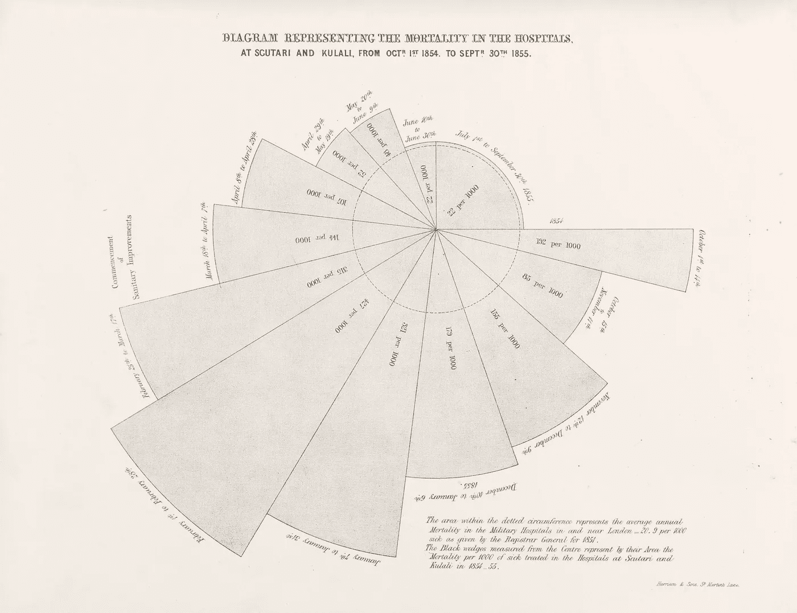
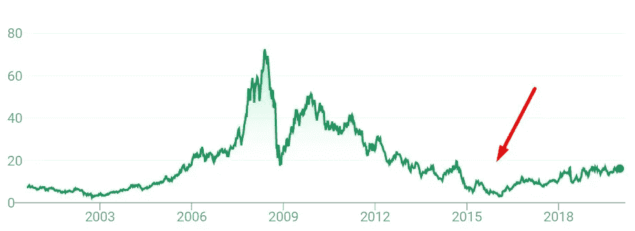
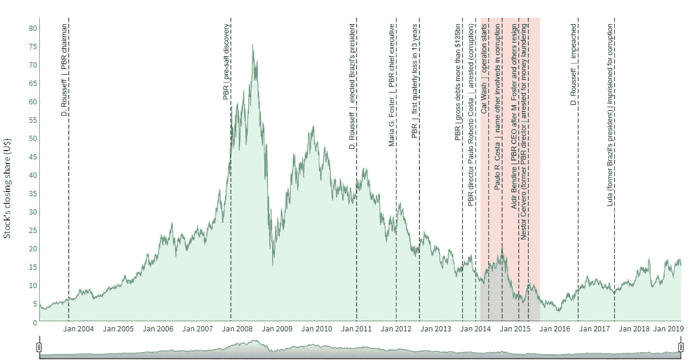

# 数据可视化，让他们惊叹

> 原文：<https://towardsdatascience.com/data-visualization-make-them-wonder-31a7a76f66df?source=collection_archive---------22----------------------->

## 设计强大可视化的两个概念

格雷格·拉科齐的照片

W 是什么让你对数据可视化如此着迷？我喜欢从数据中创造视觉效果的主要原因是，它能让我们看到研究主题的不同视角。在这篇文章中，我将分享两个概念，通过我们设计的可视化来提高我们的洞察力。

1.  DataViz 是“第二只”眼睛
2.  知识之岛

## **1 — DataViz，一只“第二”眼睛**

我们的大脑有能力用我们的眼睛来看 3D。这叫立体视觉。基本上，每只眼睛给我们一个 2D 视觉，因为它们在我们脸上是分开的，所以每只视网膜产生的图像略有不同。这种差异是深度的结果，深度提供了第三维度。换句话说，有第二只眼睛会带来不同的视角，当两个视角放在一起时，我们可以看到 3D。

数据可视化就像第二只眼睛，它可以给我们不同的视角，从而产生新的理解和知识。艺术家迈克尔·墨菲称之为感知转变，“当一个人对特定刺激的解释突然改变时发生的瞬间”。下面的视频展示了迈克尔·墨菲艺术的感知转变的一个例子。

佛罗伦萨·南丁格尔(1820–1910)是数据可视化设计师改变视角的完美例子，她改变了我们处理医疗保健和拯救生命的方式。她是一名护士和统计学家。她收集数据并创造可视化效果，以更好地理解战争和医院中的死亡率等主题。她用下面的图表证明了卫生条件的改善是如何降低医院死亡率和预防疾病的。点击了解更多关于佛罗伦萨·南丁格尔和她的遗产[。](https://medium.com/nightingale/florence-nightingale-is-a-design-hero-8bf6e5f2147)

显示医院死亡率的图表。信用:[惠康收款](https://wellcomecollection.org/works/nusfjvfg)

## **2 —知识之岛**

“知识之岛”的概念很简单，拉尔夫·w·索克曼称之为“知识之岛越大，奇迹的海岸线就越长”。我们对一个主题的理解就像一个岛屿的大小，它的海岸线代表了我们可以思考、思考和质疑它的程度。

马塞洛·格莱塞写了一本名为《知识之岛》的书。科学的局限和对意义的探索”，他给出了这样的定义:

> “我们拥有的知识决定了我们能够拥有的知识。随着知识的转移，我们会提出我们无法预料的新问题”。

数据可视化是增加我们知识孤岛的一种强有力的方式。它可以给我们不同的视角，增加我们岛屿的面积，从而扩大奇妙的海岸线。它将使我们能够思考以前无法思考的问题。Alberto Cairo 在他的书《真实的艺术》中以一种非常有见地的方式使用知识岛来教授数据可视化。推荐阅读。

2019 年初，我致力于一个代表这个概念的可视化。我正在研究巴西石油公司(PBR，一家巴西公司)的股票，以决定现在是否是买入的好时机。我盯着下面的图表:

巴西石油公司股票

我的目光直奔 2013–2016 年期间。我想知道那里发生了什么使那些股票如此急剧地下跌。然后我意识到，在那些年里，巴西正在进行一项大规模行动，调查政府和巴西国家石油公司之间的腐败。我对此做了更多的研究，将政府和反腐行动中的一些重要事件放在一起，寻找与 PBR 股市的任何关联。下图是我研究的结果(点击[此处](http://rpubs.com/gustavo_hideo/pbr_scandal)查看完整页面):

自从迪尔玛·罗塞夫(Dilma Rousseff)在 2012 年当选巴西总统并改变了巴西国家石油公司(Petrobras)的领导层以来，股价开始下跌，并创下了过去 13 年来的最低价格。红色区域显示了近 30 人因被指控腐败而被捕的时期，紧随其后的是最低价格水平。第一个情节让我提出了新的问题，放大了我的知识孤岛，找到了新的视角。现在我的奇妙海岸线更长了，这个岛也可以变得更大了。政府腐败如何影响其他公司或经济的其他部分？我可以用政府的腐败来预测股价吗？

数据可视化是强大的，它可以改变、改善和拯救世界。这是带来新观点和创新的关键。下一次，当你着手进行数据收集或可视化设计时，记住知识之岛，让你的读者对他们从未遇到过的新问题感到好奇。

数据可视化是强大的，它可以改变、改善和拯救世界。这是带来创新的关键。当您创建和设计下一个可视化时，请牢记这些概念进行数据探索。它将引导你为你的读者提供新的数据和知识。你将使他们能够问更深层次的问题。**让他们去想吧！**

**参考文献:** 【1】[n . l .安徒生《信仰之眼》四月总会(2019)](https://www.churchofjesuschrist.org/study/ensign/2019/05/25andersen?lang=eng)T5【2】m .格莱塞《知识之岛》(2014)
【3】a .开罗《真实的艺术》(2016)