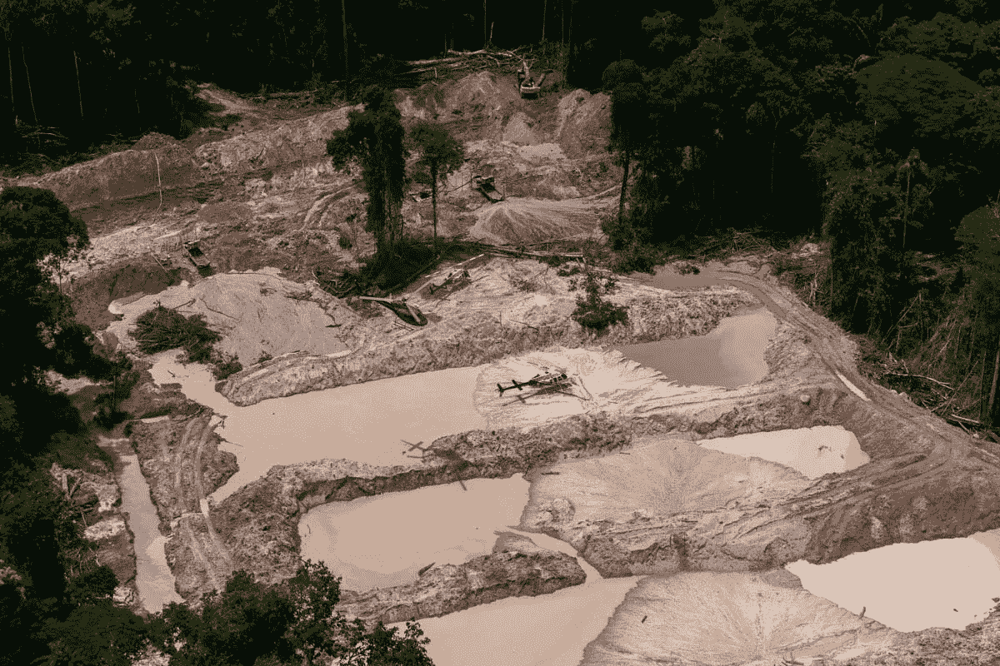
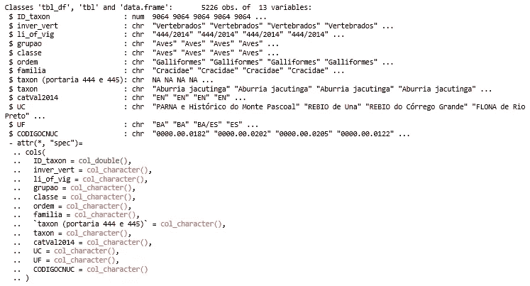
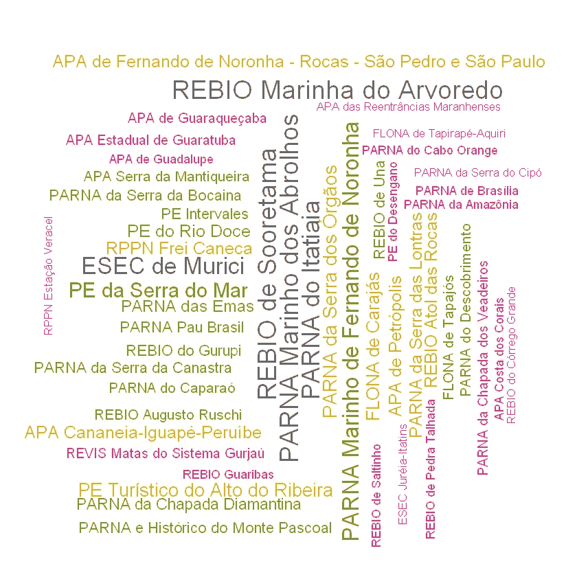
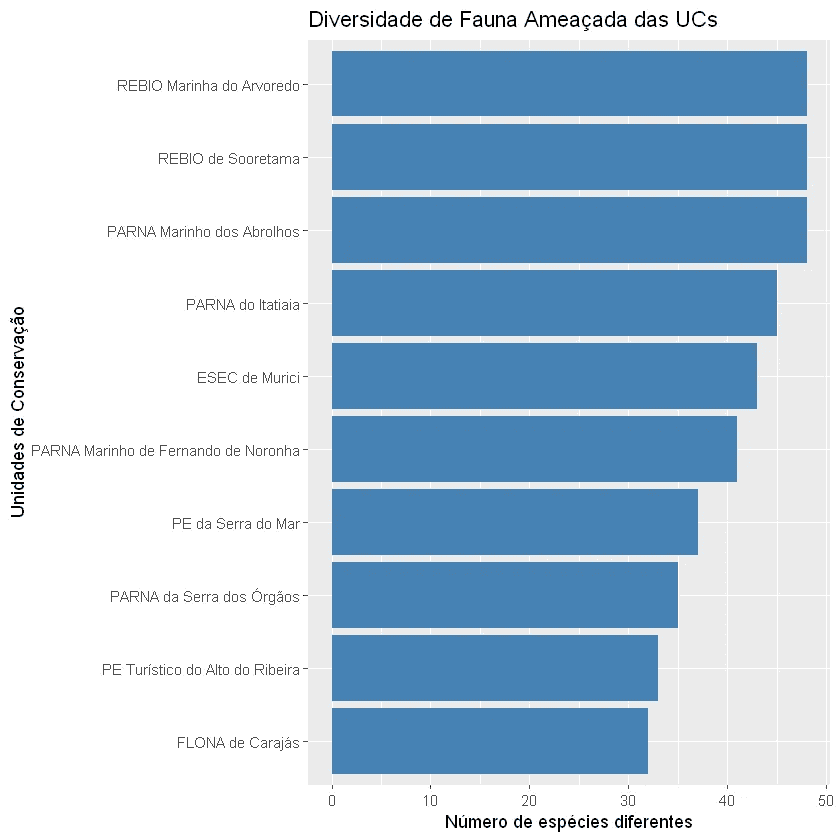
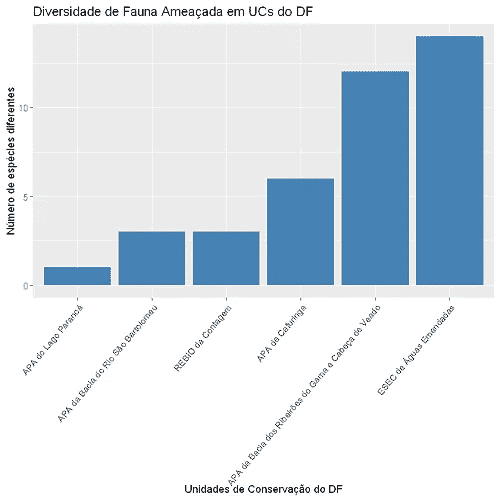
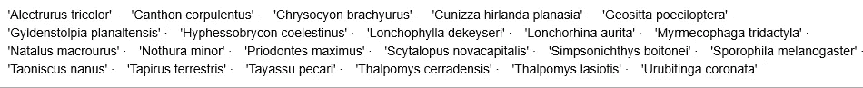
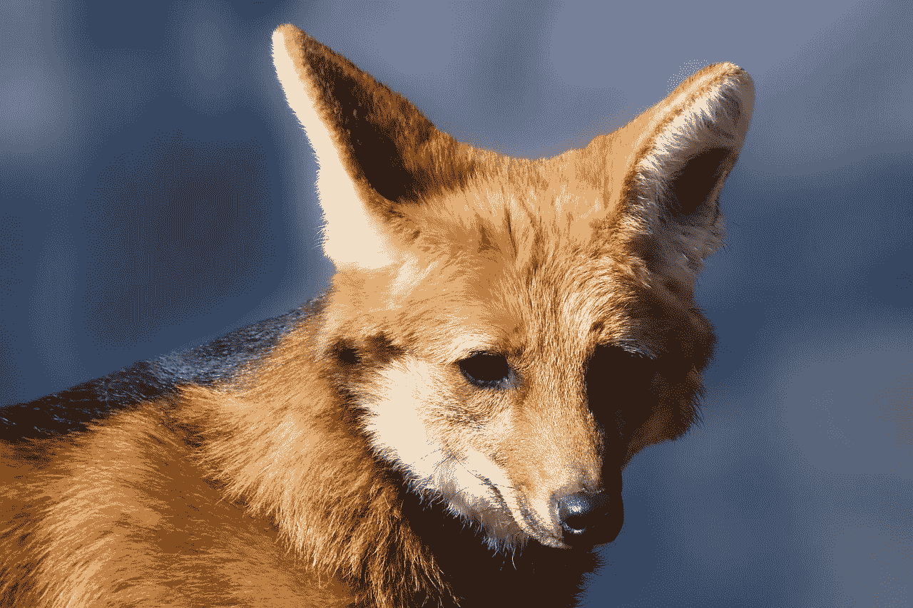
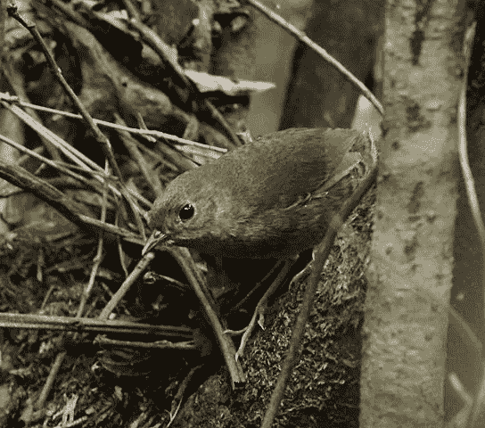

# 使用 R 实现巴西联邦保护区动物物种的数据可视化

> 原文：<https://towardsdatascience.com/data-visualization-of-fauna-species-in-brazils-federal-conservation-units-using-r-ac9e2ac66e4?source=collection_archive---------57----------------------->

## 使用 R 语言工具进行环境支持数据分析的实例。


由 [douglasgois](https://pixabay.com/pt/users/douglasgois-3968290/) 通过 [pixabay](https://pixabay.com/pt/photos/pass%C3%A1ros-aves-arara-p%C3%A1ssaro-1904374/) 拍摄的照片

欢迎阅读我的第一篇数据科学文章！我将试着以简单明了的方式解释这项工作。

联邦保护单位(*缩写*“UC”)是巴西国家领土的保护区，由政府划定，以其自然特征的相关性为特征，在这里保护和保存生物多样性。

生物多样性代表了存在于生物圈、我们的环境中的一整套物种，以及它们的基因和涉及物种之间关系的整个生态系统。人类作为土地不可分割的一部分，属于这个生态系统，并对其可能影响环境平衡的行为负责。

当今时代，造假者、大业主、非法伐木和偷猎的行为和活动越来越不受控制，这告诉我们应该更加注意和警惕。



Parna do Jamanxim 的非法采矿活动。照片:Ascom/Ibama

因此，我偶然发现了一个由 ICMBio (Chico Mendes 生物多样性保护研究所)提供的 UCs 中受威胁和几乎受威胁动物的数据库，该数据库更新至 2018 年。data . gov . br/dataset/especes-da-fauna-em-unidades-de-conservacao。它是一个. csv 文件，有 13 个实例，包括:物种名称、纲、目、科、脊椎动物与否、UC(保护单位)、UF(联盟单位)等。

因此，我决定使用 R 语言的一些工具来执行更精确的分析，并探索这个数据集中其他一些隐含的相关数据。

我的目标是从数不清的仍有可能但未在该数据集中直接指定的信息中提取 3 条信息，它们是:
·受威胁和接近受威胁动物多样性更大的 UCs
·联邦区内受威胁和接近受威胁动物多样性更高的 UCs(*缩写*“DF”)；
受威胁和接近受威胁的物种，出现在 DF 地区的 UCs 中。

不要再说了，开始工作！

起初，我导入了。csv 与

```
fa <- read_csv("arquivo.csv")
```

转换到*tible*以便以更合适的方式进行数据处理

```
fauna <- as_tibble(fa)
str(fauna) #tipos de dados
```



作者图片

现在我们有了一个来自。csv 文件。

经过几个步骤的数据争论后，data.frame 现在可以发现信息了。

为了统计每个 UC 在数据集中出现的次数，我重新分组为 UC 和 UF，并将其重新排列为另一个名为 *uc_ordem* 的 *df* 。

```
uc_qtd <- fauna_uc %>%
  group_by(UC, UF) %>%
  count()
uc_ordem <- arrange(uc_qtd, desc(n))
```

现在，为了更好地可视化数据并获得我想要的第一个信息，我生成了一个具有 50 个更高频率的词云，以及一个包含 10 个濒危物种多样性最大的词云的条形图。

```
wordcloud(uc_ordem$UC, uc_ordem$n, random.order=FALSE, rot.per=0.35, scale=c(1.9, 0.1), min.freq = 1, max.words=50, 
colors=brewer.pal(8, "Dark2"))p <- head(uc_ordem,10)
ggplot(p, aes(x=reorder(UC, n),y=n)) +
  geom_bar(stat="identity", fill="steelblue") + coord_flip() +
  labs(title = "Diversidade de Fauna Ameaçada das UCs", x = "Unidades de Conservação", y = "Número de espécies diferentes")
```



作者图片

根据数据集中包含的数据，Marinha do Arvoredo 和 Sooterama 的生物保护区以及 Abrolhos 国家公园是受威胁和几乎受威胁物种多样性最大的保护区(各有 48 个物种)。

有了这些信息，收集本文开头提出的最后两个信息就变得容易了。所以，我们走吧！

为了只过滤按不同种类数排序的 DF UCs，我使用了 *filter()* 函数，然后生成了一个新的 data.frame 的条形图。

```
fauna_qtd_df <- fauna_uc %>% filter(UF == "DF") %>%
                        group_by(UC) %>%
                        count() %>%
                        arrange(desc(n))ggplot(fauna_qtd_df, aes(x=reorder(UC, n),y=n)) +
  geom_bar(stat="identity", fill="steelblue") + theme(axis.text.x = element_text(angle = 50, hjust = 1)) +
  labs(title = "Diversidade de Fauna Ameaçada em UCs do DF", x = "Unidades de Conservação do DF", y = "Número de espécies diferentes")
```



作者图片

Á的 ESEC 是联邦区内濒危物种最多的加州大学。

作为对 R 中数据的探索性分析的最后一步，为了提取我想要的最后一个信息，我从 *unique()* 函数中创建了 data.frame *animals_df* ，这允许我提取重复的单个元素。

```
fauna_df <- fauna_uc %>% filter(UF == "DF") %>%
                        group_by(ID_taxon)
fn_df <- unique(fauna_df$taxon)
fn_df
```



作者图片



Lobo-Guará(短尾金龟)。照片由[ge linger](https://pixabay.com/pt/users/gellinger-201217/)通过 [pixabay](https://pixabay.com/pt/photos/mundo-animal-lobo-guar%C3%A1-predador-4069094/) 拍摄



Tapaculo-de-brasília。照片:赫克托·博泰

最后，我有 22 个物种的名字，它们的栖息地之一是塞拉多生物群落。

现在，我已经向您介绍了 R 语言中包含的许多数据分析工具中的一些，我鼓励您从这个数据集甚至其他环境数据集包含的许多工具中获取更多信息，获取新数据并使用数据科学做出贡献，以保护和拯救生物多样性。

感谢阅读！