# 数据可视化:原理、工具和有用的技巧

> 原文：<https://towardsdatascience.com/data-visualization-principles-tools-and-useful-tricks-b68d9c138a86?source=collection_archive---------30----------------------->

来源:[沉积照片](https://ru.depositphotos.com/147576625/stock-photo-business-people-working-with-graphs.html)

## 当 Excel 电子表格不足以将这些点联系起来，并且不可能让分析师参与构建报告时，数据可视化服务和工具就来了。

# 为什么要数据可视化？

如果你希望你的《脸书邮报》被尽可能多的人阅读，你会怎么做？你会增加一个有趣的视觉效果。这个技巧对报告也非常有效。数据驱动的视觉效果吸引更多的注意力，更容易理解，并有助于将您的信息快速传达给受众。在描述性图形和仪表板的帮助下，即使是困难的数据也可以清晰易懂。这是为什么呢？大多数人都是视觉学习者。因此，如果你希望你的大多数合作伙伴、同事和客户能够与你的数据进行交互，你应该把枯燥的图表变成漂亮的图形。基于研究，以下是一些值得注意的数字，它们证实了可视化的重要性:

*   人们从眼睛中获得 90%的关于他们周围环境的信息。
*   50%的大脑神经元参与视觉数据处理。
*   图片增加了 80%阅读文本的愿望。
*   人们记住他们听到的 10%，他们读到的 20%，他们看到的 80%。
*   如果包装插页不包含任何插图，人们会记住 70%的信息。添加图片后，他们的记忆率高达 95%。

相关数据可视化为您的企业带来诸多优势:

*   **快速决策。**使用图形可以轻松快速地汇总数据，让您快速看到一个列或接触点比其他列或接触点高，而无需查看 Google Sheets 或 Excel 中的几页统计数据。
*   **更多的人参与进来。大多数人更擅长感知和记忆视觉呈现的信息。**
*   **参与程度更高。漂亮明亮的图形和清晰的信息会吸引读者的注意力。**
*   **更好地理解数据**。完美的报告不仅对技术专家、分析师和数据科学家来说是透明的，对首席营销官和首席执行官来说也是透明的，有助于每一位员工在其职责范围内做出决策。

# 成功数据可视化的原则

创建任何图形之前要做的第一件事是检查所有数据的准确性和一致性。例如，如果比例因子是 800%,而平均值是 120–130 %,您应该检查这个数字的来源。也许你需要从图表中删除某种异常值，这样就不会扭曲整体画面:800%淡化了 120%和 130%之间的差异。报告中这种无关紧要的数据会导致错误的决策。在现实生活中，我们习惯于这样一个事实:正确的信息应该在正确的时间传递给正确的人。数据可视化有三个相似的原则:

1.  根据你的目标选择正确的图形。​
2.  确认你的图片的信息适合观众。
3.  为图形使用合适的设计。

如果你的信息是及时的，但图形不是动态的，或者有不正确的见解或困难的设计，那么你不会得到你希望的结果。

# 图表的类型及如何选择

如果你选择了错误的图表，你的读者将会感到困惑或者错误地解释数据。这就是为什么在创建图表之前，确定要可视化的数据及其目的非常重要:

*   比较不同的数据点
*   显示数据分布:例如，哪些数据点是频繁的，哪些不是
*   借助数据显示事物的结构
*   追踪数据点之间的联系

让我们来看看最受欢迎的图表类型以及它们可以帮助你实现的目标。

**1。折线图**

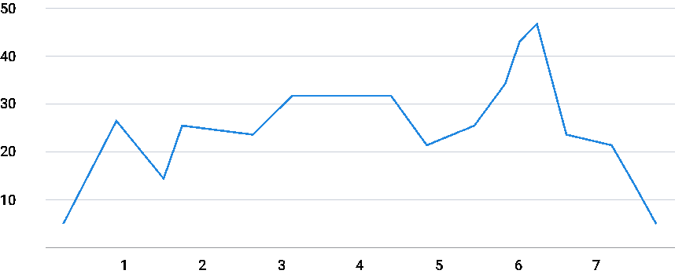

图片由作者提供

折线图显示一个或多个变量如何在数据点之间变化。这种类型的图表对于比较数据集随时间的变化非常有用，例如，一年内三个登录页面每月的流量统计。

**2。条形图**

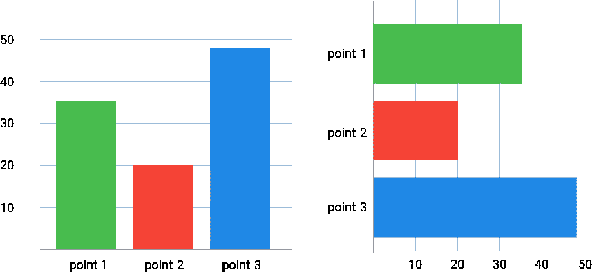

图片由作者提供

条形图是另一个非常适合比较数据集的图表。当您需要比较大量数据集或直观地强调其中一个数据集的独特优势时，通常会使用水平条形图。垂直条形图展示了数据点如何随时间变化，例如，公司的年度利润在过去几年中是如何变化的。

**3。直方图**

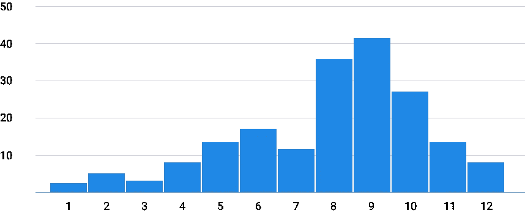

图片由作者提供

由于直方图和条形图在视觉上的相似性，它们经常被误认为是条形图，但是这些图表的目标是不同的。直方图显示了一个数据集在一个连续的时间间隔或一个确定的时间段内的分布。在这个图表的纵轴上，你可以看到频率，而在横轴上，你可以看到时间间隔。

与柱状图不同，条形图不显示任何连续的区间；每列都显示自己的类别。借助条形图可以更容易地展示不同年份的购买数量。如果您想知道订单价值(10–100 美元、101–200 美元、201–300 美元等)。)的购买量，最好选择直方图。

**4。饼状图**

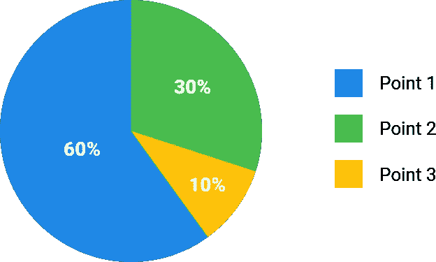

图片由作者提供

饼图显示数据集中每个值的份额。它用于显示任何数据集的组成部分。例如，每个产品类别占总销售额的百分比是多少？

**5。散点图**

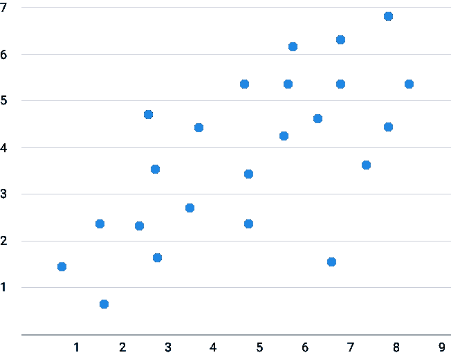

图片由作者提供

散点图显示了数据点之间的联系。例如，在散点图的帮助下，你可以发现转化率如何根据产品折扣的大小而变化。

**6。气泡图**

这是一个有趣的图表，它允许你通过第三个参数来比较两个参数。让我们把上一个例子中的转换率和折扣大小，加上收入(用圆圈大小表示)，我们会得到类似下图的结果。

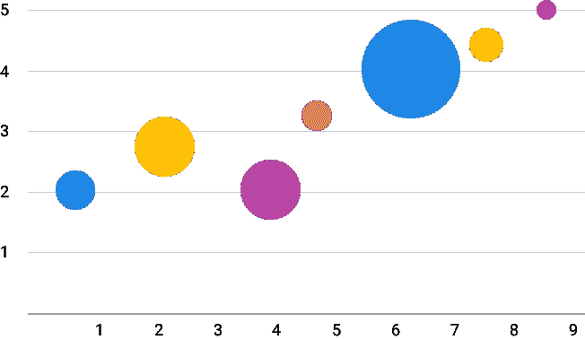

图片由作者提供

看这个图表，很容易注意到打 7 折的产品转化率最高，而不打折或打 9.5 折的产品带来的收益最多。

**7。地理图**

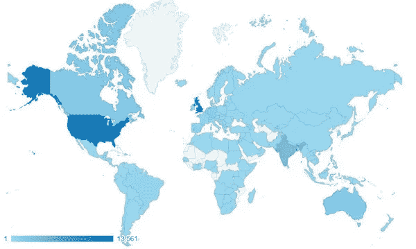

图片由作者提供

地理图很简单。当您需要展示跨地区、国家和大陆的特定分布时，可以使用它。

我们提到了一些最受欢迎的图表，但不是全部。您可以在[数据可视化目录](https://datavizcatalogue.com/index.html)中找到其他类型的图表。此外，我们推荐这张[方便的信息图表](https://www.labnol.org/software/find-right-chart-type-for-your-data/6523/)，它可以帮助你为你的目标选择正确的图表类型。

# 视觉效果的正确使用

使用数据可视化时，您必须考虑的第二件重要事情是为受众选择正确的信息。你在报告中谈论的数据应该是你的读者所熟悉和清楚的。

这是一张获得了著名的数据新闻奖的图表。对于不熟悉这个故事背景的人来说，这个图表看起来像是一个三岁小孩画的画。然而，当你对它了解得更多一点的时候，你会看到它的作者做了大量的工作。

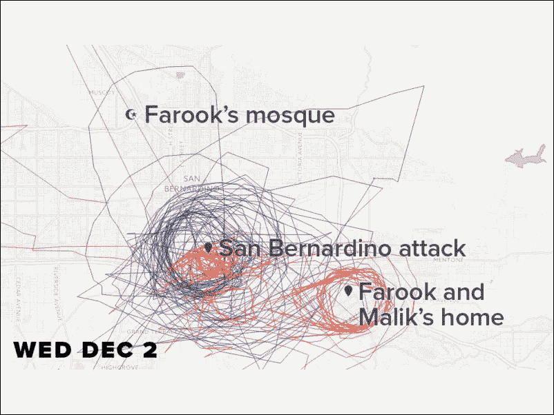

来源: [BuzzFeedNews](https://www.buzzfeednews.com/article/peteraldhous/spies-in-the-skies)

Buzzfeed 新闻编辑 Charles Seife 和 Peter Aldhous 使用 R 语言将联邦调查局和 DHS 特工作为空中监视的一部分获得的飞行数据可视化[。具体来说，这张图表显示了 2015 年 12 月加州圣贝纳迪诺大规模枪击事件负责人的房屋和清真寺上方的航班。](https://www.buzzfeednews.com/article/peteraldhous/spies-in-the-skies)

当选择您想要在一个图表上可视化的参数时，您必须确认它们可以组合。有些数据组合就是不符合逻辑，尽管乍一看数据完全相关。这是一个有错误相关性的图表的例子。它表明掉进游泳池淹死的人数与尼古拉斯·凯奇电影的数量相关。

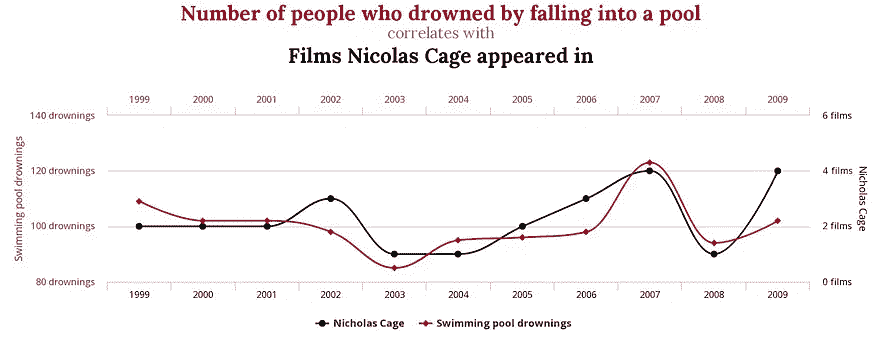

来源:[泰勒维金](https://www.tylervigen.com/spurious-correlations)

创建图表时，接下来要考虑的是比例和范围。人们习惯于这样一个事实，即轴上的测量是从底部和左侧开始的。如果你改变了测量的方向，会让一个不专心的观众感到困惑。尽管我们应该提到，当用作战术机动时，反转测量是可能的，如下例所示:

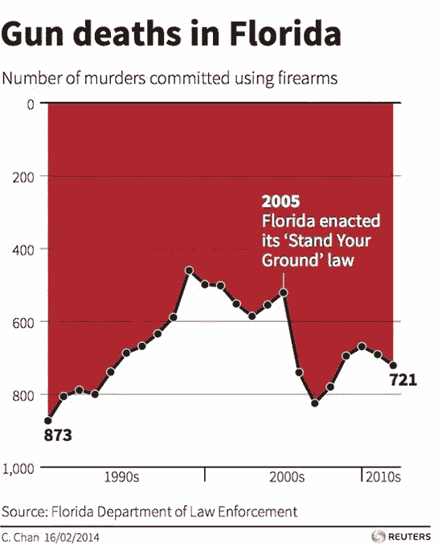

来源: [Omundy](https://omundy.wordpress.com/2017/10/18/data-culture-ethical-injustice-in-data-visualization/)

乍看之下，使用枪支的谋杀数量似乎在逐年下降。事实上，它是相反的，因为规模从顶部开始。也许图表的作者故意这样做是为了减少对数据的负面反应。

合适的比例也能让你的图表更清晰。如果报告显示的数据点太近，您看不到任何移动，请尝试更改比例。不要从零开始测量，或者将标尺分成更小的部分，图像会变得清晰。

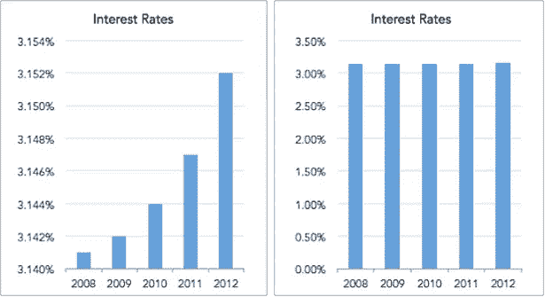

图片由作者提供

在向最终用户提供报告之前，请确保图表加载速度很快。缓慢的加载会扼杀你所有的努力。例如，如果您在 Google Sheets 中可视化数据，您的数据很可能存储在同一页面或下一页面，而不是来自第三方来源。但是当您在 Data Studio 中创建报告时，数据将从其他地方导入。在这种情况下，您必须注意数据源的可访问性和数据流速率。否则，当有一个图表模板但数据尚未加载时，您将会看到一幅令人沮丧的画面。

# 正确的设计

你的图形设计应该总是遵循简单的原则。如果你必须准备一份标准的报告，就没有必要修饰它。避免任何只会使图表混乱的额外元素:不同的颜色和结构、3D 体积、阴影、渐变等。

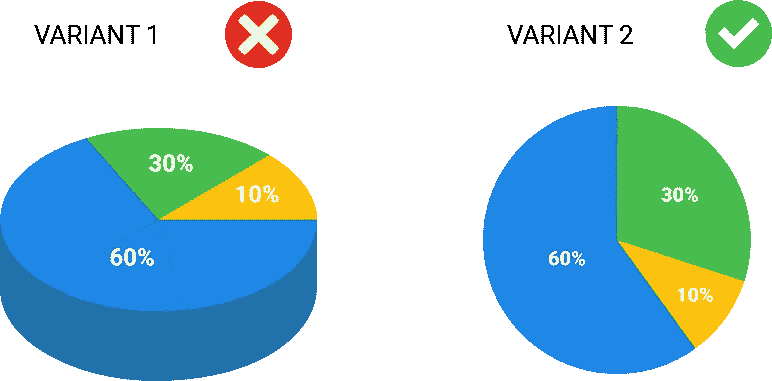

图片由作者提供

图表越简单，你的读者就越容易理解你想要分享的信息。

不要将可视化效果做得太小，也不要将所有图表放在同一个仪表板页面上。在一张幻灯片或同一个仪表板页面上使用三种以上的图表被认为是不良风格。如果你真的需要这么多图表类型，把它们放在不同的页面上，这样就容易理解了。

不要害怕尝试。如果你有一个非标准的任务，也许你的解决方案也应该是非标准的。在下面的信息图中，我们可以看到不同动物的翅膀运动模式。动态可视化是完全相关的。

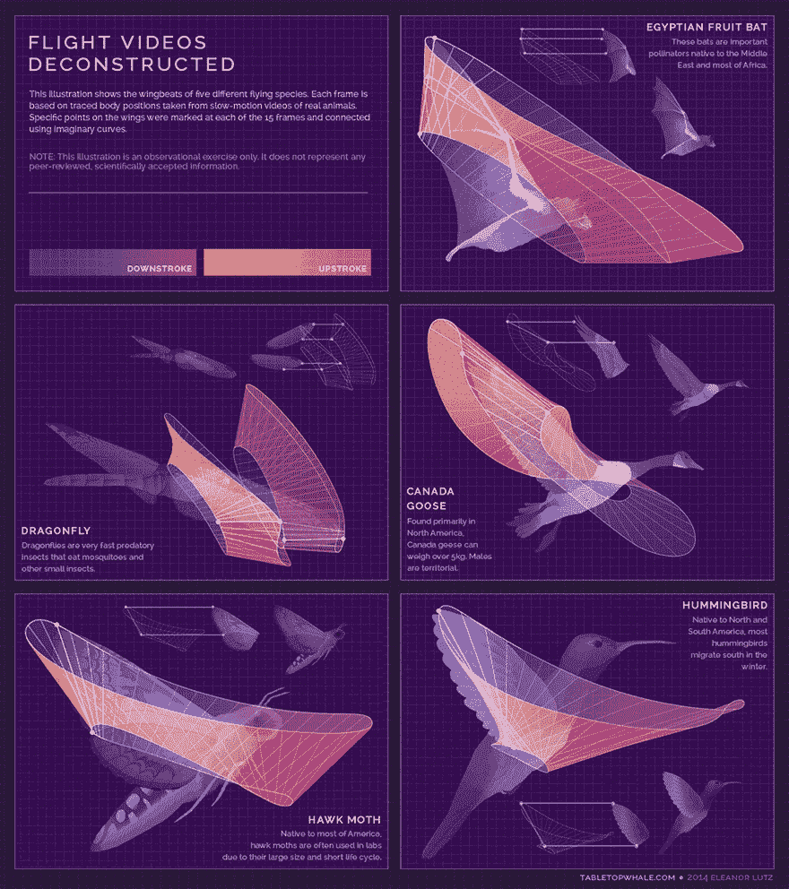

来源: [KickstartUtopia](https://kickstartutopia.wordpress.com/2014/10/14/natures-geometry/)

让我们看看数据可视化工具，并讨论如何根据您的目标选择合适的工具。

# 比较报告软件

现在，市场上有很多数据可视化工具。有些是付费的，有些是免费的。其中一些可以完全在网络上工作，另一些可以安装在桌面上但可以在线工作，还有一些只能离线工作。我们列出了 10 个流行的数据可视化工具:

1.  Excel/Google 电子表格
2.  [数据工作室](https://datastudio.google.com/)
3.  [画面](https://public.tableau.com/s/)
4.  [电源 BI](https://powerbi.microsoft.com/en-us/)
5.  [QlikView](https://www.qlik.com/us)
6.  [R 工作室](https://www.r-project.org/)
7.  [Visual.ly](https://visual.ly/)
8.  [纠结](http://worrydream.com/Tangle/)
9.  [iCharts](http://icharts.net/)
10.  [智能数据](https://www.owox.com/products/bi/smart-data/)

前五种工具和服务是由专门从事数据可视化的公司开发的。数字 6 到 10 是非常有趣的工具，大部分是免费的在线工具。它们提供非标准类型的可视化，并可能提供处理数据的新方法。

选择报告工具时要注意什么:

*   **从你想完成的任务开始。**例如，现在市场上的一个主要趋势是动态报告。如果一个工具不能处理动态报告，那就是对它的攻击。
*   **考虑你准备支付的金额。**如果你的团队足够大，每个员工都必须使用可视化工具，那么每个用户的成本可能是一个停止信号。
*   决定谁将使用该工具以及如何使用。有没有组编辑的可能？开始使用该工具有多简单？界面友好吗？有没有可能在没有任何编程知识的情况下创建一个报表？例如，R Studio 是一个很好的服务，特别是在搜索趋势和建立归因和相关性模型方面。但是如果你不知道任何编程语言，不会连接任何特定的库，也不是技术专家，那么你开始使用 R Studio 将会很困难。

我们选择了五种服务，并准备了一个表格，比较它们的优点、缺点和主要特征。在我们开始之前，让我们解释一下*动态数据可视化*和*动态报告*有何不同。

*动态报告*指实时从不同来源导入数据的可能性。谷歌数据工作室没有动态报告。假设我们已经连接了一个来自 Google BigQuery 的 Data Studio 请求，然后更改了这个请求中的一些内容。为了在报告中记录这些变化，我们至少需要刷新 Data Studio 页面。然而，如果在 Google BigQuery 中我们添加或删除了一些字段(不仅仅是改变计算的逻辑，而是改变表的结构)，那么 Data Studio 将会关闭报告并显示一个错误。你必须重做它。

*动态数据可视化*是指在一个会话中查看不同日期的汇总统计数据的可能性。例如，在 Google Analytics 中，您可以更改时间间隔，并获得所需日期的统计数据。

## 五大可视化工具的关键特征

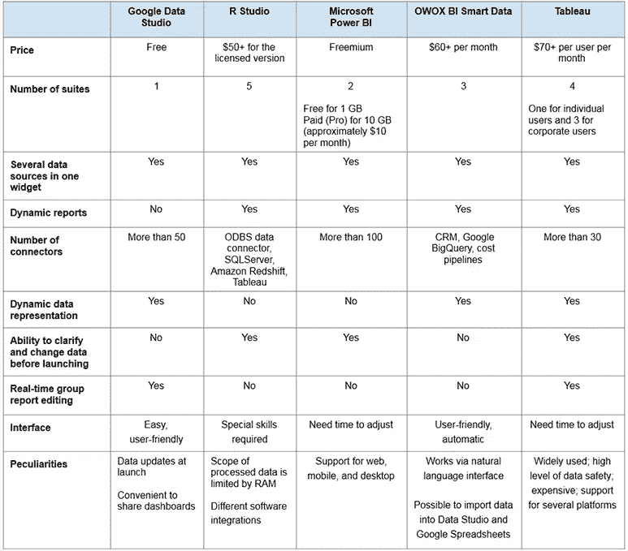

我们想详细讨论与 OWOX BI 一起使用的三个工具:Google Data Studio、Google Sheets 和 OWOX BI Smart Data。

# 谷歌数据工作室

Google [Data Studio](https://datastudio.google.com/) 允许你连接数据源，可视化数据，并以类似于其他 Google 产品的方式轻松地与同事分享报告。

优势:

*   免费
*   150 多个易于集成的连接器
*   可以通过一个仪表板使用来自多个来源的数据
*   方便共享报告

Google Data Studio 是一个免费工具，有 Google 提供的 [17 个原生连接器](https://datastudio.google.com/data)。它们已经过检查，工作正常，足以完成大多数任务。还有由合作伙伴提供的连接器，尽管您必须理解连接器可以由具有不同技能水平的开发人员提供，并且不能保证它们会正确执行。

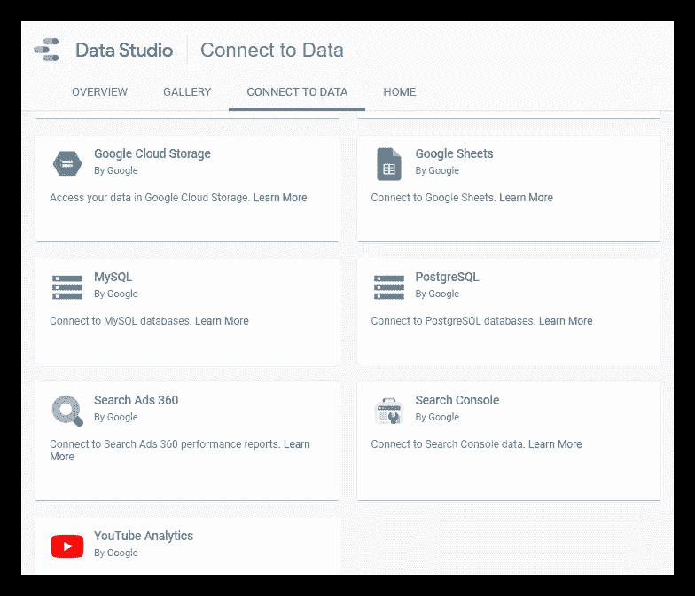

图片由作者提供

顺便说一下，如果你想在 Data Studio 报告中看到任何脸书或雅虎 Gemini 的统计数据，你可以在 OWOX BI 的帮助下[将数据导入 Google BigQuery](https://www.owox.com/products/bi/pipeline/facebook-ads-to-google-bigquery/) 。虽然其他连接器可能会忽略一些分析，但使用 BigQuery，您可以从您的脸书帐户接收[完整的数据分析](https://support.owox.com/hc/en-us/articles/115000316593)。

有一个方便的谷歌数据工作室[图库，里面有现成的模板](https://datastudiogallery.appspot.com/gallery)。

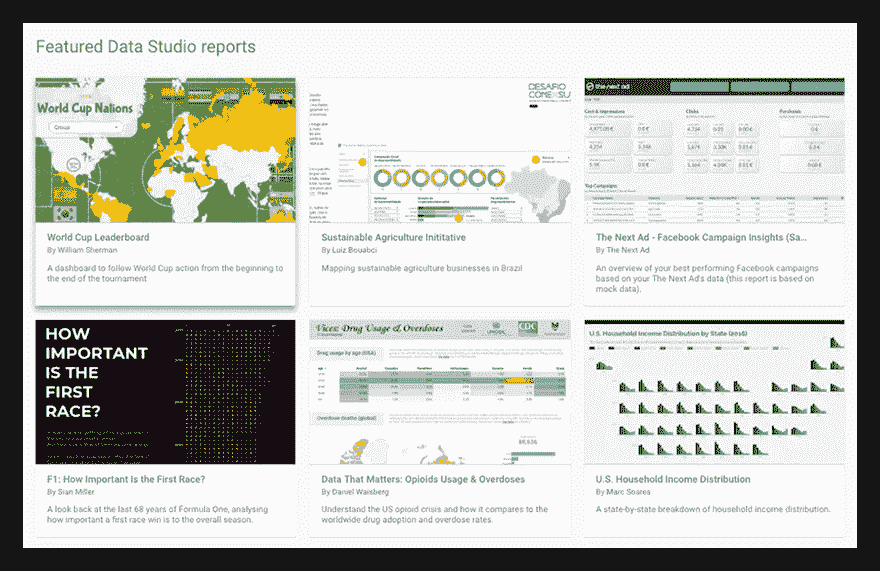

图片由作者提供

OWOX BI 也有现成的仪表板模板。

第一个是营销属性仪表板。在这个仪表板中，您可以找到营销专家和分析师使用的所有基本参数和指标。

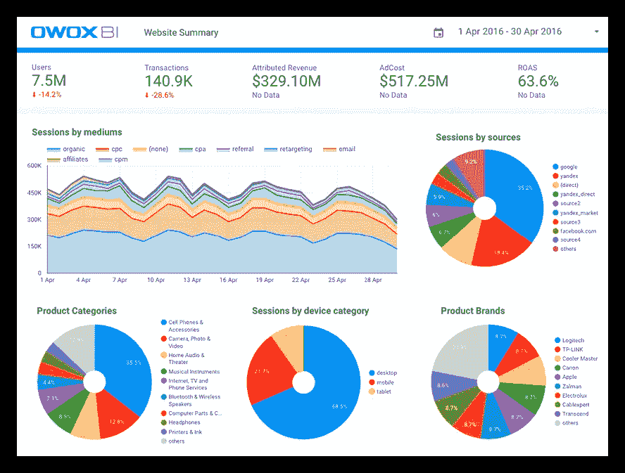

图片由作者提供

第二个控制面板是数字营销付费渠道 KPI 控制面板，它根据数据源进行划分(详细显示)。换句话说，它显示脸书营销活动的过滤数据等。

这些是演示仪表板。您可以复制它们，更改自己的数据源，并在工作中使用它们。

Data Studio 最近的一次更新增加了按视图过滤数据的可能性。例如，您可以比较当前期间和上一年的数据点。

Data Studio 的另一个有趣的更新是允许您在界面中更改已经创建的图形的类型。以前，更改图表时，您必须删除它并创建一个新的图表。现在可以直接在界面中改变图形样式了。

# 谷歌工作表

这是最受欢迎的报告工具，任何营销专家都至少使用过一次。Google Sheets 界面非常简单明了，尤其是对于那些开始使用 Excel 进行分析的人来说。

优势:

*   自由灵活—支持动态参数、数据透视表等
*   易于与数据源集成
*   通过链接方便地共享报告

有用的链接:

*   [创建 Google Sheets 报表的简单 SQL 请求示例](https://support.owox.com/hc/en-us/sections/203951598)
*   [如何在报表中使用动态参数](https://support.owox.com/hc/en-us/articles/217491007)

Google Sheets 中的图表和报表集与 Google Data Studio 中的相同。

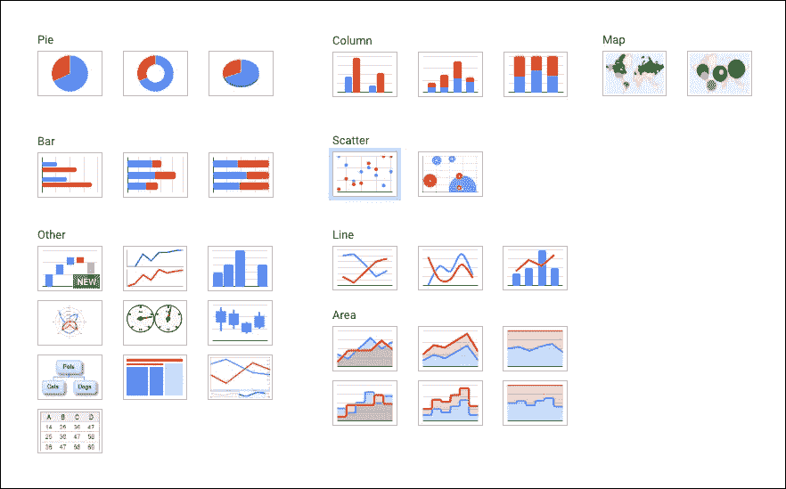

图片由作者提供

此外，还可以管理颜色和选择单元格格式:

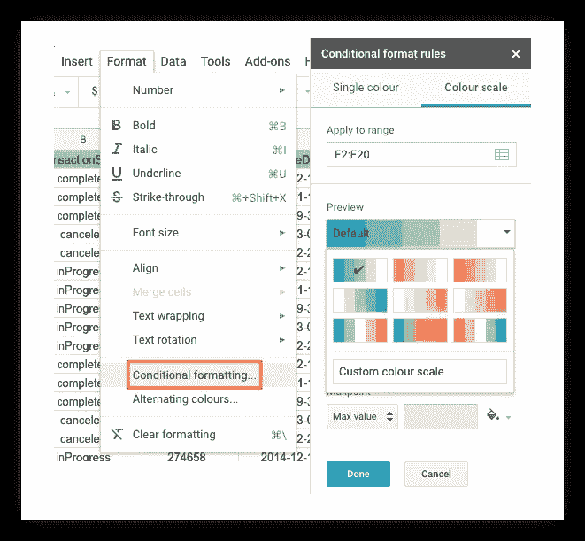

图片由作者提供

也许 Google Sheets 的主要优势是数据透视表。最近，Google Data Studio 进行了更新，允许计算三个以上的字段和十列。它让分析师的生活变得更加轻松，尽管 Data Studio 中的可能性仍然有限，而且在 Google Sheets 中使用数据透视表仍然更加舒适。

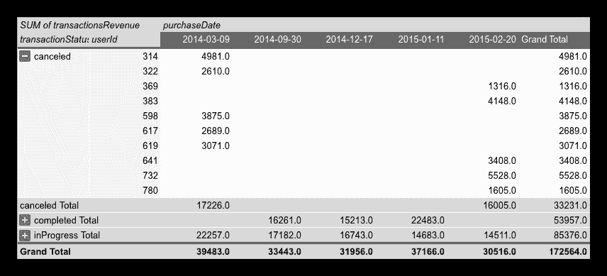

图片由作者提供

谷歌工作表[有一个免费的插件](https://chrome.google.com/webstore/detail/google-analytics/fefimfimnhjjkomigakinmjileehfopp)，可以让你直接从谷歌分析上传数据，并根据导入的数据生成报告。此外，您可以直接从工作表中请求谷歌分析数据。在这个 GIF 中，您可以看到如何导入数据以及应该设置哪些参数和指标。

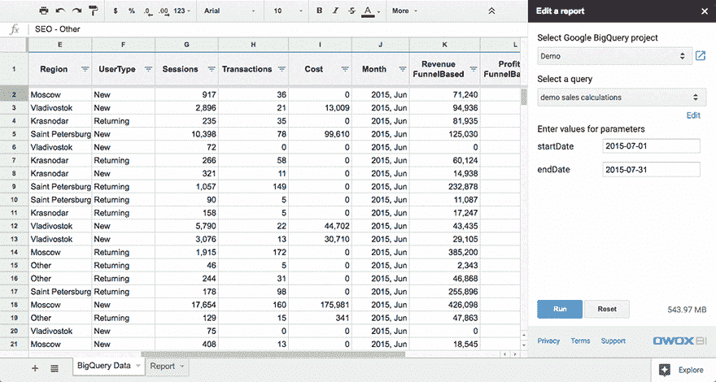

图片由作者提供

我们想在 Google Sheets 中分享我们最喜欢的报告——群组分析报告。

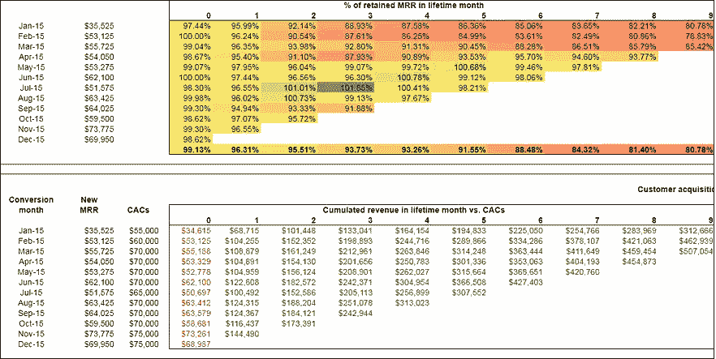

图片由作者提供

这个报告模板可以在[这里](https://docs.google.com/spreadsheets/d/1DQXOfOkdPSHoRQV8rdKX2bFz_6lq_h2GLnvqkjgzFts/edit#gid=673555915)找到。你可以看到使用的说明和公式。必须填写彩色字段，其他彩色字段在公式的帮助下更新。有大量计算出来的指标，但是这个报告很难，而且需要大量的人力。我们希望这个模板对你有用。此外，您可以在 Google Analytics 和 Google Sheets 中阅读[详细的群组分析指南，我们在其中提供了非常详细的说明。](https://www.owox.com/blog/use-cases/cohort-analysis/)

# OWOX BI 智能数据

有了 [OWOX BI 智能数据](https://www.owox.com/products/bi/smart-data/)，你不需要知道 SQL 语法。用自然语言用简单的英语问一个问题就够了。该服务处理请求，将其翻译成技术语言，并返回一个漂亮的图形和表格，其中包含您的问题的答案。

优势:

*   不需要特殊的技术培训
*   快速回答问题
*   友好的界面
*   有俄语和英语版本

有一个详细的[参考指南](https://support.owox.com/hc/en-us/categories/203186127-BI-Smart-Data)，您可以从中了解到您可以在智能数据中创建的每种类型的报告。

# 智能数据报告使用什么数据

您网站上的用户操作:

*   你可以在 OWOX BI 的帮助下调整[Google Analytics→Google big query](https://support.owox.com/hc/en-us/sections/204127918-%D0%98%D0%BD%D1%82%D0%B5%D0%B3%D1%80%D0%B0%D1%86%D0%B8%D1%8F-%D0%BA%D0%BE%D0%B4%D0%B0-%D0%BE%D1%82%D1%81%D0%BB%D0%B5%D0%B6%D0%B8%D0%B2%D0%B0%D0%BD%D0%B8%D1%8F?utm_campaign=webinar-reporting-tools-presentation&utm_medium=event&utm_source=presentation)流媒体。
*   或者使用标准的[Google Analytics 360→Google big query](https://support.google.com/analytics/answer/3416092)导出。

交易:

*   [谷歌分析→谷歌大查询](https://developers.google.com/analytics/devguides/collection/analyticsjs/enhanced-ecommerce#measuring-transactions)
*   [谷歌工作表→谷歌大查询](https://www.owox.com/products/bi/pipeline/google-bigquery-to-google-sheets/)
*   [CRM → Google BigQuery](https://support.owox.com/hc/en-us/articles/115000071093)

广告活动成本:

*   推特、脸书、雅虎双子座，我的。目标→谷歌分析
*   [其他来源→谷歌分析](https://support.owox.com/hc/en-us/articles/217329137-%D0%98%D0%BC%D0%BF%D0%BE%D1%80%D1%82-%D0%B7%D0%B0%D1%82%D1%80%D0%B0%D1%82-%D0%B8%D0%B7-%D0%B4%D1%80%D1%83%D0%B3%D0%B8%D1%85-%D0%B8%D1%81%D1%82%D0%BE%D1%87%D0%BD%D0%B8%D0%BA%D0%BE%D0%B2?utm_campaign=webinar-reporting-tools-presentation&utm_medium=event&utm_source=presentation)

收集完所有这些数据后，你就可以开始提问了。我们在 OWOX BI 智能数据中添加了客户需要的所有报告。然后，我们按主题将它们分组，以便于搜索报告。我们有 ROPO 报告，归因报告，注册会计师合作伙伴报告，客户关系管理数据报告，等等。

**根据您的数据提出的问题:**

*   [在[时间段]内，[指标]如何随[维度]而变化？](https://support.owox.com/hc/en-us/articles/115000054394-How-did-metric-change-over-time-period-by-dimension-)
*   [尺寸的度量是多少？](https://support.owox.com/hc/en-us/articles/228129348-What-was-the-metric-by-dimension-)
*   [【公制】如何分配给【维度】？](https://support.owox.com/hc/en-us/articles/228173427-How-was-the-metric-distributed-to-dimension-)
*   网站上有多少[公制]？

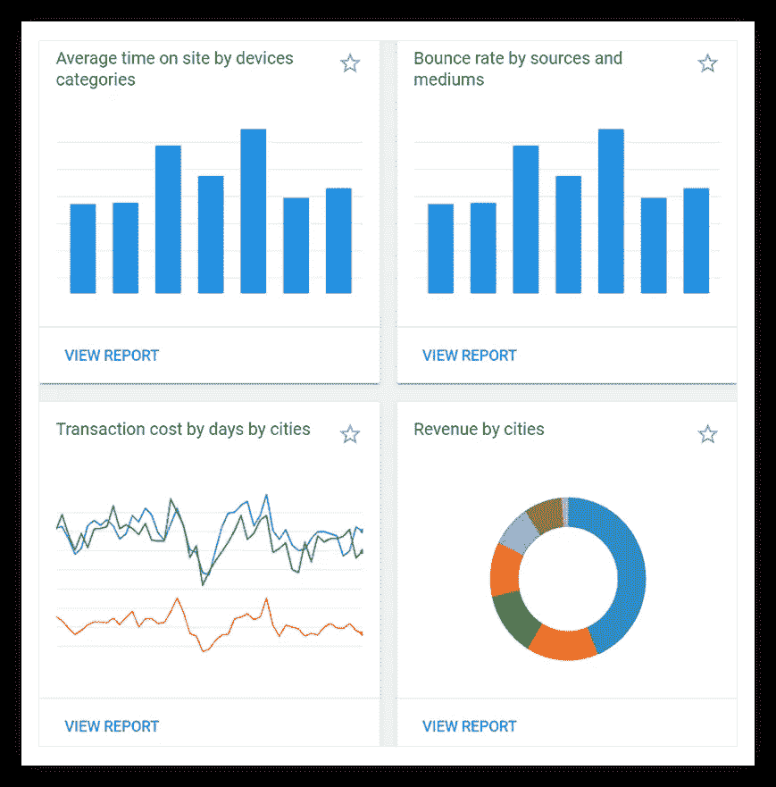

图片由作者提供

**归因问题:**

*   广告渠道、活动和关键词的真正价值是什么？
*   根据基于漏斗的模型，roa、ROI 和 CRR 是什么？
*   转化价值(如注册)是如何在渠道和活动中分配的？
*   根据最后的非直接点击模型，哪些来源具有最大和最小的价值？
*   哪些活动和关键词在吸引新用户方面表现最佳？
*   在漏斗的每一步，哪些渠道和活动表现最好？
*   来源和渠道的哪些行动链导致交易？

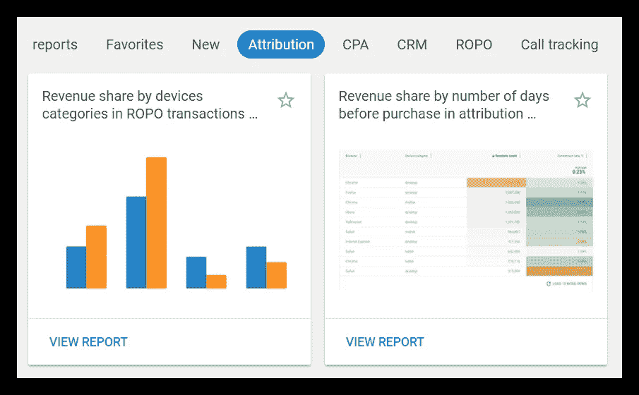

图片由作者提供

**关于 CRM +线上数据的问题:**

*   不同活动的订单执行情况如何不同？
*   不同渠道组每天的毛利有何不同？
*   不同城市的 CRM 订单数和 CRM 用户数有什么不同？
*   按来源和渠道，ROAS 毛利是多少？
*   CRM 订单数量与支付和交付类型之间有什么关系？
*   换算和平均配送时间、城市有什么关系？
*   CRM 订单、CRM 用户数、店铺之间有什么关系？

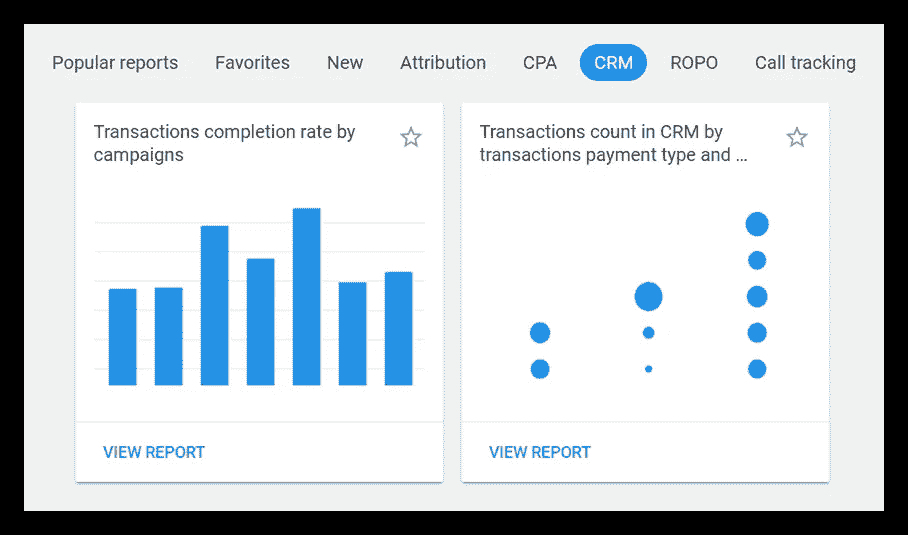

图片由作者提供

在本[参考文献](https://support.owox.com/hc/en-us/articles/360003522373-CRM-data)中，您可以找到 CRM 导出的完整数据结构。

**注册会计师活动问题:**

*   流量诈骗的来源有哪些？
*   根据品牌需求购买了多少广告？
*   哪一个合作伙伴应该为重叠交易的行为支付报酬？
*   CPA 合作伙伴生成的会话质量如何？

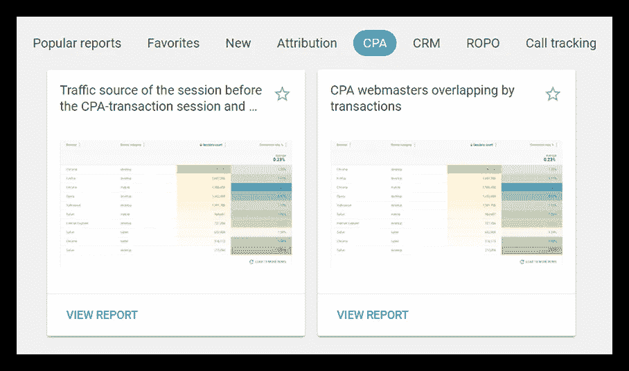

图片由作者提供

**ROPO(线上调研，线下购买)问题:**

*   线上广告对线下购买有什么影响？
*   什么是真正的 ROPO 购买转换窗口，交易价值和用户做出购买决定的天数之间有什么关系？
*   在完成线下购买之前，买家、交易和收入是如何按天分配的。
*   用户需要多少天来决定购买最贵的商品？

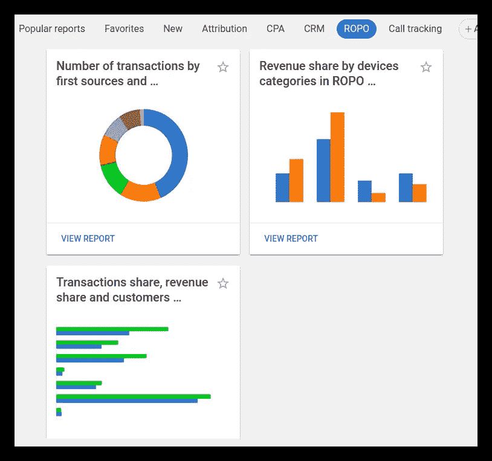

图片由作者提供

这里是 OWOX BI Smart Data 的一个小 FAQ 块，它解决了如何构建请求、结构应该是什么样子、如何显示您想要查看的维度和指标等问题。

对于给定的维度，一次可以选择多少个指标？

智能数据报告不限制您可以使用的指标数量。然而，有了大量的指标，在 Google Data Studio 中可视化数据更加容易。

*   在[参考指南](https://support.owox.com/hc/en-us/articles/115000054394-How-did-metric-change-over-time-period-by-dimension-)中可以找到所有可能的指标和尺寸列表。

**如何构建请求，结构应该是什么样子**

示例和问题结构可在我们的参考指南中找到:

*   [对谷歌分析数据的提问](https://support.owox.com/hc/en-us/sections/205908408-Questions-to-Google-Analytics-data)
*   [对 OWOX BI 归因数据的提问](https://support.owox.com/hc/en-us/sections/206247407-Questions-to-OWOX-BI-Attribution-data)

最好的选择是只输入您想要查看的维度和指标。

**这些图表显示的数值是否正确？**

智能数据报告基于您的完整数据和现成的 SQL 请求，您可以在 Google BigQuery 项目中复制和检查这些数据和请求。