# 数据可视化:用 Python 中的图表说出来

> 原文：<https://towardsdatascience.com/data-visualization-say-it-with-charts-in-python-138c77973a56?source=collection_archive---------15----------------------->

## 使用 matplotlib、pyplot 和 seaborn 的 python 可视化最佳实践和概念的完整实践指南


威廉·艾文在 [Unsplash](https://unsplash.com?utm_source=medium&utm_medium=referral) 上的照片

商业智能(BI)是一个概念，通常涉及组织中适当且有价值的商业信息的交付和集成。公司使用 BI 来检测重大事件，如深入了解客户行为、监控关键绩效指标以及获取市场和销售情报，以快速适应不断变化的动态业务。可视化是任何 BI 的支柱，因此分析师或数据科学家需要了解可视化的细微差别，以及它如何在有效交流见解和发现方面发挥重要作用。

我们将使用真实世界的数据提出一些商业问题，并了解如何用 Python 创建强大的**、**有效的**和**有洞察力的**、可视化的 **PEI 框架**的演示。**

## **以下是我们将在本文中涉及的五件事:**

*   **可视化在分析行业中的重要性**
*   **如何决定使用哪个图表**
*   **python 中 matplotlib 和 seaborn 的介绍和背景**
*   **使用 python 的一系列图表和可视化来回答来自真实世界数据的相关问题**
*   **使用可视化讲述故事的最佳实践**

# **为什么数据可视化很重要？**

**数据和分析正在改变竞争的基础。领先的公司不仅利用他们的能力来改善他们的核心业务，还推出全新的商业模式。随着 cxo 不断跟踪不断变化的市场，Topline KPIs(关键绩效指标)正在成为当前的需求，从而使他们能够做出明智的大规模决策。仪表板在利益相关者中变得越来越流行，随着从众多数据源收集的大量数据涌入，可视化成为分析这些数据的关键。简而言之，构建视觉效果的四个主要原因包括:**

1.  **对于探索性数据分析，通常称为数据 EDA**
2.  **向不同的利益相关方清楚地传达顶层调查结果**
3.  **分享数据的无偏表示**
4.  **使用可视化来支持发现、见解和建议**

**在我们开始之前，让我们看一看可视化图表的基础。图表通常分为两大类:**

*   ****数据图表**，也叫定量图表，用图形描绘数字来说明一个点。它们包括饼图、条形图、堆积条形图、散点图、折线图等。**
*   ****概念图**，也叫非量化图表，使用文字和图像。概念图描述了一种情况，如相互作用、相互关系、杠杆作用或工作中的力量。一些常见的例子有流程图、甘特图、矩阵等。**

**数据图表是分析行业中使用最广泛的图表类型。从仪表板、定期报告到演示文稿，它们在以利益相关方能够理解的方式传达我们的分析方面发挥着重要作用。概念图在咨询和战略概述中起着重要作用，尤其是在逐步概述战略很重要的情况下，或者在需要 SWOT 分析(优势、劣势、机会、威胁)的情况下。**

****想了解更多关于当前市场上商务智能趋势的信息吗？****

**[](/the-dawn-of-modern-analytics-a-look-into-some-of-the-recent-trends-of-business-intelligence-fc12cdf41cae) [## 现代分析的黎明——了解商业智能的一些最新趋势…

### 基于调查的方法来确定每个数据科学家都应该知道的 BI 工具

towardsdatascience.com](/the-dawn-of-modern-analytics-a-look-into-some-of-the-recent-trends-of-business-intelligence-fc12cdf41cae) 

# 图表选择框架

在使用 Excel、Python、R、Tableau、R Shiny、Power BI 或 Qliksense 等平台时，用户会接触到多种引人注目的图表布局。然而，在分析的世界里，创造一个有吸引力的可视化比创造一个有效的可视化更重要。下面是选择框架，它是任何图表选择的基础。

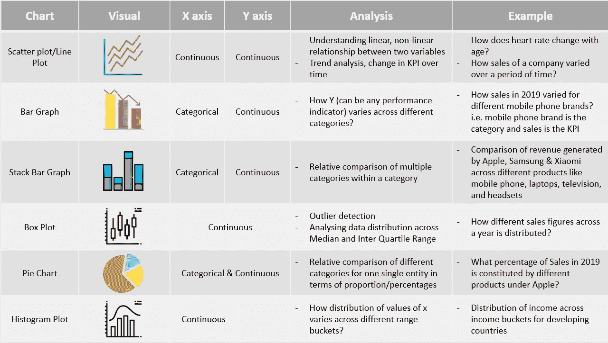

图表选择框架

# Python 中的数据可视化简介

## Matplotlib 历史和建筑

Matplotlib 是 Python 中使用最广泛的数据可视化库之一。它是由约翰·亨特发明的，他是一名神经生物学家，当时正致力于分析皮层脑电图信号。他的团队可以使用专利软件的授权版本进行分析，并且只能轮流使用。为了避免这种限制，John 开发了一个基于 MATLAB 的版本，在后期阶段配备了一个脚本接口，用于快速轻松地生成图形，目前称为 matplotlib。

Matplotlib 运行在一个三层架构系统上，后端层、艺术家层和脚本层。

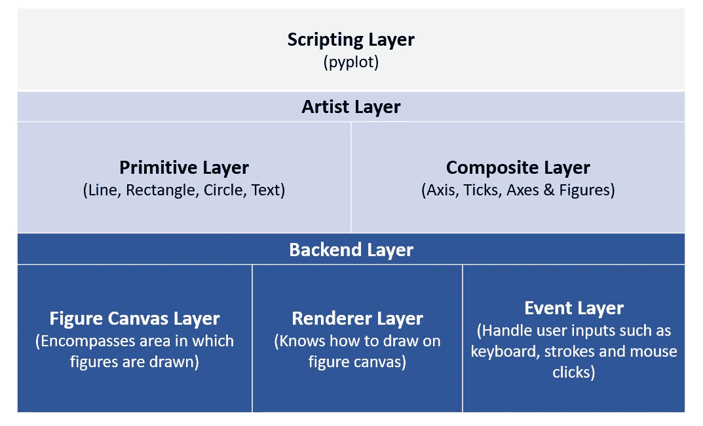

Matplotlib 架构

让我们看看下面的代码:

```
# — — — — — — — — — — — — - Backend Layer, Figure Canvas Layer: Encompases area in which figures are drawn — — — — — — — — — — — — -from matplotlib.backends.backend_agg import FigureCanvasAgg as FigureCanvas#— — — — — — — — — — — — -From Artist layer, importing Artist Figure: Artist layer knows how to use a renderer to draw an object----------------------
from matplotlib.figure import Figure
fig=Figure()
canvas=FigureCanvas(fig) #-----passing object of artist layer to backend layer (Figure Canvas)#— — — — — — — — — — — — -Using numpy to create random variables----------------------
import numpy as np
x=np.random.rand(100)#— — — — — — — — — — — — -Plotting a histogram---------------------
ax=fig.add_subplot(111)
ax.hist(x,100)
ax.set_title('Normal Distribution')
fig.savefig('matplotlib_histogram.png')
```

我们可以看到，要使用后端和艺术家层的组合绘制随机数直方图，我们需要处理多行代码片段。为了减少这种工作，Matplotlib 引入了名为 **Pyplot** 的脚本层。

*"matplotlib.pyplot"* 是命令风格函数的集合，使 matplotlib 像 MATLAB 一样工作。每个 pyplot 函数对图形进行一些改变，例如，创建图形，在图形中创建绘图区域，在绘图区域中绘制一些线，用标签装饰绘图，等等。在 matplotlib.pyplot 中，各种状态在函数调用中被保存，这样它可以跟踪诸如当前图形和绘图区域之类的东西，并且绘图函数指向当前轴。

```
import matplotlib.pyplot as plt#— — — — — — — — — — — — -Using numpy to create random variables----------------------
import numpy as np
x=np.random.rand(100)plt.hist(x,100) #-----100 refers to the number of binsplt.title(‘Normal distribution Graph’)
plt.xlabel(‘Random numbers generated’)
plt.ylabel(‘Density’)
plt.show()
```

同样的输出可以通过 pyplot 使用更少的代码行直接生成。

让我们看看下面的例子，以了解我们如何使用 python 中的 matplotlib 和 pyplot 创建不同的绘图。我们将使用来自 Kaggle 的[自杀率概览数据来绘制上面讨论的一些图表。](https://www.kaggle.com/russellyates88/suicide-rates-overview-1985-to-2016)

```
#— — — — — — — — — — — — -Reading dataset — — — — — — — — — — — -
import pandas as pdsuicide_data=pd.read_csv(‘C:/Users/91905/Desktop/master.csv’)suicide_data.head()#We can summarize data by multiple columns like country, year, age, #generation etc. For the sake of simplicity we will try and the #answer the following questions#1\. How total suicide number in the globe changed with time#2\. Total suicides by gender and age bucket separately#3\. Total suicides by gender across age buckets#4\. Proportion of suicides by generation#5\. Distribution of suicides till date using box plot and histogram#— — — — — — — — — — — — -Since data is at different levels, we will try and summarize the data by year, --------------
#— — — — — — — — — — — — -sex, age, sex+age and generation--------------year_summary=suicide_data.groupby('year').agg(tot_suicide=('suicides_no','sum')).sort_values(by='year',ascending=True)gender_summary=suicide_data.groupby('sex').agg(tot_suicide=('suicides_no','sum')).sort_values(by='sex',ascending=True)age_summary=suicide_data.groupby('age').agg(tot_suicide=('suicides_no','sum')).sort_values(by='tot_suicide',ascending=True)#— — — — — — — — — — — — -Line Graph to see the trend over years-----------------import matplotlib.pyplot as plt
import numpy as np%matplotlib inlineyear_summary.plot(kind='line', figsize=(10,6));
plt.title('Summary of Suicides by Year');
plt.xlabel('Year');
plt.ylabel('#Suicides');#— — — — — — — — — — — — -Bar graph to compare suicides by gender and age-------------
gender_summary.plot(kind='bar', figsize=(10,6));
plt.title('Summary of Suicides by Gender');
plt.xlabel('Sex');
plt.ylabel('#Suicides');age_summary.plot(kind='bar', figsize=(10,6));
plt.title('Summary of Suicides by Age');
plt.xlabel('Age');
plt.ylabel('#Suicides');#— — — — — — — — — — — — -Total suicides by age and gender together----
gender_age_summary=suicide_data.groupby(['sex','age']).agg(tot_suicide=('suicides_no','sum')).unstack()
gender_age_summary.head()gender_age_summary.plot(kind='bar', figsize=(10,6), stacked=True);
plt.title('Summary of Suicides by Genger & Age');
plt.xlabel('Age');
plt.ylabel('#Suicides');#— — — — — — — — — — — — -Proportion of Suicide by Generation— — — — — — — — — — — — -
generation_summary=suicide_data.groupby('generation').agg(tot_suicide=('suicides_no','sum')).sort_values(by='tot_suicide',ascending=False).reset_index()
generation_summary.head(10)#— — — — — — — — — — — — -Plotting pie chart— — — — — — — — — — — — -
fig1, ax1 = plt.subplots();
fig1.set_size_inches(8,6)ax1.pie(generation_summary['tot_suicide'],labels=generation_summary['generation'],autopct='%1.0f%%',shadow=True);
ax1.axis('equal')  # Equal aspect ratio ensures that pie is drawn as a circle.
plt.title('% Suicides across Generation')
plt.show();#— — — — — — — — — — — — -Histogram Plot— — — — — — — — — — — — -
year_summary.plot(kind='box', figsize=(10,6)); #----------To plot histogram change kind='box' to kind='hist'
plt.title('Distribution of suicide figures');
```

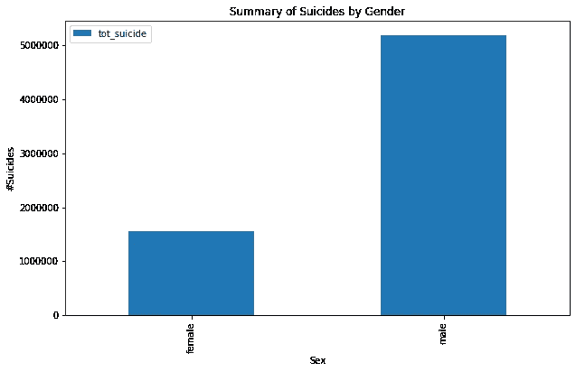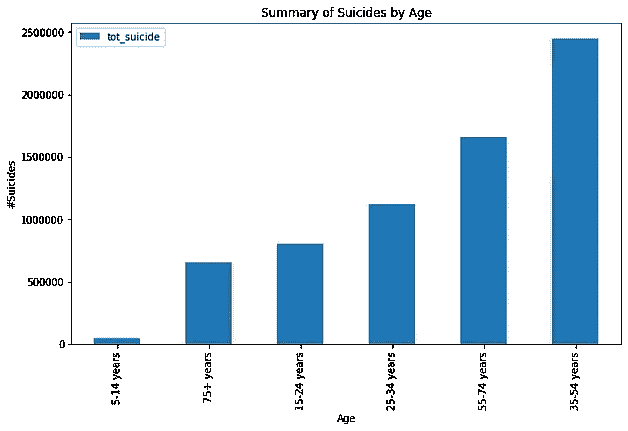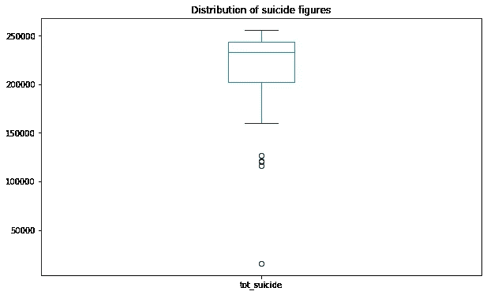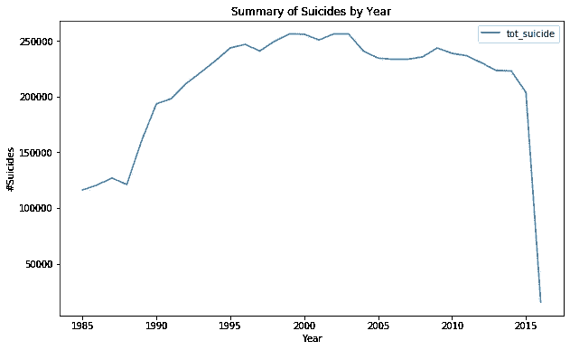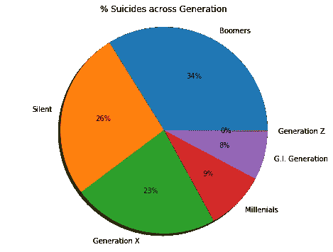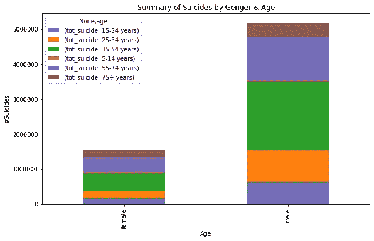

基于 Matplotlib 和 Pyplot 的自杀数据可视化

## 海生的

Seaborn 是一个基于 [matplotlib](https://matplotlib.org/) 的 Python 数据可视化库。它提供了一个高层次的界面来绘制有吸引力的和信息丰富的统计图形。Seaborn 通常以统计数据可视化为目标，但提供更智能和增强的布局。

> 有用提示—在使用 seaborn 功能之前，使用 sns.set(color_codes=True)。这为你的可视化添加了一个很好的背景。

让我们尝试使用 Seaborn 重新创建上面的图表

```
import seaborn as snssns.set(color_codes=True)#— — — — — — — — — — — — -Suicides by year--------------------------
year_summary=suicide_data.groupby('year').agg(tot_suicide=('suicides_no','sum')).sort_values \
                                    (by='year',ascending=True).reset_index()
year_summary.head()#— — — — — — — — — — — — -Using Seaborn to plot trend of suicide with time-------------------------------
fig, ax = plt.subplots(figsize=(10,6));
plt.title('#Suicides across Years')
sns.lineplot(year_summary['year'],year_summary['tot_suicide']);#— — — — — — — — — — — — -Summary by Gender------------------------------------------
gender_summary=suicide_data.groupby('sex').agg(tot_suicide=('suicides_no','sum')).sort_values(by='sex',ascending=True).reset_index()fig, ax = plt.subplots(figsize=(10,6));
plt.title('#Suicides across Years')ax=sns.barplot(gender_summary['sex'],gender_summary['tot_suicide']);
ax.set(xlabel='Gender', ylabel='#Suicides');
plt.show()#— — — — — — — — — — — — -Summary by Gender/age------------------------------------------
gender_age_summary=suicide_data.groupby(['sex','age']).agg(tot_suicide=('suicides_no','sum')).reset_index()
gender_age_summary.head()fig, ax = plt.subplots(figsize=(10,6));
plt.title('#Suicides across Years')ax=sns.barplot(x=gender_age_summary['sex'],y=gender_age_summary['tot_suicide'],hue=gender_age_summary['age']);
ax.set(xlabel='Gender', ylabel='#Suicides');
plt.show()gender_age_summary1=suicide_data.groupby(['sex','age']).agg(tot_suicide=('suicides_no','sum')).unstack()
gender_age_summary1.head()#— — — — — — — — — — — — -Stack bar--------------------------------
sns.set()
gender_age_summary1.plot(kind='bar', stacked=True)#— — — — — — — — — — — — -Checking correlation between suicide, population and gdp per capita
sns.pairplot(suicide_data[['suicides_no', 'population', 'gdp_per_capita ($)']], size=4, aspect=1);#— — — — — — — — — — — — -Boxplot— — — — — — — — — — — — -
sns.boxplot(gender_age_summary['sex'],gender_age_summary['tot_suicide']);
```

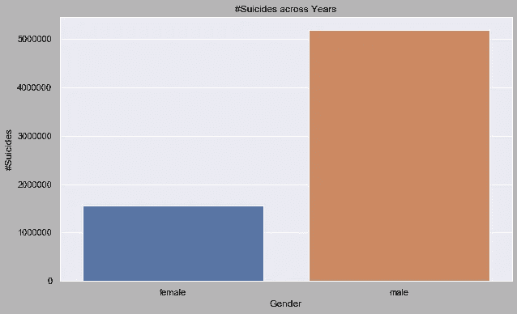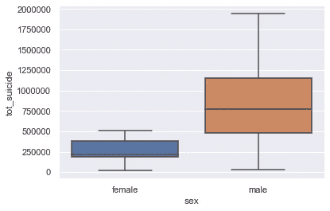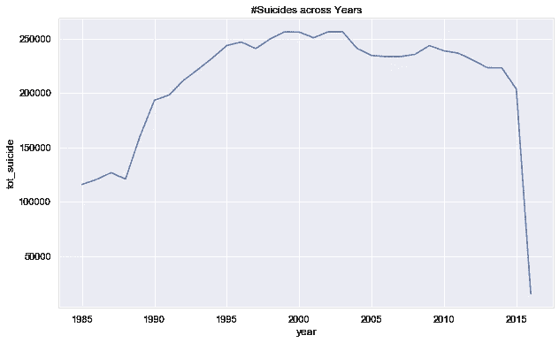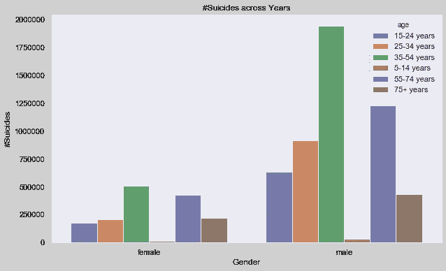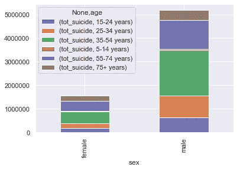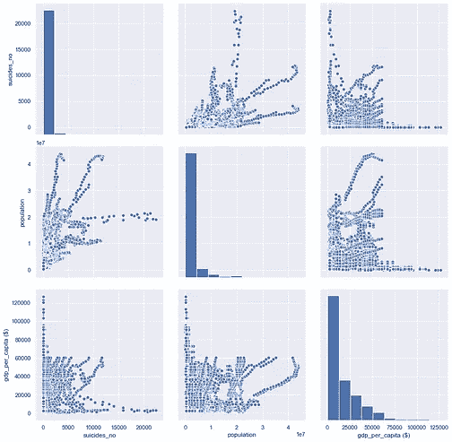

使用 Seaborn 的自杀数据可视化

# 使用可视化讲述故事的最佳实践

以下是创建演示文稿或可视化效果时应该遵循的一些最佳实践:

1.  明确定义问题陈述，并使用自上而下的方法将其分解为多个假设。在上述案例研究中，问题陈述包括了解不同国家的自杀率以及影响自杀率的因素。因此，在进入可视化之前，列出所有可能影响自杀率的因素，例如，年龄、性别、GDP、人口、增长、世代等等。
2.  确定可能给你的故事增加价值的关键因素。想一想这些因素是如何相互联系的，以便对正在发生的事情有一个更全面的了解。不要按年龄和性别分别看自杀率，试着比较两组的自杀率。你可以得到高质量的见解，比如，年龄在 18 到 25 岁之间的男性自杀率更高
3.  一旦你决定了因素，确保你使用图表选择框架来决定哪个图表最适合
4.  确保所有图表格式的一致性，包括颜色、文本大小、标题大小、轴间距、图例位置和图表对象的对齐
5.  在每一个图像下面都有一些发现；这将帮助你为你的利益相关者拼凑一个故事

**数据科学行业的新手？这里有一些提示和窍门供你开始！**

[](/are-your-coding-skills-good-enough-for-a-data-science-job-49af101457aa) [## 对于数据科学的工作，你的编码技能够好吗？

### 5 编码嗅探如果你在数据科学行业工作，你必须知道

towardsdatascience.com](/are-your-coding-skills-good-enough-for-a-data-science-job-49af101457aa) [](/i-cant-teach-you-data-science-in-10-days-f3beeb099b60) [## 我不能在 10 天内教你数据科学

### 理解数据科学空间中的实体和需求的案例研究方法

towardsdatascience.com](/i-cant-teach-you-data-science-in-10-days-f3beeb099b60) 

*关于作者:高级分析专家和管理顾问，帮助公司通过对组织数据的商业、技术和数学的组合找到各种问题的解决方案。一个数据科学爱好者，在这里分享、学习、贡献；你可以和我在* [*上联系*](https://www.linkedin.com/in/angel-das-9532bb12a/) *和* [*上推特*](https://twitter.com/dasangel07_andy)*；***