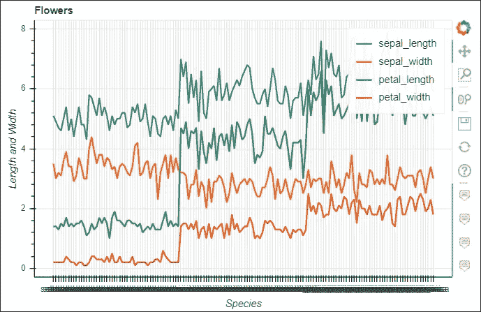

# 使用熊猫散景的数据可视化

> 原文：<https://towardsdatascience.com/data-visualization-using-pandas-bokeh-109240770fd3?source=collection_archive---------38----------------------->

## 为熊猫数据帧创建令人惊叹的可视化效果

探索性数据分析是理解和建立有效的 ML 模型的基础。数据可视化是 EDA 的一个关键部分，有许多工具可用于此。Bokeh 是一个交互式可视化库。它提供了直观和通用的图形。散景有助于快速轻松地制作交互式绘图和仪表盘。熊猫散景为熊猫提供了一个散景绘图后端。

> 将熊猫散景与您的 Python 代码集成非常简单。你只需要安装并导入 pandas-bokeh 库，然后你就可以像使用其他可视化工具一样使用它了。你应该在导入熊猫后导入熊猫-散景库。使用以下命令下载并导入 pandas-bokeh 库:

```
*#Load the pandas_bokeh library*

!pip install pandas_bokehimport pandas as pd
import pandas_bokeh
```

您可以将打印输出设置为 HTML 或笔记本。使用命令**pandas _ bokeh . output _ notebook()**将输出设置为 notebook。这将在笔记本单元格中嵌入情节。使用命令**pandas _ bokeh . output _ file(filename)**将输出显示为 HTML 文件。

您可以使用命令 **df.plot_bokeh()** 轻松绘制 Pandas 数据帧。熊猫散景提供了各种各样的绘图选项，如线，分散，酒吧，直方图，面积，地图绘图，步骤，点，饼图。所有的情节都是互动的，可平移的，可缩放的。下面是一些流行的可视化代码的例子，使用数据分析中常用的 pandas_bokeh 绘制。

**柱状图**

```
*#Vertical barchart*
carhpbot.plot_bokeh(
    kind="bar",
    figsize =(1000,800),
    x="name",
    xlabel="Car Models", 
    title="Bottom 10 Car Features", 
    alpha=0.6,
    legend = "top_right",
    show_figure=True)

*#Stacked vertical bar*
carhpbot.plot_bokeh.bar(
    figsize =(1000,800),
    x="name",
    stacked=True,
    xlabel="Car Models", 
    title="Bottom 10 Car Features", 
    alpha=0.6,
    legend = "top_right",
    show_figure=True)
```


条形图

**线条图**

```
iris.plot_bokeh(
    kind='line',
    x='species',
    y=['sepal_length', 'sepal_width','petal_length','petal_width'],
    xlabel='Species',
    ylabel='Length and Width',
    title='Flowers',
)
```



**直方图**

```
iris.plot_bokeh(kind="hist",title ="Iris feature distribution",
                   figsize =(1000,800),
                   xlabel = "Features",
                   ylabel="Measure"
                )
```


柱状图

**散点图**

```
car.plot_bokeh.scatter(
    x='horsepower', 
    y=['weight'],
    figsize=(1000, 700),
    zooming=False,
    panning=False
)
```


**地图地块**

```
mapplot["size"] = mapplot["pop_max"] / 1000000
mapplot.plot_bokeh.map(
    x="longitude",
    y="latitude",
    hovertool_string="""<h2> @**{name}** </h2> 

                        <h3> Population: @**{pop_max}** </h3>""",
    tile_provider="STAMEN_TERRAIN_RETINA",
    size="size", 
    figsize=(1200, 600),
    title="Cities with more than 1000K population")
```


地图绘图

**面积图**

```
carhp.plot_bokeh.area(
    x="name",
    stacked=True,
    figsize=(1300, 700),
    title="Compare Car Models",
    xlabel="Top 10 Car models",
    )
```


这些是使用 pandas_bokeh 绘制的一些基本图。这些图中的每一个都可以使用各种可选参数进一步增强。熊猫博客提供了一个精彩的 [GitHub 库](https://github.com/PatrikHlobil/Pandas-Bokeh)用一些很棒的例子解释了所有的情节。我上面展示的例子都可以在我的 [Kaggle 笔记本](https://www.kaggle.com/krrai77/data-visualization-using-bokeh)的数据集中找到。