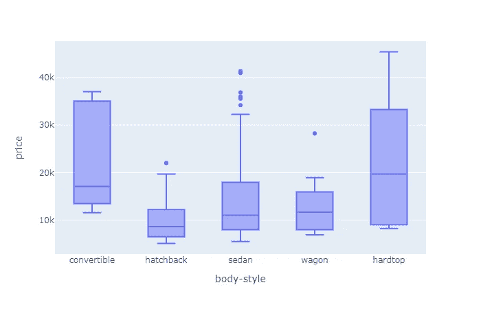
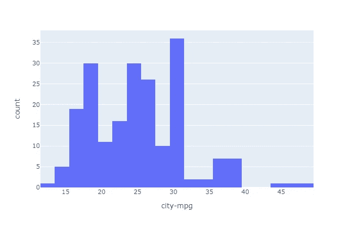
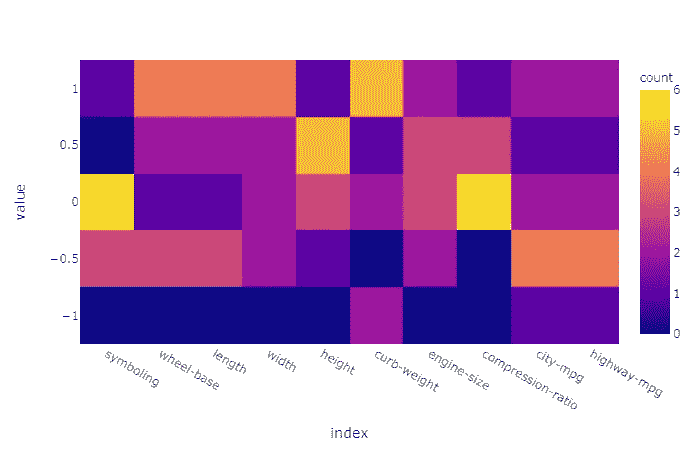
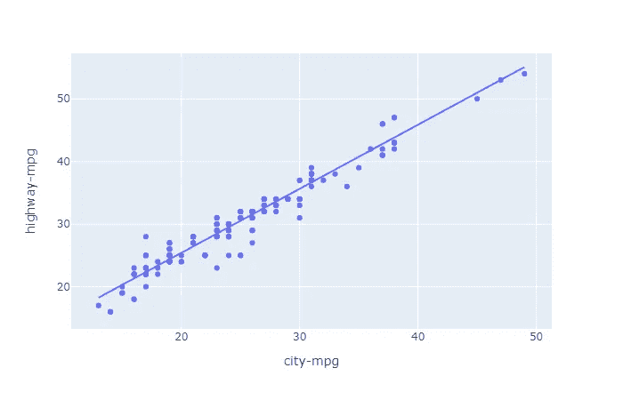
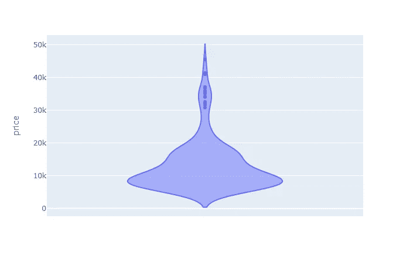
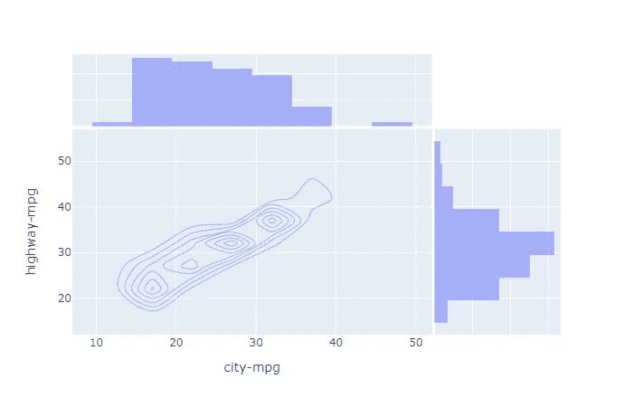

# 使用 Plotly 的统计图进行数据可视化

> 原文：<https://towardsdatascience.com/data-visualization-using-statistical-charts-by-plotly-e730c27de1fd?source=collection_archive---------49----------------------->

## 统计图表类型和使用 Plotly 绘图


斯蒂芬·道森在 [Unsplash](https://unsplash.com?utm_source=medium&utm_medium=referral) 上拍摄的照片

数据可视化在数据分析中起着重要的作用，因为只要人眼看到一些图表或图形，他们就会试图在该图形中找到模式。

数据可视化是使用不同的图/图形/图表直观地表示数据，以找出模式、异常值以及数据集不同属性之间的关系。它是数据的图形表示。

统计数据分析是执行各种统计操作的过程。它是一种定量研究，即对数据进行研究，以找出数据的统计特性。

Python 为可视化提供了不同的库/包，如 Matplotlib、Seaborn、ggplot 等。但我个人最喜欢的是 **Plotly** ，因为它不仅帮助我们可视化数据，还创建了高度互动和视觉上吸引人的图表/条形图/曲线图等。

# 在本文中，我们将讨论最重要的统计图表，并将创建和可视化它们。

# 箱线图

箱线图帮助我们可视化数据及其四分位数，箱线图的主要好处之一是我们可以清楚地识别异常值。让我们绘制一个箱线图，这里使用的数据集是一个汽车设计数据集，它包含汽车制造公司的不同属性。

```
import pandas as pd
import plotly.express as pxdf = pd.read_csv('car_design.csv')fig = px.box(df, x="body-style", y="price")
fig.show()
```



箱线图(异常值清晰可见)

# 直方图

直方图用于确定数据的近似分布。在直方图中，创建不同的箱，并表示每个箱的计数。直方图基于面积，而不是条形的高度。在直方图中，它是指示每个条柱出现频率的条形区域。

```
fig = px.histogram(df, x="city-mpg")
fig.show()
```



代表不同数据仓的直方图。

# 热图

热图是数据的二维图形表示，表示不同数据属性之间的相关性，并根据颜色进行区分。

```
fig = px.density_heatmap(df.corr())
fig.show()
```



热图

# 散点图

散点图是一种可视化形式，其中点用于显示数据集中两个变量的不同值。它用于找出两个变量之间的关系。

```
fig = px.scatter(df, x="city-mpg", y="highway-mpg", trendline="ols")
fig.show()
```



散点图显示了强相关性

# 小提琴情节

小提琴图是数字数据的统计表示。它类似于一个箱形图，在每一侧增加了一个旋转的核密度图。

```
fig = px.violin(df, y="price")
fig.show()
```



使用小提琴图的价格分布

# 2D 密度等高线

2D 密度图或 2D 直方图是众所周知的直方图的扩展。它显示了数据集中的值在两个定量变量范围内的分布。避免在散点图中过度绘制非常有用。

```
fig = px.density_contour(df, x="city-mpg", y="highway-mpg", marginal_x="histogram", marginal_y="histogram")
fig.show()
```



2D 密度等值线图

在本文中，我们看到了不同的统计图，以及如何使用 Plotly 绘制它们，Plotly 是一个用于可视化的 python 库。

这些图将为您提供统计数据可视化背后的基本概念，您可以相应地更改参数，并根据您的要求可视化数据。

[](https://analyticsindiamag.com/tips-for-automating-eda-using-pandas-profiling-sweetviz-and-autoviz-in-python/) [## 在 Python 中使用 Pandas Profiling、Sweetviz 和 Autoviz 实现 EDA 自动化的技巧

### 探索性数据分析(EDA)用于探索我们正在处理的数据的不同方面。应该执行…

analyticsindiamag.com](https://analyticsindiamag.com/tips-for-automating-eda-using-pandas-profiling-sweetviz-and-autoviz-in-python/) [](/downloading-stock-data-and-representing-it-visually-6433f7938f98) [## 下载股票数据并直观地展示出来

### 使用 YFinance 和 Plotly 库进行股票数据分析

towardsdatascience.com](/downloading-stock-data-and-representing-it-visually-6433f7938f98) [](/sweetviz-automated-eda-in-python-a97e4cabacde) [## sweet viz:Python 中的自动化 EDA

### 使用 Sweetviz python 库进行探索性数据分析

towardsdatascience.com](/sweetviz-automated-eda-in-python-a97e4cabacde) 

# 在你走之前

***感谢*** *的阅读！如果你想与我取得联系，请随时通过 hmix13@gmail.com 联系我或我的* [***LinkedIn 个人资料*** *。*](https://www.linkedin.com/in/himanshusharmads/) *您也可以在我的**[***Github****中查看我在这里使用的代码和数据。*](https://github.com/hmix13/StatisticalVisualization)*