# 使用 Streamlit 实现数据可视化

> 原文：<https://towardsdatascience.com/data-visualization-using-streamlit-151f4c85c79a?source=collection_archive---------6----------------------->

## Streamlit 简介


卢克·切瑟在 [Unsplash](https://unsplash.com?utm_source=medium&utm_medium=referral) 上的照片

喜欢、分享、订阅频道- [HackerShrine](https://www.youtube.com/channel/UC0ZCXAvGOg5fDyw0Xu-_PCw)

最近，我遇到了一个开源框架— [Streamlit](https://www.streamlit.io/) ，它是用来创建数据应用的。所以我花了一些时间在文档上，并在一个[粮食需求预测数据集](https://datahack.analyticsvidhya.com/contest/genpact-machine-learning-hackathon-1/#ProblemStatement)上做了一些数据可视化。

> Streamlit 的开源应用框架是数据科学家和机器学习工程师在几个小时内创建漂亮、高性能应用的最简单方式！全是纯 Python。全部免费。
> 
> [—流线型](https://www.streamlit.io/)

要开始，只需键入以下命令:

```
pip install streamlit
```

要检查它是否安装正确，请运行以下命令:

```
streamlit hello
```

如果这出现在您的浏览器上，则 streamlit 已安装并正常工作！

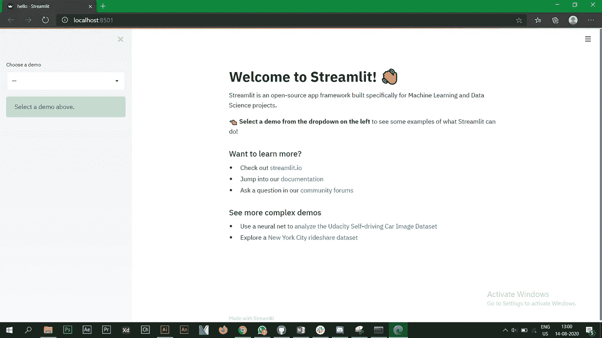

现在我们将使用上面链接中提供的数据集绘制一些简单的图表。

首先导入必要的库并给出一个标题。

```
import streamlit as st
import pandas as pd
import numpy as np
import plotly.figure_factory as ff
import matplotlib.pyplot as pltst.title(‘Food Demand Forecasting — Analytics Vidhya’)
```

在数据集中，您将看到 3 个 csv 文件，我们现在将使用 pandas 导入这些文件。@st.cache 在这里对于流畅快速的运行是相当重要的。在这里详细阅读[。](https://docs.streamlit.io/en/stable/tutorial/create_a_data_explorer_app.html#effortless-caching)

```
[@st](http://twitter.com/st).cache
def load_data(nrows):
    data = pd.read_csv('train.csv', nrows=nrows)
    return data[@st](http://twitter.com/st).cache
def load_center_data(nrows):
    data = pd.read_csv('fulfilment_center_info.csv',nrows=nrows)
    return data[@st](http://twitter.com/st).cache
def load_meal_data(nrows):
    data = pd.read_csv('meal_info.csv',nrows=nrows)
    return data
```

现在让我们调用这些函数。我现在只取 1000 行，你可以取整个数据集。

```
data_load_state = st.text('Loading data...')
weekly_data = load_data(1000)
center_info_data = load_center_data(1000)
meal_data = load_meal_data(1000)
```

首先我们来看一下 ***周需求数据*** 。我们将绘制条形图，直方图，折线图和面积图。

**条形图**

```
st.subheader(‘Weekly Demand Data’)
st.write(weekly_data)#Bar Chart
st.bar_chart(weekly_data[‘num_orders’])
```

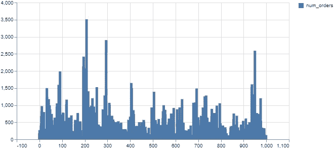

**直方图**

```
#histogram
df = pd.DataFrame(weekly_data[:200], columns = [‘num_orders’,’checkout_price’,’base_price’])
df.hist()
plt.show()
st.pyplot()
```

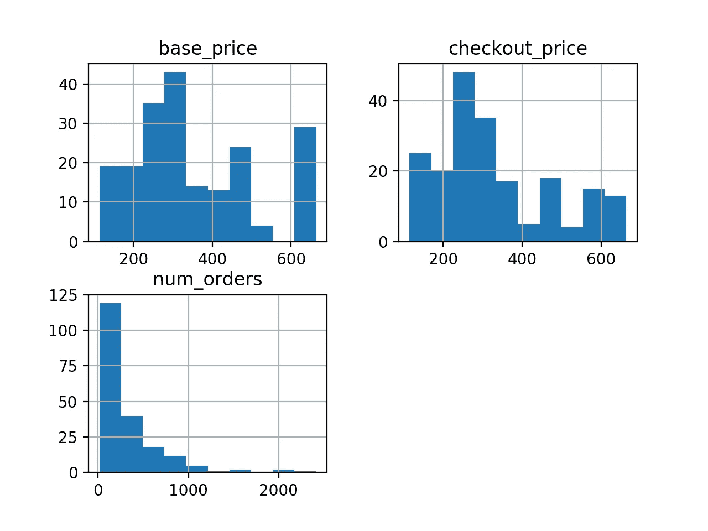

**折线图**

```
#Line Chart
st.line_chart(df)
```

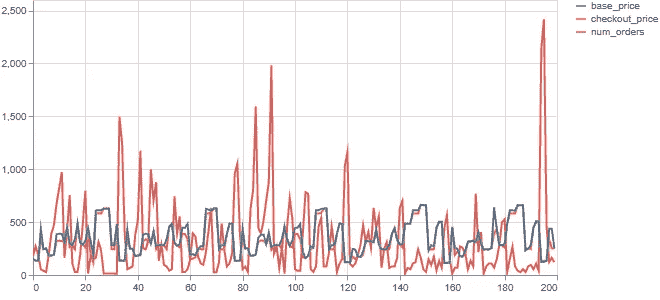

**面积图**

```
chart_data = pd.DataFrame(weekly_data[:40], columns=[‘num_orders’, ‘base_price’])
st.area_chart(chart_data)
```

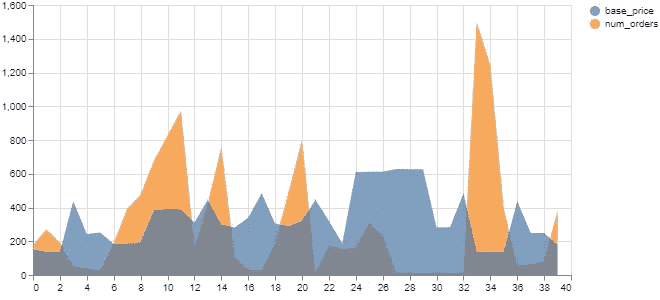

我们拥有的下一个 csv 文件属于 ***履行信息中心。***

为了显示 csv 文件中的原始数据，我添加了一个复选框，当它被选中时，就会显示原始数据。Streamlit 提供了简单而优雅的语法，如下所示。

```
st.subheader(‘Fulfillment Center Information’)
if st.checkbox(‘Show Center Information data’):
    st.subheader(‘Center Information data’)
    st.write(center_info_data)
#st.write(center_info_data)
```

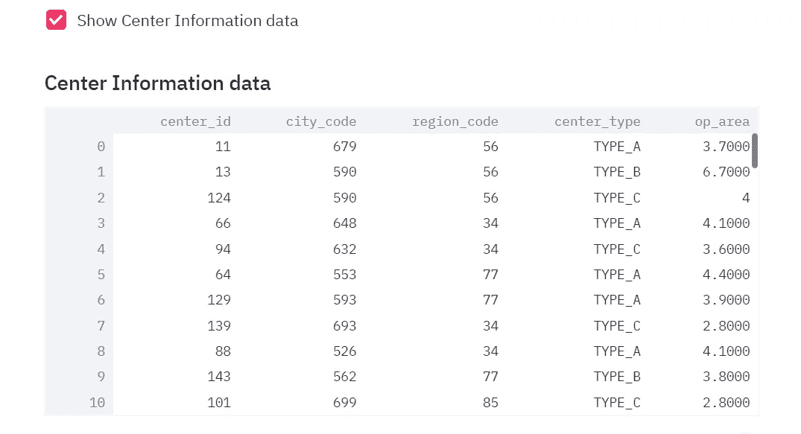

以类似于每周需求数据的方式绘制区域代码和中心类型的条形图。

```
st.bar_chart(center_info_data[‘region_code’])
st.bar_chart(center_info_data[‘center_type’])
```

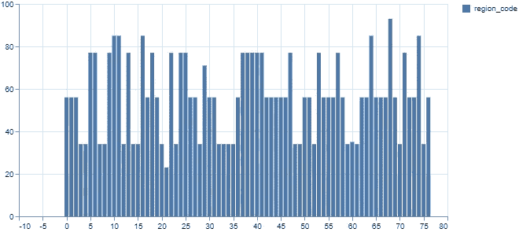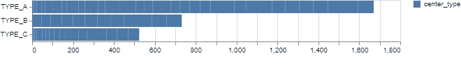

接下来，我们将使用 plotly 查看配送区域代码和中心 id。

```
hist_data = [center_info_data[‘center_id’],center_info_data[‘region_code’]]
group_labels = [‘Center Id’, ‘Region Code’]
fig = ff.create_distplot(hist_data, group_labels, bin_size=[10, 25])
st.plotly_chart(fig, use_container_width=True)
```

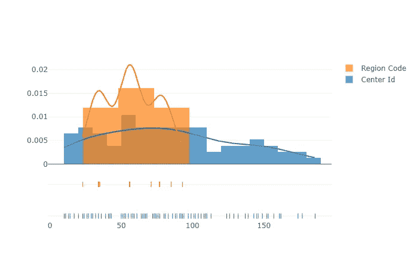

我们拥有的最后一个 csv 文件是膳食数据，让我们也显示它的原始数据。

```
st.subheader('Meal Information')
st.write(meal_data)
```

这里绘制了一个简单的 cusine 柱条形图。

```
st.bar_chart(meal_data[‘cuisine’])
```

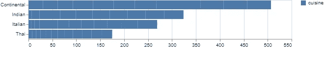

然后创建按钮，点击该按钮将显示餐饮类别数量的条形图。这可以通过编写以下代码来实现:

```
agree = st.button(‘Click to see Categories of Meal’)
if agree:
 st.bar_chart(meal_data[‘category’])
```

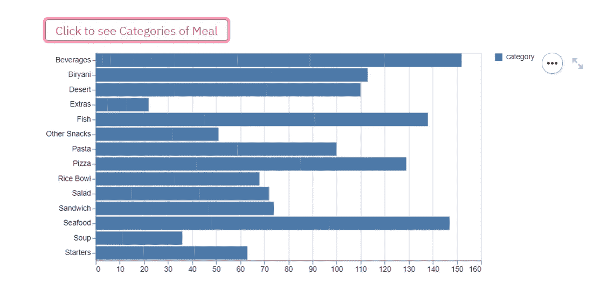

要运行您的 streamlit 应用程序，只需键入以下命令:

```
streamlit run appname.py
```

这将打开一个浏览器，你可以看到所有的可视化。

这是我电脑上的一个屏幕录像。

[](https://www.linkedin.com/posts/aniket-wattamwar-0a6658139_machinelearning-python-streamlit-activity-6699267657994162176-psWO) [## Aniket Wattamwar 在 LinkedIn 上发帖

### 最近，我偶然发现了一个开源框架 Streamlit。所以，我花了一些时间在文档上，做了一些…

www.linkedin.com](https://www.linkedin.com/posts/aniket-wattamwar-0a6658139_machinelearning-python-streamlit-activity-6699267657994162176-psWO) 

你可以在我的 G [itHub](https://github.com/aniketwattamwar) 上找到完整的代码。你也可以在其他平台上和我联系——[Linktree](https://linktr.ee/aniketwattamwar)

谢谢你。

和平。