# 使用 ggplot2 实现数据可视化

> 原文：<https://towardsdatascience.com/data-visualization-with-ggplot2-db04c4956236?source=collection_archive---------10----------------------->

## [实践教程](https://towardsdatascience.com/tagged/hands-on-tutorials)

## R 语言中的“图形语法”一瞥


来自 [Pixabay](https://pixabay.com/?utm_source=link-attribution&utm_medium=referral&utm_campaign=image&utm_content=2420762) 的[大卫·马克](https://pixabay.com/users/12019-12019/?utm_source=link-attribution&utm_medium=referral&utm_campaign=image&utm_content=2420762)的图片

## r 编程

编程已经成为最好的数据分析工具之一，尤其是在可视化分析方面。一个伟大的社区贡献使得学习、使用和分享有效的可视化变得更加容易。必须指出，适当的可视化对于数据科学家&人工智能专家来说是一个非常重要的因素。即使您只对具有影响力的可视化的业务通信感兴趣，R 也可以为您提供一种全面的工作方式，在这种方式下，您可以充分自由地处理数据并为您的受众创建有用的图表。顺便说一下，它是一个开源工具。RStudio 是最适合 r 的 IDE(集成开发环境)。

## ggplot2

[***gg plot 2***](https://ggplot2.tidyverse.org/)是 R 社区最流行的数据可视化包。它是由哈德利·威克姆在 2005 年创立的。它是基于 Leland Wilkinson 的 [***图形语法***](https://www.amazon.com/Grammar-Graphics-Statistics-Computing/dp/0387245448) 实现的——这是一种数据可视化的通用方案，它将图形分解为比例和层等语义组件。在使用 ***ggplot2*** 的时候，你提供数据，调用特定的函数，将你想要的变量映射到美学，定义图形参数，剩下的就交给它了！具体可以去翻翻它的[文档](https://www.rdocumentation.org/packages/ggplot2/versions/3.3.2)。

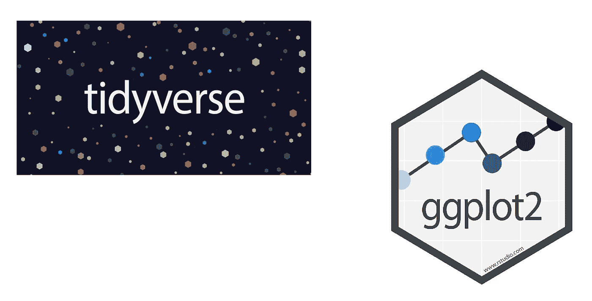

图片来源:[潮汐](https://images.app.goo.gl/C7wgXno4gApoemLr6)， [ggplot2](https://images.app.goo.gl/92ZL6KuHFE7eARMS6)

## tidyverse

[***tidy verse***](https://www.tidyverse.org/)是同一位 Hadley Wickham 推出的数据科学软件包集合。***【tidy verse】*封装了“*gg plot 2”***以及其他用于数据争论和数据发现的包。更多细节可在其[文档](https://www.rdocumentation.org/packages/tidyverse/versions/1.3.0)中找到。

## 安装软件包

让我们先安装所需的软件包。您不需要在我们的系统中多次安装任何软件包，除非您愿意升级它。**注意**:如果安装*，那么就不需要单独安装 ***ggplot2*** ！*

```
***# install.packages('ggplot2')
install.packages('tidyverse')
install.packages("ggalt")
install.packages('GGally')
install.packages('ggridges')***
```

*   ****反转*** 为*所有地块**
*   ****ggalt*** 为*哑铃剧情**
*   ****GGally***for*散点图**
*   ***垄*垄*垄**为*垄**

## *加载包*

*现在我们需要加载我们的包。与安装不同，每次启动系统时都需要加载软件包。*

```
***library(tidyverse)
library(ggalt)
library(GGally)
library(ggridges)***
```

## *探索数据集*

*在本练习中，我们将使用四个数据集。其中两个是标准数据集，在世界范围内用于实践数据可视化。这些是 ***虹膜*** 和 ***钻石*** 数据集。另外两个是为此工作目的专门策划的数据集。 ***names.csv*** 有 1880 年到 2017 年这几年三个女性名字的使用数据，***life _ expect ency . CSV***包含了 15 个国家 1967 年和 2007 年的预期寿命。请从我的 [github 库](https://github.com/aykhaled/R_Visualization)或者从 [google drive](https://drive.google.com/file/d/1L_vL4ws524nvDxCkruhuK5GgaN5tD7On/view?usp=sharing) 下载这两个数据集，看哪个方便。注意:所有这些数据集都是开源的。*

*现在，让我们导入数据集*

```
***data_iris <- iris
data_diamonds <- diamonds**setwd("E:**/**---**/**your_working-directory")
**data_names <- read.csv("names.csv", header = TRUE)
data_life_exp <- read.csv("life_expectency.csv", header = TRUE)***
```

*这里有三个检查导入数据的选项，*

```
***View(data_iris)***
```

*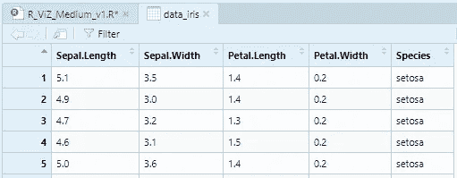*

*作者图片*

```
***head(data_iris)***
```

*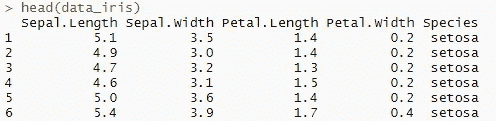*

*作者图片*

```
***glimpse(data_iris)***
```

*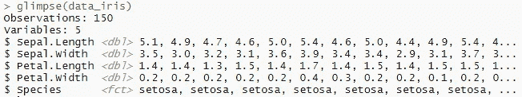*

*作者图片*

## *关于功能*

*我们将使用 *ggplot2* 包中的几个函数。这些函数一起工作，产生所需的图形。每个 *ggplot2* 图形都以函数`**ggplot()**` 开始。它基本上创建了坐标系。在此之上添加图形层。该函数的第一个参数是目标图的输入数据集。然后是 *geom* 功能，根据其 *geom* 即`**geom_point**`、`**geom_line**`、`**geom_bar**`等，在坐标系上添加标绘图层。每个几何函数都需要一个 T4 参数。这定义了数据集中的变量如何映射到可视化属性。美学函数`**aes()**`被分配给`**mapping**`自变量。`aes()`函数的主要参数是轴增量- `**x**`、`**y**`和微分参数，如`**color**`、`**size**`、`**fill**`、`**alpha**`。当区别参数被放在`aes()`函数之外时，它们就变成了共同特征参数。`**ggtitle()**`、`**xlab()**`、`**ylab()**`、`**theme()**`这些功能用于标签和专题属性。**注** **:** 通过执行 ***命令，可以在帮助选项卡中找到这些功能的详细信息？****function _ name*，像`**?geom_point**`。*

*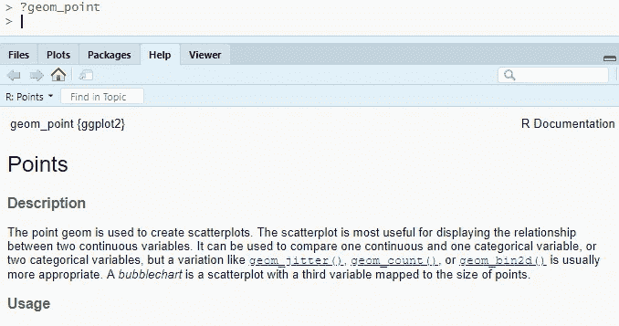*

*作者图片*

*这些功能可以组织在下面的模板中*

```
***ggplot(data = <DATA>) + 
  <GEOM_FUNCTION>(mapping = aes(<MAPPINGS>))****ggplot(<DATA>) + 
  <GEOM_FUNCTION>(aes(<MAPPINGS>))****ggplot(data = <DATA> , mapping = aes(<MAPPINGS>)) + 
  <GEOM_FUNCTION>()****ggplot(<DATA> , aes(<MAPPINGS>)) + 
  <GEOM_FUNCTION>()***
```

# ***散点图***

**

*照片由 [Gábor Juhász](https://unsplash.com/@juhg?utm_source=medium&utm_medium=referral) 在 [Unsplash](https://unsplash.com?utm_source=medium&utm_medium=referral) 上拍摄*

*数据集- ***虹膜****

**

*作者图片*

***基本散点图***

```
***ggplot(data_iris) +
  geom_point(aes(x = Sepal.Length , y = Sepal.Width),
             color = 'blue', size = 4, pch = 19) +**

  ggtitle("Basic Scatter Plot", subtitle = "iris") +
  xlab("SEPAL LENGTH") +
  ylab("SEPAL WIDTH") +
  theme_bw() +
  theme(axis.text.x = element_text(face = 'bold.italic', 
                                   color = 'darkgreen',
                                   size = 10, angle = 0),
        axis.text.y = element_text(face = 'bold', 
                                   color = 'blue',
                                   size = 10, angle = 45))*
```

*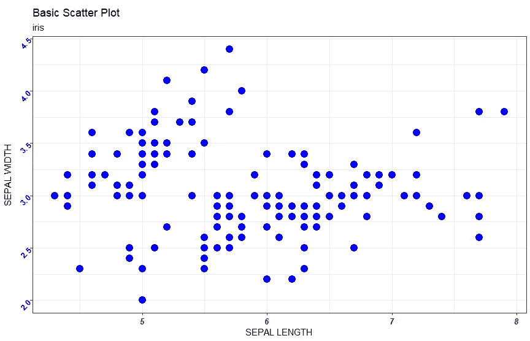*

*作者图片*

***散点图，通过颜色区分特征&形状***

```
***ggplot(data_iris) +
  geom_point(aes(x = Sepal.Length , y = Sepal.Width,
                 *color = Species, shape = Species*), size = 4) +**

  ggtitle("Scatter Plot with feature differentiation - 1") +
  xlab("SEPAL LENGTH") +
  ylab("SEPAL WIDTH") +
  theme_bw() +
  theme(axis.text.x = element_text(face = 'bold.italic', 
                                   color = 'darkgreen',
                                   size = 10, angle = 0),
        axis.text.y = element_text(face = 'bold', 
                                   color = 'blue',
                                   size = 10, angle = 45))*
```

*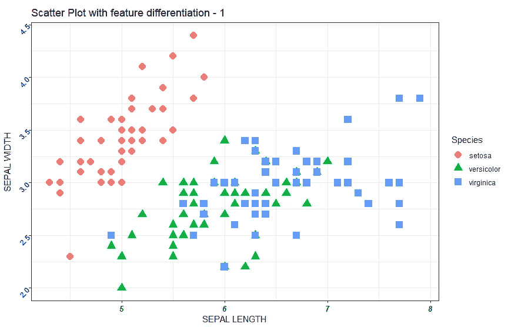*

*作者图片*

***散点图，按尺寸区分特征&透明度***

```
***ggplot(data_iris) +
  geom_point(aes(x = Sepal.Length , y = Sepal.Width,
                 *size = Petal.Width, alpha = Petal.Length*)) +**

  ggtitle("Scatter Plot with feature differentiation - 2") +
  xlab("SEPAL LENGTH") +
  ylab("SEPAL WIDTH") +
  theme_bw() +
  theme(axis.text.x = element_text(face = 'bold.italic', 
                                   color = 'darkgreen',
                                   size = 10, angle = 0),
        axis.text.y = element_text(face = 'bold', 
                                   color = 'blue',
                                   size = 10, angle = 45))*
```

**

*作者图片*

# *线形图*

**

*艾玛·露易丝·科默福德在 [Unsplash](https://unsplash.com?utm_source=medium&utm_medium=referral) 上拍摄的照片*

*数据集- ***名称****

*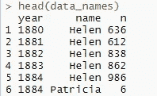*

*作者图片*

***基本线条图***

```
***ggplot(data_names %>% filter(name == 'Helen')) +
  geom_line(aes(x = year, y = n), 
            lwd = 1.25, color = 'darkgreen') +**

  ggtitle("Basic Line Plot", subtitle = "name - Helen") +
  xlab("YEAR") +
  ylab("NUMBER") +
  theme_bw() +
  theme(axis.text.x = element_text(face = 'bold', size = 10),
        axis.text.y = element_text(face = 'bold', size = 10))*
```

*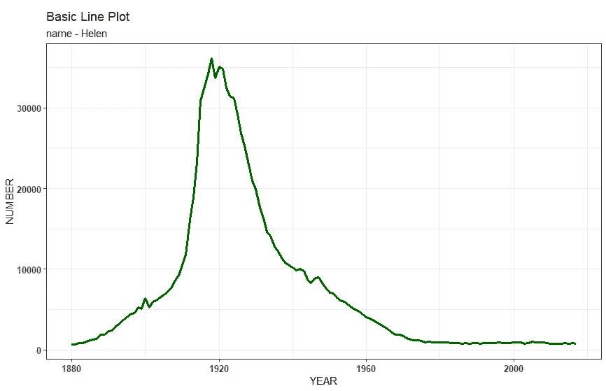*

*作者图片*

*根据颜色和线型区分特征的线图*

```
***ggplot(data_names) +
  geom_line(aes(x = year, y = n, 
                *color = name, lty = nam*e), lwd = 1.25) +**

  ggtitle("Line Plot with feature differentiation") +
  xlab("YEAR") +
  ylab("NUMBER") +
  theme_bw() +
  theme(axis.text.x = element_text(face = 'bold', size = 10),
        axis.text.y = element_text(face = 'bold', size = 10))*
```

**

*作者图片*

# *条形图*

**

*照片由[所有邦](https://unsplash.com/@all_bong?utm_source=medium&utm_medium=referral)在 [Unsplash](https://unsplash.com?utm_source=medium&utm_medium=referral) 上拍摄*

*数据集- ***钻石****

*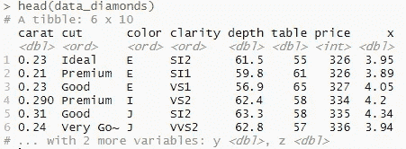*

*作者图片*

***基本条形图***

```
**as.data.frame(table(data_diamonds$cut))* **ggplot(as.data.frame(table(data_diamonds$cut))) +
  geom_bar(aes(*x = Var1, y = Freq*), 
           *stat = 'identity'*, fill = 'darkgreen') +**

  ggtitle("Basic Bar Plot") +
  xlab("CUT") +
  ylab("COUNT") +
  theme_bw() +
  theme(axis.text.x = element_text(face = 'bold', size = 10),
        axis.text.y = element_text(face = 'bold', size = 10))*
```

*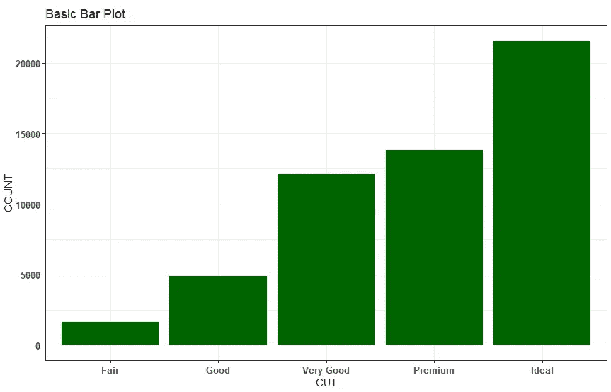*

*作者图片*

***极坐标变换的基本条形图***

```
**as.data.frame(table(data_diamonds$cut))* **ggplot(as.data.frame(table(data_diamonds$cut))) +
  geom_bar(aes(*x = Var1, y = Freq, fill = Var1*), 
           *stat = 'identity'*) +**

  ggtitle("Bar Plot with polar transformation") +
  xlab("CUT") +
  ylab("COUNT") + **coord_polar("y") +** theme_bw() +
  theme(axis.text.x = element_text(face = 'bold', size = 10),
        axis.text.y = element_text(face = 'bold', size = 10))*
```

*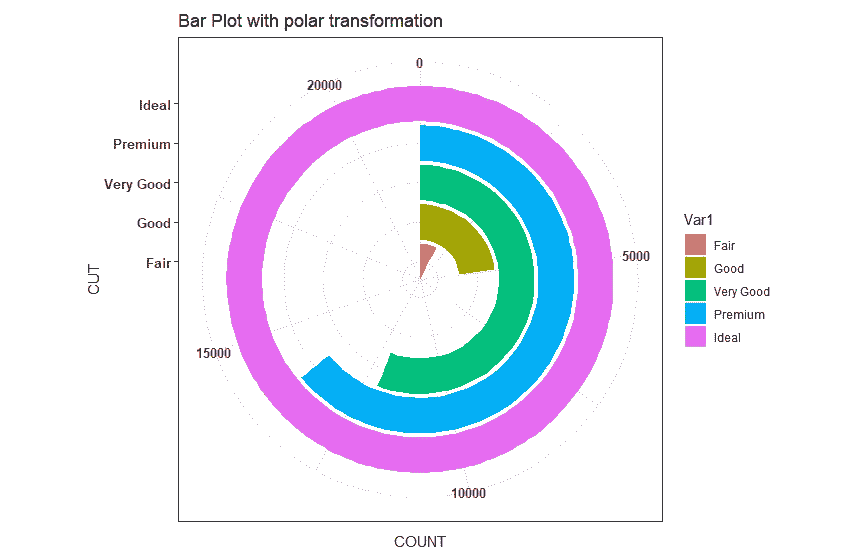*

*作者图片*

***基本条形图- 2***

```
***ggplot(*data_diamonds*) +
  geom_bar(aes(x = cut, fill = cut),
           color = 'lightblue') +**

  ggtitle("Basic Bar Plot - 2") +
  xlab("CUT") +
  ylab("COUNT") +
  theme_bw() +
  theme(axis.text.x = element_text(face = 'bold', size = 10),
        axis.text.y = element_text(face = 'bold', size = 10))*
```

**

*作者图片*

***堆积条形图***

```
***ggplot(data_diamonds) +
  geom_bar(aes(x = cut, *fill = clarity*), 
           color = 'lightblue') +**

  ggtitle("Stacked Bar Plot") +
  xlab("CUT") +
  ylab("COUNT") +
  theme_bw() +
  theme(axis.text.x = element_text(face = 'bold', size = 10),
        axis.text.y = element_text(face = 'bold', size = 10))*
```

*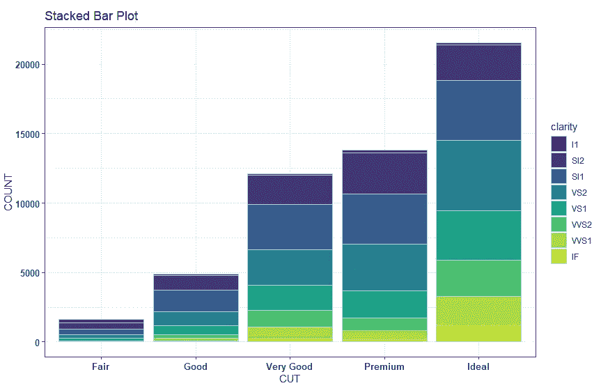*

*作者图片*

***相同高度的堆积条形图***

```
***ggplot(data_diamonds) +
  geom_bar(aes(x = cut, fill = clarity), *position = 'fill*') +**

  ggtitle("Stacked Bar Plot (same height)") +
  xlab("CUT") +
  ylab("COUNT") +
  theme_bw() +
  theme(axis.text.x = element_text(face = 'bold', size = 10),
        axis.text.y = element_text(face = 'bold', size = 10))*
```

*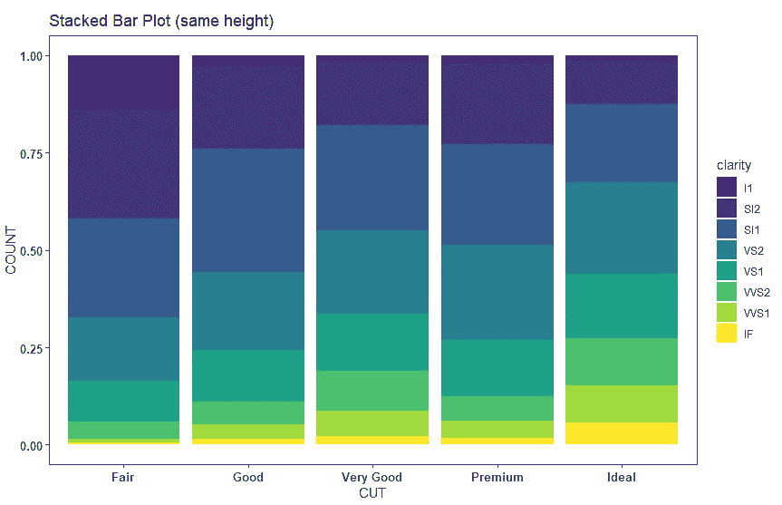*

*作者图片*

***分组条形图***

```
***ggplot(data_diamonds) +
  geom_bar(aes(x = cut, fill = clarity), *position = 'dodge'*) +**

  ggtitle("Grouped Bar Plot") +
  xlab("CUT") +
  ylab("COUNT") +
  theme_bw() +
  theme(axis.text.x = element_text(face = 'bold', size = 10),
        axis.text.y = element_text(face = 'bold', size = 10))*
```

*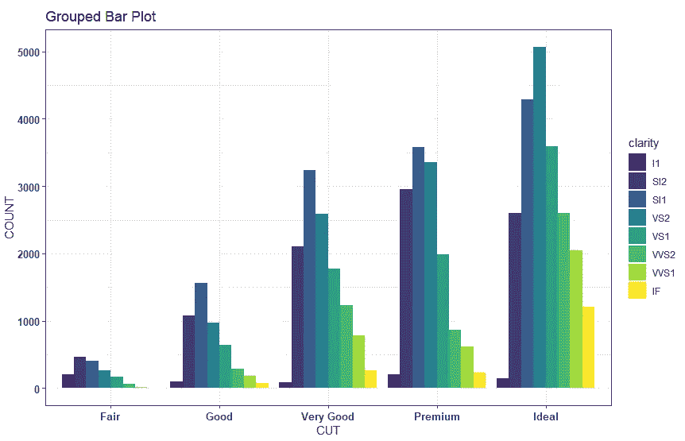*

*作者图片*

***带极坐标变换的堆积条形图***

```
***ggplot(data_diamonds) +
  geom_bar(aes(x = cut, fill = clarity)) +**

  ggtitle("Stacked Polar (1)") +
  xlab("CUT") +
  ylab("COUNT") +
 **coord_polar("y") +**

  theme_bw() +
  theme(axis.text.x = element_text(face = 'bold', size = 10),
        axis.text.y = element_text(face = 'bold', size = 10))*
```

*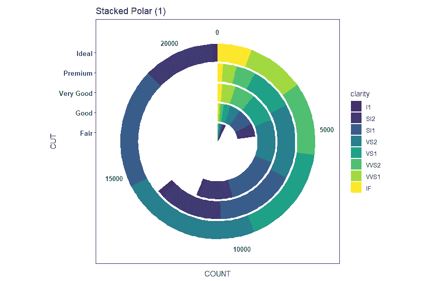*

*作者图片*

***带极坐标变换的堆积条形图- 2***

```
***ggplot(data_diamonds) +
  geom_bar(aes(x = cut, fill = clarity)) +**

  ggtitle("Stacked Polar (2)") +
  xlab("CUT") +
  ylab("COUNT") +

  **coord_polar() +**

  theme_bw() +
  theme(axis.text.x = element_text(face = 'bold', size = 10),
        axis.text.y = element_text(face = 'bold', size = 10))*
```

*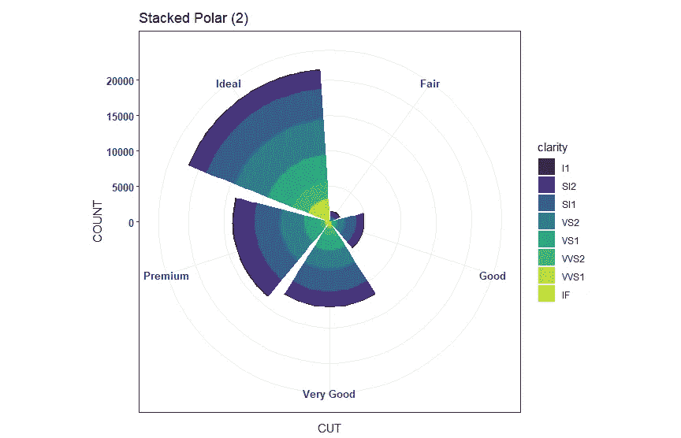*

*作者图片*

# *瓷砖图*

**

*照片由[工作保存器](https://unsplash.com/@jobsavelsberg?utm_source=medium&utm_medium=referral)在 [Unsplash](https://unsplash.com?utm_source=medium&utm_medium=referral) 上拍摄*

*数据集- ***钻石****

**

*作者图片*

```
**as.data.frame(table(data_diamonds$cut, data_diamonds$color))*
**ggplot(as.data.frame(table(data_diamonds$cut, 
                           data_diamonds$color))) +
  geom_tile(aes(x = Var1, y = Var2, fill = Freq)) +
 *geom_text(aes(x = Var1, y = Var2, label = Freq), 
            color = "yellow") +***

  ggtitle("Tiles Plot") +
  xlab("CUT") +
  ylab("COLOR") +
  theme_bw() +
  theme(axis.text.x = element_text(face = 'bold', size = 10),
        axis.text.y = element_text(face = 'bold', size = 10))*
```

*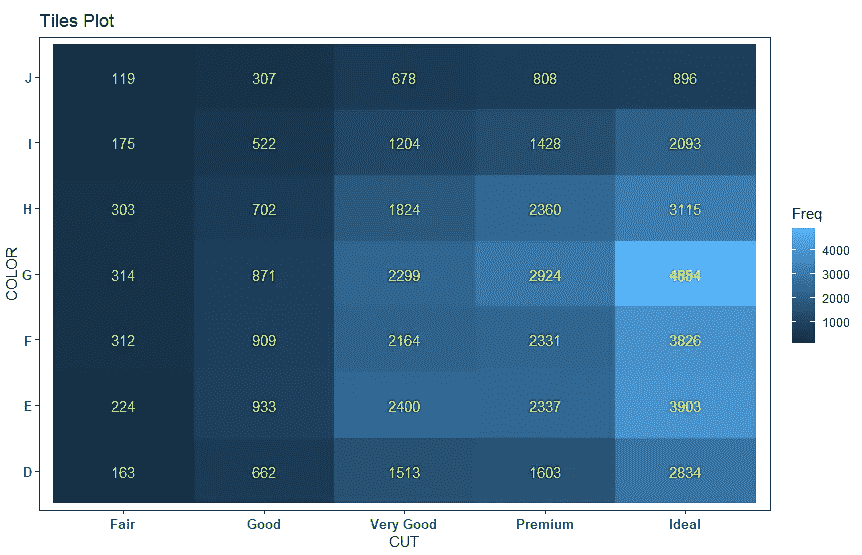*

*作者图片*

# *哑铃图*

**

*照片由 [Anastase Maragos](https://unsplash.com/@visualsbyroyalz?utm_source=medium&utm_medium=referral) 在 [Unsplash](https://unsplash.com?utm_source=medium&utm_medium=referral) 上拍摄*

*数据集-***life _ exp****

*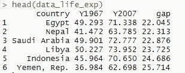*

*作者图片*

```
***ggplot(data_life_exp) +
  geom_dumbbell(aes(x = Y1967, *xend = Y2007*, 
                    y = country, *group = country*),
                *colour* = 'grey', size = 4,
                *colour*_x = 'green', *colour*_xend = 'blue') +**

  ggtitle("Dumbbell Plot (Life Expenctancy 1967 ~ 2007)") +
  xlab('YEAR') +
  ylab('COUNTRY') +
  theme_bw() +
  theme(axis.text.x = element_text(face = 'bold', size = 10),
        axis.text.y = element_text(face = 'bold', size = 10))*
```

*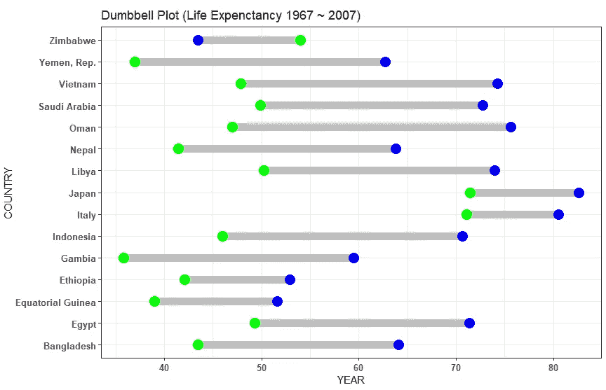*

*作者图片*

# *散布矩阵图*

**

*照片由[维克多·福加斯](https://unsplash.com/@sonance?utm_source=medium&utm_medium=referral)在 [Unsplash](https://unsplash.com?utm_source=medium&utm_medium=referral) 上拍摄*

*数据集- ***虹膜****

**

*作者图片*

***基本散点图矩阵图***

```
***ggpairs(data_iris[ , 1:4]) +**
  theme_bw()*
```

*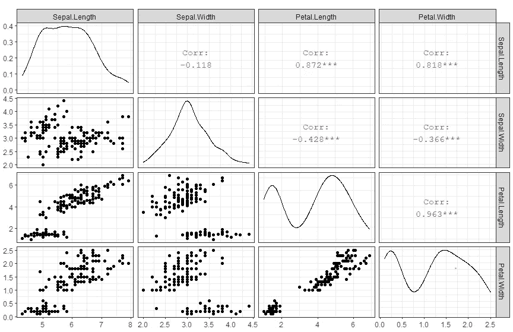*

*作者图片*

***具有特征差异的散点图***

```
***ggpairs(data_iris, aes(color = Species)) +**
  theme_bw()*
```

*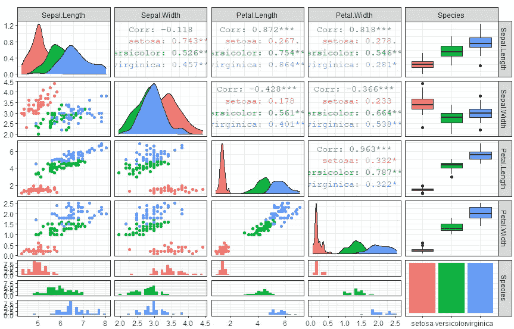*

*作者图片*

# *柱状图*

**

*由 [Clarisse Meyer](https://unsplash.com/@clarissemeyer?utm_source=medium&utm_medium=referral) 在 [Unsplash](https://unsplash.com?utm_source=medium&utm_medium=referral) 上拍摄的照片*

***数据集-*钻石****

**

*作者图片*

***基本直方图***

```
***ggplot(data_diamonds) +
  geom_histogram(aes(x = price), fill = 'blue', 
                 color = "lightblue", binwidth = 500)+**

  ggtitle("Basic Histogram") +
  xlab("PRICE") +
  ylab("Frequency") +
  theme_bw() +
  theme(axis.text.x = element_text(face = 'bold', size = 10),
        axis.text.y = element_text(face = 'bold', size = 10))*
```

**

*作者图片*

***堆积直方图***

```
***ggplot(data_diamonds) +
  geom_histogram(aes(x = price, *fill = cut*), 
                 color = "lightblue", binwidth = 500)+**

  ggtitle("Stacked Histogram") +
  xlab("PRICE") +
  ylab("Frequency") +
  theme_bw() +
  theme(axis.text.x = element_text(face = 'bold', size = 10),
        axis.text.y = element_text(face = 'bold', size = 10))*
```

*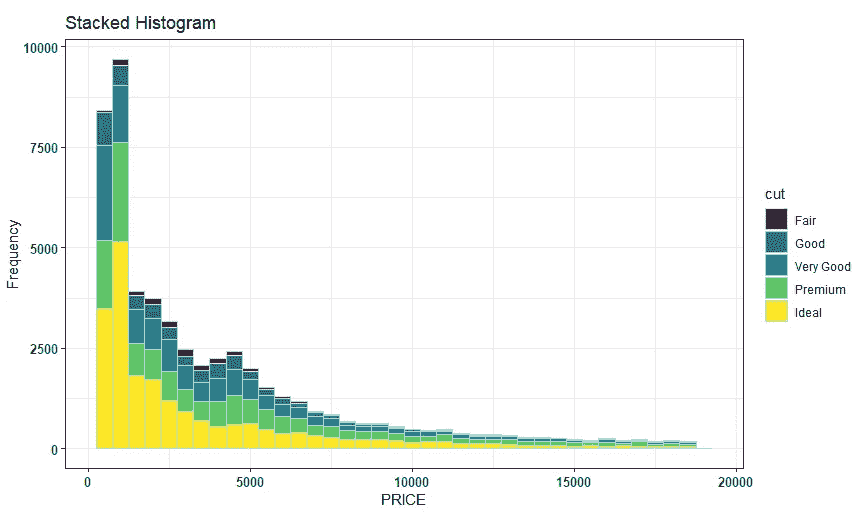*

*作者图片*

# *密度图*

**

*照片由[塞拉斯·拜施](https://unsplash.com/@silasbaisch?utm_source=medium&utm_medium=referral)在 [Unsplash](https://unsplash.com?utm_source=medium&utm_medium=referral) 上拍摄*

*数据集- ***钻石****

**

*作者图片*

```
***ggplot(data_diamonds) +
  geom_density(aes(x = carat, 
                   fill = cut), alpha = 0.7)+**

  ggtitle("Density Plot") +
  xlab("PRICE") +
  ylab("Density") +
  theme_bw() +
  theme(axis.text.x = element_text(face = 'bold', size = 10),
        axis.text.y = element_text(face = 'bold', size = 10))*
```

**

*作者图片*

# *箱形图*

**

*由 [CHUTTERSNAP](https://unsplash.com/@chuttersnap?utm_source=medium&utm_medium=referral) 在 [Unsplash](https://unsplash.com?utm_source=medium&utm_medium=referral) 上拍照*

***数据集-*钻石****

**

*作者图片*

***基本方框图***

```
***ggplot(data_diamonds) +
  geom_boxplot(aes(x = cut, y = carat, fill = cut)) +**

  ggtitle("Basic Box Plot") +
  xlab("CUT") +
  ylab("CARAT") +
  theme_bw() +
  theme(axis.text.x = element_text(face = 'bold', size = 10),
        axis.text.y = element_text(face = 'bold', size = 10))*
```

*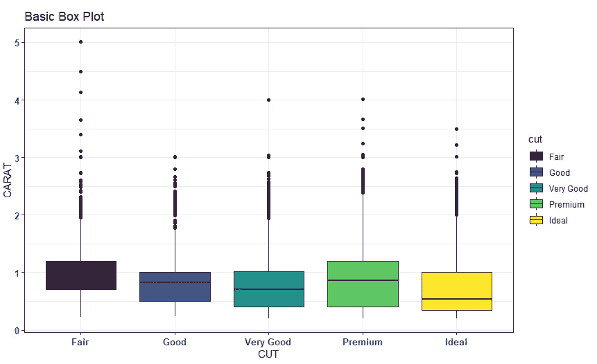*

*作者图片*

***分组方框图***

```
***ggplot(data_diamonds) +
  geom_boxplot(aes(x = cut, y = carat, *fill = clarity*)) +**

  ggtitle("Grouped Box Plot") +
  xlab("CUT") +
  ylab("CARAT) +
  theme_bw() +
  theme(axis.text.x = element_text(face = 'bold', size = 10),
        axis.text.y = element_text(face = 'bold', size = 10))*
```

*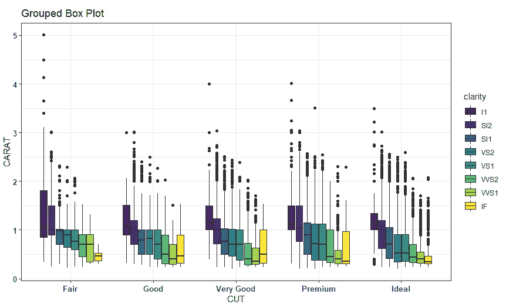*

*作者图片*

***带极坐标变换的箱形图***

```
***ggplot(data_diamonds) +
  geom_boxplot(aes(x = color, y = price, fill = color)) +**

  ggtitle("Box Plot with polar transform") + **coord_polar("y") +**

  theme_bw() +
  theme(axis.text.x = element_text(face = 'bold', size = 10),
        axis.text.y = element_text(face = 'bold', size = 10))*
```

*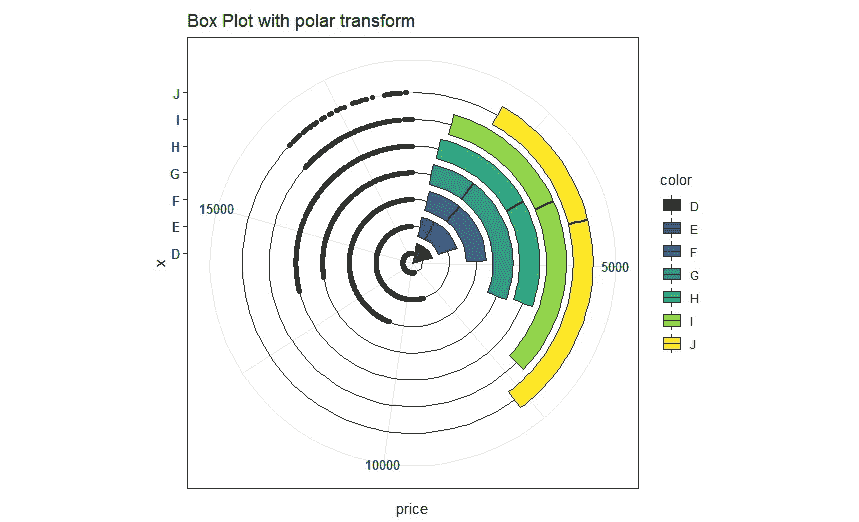*

*作者图片*

# *小提琴情节*

**

*图片由 [Elijah M. Henderson](https://unsplash.com/@elijahhenderson?utm_source=medium&utm_medium=referral) 在 [Unsplash](https://unsplash.com?utm_source=medium&utm_medium=referral) 上拍摄*

*数据集- ***钻石****

**

*作者图片*

```
***ggplot(data_diamonds) +
  geom_violin(aes(x = cut , y = carat, fill = cut)) +**

  ggtitle("Violin Plot") +
  xlab("CUT") +
  ylab("CARAT") +
  theme_bw() +

  theme(axis.text.x = element_text(face = 'bold', size = 10),
        axis.text.y = element_text(face = 'bold', size = 10))*
```

*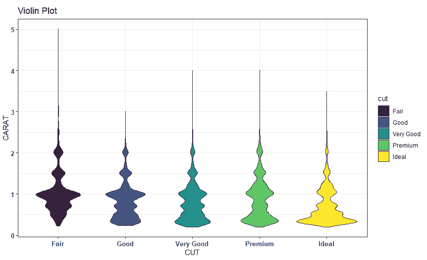*

*作者的意象*

# *山脊图*

**

*保罗·厄尔在 [Unsplash](https://unsplash.com?utm_source=medium&utm_medium=referral) 上的照片*

*数据集- ***钻石****

**

*作者图片*

```
***ggplot(data_diamonds) +
  geom_density_ridges(aes(x = carat , y = cut, 
                          fill = clarity), alpha = 0.7) +** 
  ggtitle("Ridge Plot") +
  xlab("PRICE") +
  ylab("CUT") +
  theme_bw() +

  theme(axis.text.x = element_text(face = 'bold', size = 10),
        axis.text.y = element_text(face = 'bold', size = 10))*
```

*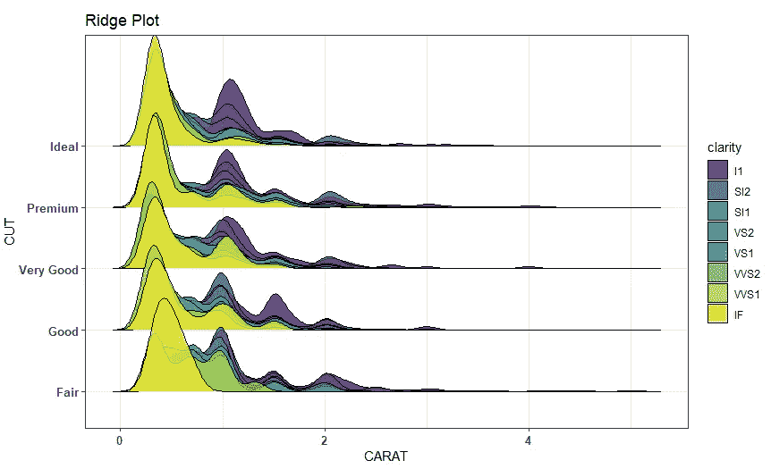*

*作者图片*

*我相信你会发现这篇文章非常有帮助，我建议你用自己的数据集进一步练习这些图表。这可能是视觉分析和您迈向数据科学*之旅的良好开端！！**

****

**[Chirag Saini](https://unsplash.com/@chirag14?utm_source=medium&utm_medium=referral) 在 [Unsplash](https://unsplash.com?utm_source=medium&utm_medium=referral) 上拍摄的照片**

**[](https://www.linkedin.com/in/aykhaled/) [## 艾哈迈德叶海亚哈立德-经理，企业计划管理- EPMO，企业战略-机器人…

### 打破数据、战略、规划和执行之间的孤岛！这个简介是一个技术和人工智能专业人士目前…

www.linkedin.com](https://www.linkedin.com/in/aykhaled/)**