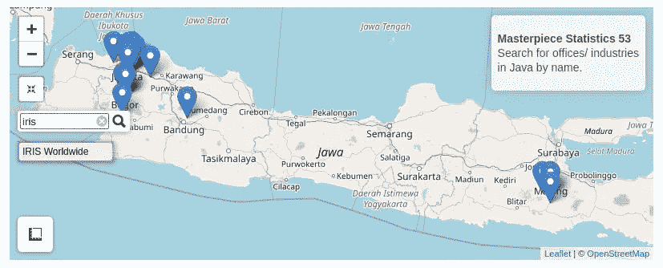

# 使用 R 的数据可视化手册:初学者教程

> 原文：<https://towardsdatascience.com/data-visualization-with-leaflet-using-r-eea044c0c328?source=collection_archive---------25----------------------->


照片由[凯尔西·奈特](https://unsplash.com/@kelsoknight?utm_source=medium&utm_medium=referral)在 [Unsplash](https://unsplash.com?utm_source=medium&utm_medium=referral) 上拍摄

## [动手教程](https://towardsdatascience.com/tagged/hands-on-tutorials)

## 以更互动的方式创建我们的数据可视化

## 目录(仅适用于 web)

```
1 [What’s leaflet?](/data-visualization-with-leaflet-using-r-eea044c0c328#f65e)
2 [Interaction Features](#b0ea)
3 [Prerequisites](#69bd)
4 [Let’s Create the Data Viz](#7752)
5 [Recap](#7432)
6 [Conclusion](#5cd8)
7 [References](#150f)
```

## 传单是什么？

he leaflet 是一个开源库，可以轻松地实现空间数据可视化。因为它是一个开源库，并集成到任何平台和编程语言中，所以它目前成为世界上最流行的地图库。从历史上看，这份传单是由 **Vladimir Agafonkin** 于 2011 年首次开发的。

## 先决条件

在我们开始构建可视化之前，确保我们满足以下要求。

*   有几个库的 R 编程语言，如`**leaflet**`、`**leaflet.extras**`、`**dplyr**`
*   数据由位置点(纬度和经度)和附加信息组成。您可以在这里 轻松下载样本数据[](https://audhiaprilliant.github.io/assets/docs/Location%20Data.txt)
*   **良好的互联网连接**

## **让我们创建数据，即**

**用 R 构建一个脚本来创建传单地图非常简单。但是，如果我们想建立一个交互式的美丽的地图，当然，一些脚本必须添加。下面的脚本将创建我们的简单地图(实际上这很酷)。为什么？因为我们已经给我们的标记添加了一些信息，如*地点的名称、地址、经度、纬度、主管、*和*学生的姓名*，而不是只有标记。单击标记后，该信息将通过弹出窗口显示。**

```
leaflet(data.location) %>%
  addProviderTiles(providers$OpenStreetMap) %>%
  addMarkers(lng = ~long,
             lat = ~lat,
             popup = paste(paste('<b>Office:</b>',
                                 data.location$place),
                           paste('<b>Address:</b>',
                                 data.location$address),
                           paste('<b>Lat:</b>',
                                 data.location$lat),
                           paste('<b>Long:</b>',
                                 data.location$long),
                           paste('<b>Supervisor:</b>',
                                 data.location$supervisor),
                           data.location$student1,
                           data.location$student2,
                           data.location$student3,
                           sep = '<br/>'),
             label = ~place,
             group = 'data.location')
```

**好的，让我们在地图上添加一些特征。在放大和缩小每个位置后，最好将我们的视图重置为默认值。所以，我们可以添加一个重置地图按钮。此外，我们有一个搜索功能来简化我们的搜索，只需输入我们的位置名称，算法就会根据我们的关键字显示相关的结果。所以，只需在前一个脚本的底部添加以下脚本即可。**

```
addResetMapButton() %>%
addSearchFeatures(
  targetGroups = 'data.location',
  options = searchFeaturesOptions(zoom = 15,
                                  openPopup = TRUE,
                                  firstTipSubmit = TRUE,
                                  autoCollapse = TRUE,
                                  hideMarkerOnCollapse = TRUE))
```

**好，然后，我们添加测量按钮，并突出显示它的一般信息或标题。对于 measure 按钮，正如它的名字一样，它将向我们显示两点或更多点之间的距离。我们可以利用这个特性来估计两个城市之间的距离。如果遇到之字形路线，可以逐点画一条直线。测量单位必须根据我们的需要来设置，例如以米为单位。最后，为了显示我们的一般信息，最好添加一个信息框。**

```
addMeasure(
    position = 'bottomleft',
    primaryLengthUnit = 'meters',
    primaryAreaUnit = 'sqmeters',
    activeColor = '#3D535D',
    completedColor = '#7D4479') %>%
addControl("<P><b>Masterpiece Statistics 53</b>
<br/>Search for offices/ industries<br/>in Java by name.</P>",
           position = 'topright')
```

## **概述**

**概括一下我们的脚本，我们可以正确地运行下面的脚本，瞧，我们的地图已经准备好解释并开始生产了。**

**完整版本的数据脚本，即使用传单**

**我们可以看看我们的地图，如下图所示。**

****

**使用传单的数据可视化(图片由作者提供)**

**我们可以试试搜索的功能。例如，根据我们以前的代码，它将从数据中读取任何输入。**

****

**从传单中搜索的特征(图片由作者提供)**

## **结论**

**因此，我们可以很容易地使用传单作为我们的工具来可视化的空间数据。它提供了许多功能，如搜索功能、缩放等。传单也很容易部署到 HTML 中。**

## **参考**

**[1]伍德拉夫，穆林斯，琼斯 [*宣传单:制作网络地图！*](https://maptimeboston.github.io/leaflet-intro/)*(2014)。***

***[2]诉阿加丰金。 [*宣传单:一个面向移动友好的交互式地图的开源 JavaScript 库*](https://leafletjs.com/index.html)(2019)[https://leafletjs.com/index.html](https://leafletjs.com/index.html)。***