# Python 中 Matplotlib 的数据可视化

> 原文：<https://towardsdatascience.com/data-visualization-with-matplotlib-in-python-46da7d862ea1?source=collection_archive---------42----------------------->

## 破解数据科学就业市场的最佳实践

照片由 [M. B. M.](https://unsplash.com/@m_b_m?utm_source=medium&utm_medium=referral) 在 [Unsplash](https://unsplash.com?utm_source=medium&utm_medium=referral) 拍摄

在分析数据之前，首先要做的事情之一就是数据可视化。在 Python 中，有许多高质量的可视化库。最流行的通用可视化库是 Matplotlib，它主要致力于生成静态出版物质量的 2D 和 3D 图形。我们可以将它用于许多不同的图，如直方图、条形图、热图、线图、散点图等。

# Matplotlib 基础

在 Matplotlib 中，您将会遇到和使用一些重要的概念，以及它们的含义或作用。

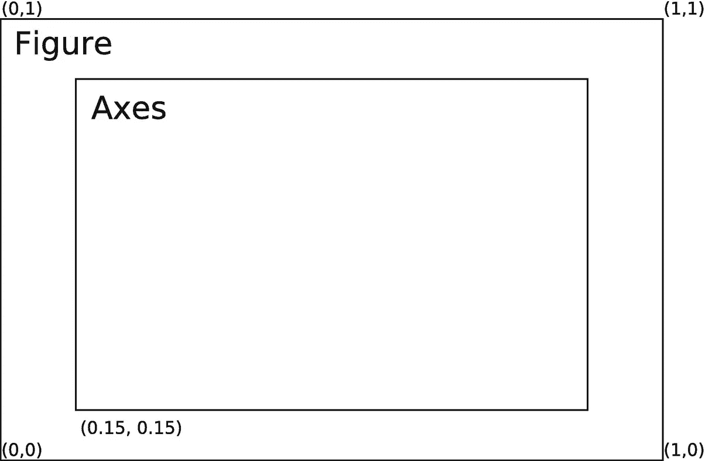

Matplotlib 中的绘图元素

*   轴—这代表一条数字线，用于确定图形界限。
*   轴——这些代表我们所理解的情节。一个图形可以包含尽可能多的轴。
*   艺术家——指的是你能在你的图形上看到的一切，例如`collection` 对象、`Line2D`对象和`Text`对象。请记住，大多数艺术家都在轴上。
*   图形—指您正在处理的整个图形。

一个图形可以包含多个轴实例，例如，在一个图形中显示多个面板，或者在另一个轴实例中显示插图。

# 基本 Matplotlib 函数

`Matplotlib`库一开始看起来可能相当复杂，但是有了基本的编码知识，对你来说应该会更容易。以下是您将在 Matplotlib 中使用的绘图列表。

*   箭筒-用于创建 2D 箭场
*   步长(step )-用于创建步长图
*   Stem-用于构建 stem 图
*   散点图(scatter )-创建 x 相对于 y 的散点图
*   堆叠图-用于为堆叠区域创建图
*   绘图(plot )-为轴创建标记或绘图线
*   极坐标(polar )-创建极坐标图
*   饼图—创建饼图
*   条形图-创建水平条形图
*   条形图-创建条形图
*   箱形图-创建须状和箱形图
*   直方图—用于创建直方图
*   Hist2d 用于在 2d 创建直方图

此外，如果您经常使用图像，您应该使用以下图像功能。

*   Imshow —用于显示坐标轴上的图像
*   Imsave —用于以图像文件的形式保存数组
*   Imread —用于将文件从图像读入数组

# 做中学

> 这本书里的所有脚本都是通过 Jupyter 笔记本执行的。因此，您应该安装 Jupyter 笔记本或在 Saturn Cloud 上创建一个帐户。

完整的源代码

## 导入 Matplotlib

让我们看看如何使用它。我们必须首先从我们的`Matplotlib`包中导入`pyplot`模块，然后才能创建一个图。

## 设置样式

我们将使用`plt.style`指令为我们的人物选择合适的美学风格。这里我们将设置默认样式，这确保我们创建的绘图使用默认的 Matplotlib 样式。

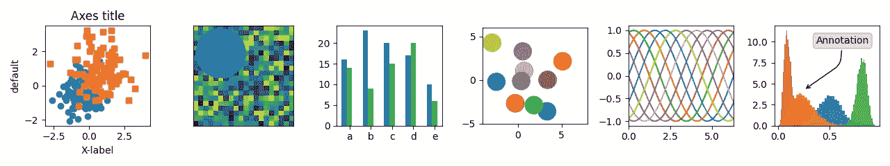

图片由 [Matplotlib](https://matplotlib.org/3.2.1/gallery/style_sheets/style_sheets_reference.html) 提供

简化，执行以下命令。

你也可以使用不同的风格。点击此处进一步阅读。请注意，从 Matplotlib 版本 1.5 开始支持这里使用的样式表，因此如果您使用的是 Matplotlib 的早期版本，则只有默认样式可用。

## 绘制函数

我们将学习如何用 Python w/ Matplotlib 绘制正弦波。我们将绘制`sin(x)`及其在区间`0`和`2π`之间的倍数和次倍数角度。

`NumPy`库有`sin()`函数，它接受一组值并为它们提供正弦值。

使用以下命令，将您的绘图的静态图像嵌入笔记本中。

`math`库将帮助定义`pi`来生成 x 轴的随机值。

计算每个样本在处的正弦波值，然后指定 x 轴和 y 轴标签以及图标题，如图所示。

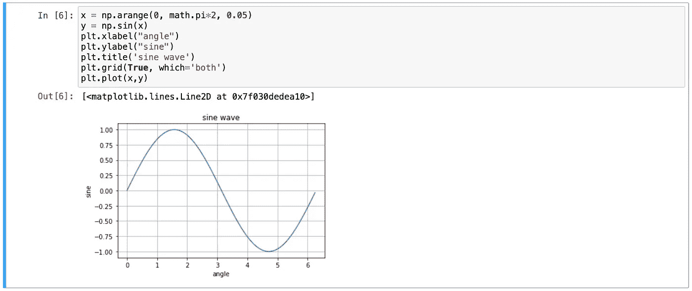

## **线条图**

我们要绘制的第二个图是线形图。线形图是所有 Matplotlib 图中最简单的一种。线形图主要用于绘制两组数值之间的关系。

现在，我们创建两个不同风格的独特系列。使用`linspace ()`功能确定 x 坐标。`x`坐标从`0`开始，到`20`结束，因此您应该有以下函数。

按以下顺序在你的坐标轴上画线。

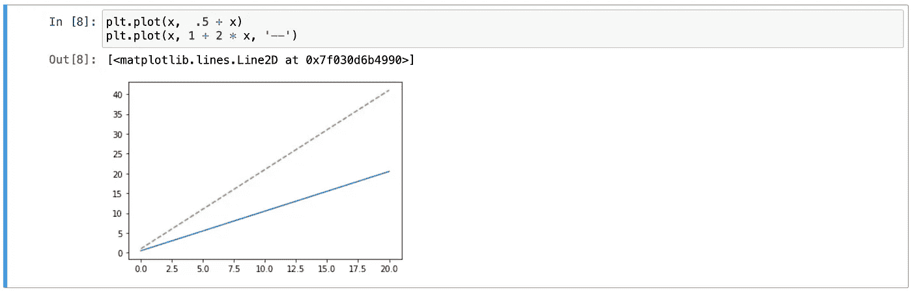

在上面的例子中，作为默认线条的第一条是实线，而第二条是虚线。

## 调整线条的颜色和样式

要调整颜色，可以使用 color 关键字，该关键字接受一个字符串参数，表示几乎任何可以想象的颜色。颜色可以通过多种方式指定。

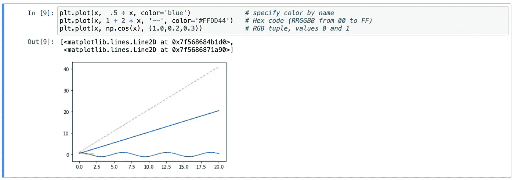

如果没有指定颜色，Matplotlib 将自动循环显示多行的一组默认颜色。

同样，我们可以使用`linestyle`关键字调整线条样式，如下所示。

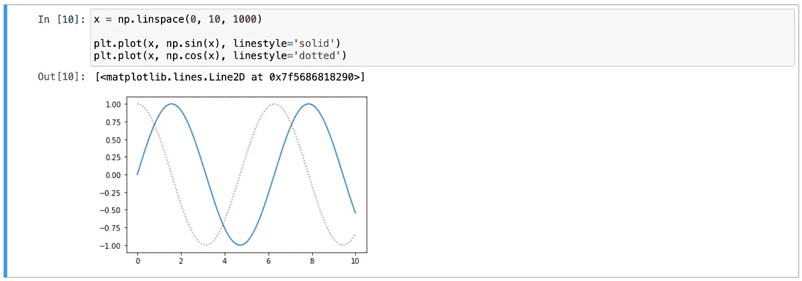

## 调整绘图的轴限制

调整轴极限的最基本方法是使用`plt.xlim()`和`plt.ylim()`方法。

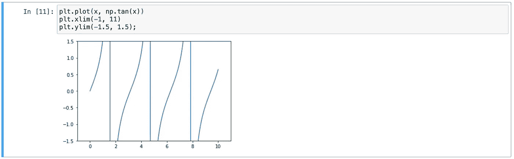

如果您想让任一轴反向显示，只需执行此命令。

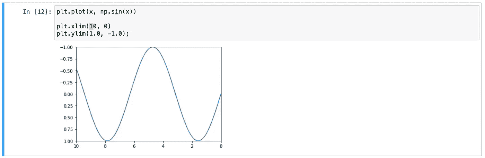

此外，我们还可以通过传递一个指定`[x-min, x-max, y-min, y-max]`的列表来设置 x 和 y 限制。

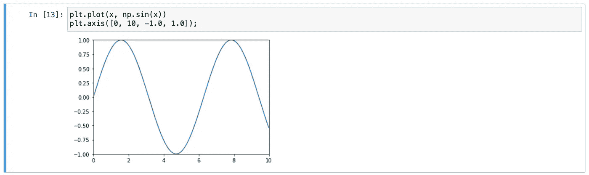

## 标记图

我们可以创建图的标签，如标题、轴标签和简单的图例。

标题和轴标签是最简单的标签，如下所示。

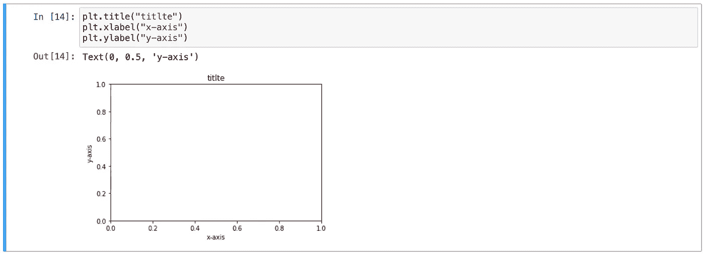

可以通过`plt.legend()`方法创建图例。

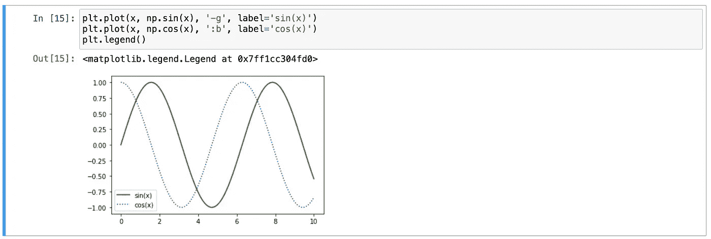

## 对数图

对数图本质上是一个基本图，但它是在对数标度上设置的。这与普通线性标度的区别在于，间隔是按照大小顺序设置的。我们有两种不同类型的对数图。

*   双对数图。
*   半对数图。

例如，执行下面的代码片段来显示对数图。

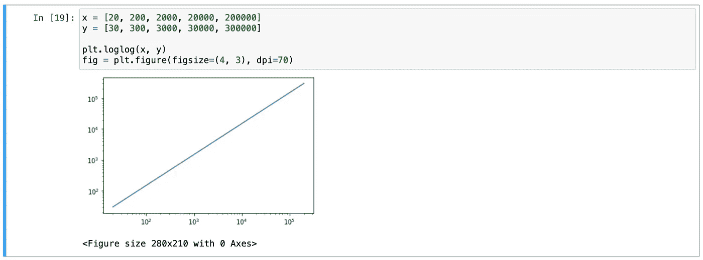

## 散点图

散点图用于以散点的形式绘制两个数字列之间的关系。通常，对于 x 轴上的每个值，如果 y 轴上有多个值，则使用散点图。

使用`plt.scatter()`功能创建散点图，如下所示。例如，我们使用来自`sklearn`库的虹膜数据，其中每个样本都是三种类型的花中的一种，其花瓣和萼片的大小已经过仔细测量。

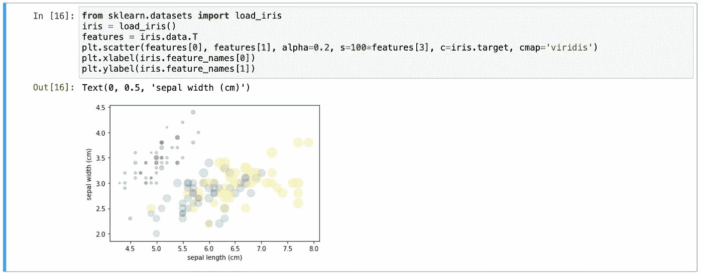

我们可以同时探索数据的四个不同维度:每个点的`(x, y)`位置对应于萼片长度和宽度，该点的`size`与花瓣宽度相关，而`color`与特定种类的花相关。

## 如何绘制带误差线的条形图？

误差线对问题解决者很有用，因为误差线显示了一组测量值或计算值的置信度或精度。可以用`plt.errorbar()`方法创建一个基本的误差栏。

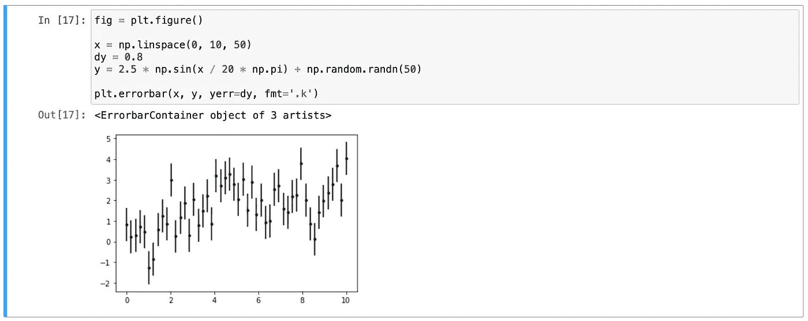

我们使误差线比点本身更亮，如下所示。

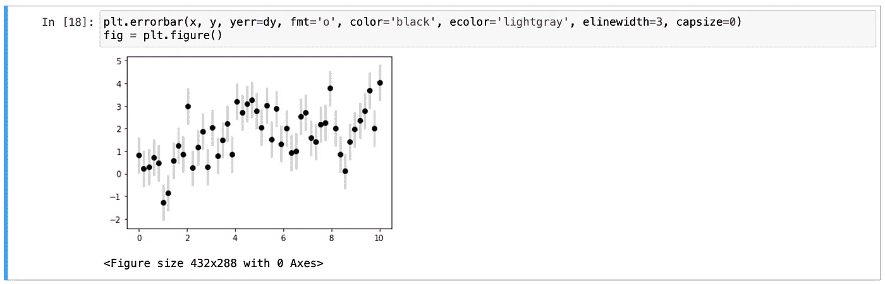

## 使用具有双界面的多个轴和图形

为了创建多个支线剧情，我们也可以使用`subplot()`函数在主图中创建多个绘图区域。

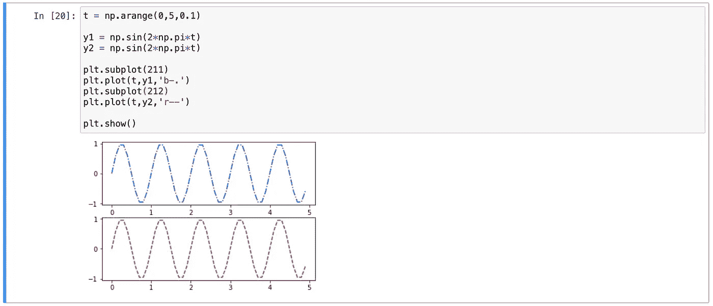

此外，我们可以使用下面的代码从上面的图中创建垂直分割。

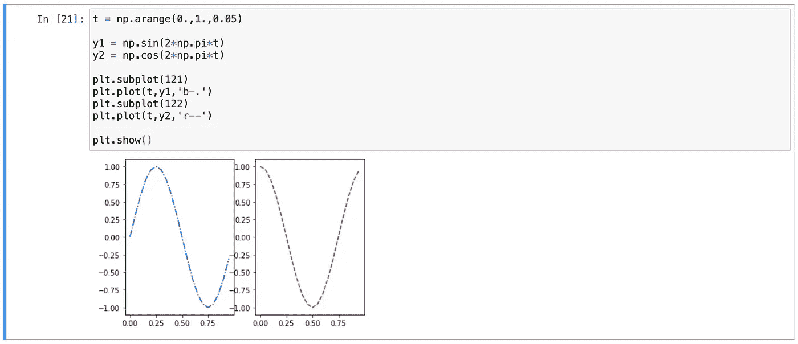

## 如何创建条形图？

条形图用于显示与分类数据相关的值。然而，`plt.bar()`函数接受一个位置和值的列表，x 的标签由`plt.xticks()`提供。

例如，我们显示了越南电信公司 2019 年的服务收入如下。

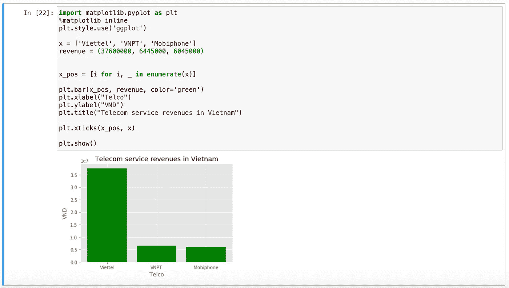

我们也可以在同一个图表中包含多个 X 值。Viettel 是 2019 年越南最大的纳税人，具体如下。

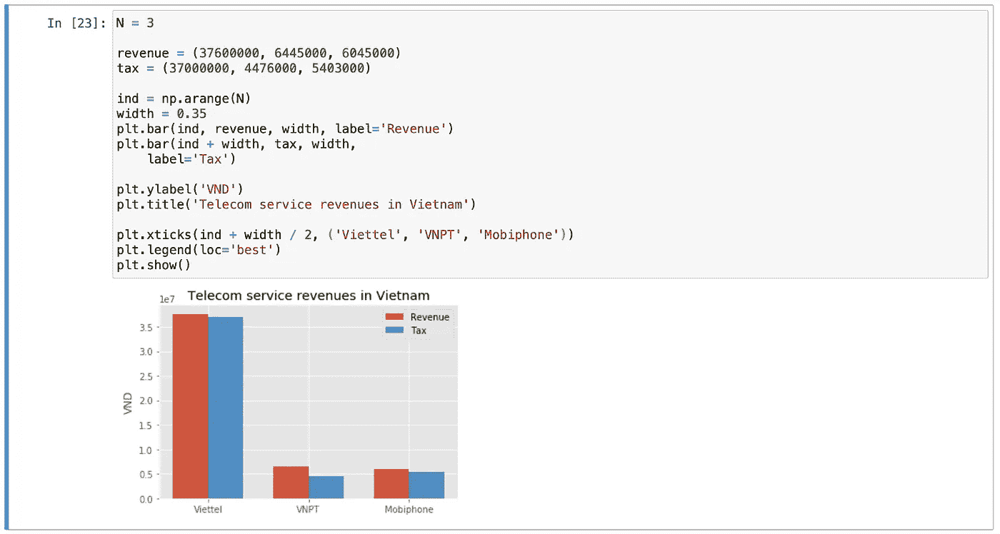

对于堆叠条形图，我们需要提供参数`bottom`，这通知 matplotlib 条形图应该从哪里开始，因此我们将添加下面的值。

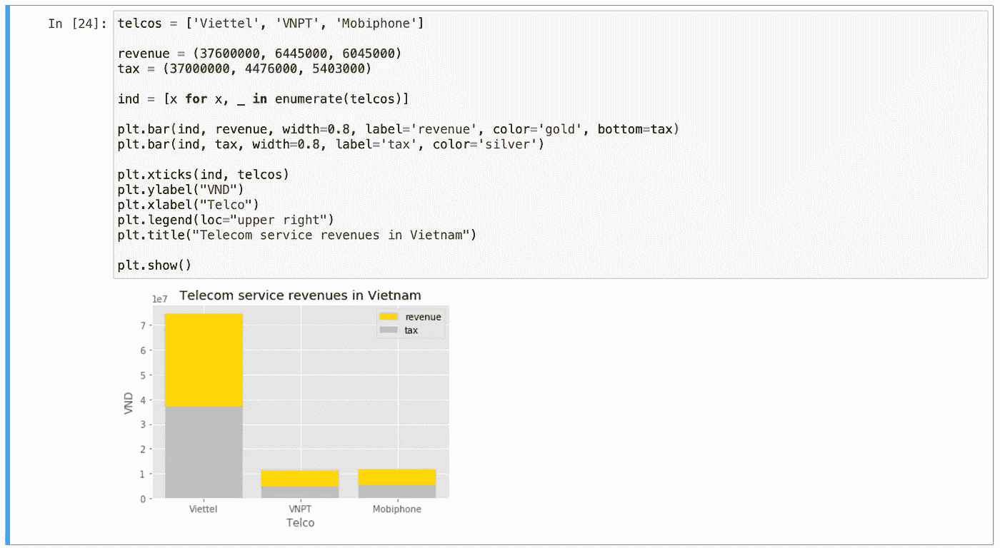

## 绘制直方图

直方图是概率分布的图形表示。事实上，直方图只是一种特定的条形图。

以下脚本从正态分布中提取 1000 个值，然后生成 20 个柱的直方图。

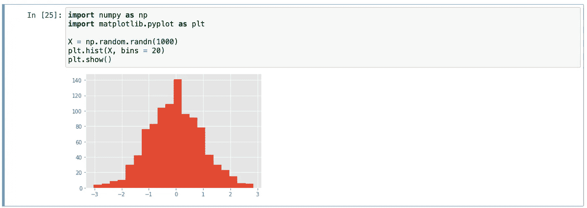

## 绘制箱线图

通过方便地显示一组值的中值、四分位数、最大值和最小值，箱线图允许您比较值的分布。以下脚本显示了从正态分布中抽取的 100 个随机值的箱线图。

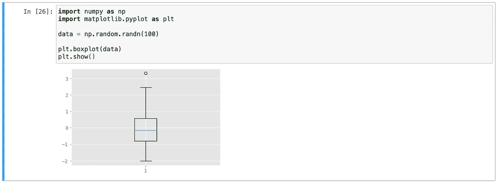

## 饼图

要比较数量的相对重要性，没有什么比饼图更好的了。

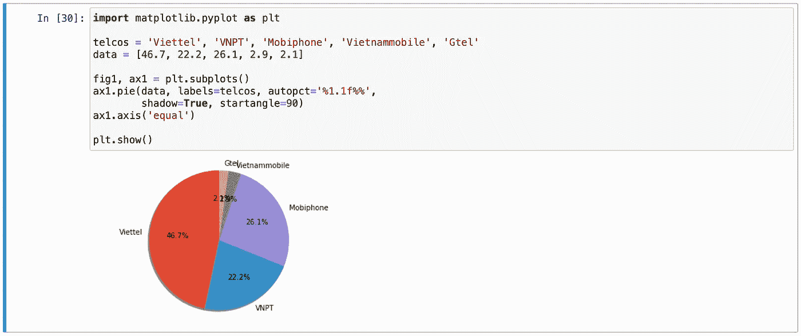

## 将数字保存到文件中

要将图形保存到文件中，我们可以使用`savefig`方法。这个方法接受一个字符串，输出文件名作为第一个参数，还有几个可选的关键字参数。例如，要将前面的图形保存为 PNG 文件，您可以运行以下命令。

使用`savefig`的`transparent=True` 参数也可以使图形画布透明。

输出。

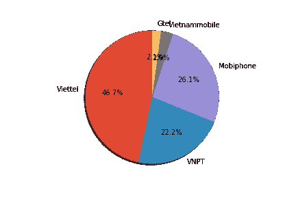

my_figure.png 文件

都是关于用 Python 中的 Matplotlib 进行数据可视化。

# 参考

[1]https://matplotlib.org

[2][https://www.saturncloud.io/s/](https://www.saturncloud.io/s/)

[3][https://matplotlib . org/3 . 2 . 1/gallery/style _ sheets/style _ sheets _ reference . html](https://matplotlib.org/3.2.1/gallery/style_sheets/style_sheets_reference.html)