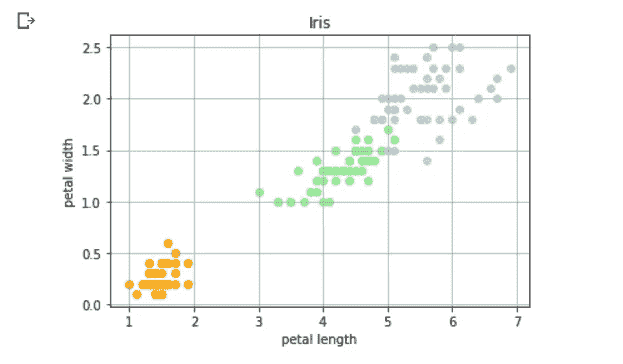

# 用 Python 实现数据可视化

> 原文：<https://towardsdatascience.com/data-visualization-with-python-8bc988e44f22?source=collection_archive---------10----------------------->


(图片由[作者](https://medium.com/@beginningofthefuture)提供)

## 终极指南

## 掌握 python 的数据可视化库(matplotlib，seaborn，pandas，和 plotly。)

> **《一图胜千言》**
> 
> **——弗雷德·r·巴纳德**

数据可视化是数据的视觉(或图形)表示，以便**在数据中找到有用的见解**(即趋势和模式)，并使数据分析过程变得更加容易和简单。

数据可视化的目的是在第一眼就能快速清晰地理解数据，并使其在视觉上可以呈现以理解信息。

在 Python 中，有几个全面的库可用于创建高质量、有吸引力、交互式和信息丰富的统计图形(2D 和 3D)。

## Python 中一些流行的数据可视化库

*   Matplotlib 就是这样一个流行的可视化库，它允许我们创建高质量的图形，包括散点图、折线图、条形图、直方图和饼图。
*   **Seaborn** 是 Python 的另一个数据可视化库**，它构建在 Matplotlib、**之上，拥有一个具有吸引力设计的高级接口。此外，它减少了产生与 Matplotlib 相同结果所需的代码行数。
*   **Pandas** 是 Python 中另一个很棒的数据分析库(数据操作、时序分析、集成数据索引等)。). **Pandas Visualization** (构建于 Matplotlib 之上)是 Pandas library 的一个工具，它允许我们更快更容易地创建数据帧(以列和行的表格形式排列的数据)**和系列**(能够保存任何类型数据的一维标签数组)的**可视化表示。**
*   **Plotly** 库用于创建交互式和多维绘图，通过提供更好的数据可视化，使数据分析过程更容易。

通过这篇文章，我们将能够通过学习如何在不同的 Python 库中绘制数据来可视化不同形式的数据，并理解在哪里适当地使用哪一个。

> **注意:我们可以使用**[**Google co laboratory**](https://colab.research.google.com/)**来避免安装库的过程。只需将所有库导入笔记本即可使用。**

## 了解 Maplotlib 的基础知识


(图片由[作者](https://medium.com/@beginningofthefuture) ) **图中的元素**

*   **图:**一切都被绘制的整个区域。它可以包含多个带轴的图、图例、轴范围、网格、图标题等。
*   **轴:**图形下方正在构建图形的区域(或图形出现的区域)被称为轴。一个图形中可以有多个轴。
*   **轴:**这是图表中的数字线，代表绘图的数值范围(上图中提到的 X 轴和 Y 轴)。在多维图形的情况下，图形中可以有两个以上的轴。
*   **图标题:**标题位于轴上方的中央，给出了图的概况。

## 导入数据集

在本文中，我们将在不同的地方使用 [**虹膜数据集**](https://archive.ics.uci.edu/ml/datasets/iris) **(** 作为一个例子)，它是免费的，并且是常用的(因为它是模式识别文献中最著名的数据库之一)。

我们可以通过两种方式导入该数据集:

## 1.使用 Scikit-learn 库:

**使用 Scikt-learn 库导入虹膜数据集**

无需下载`.csv`文件，我们可以使用 python 中的 sci-kit 学习库直接导入工作空间中的数据集。


(图片由[作者](https://medium.com/@beginningofthefuture) ) **数据集中的前五个头**

## 2.使用熊猫图书馆:

**使用 Pandas 库导入数据集**

使用上面的(通过导入 Pandas 库)代码，并下载数据集的`.csv`格式，我们可以在我们的工作空间中导入数据。这些是`iris`数据集中的前五个元素:


(图片由[作者](https://medium.com/@beginningofthefuture) ) **数据集中的前五个头**

> 上述两种方法都可以用于导入数据集和创建图表，但我们将使用后者，因为数据的可读性更好(正如您可以看到的两种方法的输出结果的差异)。

## Matplotlib 入门

我们首先使用以下代码在笔记本中导入库:

导入 matplotlib

该库中有多种样式可用于绘制地块。

## **线条图**

折线图或折线图表示一个系列(连续)中的数据，沿数字线显示数据的频率。它可以用来比较数值组。这是我们可以用 python 制作的最简单的图表之一。

**基本线图的代码**

这里，使用`numpy` `linspace()`函数，我们将生成数据点并将其存储在变量`x`中，计算`x`值的平方并将其存储在另一个变量`y`中。

我们将使用`plt.plot()`功能绘制图形，使用`plt.show()`显示图形。


(图片由[作者](https://medium.com/@beginningofthefuture))**y = x 的折线图**

我们可以给我们的图添加更多的函数，使它更容易解释。

*   **添加标签:** `x-axis label`和`y-axis label`我们将分别使用`plt.xlabel()`和`plt.ylabel()`函数。
*   我们也可以使用`plt.title()`函数给我们的图一个**标题。**
*   **图中的网格**可通过调用`plt.grid(True)`函数简单应用(使数据更容易解释)。

随着这些功能的增加，图表变得更加易读和易于分析。


(图片由[作者](https://medium.com/@beginningofthefuture))**y = x 的折线图**

我们可以在绘图中添加多条线，并通过使用不同的颜色和一些其他功能来区分它们:

在上面的代码中，我们添加了另一个变量`z=x**3` (z=x)并更改了线条的样式和颜色。

要改变线图中线条的颜色，我们必须在`plt.plot()`函数中添加`color=''`参数。

要改变线图中线条的样式，我们必须在`plt.plot()`函数中添加`linestyle=’’`参数(或者我们可以简单地添加' * '或'-'，等等)。


(图片由[作者](https://medium.com/@beginningofthefuture))**y = x 和 z=x 的折线图**

这使得信息的提取和数据变量的比较更加容易。

同样，我们也可以为数学函数创建**图:**

在这里，我们为`sin(x)`和`cos(x)`创建了一个情节。

我们可以通过使用 x 轴的功能`plt.xlim(lower_limit,upper_limit)`和 y 轴的功能`plt.lim(lower_limit,upper_limit)`来调整轴的限制。

为了进一步标记该图，我们可以添加具有`plt.legend()`功能的`legend`，这将有助于识别哪条线代表哪种功能。


(图片由[作者](https://medium.com/@beginningofthefuture))**sin(x)和 cos(x)的折线图**

## 支线剧情

为了在同一个图形中创建单独的(多个)图，我们可以使用`plt.subplots(num_rows,num_cols)`功能。这里每个支线剧情的细节可以不同。

创建支线剧情

`plt.sublots()`函数创建子情节的图形和网格，其中我们可以通过传递一个`int`值作为参数来定义列和行的数量。此外，我们还可以通过使用`gridspec_kw={'hspace': , 'wspace': }`参数来改变子选项之间的间距。之后，通过简单地使用子情节的索引号，我们可以很容易地绘制图形。


(图片由[作者](https://medium.com/@beginningofthefuture) ) **一张图中的四个支线剧情**

## **散点图**

这种图使用“点”来表示不同变量的数字数据。

散点图可用于分析一个变量如何影响其他变量。(我们可以使用任何数量的变量来绘制图表。)

我们将使用`dataset_name.plot()`函数来创建图形，在参数中，我们将应用带有标签`x-axis`和`y-axis`的`kind = 'scatter’`。看看下面提到的例子(虹膜数据集)。

这里，我们比较了数据集中不同种类的花的`petal length`和`petal width`。


(图片由[作者](https://medium.com/@beginningofthefuture) ) **虹膜数据集散点图**

但是，在这里，我们很难从这个图中分析和提取信息，因为我们无法区分存在的类别。

所以现在，我们将尝试另一种方法来解决我们的问题。在此方法中，我们将使用`plt.scatter()`创建一个散点图。

**为了根据花卉的种类改变点** **的颜色，我们可以创建一个字典，存储与种类名称相对应的颜色。通过使用`for`循环，我们创建了三种不同物种的单个散点图(每种用不同的颜色表示)。**

这个情节比上一个好得多。物种的数据变得更容易区分，并为更容易的信息分析提供了总体清晰性。



(图片由[作者](https://medium.com/@beginningofthefuture) ) **虹膜数据集彩色散点图**

## 条形图

条形图可用于**比较分类数据**。我们必须提供频率和类别，我们希望在图上表现出来。

使用 matplotlib 绘制条形图

这里我们使用 iris 数据集来比较不同种类的花的数量(然而，它们等于 50)。为了找到数据集中每个唯一类别的计数，我们使用了`value_counts()`函数。下面代码中的变量`species`和`count`存储每个唯一类别的名称(`.index`函数)和每个类别的频率(`.values`函数)


(图片由[作者](https://medium.com/@beginningofthefuture) ) **虹膜数据集中不同种类花朵的数量**

这是最基本的条形图，您可以尝试该图的一些变化，如同一图中的多个条形图，改变条形的宽度(使用`width=`参数)或创建堆积条形图(使用`bottom`参数)。

## 箱线图

箱线图通过绘制基于样本最小值、下四分位数、中值、上四分位数和样本最大值的数据分布来帮助绘制和比较值(称为[五位数汇总](https://en.wikipedia.org/wiki/Five-number_summary))。这可以帮助我们分析数据，找出数据中的异常值和变化。

箱形图

我们在这里排除了物种列，因为我们只比较 iris 数据集中所有花的`petal length, petal width, sepal length, sepal width`。我们使用`.boxplot()`功能创建盒状图。


(图片由[作者](https://medium.com/@beginningofthefuture) ) **方框图**

## 直方图

直方图用于表示数据的频率分布(或者我们可以说是概率分布)。我们必须使用`plt.hist()`函数来创建直方图，我们还可以为该图定义`bins`(即，将整个数值范围分解为一系列区间，并计算落入每个区间的数值计数)。

> 直方图是一种特殊的条形图。

使用 matplotlib 创建直方图的代码


(图片由[作者](https://medium.com/@beginningofthefuture) ) **直方图**

## 误差线

误差线是一个很好的工具，通过直观地显示数据的变化来找出一组数据之间的统计差异。它有助于指出数据分析过程中的**误差和精度**(并决定模型的质量)。

用于创建误差线 matplotlib 的代码

为了绘制误差线，我们必须使用`errorbar()`函数，其中`x`和`y`是数据点位置，`yerr`和`xerr`定义误差线的大小(在这段代码中，我们只使用了`yerr`)。

我们还可以通过使用`fmt`参数来改变误差线的样式和颜色(就像在这个特定的例子中我们将样式设置为点`’o’`),使用`ecolor`来改变点的颜色，使用`color`参数来改变垂直线的颜色。

通过在`plt.legend()`函数中添加`loc = ''`参数，我们可以确定图例在图中的位置。


(图片由[作者](https://medium.com/@beginningofthefuture) ) **cos(x)误差棒图**

## 热图

热图用于以**‘颜色编码图像图’**(数据中的值以颜色表示)的形式表示分类数据，以找到数据中特征的相关性(**聚类分析)**。在热图的帮助下，我们可以直观地对数据进行快速而深入的分析。

使用 matplotlib 创建热图

在本例中，我们使用 iris 数据集来创建热图。`.corr()` 是熊猫的数据框函数，用来寻找数据集中的相关性。热图是通过使用`.imshow()`函数创建的，其中我们将数据集的`correlation`、`cmap`(用于设置绘图的样式和颜色)作为参数传递。为了添加工具栏，我们使用了`.figure.colorbar()`函数。最后，为了添加注释(你可以在色块上看到提到的值)，我们使用了两个 for 循环。


(图片由[作者](https://medium.com/@beginningofthefuture) ) **虹膜数据集热图**

## 饼图

饼图用于查找数据类别组成之间的相关性(可以是数据的百分比或比例),其中每个切片代表一个不同的类别，提供整个数据的摘要。

饼图 matplotlib

为了绘制饼图，我们必须使用`plt.pie()`函数。为了给绘图带来 3D 效果，我们使用了`shadow = True`参数、`explode`参数来显示与绘图其余部分分开的类别，为了显示每个类别的百分比，我们必须使用`autopct`参数。为了使圆成比例，我们可以使用`plt.axis('equal')`功能。


(图片由[作者](https://medium.com/@beginningofthefuture) ) **饼状图 matplotlib**

## 海生的

凭借 seaborn 的高级界面和吸引人的设计，我们可以用更好的可视化效果创造出**惊人的情节。此外，**所需的代码行数在很大程度上减少了**(与 matplotlib 相比)。**

在工作区中导入库的代码:

导入 seaborn 库

## 线形图

我们可以通过使用`sns.lineplot()`函数在 seaborn 库中简单地创建线图。

在这里，我们可以使用库中可用的`.set_style()`功能改变网格/背景的颜色。并且使用`sns.lineplot()`功能我们可以绘制折线图。


(图片由[作者](https://medium.com/@beginningofthefuture) ) **折线图使用 seaborn 库**

## 散点图

有了 seaborn 库，我们只用一行代码就可以创建散点图！

使用 seaborn 库的散点图

这里，我们使用了`**FacetGrid()**` **函数**(通过它我们可以快速浏览我们的数据集)来创建绘图，我们可以在其中定义`hue`(即散点的颜色)和`.map`函数来定义图形类型。(创建散点图的另一种方法是使用`sns.scatterplot()`


(图片由[作者](https://medium.com/@beginningofthefuture) ) **散点图使用 seaborn 库**

## 条形图

我们可以使用`sns.barplot()`函数在 seaborn 库中创建一个柱状图。


(图片由[作者](https://medium.com/@beginningofthefuture) ) **棒图使用 seaborn 库**

## **直方图**

我们可以使用`sns.distplot()`函数在 seaborn 库中创建一个直方图。我们还可以使用这个库进行数据分析，计算**概率分布频率(PDF)、累积分布频率(CDF)、核密度估计** **(KDE)** 。

Seaborn 提供了比 matplotlib 更多的数据可视化特性。


(图片由[作者](https://medium.com/@beginningofthefuture) ) **直方图使用 seaborn 库**

## 热图

Seaborn 在创建热图方面非常高效，它显著减少了创建图表的代码行。

matplotlib 中的多行代码减少到只有两行！


(图片由[作者](https://medium.com/@beginningofthefuture) ) **使用 seaborn 库的热图**

## 配对图

这是 seaborn 图书馆提供的一种独特的情节。这绘制了数据集中的成对关系(在单个图中)。对于数据分析来说，这是一个非常棒的工具。

通过使用`sns.pairplot()`功能，我们可以创建配对图(`height`用于调整图的高度)。


(图片由[作者](https://medium.com/@beginningofthefuture) ) **Pairplot 使用 seaborn 库**

## 熊猫可视化

这个库提供了一种使用 pandas 数据框和数据结构绘制图表的简单方法。这个库也是建立在 matplotlib 之上的，因此需要更少的代码行。

## 直方图

用这个库创建直方图非常简单，我们只需使用`.plot.hist()`函数。我们也可以通过使用`subplots=True`参数在同一个图中创建支线剧情。


(图片由[作者](https://medium.com/@beginningofthefuture) ) **直方图使用熊猫库**

## 线形图

通过使用`.plot.line()`函数，我们可以使用该库创建线图。图例也会自动添加到该库中。


(图片由[作者](https://medium.com/@beginningofthefuture) ) **线条图使用熊猫库**

## Plotly

有了这个库，我们就可以创建**多维互动剧情了！这是一个易于使用的高级接口库。我们可以使用下面的代码导入这个库:**

## 4D 图(虹膜数据集)

您可以试着自己运行这段代码来检查和处理这个图。


(图片由[作者](https://medium.com/@beginningofthefuture) ) ***互动多维剧情***

## 结论

我希望通过这篇文章，您能够使用 python 中的不同库来可视化数据，并开始分析它。

为了更好地理解这些概念，我建议您尝试编写这些代码。继续探索，我相信你会发现新的特性。我在文档末尾分享了我的笔记本储存库，供您参考。

如果你有任何问题或意见，请发表在评论区。

[](https://github.com/kk189/Hello/blob/master/data_visualization.ipynb) [## kk 189/你好

### permalink dissolve GitHub 是超过 5000 万开发人员的家园，他们一起工作来托管和审查代码，管理…

github.com](https://github.com/kk189/Hello/blob/master/data_visualization.ipynb) 

如果您想改进编写代码的方式，请查看我们的另一篇文章:

[](https://medium.com/swlh/how-to-write-efficient-and-faster-code-67567e74ef87) [## 高效编写代码的 9 个技巧

### 如何编写高效、更快的代码来提高程序的性能？

medium.com](https://medium.com/swlh/how-to-write-efficient-and-faster-code-67567e74ef87) 

***最初发表于:***[***www.patataeater.blogspot.com***](http://www.patataeater.blogspot.com)

```
Resources:
[https://plotly.com/](https://plotly.com/)
[https://matplotlib.org/](https://matplotlib.org/)
[https://pandas.pydata.org/](https://pandas.pydata.org/)
[https://seaborn.pydata.org/](https://seaborn.pydata.org/#)
```