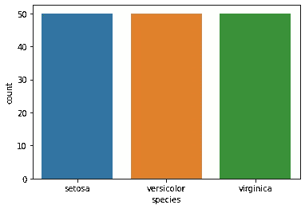
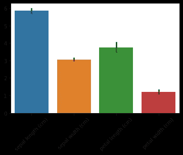
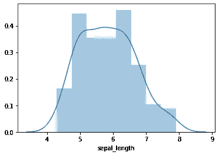
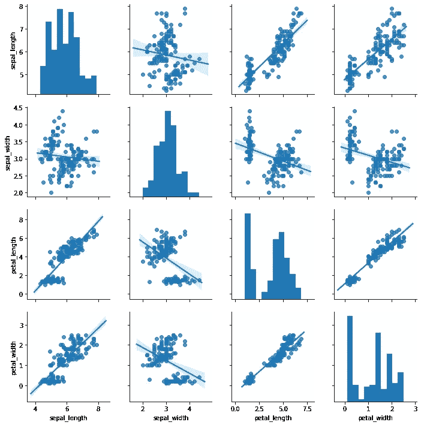
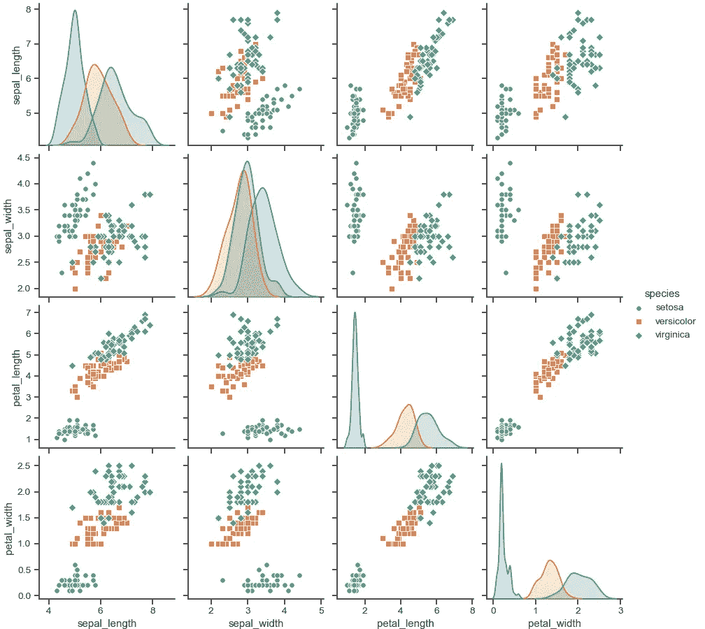
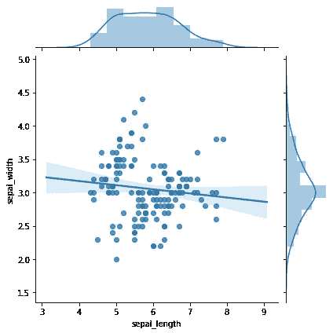
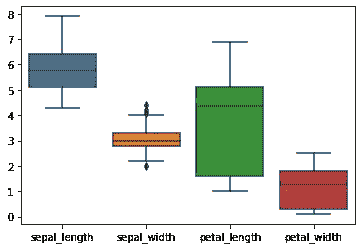
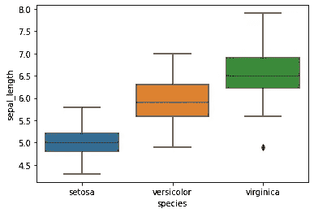
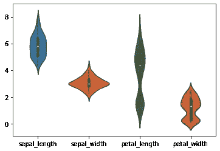
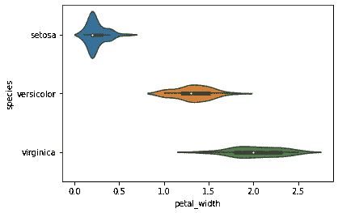

# 使用 seaborn 库实现数据可视化

> 原文：<https://towardsdatascience.com/data-visualization-with-seaborn-library-7cee8b9efe4e?source=collection_archive---------50----------------------->

## 7 个 seaborn 图表，用于快速有效的数据分析


图片由 [Pixabay](https://pixabay.com/?utm_source=link-attribution&utm_medium=referral&utm_campaign=image&utm_content=3411473) 的 [Mudassar Iqbal](https://pixabay.com/users/kreatikar-8562930/?utm_source=link-attribution&utm_medium=referral&utm_campaign=image&utm_content=3411473) 提供

**简介**

如果您还没有使用 Seaborn 进行数据探索，这是学习一些基本情节的绝佳时机。在本文中，我们将介绍几种可以在 Seaborn 中使用的不同类型的图表:

> 计数图
> 
> *条形图*
> 
> 柱状图
> 
> 接合图
> 
> 配对图
> 
> *箱线图*
> 
> *小提琴剧情*

我们将在著名的 Iris 数据集上演示如何使用它们。

**为什么要用 seaborn？**

从库[站点](https://seaborn.pydata.org/index.html)中摘录的这句话很好地描述了使用 Seaborn 的原因:

> “Seaborn 是一个基于 [matplotlib](https://matplotlib.org/) 的 Python 数据可视化库。它提供了一个高级界面，用于绘制有吸引力且信息丰富的统计图形。”

我想强调一下*【高层接口】*和一个形容词*【吸引人】*。这两者的结合使得 Seaborn 对我们这些用户来说非常有吸引力。它基本上允许你用最少的努力创建漂亮的图形。

**安装 seaborn**

安装 Seaborn 非常简单。只要从命令行运行这个命令，您就应该准备好了。

```
pip install seaborn
```

**加载数据集**

由于我们将展示如何使用真实数据集的图表，我们应该首先加载它。下面的代码使用 seaborn load_dataset 函数将著名的 Iris 数据集加载到数据框中。

```
import seaborn as sns;
df = sns.load_dataset("iris")
df.head()
```

让我们调用 info()函数来获取一些附加信息。

```
df.info()
```


该数据有 5 列 150 个条目。每个条目是一朵花，前四列是描述花的尺寸的浮点数，最后一列是表示花的分类的字符串。我们应该有三个不同的鸢尾种类。

**计数图**

我们可以使用 countplot 来可视化这个数据集上的物种分布。

计数图是可视化分类变量数值计数的理想选择。

```
sns.countplot(x ='species', data=df);
```



正如我们提到的有三类:*刚毛，云芝*，*，*和*海滨锦鸡儿*。我们还可以看到，这是一个平衡的数据集，每个花卉类别有 50 个例子。

**柱状图**

柱状图是一种广泛用于比较连续变量平均值的图表。让我们看看如何将它应用于虹膜数据集。

```
import matplotlib.pyplot as plt
sns.barplot(data=df)
plt.xticks(rotation=45)
```



请注意，该图自动排除了分类变量。对于数字列，现在很容易读取每个测量的平均值。此外，每个测量都有黑色的误差线(黑线在上面)。可以通过更改 x、y 和色调参数来操纵这种类型的图形。所以玩吧！

我还必须在代码末尾添加一个 matplotlib 函数，否则 x 轴上的标签会重叠。

**直方图**

如果您想在 Seaborn 中绘制直方图，我只想指出，它不像您在本文中遇到的以前的图表那样需要数据框。相反，您只需要向它传递一个数据序列，例如数据帧中的一列。

让我们在萼片长度栏上试试。

```
sns.distplot(df['sepal_length'])
```



如你所见，结果是一个直方图。伴随它的蓝线是核密度估计(kde ),它比直方图本身提供了更多的分布信息。

但是我如何绘制整个数据帧的直方图呢？我需要一个 for 循环吗？您可以使用 for 循环来实现这一点，或者更好地使用 pairplot。

**配对图**

Pairplot 将为所有连续变量创建直方图，并可视化所有对之间的相关性。让我们来看看如何使用它。

```
sns.pairplot(data=df.drop(columns='species'), kind='reg');
```



那看起来非常有用。请注意，配对图将数据框作为其输入。

我还添加了*种类*参数，并将其设置为*‘reg’(*kind =‘reg’)。这是为了得到适合相关图的线性回归，因为我认为它有助于可视化。

Pairplot 还有一个*色调*参数，对于数据探索非常有用。*色调*应该是一个分类变量，允许你将一个数据集划分成更小的组。在我们的例子中，我们只有一个分类变量，即*‘物种’*。让我们看看如何在 pairplot 中使用它。

```
sns.pairplot(df, hue='species');
```



太好了！现在你可以看到变量之间的相关性与它的物种划分。

**接头图**

如果您处理包含大量变量的数据集，或者只想更深入地研究一对变量，您可以使用 jointplot。让我们看看*萼片长度*和*萼片宽度的相关性。*

```
sns.jointplot(data=df, x='sepal_length', y='sepal_width', kind='reg')
```



如你所见，这又是一个非常有用的信息。对于每个变量，我们在图的两侧有直方图和核密度估计，主要部分显示为带有线性回归线的单个点。

**箱线图**

允许我们检查连续变量分布的另一个有用的可视化是箱线图。它为我们提供了四分位范围信息，并允许我们看到异常值。

让我们看看如何使用来可视化我们的连续变量。

```
sns.boxplot(data=df)
```



如你所见，我们可以看到连续变量分布的快速概览。只有*萼片宽度*有异常值，它们在须的两侧(上下)。

您可以使用 x、y 和色调参数来进一步自定义箱线图。例如，你可以通过在前面的代码中添加 x 和 y 参数来查看不同花卉种类的*萼片长度*的分布。

```
sns.boxplot(data=df, x='species', y='sepal_length')
```



**小提琴剧情**

Violin 图类似于箱线图，它们允许我们通过显示核密度估计来查看分布。

让我们看看数据集的小提琴图。

```
sns.violinplot(data=df)
```



我们可以看到花瓣宽度的 kde 有两个峰值。我的猜测是，每一种花都可能导致不同的穗状花序。你可以进一步定制小提琴的情节来展示这一点。

```
sns.violinplot(data=df, x='petal_width', y='species')
```



看起来我的停职是正确的。每个花种都有不同的分布*花瓣宽度*变量。

**总结**

正如你所看到的，使用 Seaborn 制作有效且漂亮的可视化效果非常简单。我们在这里使用的大部分代码不超过一行！这个库非常直观和用户友好，即使对于还没有完全掌握 python 的人来说也是如此。

我建议你现在选择一个数据集，自己尝试一些情节！

*最初发布于 aboutdatablog.com:* [用 seaborn 库进行数据可视化](https://www.aboutdatablog.com/post/data-visualization-with-seaborn-library)，*2020 年 7 月 23 日。*

*PS:我正在 Medium 和*[](https://www.aboutdatablog.com/)**上撰写深入浅出地解释基本数据科学概念的文章。你可以订阅我的* [***邮件列表***](https://medium.com/subscribe/@konkiewicz.m) *每次我写新文章都会收到通知。如果你还不是中等会员，你可以在这里加入*[](https://medium.com/@konkiewicz.m/membership)**。***

***下面还有一些你可能喜欢的帖子:***

**[](/9-pandas-visualizations-techniques-for-effective-data-analysis-fc17feb651db) [## 9 熊猫有效数据分析的可视化技术

### 学习如何使用折线图、散点图、直方图、箱线图和其他一些可视化技术

towardsdatascience.com](/9-pandas-visualizations-techniques-for-effective-data-analysis-fc17feb651db) [](/pandas-profiling-and-exploratory-data-analysis-with-line-one-of-code-423111991e58) [## 熊猫概况和探索性数据分析的第一行代码！

### 了解如何为自动 EDA 安装和使用 pandas profiling

towardsdatascience.com](/pandas-profiling-and-exploratory-data-analysis-with-line-one-of-code-423111991e58) [](/jupyter-notebook-autocompletion-f291008c66c) [## Jupyter 笔记本自动完成

### 数据科学家的最佳生产力工具，如果您还没有使用它，您应该使用它…

towardsdatascience.com](/jupyter-notebook-autocompletion-f291008c66c) [](/top-9-jupyter-notebook-extensions-7a5d30269bc8) [## 9 大 Jupyter 笔记本扩展

### 改进笔记本电脑功能，提高您的工作效率

towardsdatascience.com](/top-9-jupyter-notebook-extensions-7a5d30269bc8)**