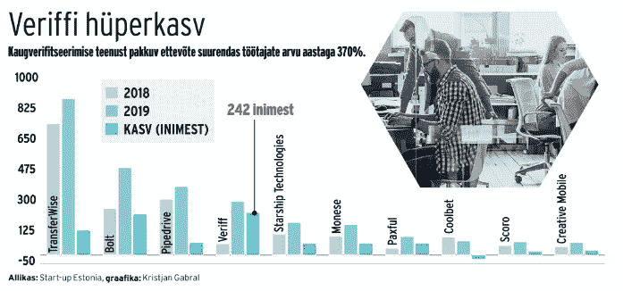
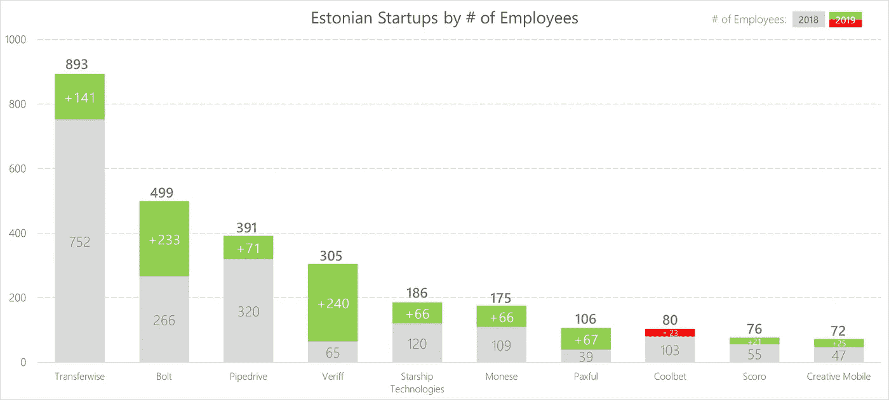
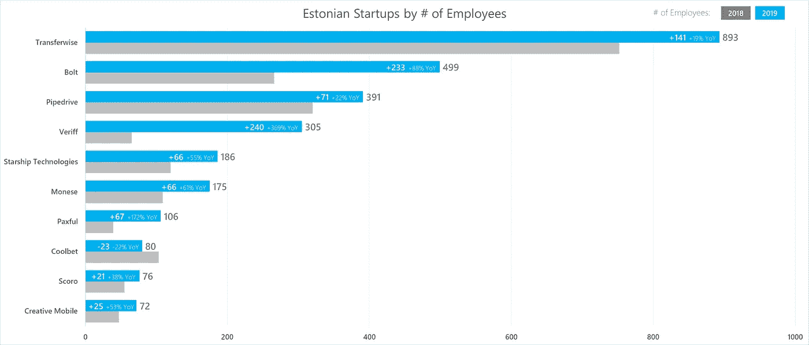

# 数据即诊所:改进排名图

> 原文：<https://towardsdatascience.com/data-viz-clinic-improving-a-ranking-chart-17e7193c672?source=collection_archive---------42----------------------->

## 无论是公司排名还是日常商品价格排名，媒体都有很多排名图表。一些渠道做到了这一点，而其他渠道往往会失败。

约书亚·戈尔德在 [Unsplash](https://unsplash.com?utm_source=medium&utm_medium=referral) 上拍摄的照片

人类是视觉动物。我们喜欢观察自然、动物和我们周围的一切生物。新闻帖子中的图片也是如此。我们喜欢让我们更接近故事的视觉层，而不仅仅是阅读纯文本。因此，我们的眼睛很可能会停留在文章中的一两张图片上。这就引出了今天的话题，排行榜。媒体喜欢排名，可以是根据年收入或员工数量对财富 500 强公司进行排名。

**爱沙尼亚初创企业景观**
我们爱沙尼亚人引以为豪的一件事就是我们的初创企业。对于爱沙尼亚以外的人来说，这里有一些你可能听说过的名字:

*   网络电话
*   转移方式
*   管道驱动
*   博尔特(原名 Taxify)
*   Veriff
*   莫内塞
*   星际飞船技术公司

所有这些初创企业都来自波罗的海小国——爱沙尼亚，该死的，我们为他们感到骄傲。所以自然地，我们的媒体喜欢比较他们和他们的统计数据。今天的例子(再一次)来自 Delfi，并根据员工数量对这些初创企业进行排名。

资料来源:Delfi arileht。数据来源:初创爱沙尼亚

该图有 3 个不同的系列:

*   2018 年员工数量
*   2019 年的员工数量
*   员工增加/减少(Kasv)

对于 10 家公司来说，这使得 30 个不同的数据点被绘制在一个图表上，并且这些系列的配色方案非常相似。此外，由于它非常简洁，几乎没有任何空间来添加额外的上下文数字。这使得人们很难了解整个故事。因此，我们如何改善这一点，以更好地向公众说明？

**你的使命，你是否应该选择接受它**
我们今天的挑战是让这张图表更简单，同时显示额外的信息。这对于那些进一步研究图表和分析数据的人来说至关重要，但与此同时，这也将迎合对高水平数字感兴趣的更广泛的受众。我根据相同的数据创建了两个不同的选项，但是使用了两个不同的图表。

**方案一:更进一步**
有一种方法可以快速提升原有观想，而不需要做太多改变。我们可以将它保留为柱形图，但我们可以将它堆叠起来，而不是将 3 个不同的系列一个接一个地显示出来。这将把 3 个系列减少为 1 个，仅显示雇员，堆叠区域将显示逐年增加/减少。结果如下:

这样做的结果是一个更清晰的图表，您可以很容易地看到同比增长是正还是负，并显示所有 3 个高水平的数字:

*   2018 年员工数量
*   2019 年员工增减数
*   2019 年底员工总数

这是唯一的选择吗？不，肯定不是，但这是我们可以利用的。如果我们考虑排名(例如体育)，他们倾向于从上到下，而不是从左到右，反之亦然。这也是我们的眼睛喜欢解释这些结果的方式。所以——回到制图板。

**方案二:我们来排列一下**
我准备用一个普通的条形图，而不是堆积柱形图。这一次我不想使用堆叠版本，因为我想使用额外的空间来引入更多的数字细节。

在选项 1 中，我使用了 3 种颜色来代表 2018 年和 2019 年期间员工的增加/减少。方案 2 使用 2 种颜色，一种代表 2018 年(灰色)，一种代表 2019 年(蓝色)。我选择显示 2019 年底的员工人数，因为这是我们追求的关键数字。额外的数字细节已添加到条形内，并反映了 2019 年的增加/减少以及同比百分比变化。不同于关注总人数，年度同比数据清楚地表明，增长最高的是 Veriff，他从 **65** 名员工增加到 **305** 名员工，增加了 **240** ，反映出 **369%** 的同比变化。

**结论**
生成不同的图形很容易，但让它们变得容易理解却是另一回事。我在本文中提出的两个选项以更有意义的方式引出了故事，而不是本文中提出的原始图表。
再一次，让我们不要考虑我们使用的图表和图形的视觉方面，而是更多地考虑如何让看到这些视觉化的人们容易地使用它们。

**来源:**
*** *数据&图形* ***—Delfi arileht—[https://arileht . Delfi . ee/news/uudised/eesti-idufirmad-kasva sid-mullu-taas-Lendu-tousis-uus-staar？id=88948031](https://arileht.delfi.ee/news/uudised/eesti-idufirmad-kasvasid-mullu-taas-lendu-tousis-uus-staar?id=88948031)