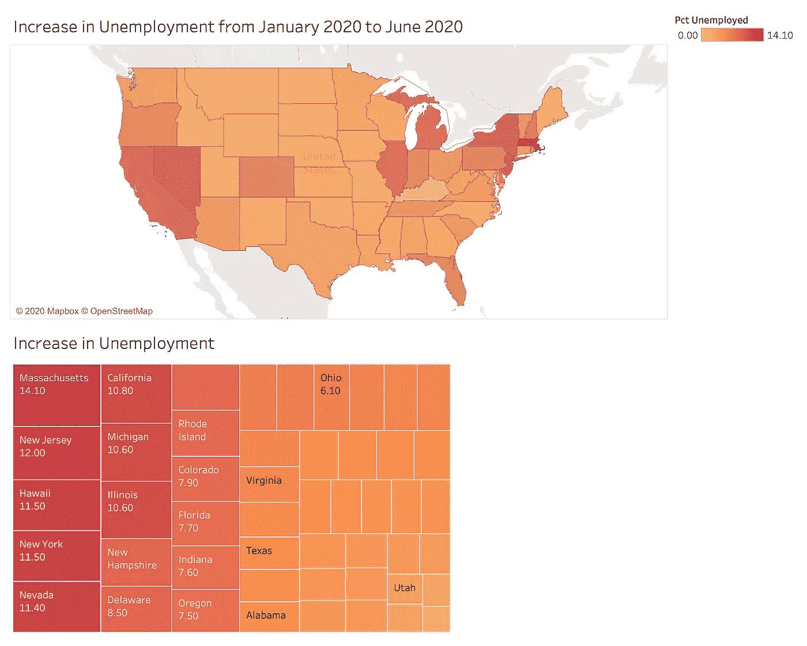
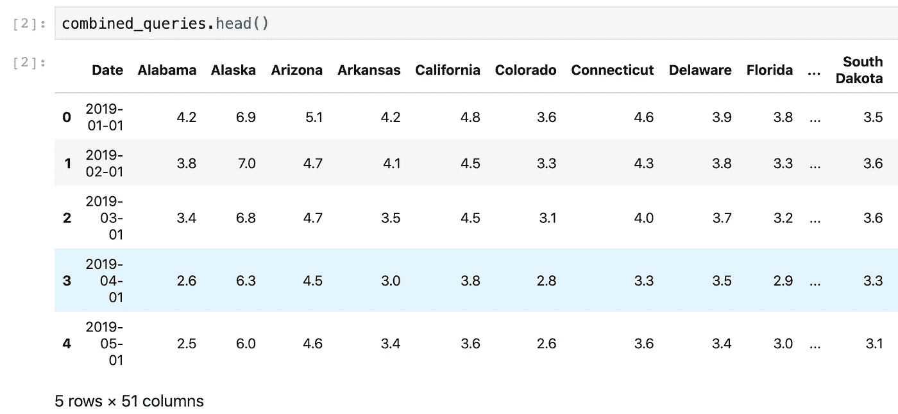
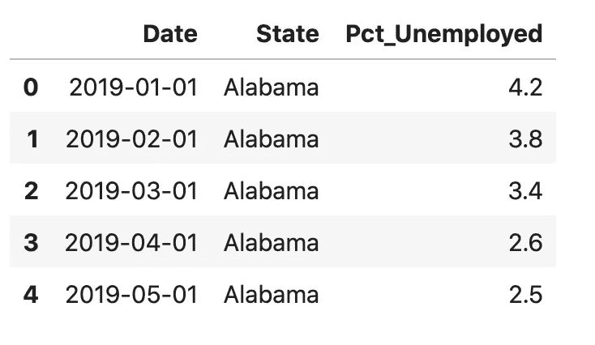
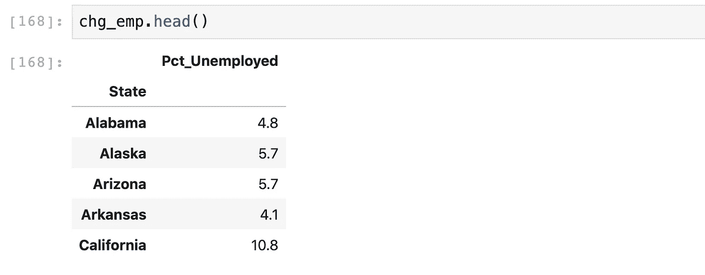
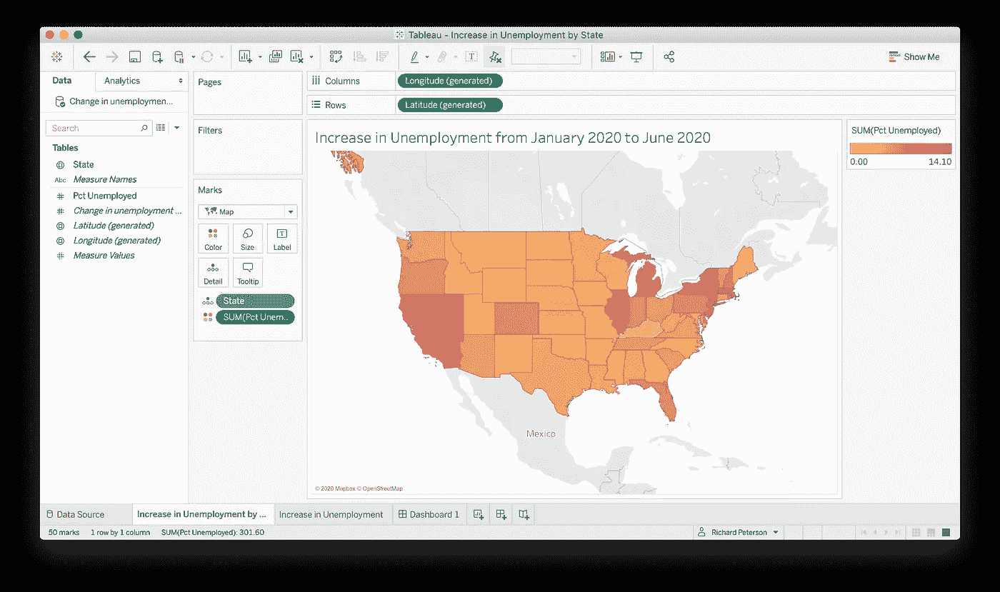
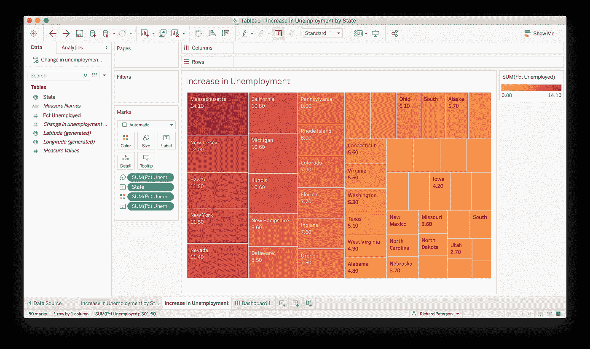
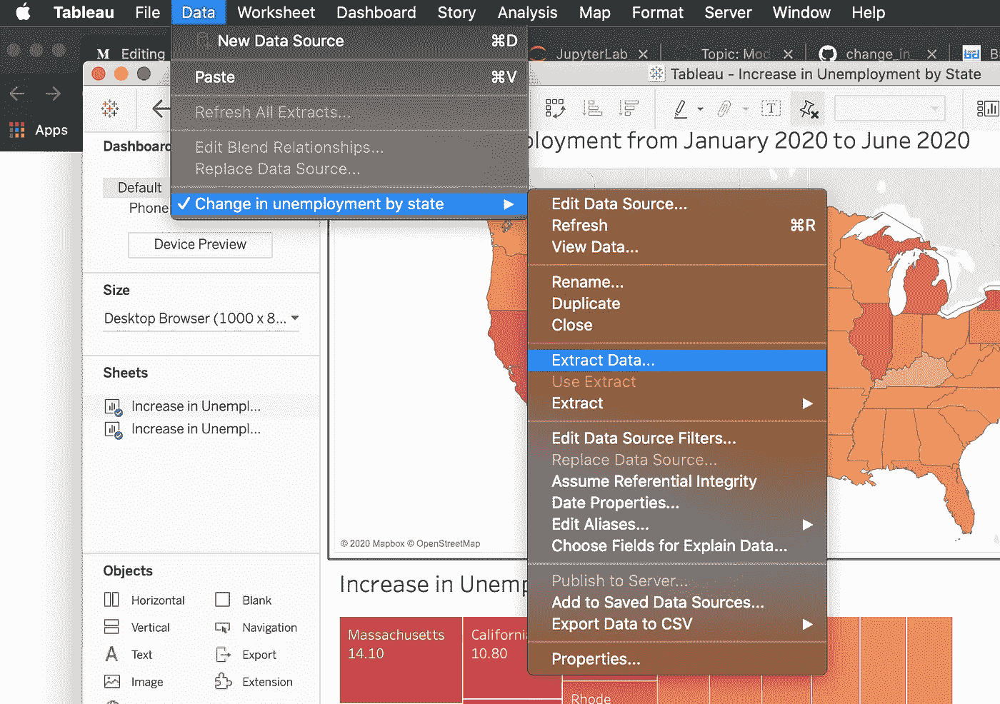
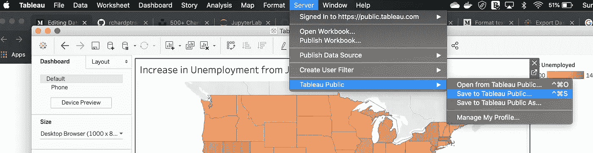

# 数据即使用 Python 和 Tableau:从 API 调用到托管仪表板

> 原文：<https://towardsdatascience.com/data-viz-using-python-and-tableau-from-api-call-to-hosted-dashboard-46195bc335ca?source=collection_archive---------31----------------------->

## 互动图表是视觉叙事的关键。



Tableau 仪表板，我们将在本文中创建。

构建信息图通常在您第一次浏览数据时就开始了。 **Matplotlib、Seaborn 和 ggplot2** 是经典的编程图表，而 **Plotly** 也大受欢迎。但对我来说，没有什么比得上**画面**的干净专业美感。在本文中，我们将抛开内联 Jupyter 笔记本图表，学习如何使用 Tableau Public 创建**托管的交互式图表。**

**本文由三部分组成:**

1.  **研究** — **你的主题是什么，你将如何提取数据？**在本文中，我们将了解**BLS 劳工统计局的 API。**我们能够使用带有参数的 **HTTP POST 请求**来检索数据，这些参数包括每个 BLS 查询的查询 id。我们需要的数据是各州的失业数据。
2.  **数据清理** —使用 python，我们将调用 BLS API，并使用 **Pandas** 将数据清理成**整齐的垂直格式。这可以用 Jupyter 笔记本或 Python 脚本来完成。数据将保存到 CSV 文件和 SQLite 数据库中。**
3.  **Tableau** —创建一个 choropleth(地理)地图和一个树形地图，并将图表发布给 Tableau Public。我们将能够共享带有嵌入链接的图表。

您可以遵循我的 GitHub repo 中的查询和清理数据部分！这是一篇来自新冠肺炎疫情的失业分析的姊妹篇。

[](https://github.com/rchardptrsn/COVID-Employment-Analysis) [## rchardptrsn/COVID-就业-分析

### 这个笔记本描述了几个查询美国劳工统计局 API 的例子，并把数据整理成一个…

github.com](https://github.com/rchardptrsn/COVID-Employment-Analysis) 

# 第 1 部分:研究和查询数据

[Bureau of Labor Statistics API 是一个 REST API](https://www.bls.gov/developers/) ，它基于惟一的查询 id 提供数据。BLS 查询 id 基于许多因素，如州和行业。要找到查询 ID，您需要浏览到 [BLS 数据库、表格&计算器](https://www.bls.gov/data/)并找到与您的数据相关的类别。各州的失业情况可以在“本地失业统计——一屏搜索”中找到。您会注意到每个查询都有一个惟一的 ID。如果您可以确定模式，您可以通过编程方式生成这些 id，而不是复制和粘贴。

# 第 2 部分:查询 API 和清理数据

在 [GitHub repo](https://github.com/rchardptrsn/COVID-Employment-Analysis) 中，有一个名为 **blspandas.py** 的模块，它具有包装器函数，用于清理和执行检索数据的 **HTTP POST 请求**([Credit:BD Economics](https://www.bd-econ.com/blsapi.html))。下面的脚本调用这些函数来创建一个查询 id 列表，执行 HTTP 请求，并将结果保存为 pandas 数据帧。

**blspandas.py** 模块的一个关键部分是`clean_bls_data(combined_queries)`函数。在我们运行`df = blspandas.clean_bls_data(combined_queries)`之前，我们的数据是这样的:



我们需要像《T2》一样的整齐垂直格式的数据。熊猫**融化**对于这种转变来说再合适不过了。

运行`df = blspandas.clean_bls_data(combined_queries)`后，数据如下所示:



## 清理数据的目标

为此，让我们思考一下我们最终需要什么。我们的目标是创建一个 choropleth 图和一个树形图，显示从 2020 年 1 月到 2020 年 6 月的失业率变化。这将描述新冠肺炎疫情对劳动力市场的影响，并显示哪些州没有反弹。

我们需要做的是找出每个州两个日期之间的失业率差异。我们将通过定位包含这两个日期的所有日期行，并从六月份的失业人数中减去一月份的失业人数。

产生的`chg_emp`数据帧如下所示:



这就是我们创造画面视觉效果所需要的一切！只需通过运行以下命令将`chg_emp`数据帧写入 CSV 文件:

```
chg_emp.to_csv('Change in unemployment by state.csv', index=False)
```

# 第三部分:画面

此时，要么注册 Tableau Public，要么购买该软件。作为一名学生，我可以免费注册并获得完整的桌面版本。

## Choropleth 图

通过将 CSV 文件导入工作簿来加载数据。单击新工作表，并按如下方式进行配置:



你会注意到在“标记”下面还有其他选项来显示每个州的名称和失业情况。

## 树形地图

对于树形图，我们将显示相同的数据，但是以一种允许更多细节的方式，包括州名和失业率的变化。在标记下，您需要:

1.  状态标签
2.  失业百分比的颜色
3.  失业百分比标签



## **创建仪表板**

您可以通过单击“仪表板 1”并拖动两个工作表来创建仪表板。在这里，我将 Choropleth 排列在树状图的顶部。


## 推送到 Tableau Public

最后，我们将把 Tableau 工作簿推送到 Tableau Public。

为此，我们需要**提取我们的 CSV 数据源**。这将允许工作簿作为单个捆绑文件上传到 Tableau Public。



一旦摘录完成，我们可以**将我们的工作簿**发布到 Tableau Public。



上传到 Tableau 后，它将在您的浏览器窗口中打开。此时，您只需点击右下角的“共享”按钮，将链接发送给您的朋友，即可共享您的仪表盘！点击这里查看我的[托管仪表板版本！](https://public.tableau.com/views/IncreaseinUnemploymentbyState/Dashboard?:language=en&:display_count=y&publish=yes&:origin=viz_share_link)

**嵌入式仪表盘**

您有几个选择:

1.  嵌入脚本—这可以嵌入到 html 中，以提供 Tableau Public 的实时仪表板版本。这篇文章演示了如何将动态仪表盘嵌入到 WordPress 博客文章中。
2.  不幸的是，您不能在中型文章中嵌入 live dashboard。
3.  另一个不错的选择是[在一个简单的 python web 服务器上嵌入仪表板。](https://www.zuar.com/blog/embedded-analytics-how-to-embed-tableau-dashboards-into-a-web-page/)

感谢您的阅读，我希望您和我一样发现 python+Tableau 堆栈很有吸引力！