# 数据即 Python:应用和仪表板

> 原文：<https://towardsdatascience.com/data-viz-with-python-apps-dashboards-6693f46f5e6a?source=collection_archive---------17----------------------->

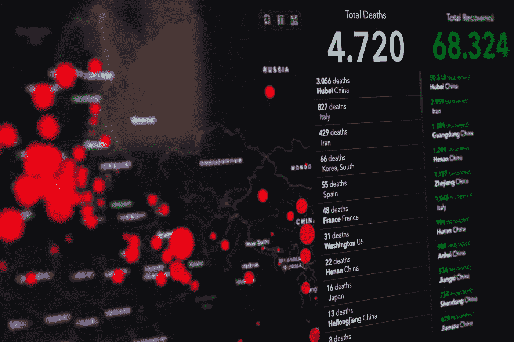

Markus Spiske 摄于 Pexels

## ***探索 Python 中最流行的开源数据可视化工具***

作为一名顾问数据科学家，我非常清楚将我的工作总结到仪表板和应用程序中的重要性。
这让我能够推广我的算法和工作，并将它们放入直觉图形中，以便更好、更快地理解。在本文中，我们将介绍设计`dashboards`和`applications`时使用的最著名的工具和`python`库。

# 目录

摘要如下:

1.  **阴谋地破折号**
2.  **流线**
3.  **散景**
4.  **基巴纳**
5.  **Heroku 部署**

# 神秘地闪过

[Dash](https://plotly.com/dash/) 是 Plotly 开发的开源工具。它允许插入多种类型的小部件，可以选择布局和样式，因为 dash 的布局是基于 HTML 的，并允许 CSS 样式。
通过运行以下命令行完成设置:

```
pip install dash
pip install dash_core_components
pip install dash_html_components
```

dash 应用程序的**布局**是组件的层次树，是 HTML 元素和图形的混合，使用:

*   **dash_html_components** 库提供了所有 html 标签的类，关键字参数描述了 HTML 属性，如样式、类名和 id。使用这个库，我们可以添加 HTML 元素，比如`Div, H1, P,... etc`。更多细节，我建议你查看它的[文档](https://dash.plotly.com/dash-html-components)。
*   **dash_core_components** 库生成更高级别的组件，如控件和图形，并使用 *Plotly* 的语法。例如，我们可以插入一个`Button, Dropdown, Slider,DatePickerRange, ... etc.`。更多详情请访问官方[网站](https://dash.plotly.com/dash-core-components)。

可以使用以下 python 代码开发一个简单的 Dash 应用程序:

```
import dash 
import dash_core_components as dcc
import dash_html_components as html

app = dash.Dash(__name__)
app.title='Hello World'
app.layout = html.Div(children=[

	html.H1(children='Hello Dash!', style={'textAlign':
		'center', 'color': '#7FDBFF'}),

	html.Div(children='''
		Dash: A web application framework for Python.
		'''),

	dcc.Graph(
		id='example-graph',
		figure={
			'data': [
				{'x': [1, 2, 3], 'y': [4, 1, 2], 'type': 'bar',
					'name': 'SF'},
				{'x': [1, 2, 3], 'y': [2, 4, 5], 'type': 'bar',
				'name': u'Montréal'},
			],
			'layout': {
				'title': 'Dash Data Visualization'
				}
			}
	),
])if __name__ == '__main__':
	app.run_server(debug=True)
```

选项`debug=True`允许考虑最近的修改，而无需重新运行应用程序。
要运行应用程序，我们使用以下命令行:

```
python app_file.py
```

你可以在 [http://127.0.0.1:8050/](http://127.0.0.1:8050/) 上运行以下应用程序:

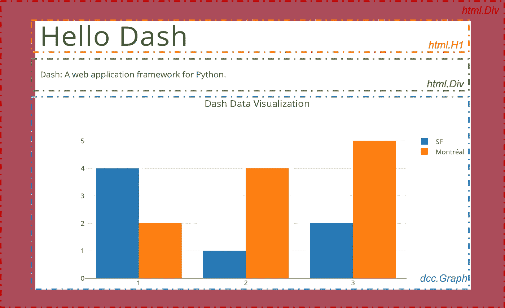

作者图片

## 式样

可以添加一个覆盖应用程序基本样式的 CSS 文件，允许您自定义图形和 HTML 元素。为此，文件夹的结构应该如下所示:

```
app.py 
assets/ 
   |-- style.css 
   |-- custom-script.js 
   |-- img.png 
   |-- background.jpg 
   |-- favicon.ico
```

必须将 CSS 文件和所有其他插入的图像放在一个名为`assets`的文件夹中，以便 Dash 读取。一旦完成，我们所要做的就是使用以下 python 行指定样式表:

```
external_stylesheets=["assets/style.css"]
app = dash.Dash(__name__, external_stylesheets=external_stylesheets)
```

## 引导程序

当构建 dash-app 时，我个人更喜欢使用 Bootstrap。这是一个用于 Plotly Dash 的 python 库，包含样式化和高级元素。
使用以下命令行完成设置:

```
pip install dash-bootstrap-components
```

将 bootstrap 主题作为样式表之一包括进来是很重要的:

```
external_stylesheets=["assets/style.css", dbc.themes.BOOTSTRAP]
app = dash.Dash(__name__, external_stylesheets=external_stylesheets)
```

Boostrap 包含了`DropDownMenu, Navbar, Progress, Button, ... etc`等很多元素。最有用的元素之一是`Layout`，它允许使用*行*和*列*来构建仪表板，这对应用程序的结构非常有用。
欲了解更多详情，请随时访问官方[文档](https://dash-bootstrap-components.opensource.faculty.ai/docs/components/alert/)。

## 复试

像任何其他应用程序一样，支持图形之间的交互性是很重要的，这可以通过回调函数来实现。
每个插入元素都有两个重要特征

*   **id** :元素的唯一称谓
*   **属性**:元素与元素不同

链接应用程序中的两个元素的方式如下:

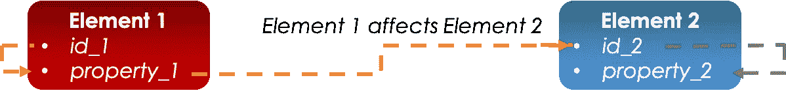

作者图片

在这种特殊情况下，第一个元素影响第二个元素:通过其 *id_1* 选择的第一个元素的 *property_1* 影响通过其 *id_2* 访问的第二个元素的 *property_2* 。

```
from dash.dependencies import Input, Output
@app.callback(
    Output(component_id='id_2', component_property='property_2'),
    [Input(component_id='id_1', component_property='property_1')]
)
def callback_function(input_value):
    """
    What to do
    """
```

**NB** :在回调函数中可以接受多个输入。

## 隐藏物

当开发一个应用程序时，在缓存中保存元素是非常重要的，这样可以减轻加载的负担，提高交互性，缓存允许这样做。
Dash 不支持特定的缓存特性，但是克服这个问题的一个方法是在 python 中使用`global variables`。

## 制表符

Dash 中的选项卡可以使用`dcc.Tab`组件插入，其中其子项是组成选项卡的元素。

```
import dash
import dash_html_components as html
import dash_core_components as dcc

external_stylesheets = ['https://codepen.io/chriddyp/pen/bWLwgP.css']

app = dash.Dash(__name__, external_stylesheets=external_stylesheets)

app.layout = html.Div([
    dcc.Tabs([
        dcc.Tab(label='1st Tab', children=[
            dcc.Graph(),
            ###
        ]),
        dcc.Tab(label='2nd Tab', children=[
            dcc.Graph(),
            ###
        ]),
        dcc.Tab(label='3rd Tab', children=[
            dcc.Graph(),
            ###
        ]),
    ])
])
```

## 走廊

Dash 有一个[图库](https://dash-gallery.plotly.host/Portal/)，你可以在那里浏览和发现其他仪表盘，这是一个很好的基线和灵感来源。

# 细流

Streamlit 是一个开源应用程序框架，主要用于使用 python 以快速高效的方式创建 ML 仪表盘。设置非常简单，可以使用以下命令行来执行:

```
pip install streamlit
```

与 Dash 相比，Streamlit 具有更好的缓存处理能力，这将在接下来的章节中进行介绍，因此可以使用以下流程实现更快的开发迭代:

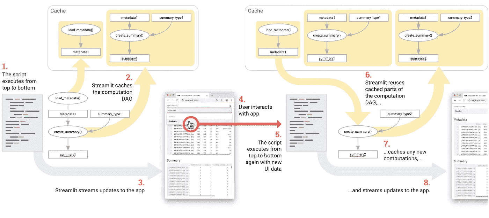

streamlit.io

一旦创建了您的文件，您可以键入这个命令行，它将在 [http://localhost:8501](http://localhost:8501) 上运行您的应用程序

```
streamlit run file.py
```

和 Dash 一样，可以选择模式`Always re-run`来实时修改。

Streamlit 的 widgets gallery 包含多个条目，它们都可以使用一行代码插入:`Markdown`、`SelectBox`、`Slider`、`Plot`等...注意，小部件可以插入到`one-page area`或`sidebar`中，插入是在`vertical stacking`之后完成的:

```
import streamlit as st
import matplotlib.image as mpimg
import matplotlib.pyplot as plt
from mpl_toolkits.mplot3d import Axes3D
from sklearn import datasets
from sklearn.decomposition import PCA
import pandas as pd

img=mpimg.imread('imgs/streamlite_funct.png')
iris = datasets.load_iris()
feature_names=['sepal length (cm)',
  'sepal width (cm)',
  'petal length (cm)',
  'petal width (cm)']
database=pd.DataFrame(iris.data, columns=feature_names)
database["class"]=iris.target

# plot the first three PCA dimensions
fig = plt.figure(1, figsize=(8, 6))
ax = Axes3D(fig, elev=-150, azim=110)
X_reduced = PCA(n_components=3).fit_transform(iris.data)
ax.scatter(X_reduced[:, 0], X_reduced[:, 1], X_reduced[:, 2], c=iris.target,
           cmap=plt.cm.Set1, edgecolor='k', s=40)
ax.set_title("First three PCA directions")
ax.set_xlabel("1st eigenvector")
ax.w_xaxis.set_ticklabels([])
ax.set_ylabel("2nd eigenvector")
ax.w_yaxis.set_ticklabels([])
ax.set_zlabel("3rd eigenvector")
ax.w_zaxis.set_ticklabels([])

def main():
    ########### Sidebar ##############################

    st.sidebar.markdown("# Hello World")
    st.sidebar.selectbox('Select a tool', ["Dash", "Kibana", "Streamlit", "Bokeh"])

    st.markdown("## Multiselection")
    st.multiselect('Select a tool', ["Dash", "Kibana", "Streamlit", "Bokeh"])

    st.markdown("## Radio buttons")
    st.radio('Select a tool', ["Dash", "Kibana", "Streamlit", "Bokeh"])

    st.markdown("## Slider") 
    st.slider('Select a Number', min_value=1, max_value=4, value=1)

    st.markdown("## Image")
    st.image(img, width=500)

    st.markdown("## DataBase")
    st.dataframe(database)

    st.markdown("## Plot")
    st.write(fig)

if __name__ == "__main__":
    main()
```

我们得到以下应用程序:

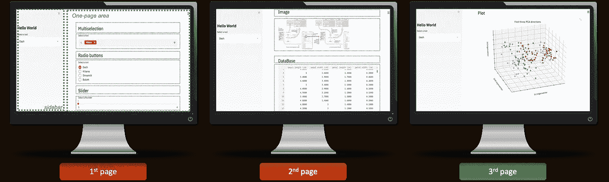

作者图片

函数`st.write`非常重要，可以用来插入很多 python 元素。要了解更多细节，我建议您阅读 streamlit 的[文档](https://docs.streamlit.io/en/latest/index.html)。

**交互性**:每个元素都可以被赋予一个代表其当前值的变量，接下来，它可以被用来更新另一个元素，从而更新交互性。

## 隐藏物

缓存通常用于存储恒定的数据，无论在应用程序上做出何种选择，这些数据都不会改变。我们可能经常在应用程序中定义函数，但每次刷新应用程序时都不需要重新运行这些函数，我们可以使用以下 python 代码缓存这些函数:

```
@st.cache  
def function_1():
	####
```

## 制表符

在许多应用程序中，选项卡可能非常重要:在 Streamlit 中实现这一点的一种方法是在侧边栏中添加一个`selectbox`，它的选择将影响仪表板的结构，并在框的值上使用 if 语句。

```
st.sidebar.markdown("Tabs")
tab=st.sidebar.selectbox('Select a Tab', ["Home", "Documentation", "Partners", "Contact"])
if tab=="Home":
	#Develop the one_pager
	##
elif tab=="Documentation":
	###
elif tab=="Partners":
	###
elif tab=="Contact":
	###
```

## 健康应用——Streamlit

当我开始发现 Streamlit 时，我决定通过开发一个简单的健康应用程序来投入使用。

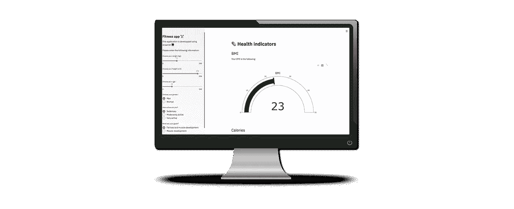

作者图片

您可以使用这个 [url](https://agile-crag-69946.herokuapp.com) 访问应用程序，脚本托管在这个 git [存储库](https://github.com/ismail-mebsout/Streamlit_app)中。更多 app 可以访问官方[图库](https://www.streamlit.io/gallery)。

# 散景

Bokeh 是一个 python 库，允许创建一个交互式仪表板。可以使用以下命令行安装它:

```
pip install bokeh
```

例如，可以使用以下 python 脚本创建以下应用程序:

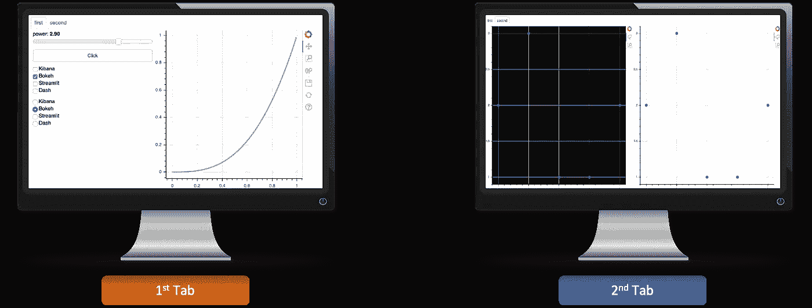

作者图片

```
from bokeh.io import show, curdoc
from bokeh.plotting import figure, ColumnDataSource
from bokeh.layouts import row, column
from bokeh.models.widgets import Tabs, Panel
from bokeh.models import Slider, CheckboxGroup, RadioGroup, Button, CustomJS

#data source
x = [x*0.005 for x in range(0, 200)]
y = x
source = ColumnDataSource(data=dict(x=x, y=y))

#Plots
plot_1 = figure(plot_width=400, plot_height=400)
plot_1.line('x', 'y', source=source, line_width=3, line_alpha=0.6)

plot_2=figure(tools='box_zoom, lasso_select')
plot_2.circle(x=[1,2,3,4,5], y=[2,3,1,1,2])
plot_2.background_fill_color = 'black'

plot_3=figure(tools='box_zoom, lasso_select')
plot_3.circle(x=[1,2,3,4,5], y=[2,3,1,1,2])

#widgets
slider = Slider(start=0.1, end=4, value=1, step=.1, title="power")
button = Button(label='Click')
checkbox = CheckboxGroup(labels=['Kibana', 'Bokeh', 'Streamlit', 'Dash']) 
radio = RadioGroup(labels=['Kibana', 'Bokeh', 'Streamlit', 'Dash'])

#Interactivity
callback = CustomJS(args=dict(source=source), code="""
        var data = source.data;
        var f = cb_obj.value
        var x = data['x']
        var y = data['y']
        for (var i = 0; i < x.length; i++) {
            y[i] = Math.pow(x[i], f)
        }
        source.change.emit();
    """)
slider.js_on_change('value', callback)

#Plots zoom-linking
plot_2.x_range=plot_3.x_range
plot_2.y_range=plot_3.y_range

#Tabs
first=Panel(child=row(column(slider, button, checkbox, radio), plot_1), title='first')
second=Panel(child=row(plot_2,plot_3), title='second')
tabs=Tabs(tabs=[first, second])

#App
curdoc().add_root(tabs)
show(tabs)
```

注意，一旦我们定义了图形`plot`，我们就使用语法`plot.graph`来为它分配想要的图形。使用`ColumnDataSource`处理数据，使用`row, column`布局。我们定制添加的小部件`Slider, CheckboxGroup, RadioGroup, Button`，并使用 JS 回调`CustomJS`将它们链接到图形。要在[http://localhost:5006/myapp](http://localhost:5006/myapp)上运行您的应用程序，您可以使用以下命令行:

```
bokeh serve --show myapp.py
```

## 走廊

和所有其他工具一样，散景一开始就有非常丰富的图库。

# 弹性堆叠

## 弹性搜索

Elasticsearch 是一种特殊类型的表格索引，它提供了一个更快的搜索引擎。我们可以将 pandas 数据库转换成一个`Elasticbase`，然后使用 Kibana 可视化它，Kibana 是 stack Elastic 的可视化工具。首先，你需要根据你的操作系统下载[Kibana](https://www.elastic.co/fr/downloads/kibana)&[elastic search](https://www.elastic.co/fr/downloads/elasticsearch)。安装后，我们将使用 elasticsearch 正确地索引我们的熊猫数据框架。为此，我们首先需要使用命令行启动服务 elasticsearch 和 kibana:

```
./elasticsearch-7.6.1/bin/elasticsearch
./kibana-7.6.1/bin/kibana
```

一旦 Kibana 启动，我们就可以使用这个 python 脚本向 Elasticsearch 服务发送数据

```
import pandas as pd
from elasticsearch import Elasticsearch

# Database loading and service openning
database=pd.read_excel("data/test_db.xlsx")
es_client = Elasticsearch(http_compress=True)

#Elasticsearch does not accept NAN values
print(database.isna().sum().sum())

df=database.copy()
INDEX="laposte" #Its name in Elasticsearch (laposte for example)
TYPE= "record"

def rec_to_actions(df):
    import json
    for record in df.to_dict(orient="records"):
        yield ('{ "index" : { "_index" : "%s", "_type" : "%s" }}'% (INDEX, TYPE))
        yield (json.dumps(record, default=int))

e = Elasticsearch() 
r = e.bulk(rec_to_actions(df))

#Verify if everything went fine
print(not r["errors"])
```

## 基巴纳

servie kibana 在本地主机的端口`5601`上启动，我们可以使用地址`localhost:5601`在浏览器中访问它。一旦进入主页面，我们可以点击`Dashboard`和`Create dashboard`，如下所示:

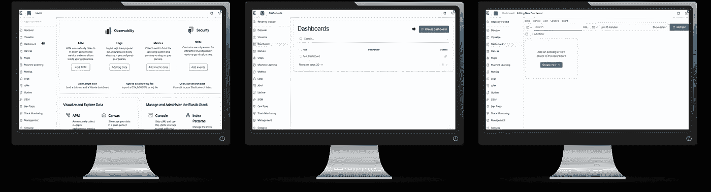

作者图片

我们现在可以通过以下步骤添加小部件:

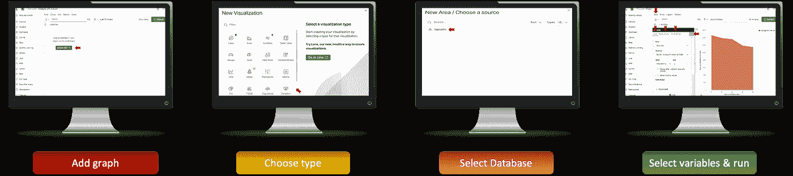

作者图片

可以使用光标定位插入的图形，这使得布局易于定制。请注意搜索栏的存在，其中的数据是使用 Elasticsearch 索引的，这使得查询耗时更少，并增加了仪表板的交互性，尤其是在处理大型数据库时。**交互**在 kibana 中自动处理。

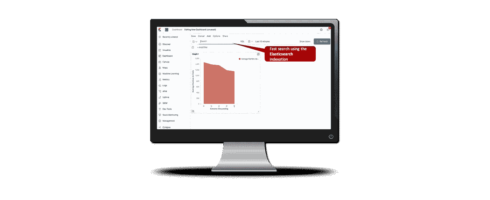

作者图片

## 制表符

Kibana 中的选项卡可以使用 markdowns 小部件中的嵌入式链接来创建。您首先在不同的仪表板中创建所有选项卡，然后在每个选项卡中添加到其他选项卡的嵌入链接。

## 走廊

不要犹豫去参观基巴纳的官方[画廊](https://www.elastic.co/fr/demos)。

# Heroku 部署

应用程序开发完成后，您可以在线托管它，这样任何人都可以使用 Url 访问它。一种方法是使用 Heroku，它提供这种有一些限制的免费服务。你首先需要注册，然后在线创建一个 heroku 应用程序，它将链接到你的 git 库。回购应具有以下结构:

```
. 
├── app.py 
├── requirements.txt 
├── setup.sh 
└── Procfile
```

您可以查看我的 git [存储库](https://github.com/ismail-mebsout/Streamlit_app)了解更多信息。在本地 git 文件夹上运行以下命令行:

```
heroku create
git push heroku master
heroku ps:scale web=1
heroku open
```

你的应用程序会一直等待你在 git 中的每一次推送，以便考虑最新的变化。

# 结论

应用程序和仪表板是每个项目非常重要和决定性的阶段，它们允许总结我们的工作，并通过一个本能的界面让用户更容易访问。每种技术的使用主要取决于您的交付和截止日期:一些工具允许更大的灵活性，另一些工具开发起来更快:

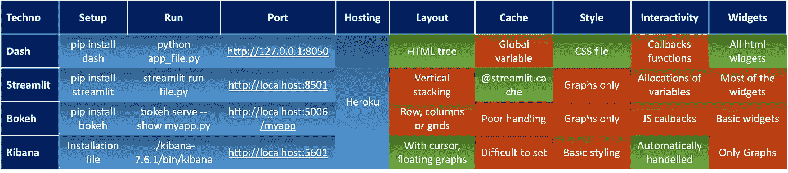

作者图片

在我个人看来，如果所有条件都满足，`Dash`可以是最佳的搭配选项。

*原载于 2020 年 5 月 20 日 https://www.ismailmebsout.com*[](https://www.ismailmebsout.com/data-viz/)**。**