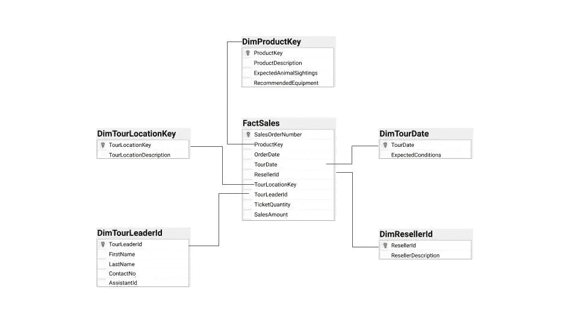

# 数据仓库综合指南

> 原文：<https://towardsdatascience.com/data-warehouse-68ec63eecf78?source=collection_archive---------10----------------------->

## 在数据清理过程完成之前，数据科学无法启动。了解数据仓库作为可用于分析的数据集的存储库的角色。

在企业环境中寻找干净的数据。[陈虎](https://unsplash.com/@huchenme?utm_source=medium&utm_medium=referral)在 [Unsplash](https://unsplash.com?utm_source=medium&utm_medium=referral) 上拍照。

作为一名数据科学家，了解一些基本的数据仓库概念是很有价值的。我们所做的大部分工作都涉及到在需要清晰易懂的数据集上增加企业价值。对于达到其生命周期的那个阶段的数据集，它已经通过了数据架构的许多组件，并且希望通过许多数据质量过滤器。这就是我们如何避免数据科学家最终将 80%的时间花在数据争论上的不幸情况。

让我们花点时间通过了解与建立数据仓库相关的各种考虑来加深对数据架构过程的理解。

**数据仓库**是一个特定的基础设施元素，它为包括[数据分析师和数据科学家](/data-analyst-vs-data-scientist-2534fc1057c3)在内的线下用户提供对数据的访问，这些数据已经过整形以符合业务规则并以易于查询的格式存储。

数据仓库通常连接来自多个“真实来源”事务数据库的信息，这些数据库可能存在于单个业务单元中。与存储在事务数据库中的信息不同，数据仓库的内容被重新格式化，以提高查询速度和方便性。

数据必须符合验证质量的特定业务规则。然后，它被存储在一个*非规范化的*结构中——这意味着将可能被一起查询的信息存储在一起。这有助于通过降低从仓库中获取数据所需的查询的复杂性(即，通过减少数据连接的数量)来提高性能。

在本指南中:

1.  [构建数据仓库](#9ba4)
2.  [增强性能和调整尺寸](#f05e)
3.  [相关数据存储选项](#5bd9)
4.  [使用大数据](#f0b3)
5.  [提取、转换、加载(ETL)](#db29)
6.  从仓库中获取数据
7.  [数据归档](#7530)
8.  [总结](#1b56)

## 构建数据仓库

在为数据仓库开发 [*维度模型*](https://www.kimballgroup.com/data-warehouse-business-intelligence-resources/kimball-techniques/dimensional-modeling-techniques/four-4-step-design-process/) 的过程中，设计通常会经过三个阶段:(1)业务模型，它根据业务需求概括数据，(2)逻辑模型，它设置列类型，(3)物理模型，它代表关系数据仓库的实际设计蓝图。

因为数据仓库将包含来自业务各个方面的信息，利益相关者必须事先同意将要存储的数据的*(即粒度级别)。*

*[提醒在实施前跨各利益主体组织验证模型](http://www.kimballgroup.com/wp-content/uploads/2012/05/DT108_WhenDimensionalModelDone.pdf)。*

**

*一个假设的 safari tours 业务的示例星形模式。*

*数据仓库中的底层结构通常被称为 [*星型模式*](https://www.kimballgroup.com/data-warehouse-business-intelligence-resources/kimball-techniques/dimensional-modeling-techniques/star-schema-olap-cube/) —它将信息分类为维度或事实(即度量)。 [*事实表*](https://www.kimballgroup.com/data-warehouse-business-intelligence-resources/kimball-techniques/dimensional-modeling-techniques/facts-for-measurement/) 存储观察或事件(即销售、订单、库存余额等。)维度表*包含关于这些事实的描述性信息(即日期、位置等。)**

**有三种不同类型的事实表:(1)标准化粒度的事务记录，(2)给定时间范围内的定期记录，(3)给定业务流程内的累积记录。**

**除了星型模式，还有将数据排列到*雪花模式的选项。这里的区别是每个维度都是归一化的。***

> ***规范化是一种数据库设计技术，用于创建包含原子级信息的记录。***

***然而，雪花模式给维度模型增加了不必要的复杂性，通常星型模式就足够了。***

## ***增强性能并根据大小进行调整***

***除了了解如何构建数据之外，设计数据仓库的人还应该熟悉如何提高性能。***

***一种增强性能的技术是按照通常的查询顺序对数据创建一个*聚集索引*。例如，我们可以选择按旅游日期降序来组织事实表，这样接下来的旅游将首先显示在表中。建立聚集索引会对记录的物理存储方式进行重新排序，从而提高检索速度。除了可选的单个聚集索引之外，一个表还可以有多个非聚集索引，这些索引不会影响表的物理存储方式，而是会在内存中创建额外的副本。***

**另一个性能增强包括将非常大的表分成多个较小的部分。这叫做*分区*。通过将一个大表分割成更小的单个表，只需要访问一小部分数据的查询可以运行得更快。分区可以是垂直的(拆分列)或水平的(拆分行)。这里有一个链接，你可以在这里下载。rtf 文件包含用于 SQL 的[分区脚本](http://www.kimballgroup.com/wp-content/uploads/2014/03/tablepartitioning.rtf)以及其他数据库架构资源，如[项目启动和管理清单](http://www.kimballgroup.com/wp-content/uploads/2014/03/Ch02-tasklist.xls)。**

****

**是的，我会偷你的免费资源和有用的工具。由[Slawek](https://unsplash.com/@s1awek?utm_source=medium&utm_medium=referral)在 [Unsplash](https://unsplash.com?utm_source=medium&utm_medium=referral) 上拍照**

**考虑总数据库大小是调优性能的另一个关键因素。根据[服务级别协议(SLA)](https://www.dbta.com/Columns/DBA-Corner/The-Importance-of-SLAs-110871.aspx) ，在设计数据仓库时估计结果数据库的大小将有助于使性能与应用程序需求保持一致。此外，它将提供对物理磁盘空间的预算需求或云存储成本的洞察。**

**要进行这种计算，只需合计每个表的大小，这[很大程度上取决于索引](https://docs.microsoft.com/en-us/sql/relational-databases/databases/estimate-the-size-of-a-database?view=sql-server-ver15)。如果数据库的大小明显大于预期，您可能需要规范化数据库的某些方面。相反，如果您的数据库变小了，您可以进行更多的非规范化，这将提高查询性能。**

## **相关数据存储选项**

**数据仓库中的数据可以重新组织成较小的数据库，以满足组织的需要。例如，一个业务部门可能会创建一个*数据集市*，提供特定于他们部门的信息。这个只读信息源为那些可能不太了解数据架构技术细节的业务用户提供了清晰度和可访问性。这里有一个创建数据集市时要部署的规划策略。**

**类似地，可以为操作报告建立一个*操作数据存储(ODS)* 。 [*主数据管理(MDM)系统*](https://www.dataentryoutsourced.com/blog/ever-changing-master-data-management/) 存储有关独特业务资产的信息(即客户、供应商、员工、产品等。)**

**[阅读关于过度使用商业智能数据可视化工具的风险](https://www.kimballgroup.com/2014/01/design-tip-162-leverage-data-visualization-tools-but-avoid-anarchy/)。**

## **使用大数据**

**为了处理大数据，数据架构师可能会选择实施一种工具，如 [*Apache Hadoop*](https://hadoop.apache.org/) 。Hadoop 基于谷歌开发的用于索引万维网的 [MapReduce 技术，并于 2006 年向公众发布。在高度结构化的数据仓库环境中，信息已经过上游验证以符合业务规则，与此相反，Hadoop 是一个软件库，它接受各种数据类型，并允许跨计算机集群进行分布式处理。Hadoop 通常用于处理流数据。](https://research.google/pubs/pub62/)**

**Hadoop 加快了多台计算机集群的数据处理速度。通过 [GIPHY](https://giphy.com/gifs/got-get-run-SWKyABQ08mbXW/links) 。**

**虽然 Hadoop 能够快速处理流数据，但它在查询速度、查询复杂性、安全性和编排方面存在问题。近年来，随着基于云的解决方案(例如 [Amazon Kinesis](https://aws.amazon.com/kinesis/) )的崛起，Hadoop 已经不再受欢迎——在处理非结构化数据的速度方面提供了相同的收益，同时与云生态系统中解决这些潜在弱点的其他工具相集成。**

**[阅读更多关于如何实现“新”数据库技术的信息](https://www.kimballgroup.com/2014/01/design-tip-162-leverage-data-visualization-tools-but-avoid-anarchy/)。**

## **提取、转换、加载(ETL)**

**[*提取*](http://www.kimballgroup.com/wp-content/uploads/2013/08/Kimball-ETL-Extract-Subsystems1.pdf) 、 [*转换*](http://www.kimballgroup.com/wp-content/uploads/2013/08/Kimball-ETL-Transformation-Subsystems1.pdf) 、 [*加载*](http://www.kimballgroup.com/wp-content/uploads/2013/08/Kimball-ETL-Load-Subsystems1.pdf) 定义将数据移出其原始位置(E)，进行某种形式的转换(T)，然后将其加载(L)到数据仓库中的过程。数据库架构师应该着眼于[实现一种系统化的方法](https://link.springer.com/article/10.1007/s00778-017-0477-2),考虑到围绕设计考虑、操作问题、故障点和恢复方法的最佳实践，而不是以一种特别的、零碎的方式来处理 ETL 管道。[另请参见这个关于设置 ETL 管道的有用资源](https://www.kimballgroup.com/2007/10/subsystems-of-etl-revisited/)。**

**ETL 的文档包括创建*源到目标的映射:*关于如何将源系统中的数据结构和内容转换为目标系统的结构和内容的一组转换指令。[这里有一个用于此步骤](http://www.kimballgroup.com/wp-content/uploads/2014/03/Ch07_ETL_Specification_ToC.docx)的样本模板。**

**您的组织也可以考虑 ELT——加载没有任何转换的数据，然后使用目标系统的能力(通常是基于云的工具)来执行转换步骤。**

## ****从仓库中获取数据****

**一旦建立了数据仓库，用户应该能够方便地从系统中查询数据。优化查询可能需要一些培训，重点是:**

*   **[调优复杂查询](https://mode.com/sql-tutorial/sql-performance-tuning/)**
*   **[使用执行计划](https://www.sqlshack.com/execution-plans-in-sql-server/)**
*   **[了解加入机制](https://mode.com/sql-tutorial/sql-performance-tuning/#making-joins-less-complicated)**
*   **[了解内存/磁盘/ IO 使用注意事项](https://docs.microsoft.com/en-us/sharepoint/administration/storage-and-sql-server-capacity-planning-and-configuration)**
*   **[使用排比](https://www.red-gate.com/simple-talk/sql/learn-sql-server/understanding-and-using-parallelism-in-sql-server/)**
*   **[编写层次查询](https://www.linkedin.com/pulse/step-by-step-guide-creating-sql-hierarchical-queries-bibhas-mitra/)**

## **数据存档**

****

**照片由[像素](https://www.pexels.com/photo/animal-wildlife-elephant-ivory-70080/)上的[像素](https://www.pexels.com/@pixabay)拍摄。**

**最后说一下优化你组织的 [*数据归档*](https://searchdatabackup.techtarget.com/definition/data-archiving) 策略。存档的数据对组织来说仍然很重要，对于希望使用历史趋势进行回归的数据科学家来说尤其重要。**

**数据架构师应该针对这一需求进行规划，将不再频繁使用的历史数据重新定位到一个具有更高延迟和强大搜索功能的独立存储系统中。将数据移动到成本较低的存储层是这一过程的一个明显优势。组织还可以从取消对归档数据的写访问中获益，保护数据不被修改。**

## **摘要**

**本文涵盖了建立数据仓库的可靠实践。通过发表评论，让我知道你是如何在工作中使用这些信息的。**

****

**遵循这些步骤，你将成为数据丛林之王。由 [Pixabay](https://www.pexels.com/@pixabay) 在[像素](https://www.pexels.com/photo/close-up-portrait-of-lion-247502/)上拍摄的照片。**

****如果你觉得这篇文章对**有帮助，请关注我的 [Medium](https://medium.com/@nicolejaneway) 、 [LinkedIn](http://www.linkedin.com/in/nicole-janeway-bills) 和 [Twitter](https://twitter.com/Nicole_Janeway) ，了解更多提升你的数据科学技能的想法。**