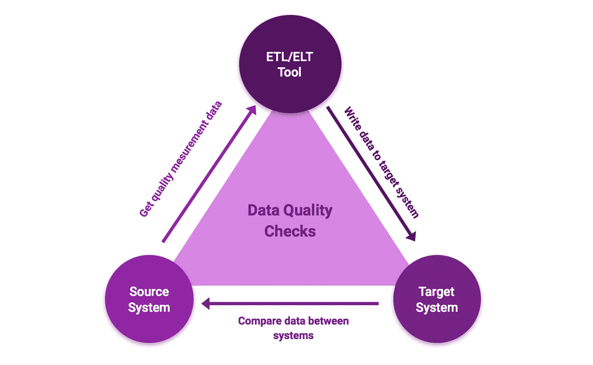
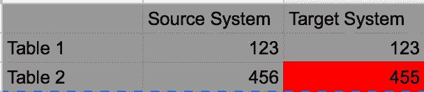
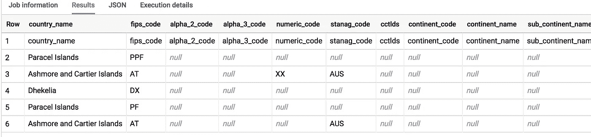

# 如何提高数据仓库的数据质量

> 原文：<https://towardsdatascience.com/data-warehouse-quality-matters-188d3ccd303?source=collection_archive---------43----------------------->

## Google 的 BigQuery 的演练示例


照片由[安德里亚斯·古尔霍恩](https://unsplash.com/@draufsicht?utm_source=unsplash&utm_medium=referral&utm_content=creditCopyText)在 [Unsplash](https://unsplash.com/s/photos/nature?utm_source=unsplash&utm_medium=referral&utm_content=creditCopyText) 拍摄

您可以在数据仓库流程中构建一些简单的数据质量检查，以检测由于 ETL/ELT 管道中的错误或连接失败而导致的数据不一致。衡量数据质量和快速检测错误总是一个好主意，否则会导致消费者缺乏信任。下面的文章将向您展示一些易于在源系统和目标系统之间进行数据一致性检查的方法——例如数据仓库或数据湖。



数据质量测量流程—作者提供的图片

## 通过计数行检查表格

检测源系统和目标系统之间偏差的一个非常简单的检查是计算两个系统中表的行数。当然，这种检查只有在源系统和目标系统中有相同的表结构时才有意义，这是通过 ELT 过程实现的。

*大查询中的行数示例:*

```
SELECT count(1) FROM `double-silo-282323.Test_Data.table_1` ;
SELECT count(1) FROM `double-silo-282323.Test_Data.table_2`
```

您可以在两个系统中手动完成这项工作，但是自动方法会更好——例如，通过 ETL 工具将计数结果从源系统带到您的数据仓库/Lake，并创建如下图所示的报告:



示例报告—按作者分类的图像

您还可以通过触发警报(例如使用云功能)并通过电子邮件发送给数据工程师来改善这种情况。

## 通过业务关键数字检查表格内容

要检查表的内容是否相同，除了计算行数之外，还需要其他技术。一个例子是关键数字的使用。您可以对某些行(如价格或金额)求和，并检查源系统表和目标系统表的总和是否相同。这里的挑战是找到好的关键人物。建议与业务部门合作。然而，您不需要太多的计算能力就可以实现这种检查，只需要 SQL 中一个简单的`SUM()`函数。

## 单一数据记录检查

要检查每一列和每一个值，可以使用下面的语句— `UNION ALL` of two `EXCEPT DISTINCT`:

```
(
  SELECT * FROM `double-silo-282323.Test_Data.table_1` 
  EXCEPT DISTINCT
  SELECT * from `double-silo-282323.Test_Data.table_2` 
)UNION ALL(
  SELECT * FROM `double-silo-282323.Test_Data.table_2` 
  EXCEPT DISTINCT
  SELECT * from `double-silo-282323.Test_Data.table_1` 
)
```

结果将是，所有在源或目标系统中不同或不存在的行都被显示出来。



查询结果示例-按作者排序的图像

这是上述方法中最有效的检测数据问题的方法，但也会耗费大量的计算能力和金钱。这是因为像 Big Query 这样的数据仓库技术会对每次查询和查询的数据量进行收费。这里的解决方案可以是每月从源系统的一个完整的表中获取数据，将其写入目标系统，并与数据仓库中的表进行比较。它将向您提供数据是否一致以及 ETL/ELT 过程是否 100%事务安全的信息。

## 确保数据一致性的其他可能性

您可以实现的其他可能性有:

*   监控您的 ETL/ELT 作业—例如，如果由于连接错误导致数据未能传输，您会收到警报。
*   构建如上所示的报告，并添加信息，如上次刷新数据时的信息。
*   如果您的数据复制过程失败，则实施归档/恢复系统。
*   使用 ELT 而不是 ETL——在紧急情况下或当您必须重新加载大量数据时(ELT 通常比 ETL 过程快得多)。
*   拥有一个处理用户数据质量投诉的流程或票证系统。
*   监控源系统，以便您知道何时出现技术困难。
*   构建您的 ETL/ELT 作业，以便它们能够处理停机时间并重试。

## **结论**

为了快速检测错误和故障，持续监控数据质量和数据传输非常重要。本文中提到了一些方法，但是由于技术设置和成本的原因，您必须找到适合您的过程的方法。但是请记住，数据质量是一个非常重要的话题。否则，您可能会缺乏用户和业务部门的信任。

## 进一步阅读

[](https://cloud.google.com/bigquery/docs/reference/standard-sql/query-syntax?hl=de) [## 标准 SQL | BigQuery | Google Cloud 中的 Abfragesyntax

### 建议使用一种或多种药片或药片，并在技术上加以改进。在…

cloud.google.com](https://cloud.google.com/bigquery/docs/reference/standard-sql/query-syntax?hl=de) [](https://alibaba-cloud.medium.com/data-quality-management-of-data-warehouses-based-on-maxcompute-2ca15c698bee) [## 基于 MaxCompute 的数据仓库数据质量管理

### 作者:海清

alibaba-cloud.medium.com](https://alibaba-cloud.medium.com/data-quality-management-of-data-warehouses-based-on-maxcompute-2ca15c698bee)