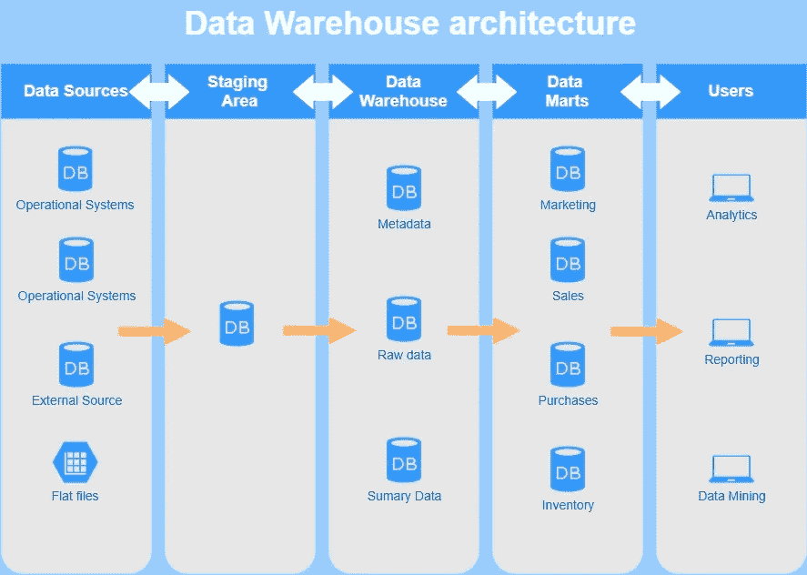
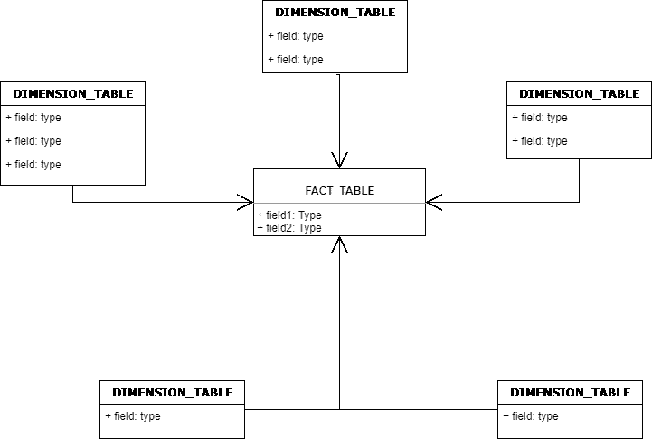
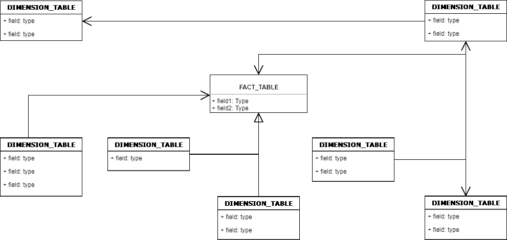
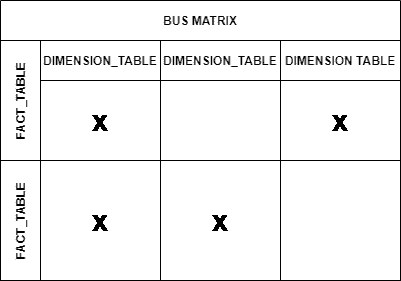

# 数据仓库:理论

> 原文：<https://towardsdatascience.com/data-warehouses-the-theory-2f0481eb5af8?source=collection_archive---------37----------------------->

## 构建数据仓库

由 [Unsplash](https://unsplash.com/s/photos/warehouse?utm_source=unsplash&utm_medium=referral&utm_content=creditCopyText) 上的 [chuttersnap](https://unsplash.com/@chuttersnap?utm_source=unsplash&utm_medium=referral&utm_content=creditCopyText) 拍摄

在数据领域，我们已经到了这样一个地步:跟上不同的技术以及使用和处理数据的不同步骤，就像是一项工作本身；将它们应用到实践中更是如此。有数据的收集，存储，清理，分析，数据的使用:这些步骤中的每一步都有人们可以使用的多种工具和编程语言，这些步骤中的每一步都有许多不同的方法来处理你的数据，在云或公司服务器上，旨在实现相同的目标。最近，我有机会接触数据仓库。

# 假人介绍

数据仓库(DWH)的一个简单定义是专用于数据分析和报告、维护数据历史的数据库。DWH 应用程序通常被称为 OLAP(在线分析处理)，但是它们并没有针对事务处理进行优化，事务处理是 OLTP 系统的领域。数据通常通过不同来源(如 OLTP 应用程序、外部数据提供者或大型机应用程序)的 ETL(提取转换加载)过程加载。用户可以读取数据，但不能写入；他们经常执行与时间相关的数据分析。

> 数据仓库通常被描述为不同数据源的集合，经过转换以便于查询和维护，适应业务需求以进行分析；商业智能环境的基础。

建设 DWH 的优势有很多，但其中一些最重要的优势是:

*   不同数据源的整合
*   轻松查询/访问数据
*   阶段步骤的历史记录
*   分析不同业务单位的数据

# 通用模式

与任何其他过程一样，有源头也有目的地。在数据仓库的情况下，数据源可以是任何东西，其思想是我们的目标是将许多不同的源放在一起，如平面 excel 文件或操作系统，将它们提供给仓库，从而准备好供最终用户分析。然而，在建立仓库的整个过程中有一些中间步骤。

作者图片

在数据源和仓库之间有一个中转区。临时区域的目的是作为数据源之间的桥梁，收集来自不同数据源的数据，复制它们并将其与一些系统数据一起存储。它们通常每天加载，但可以更频繁地加载。暂存数据也带来了一些好处:

*   **数据历史**:数据按时间存储，记录它们的历史
*   **隔离**:数据仓库与数据源分离

紧接着就是真正的仓库。仓库由一个维度模型组成。DWH 视野开阔，因为它拥有公司内所有不同单位的数据，因此是结构化数据的中心点。因此，在到达最终用户之前，还存在另一个可能的步骤:数据集市。

> 数据集市是 DWH 的一个子集，具有预处理的数据，面向业务部门进行分析。

数据集市的用途是分离不同单元的数据，减少需要考虑的数据量，使访问数据更容易，并将它们与其余单元隔离开来。然而，数据集市的存在是可选的。

无论有没有数据集市，经过处理和组织良好的数据都将用于其最初的目的:分析数据，试图找到有用的事实和见解，在这些数据的基础上构建报告，使提取的信息可视化，或者做更复杂的事情，如数据挖掘。

# 维度模型

数据仓库的数据模型称为维度模型。命名的原因来自于模型由维度和事实组成。

> 事实表是那些衡量业务绩效以及它如何随时间变化的表。

这些表包含两种类型的列:事实和维度表的外键/代理键。它可以包含*添加剂*、*半添加剂*和*非添加剂*计量类型，通常占 DWH 的 90%。它们可以有三种不同的类型:*事务性*、*周期性快照*和*累积快照*。事实表的例子是所有那些跟踪公司内定期(每日、每月、每季度等)活动的表，如员工的日常活动、销售、签票等。

> 维度表是为事实表提供基础的表，具有用于筛选记录、分组记录和标记报告的描述性属性。

相反，维度表为事实表提供了结构良好的信息，这也意味着它们的主要目的是提供数据的过滤、分组和标记。维度的例子有人员、人员的层次结构、产品、地点等。

设计维度模型的第一步是识别两种类型的表、它们的粒度以及它们之间存在的关系。建议这两个表都有代理键，并保持清晰的命名约定。设计这些表格时要考虑的一个重要方面是渐变维度(SCD)。这种表是那些记录随时间变化的属性的表。例如，在保存雇员职位的表格中，重要的是跟踪职位随时间的变化，以便知道每个职位的开始和结束日期。这些表有 6 种不同的类型，选择哪一种适合您的模型取决于稍后将对这些数据进行分析的业务需求。

虚拟星形模式示例—图片由作者提供

> 星型模式是数据模型中最基本和最有效的模式，其中事实表位于连接到维度的中心。

该模型还有另一个模式，称为雪花模式。

虚拟雪花示例—作者图片

> 雪花模式与星型模式非常相似，不同之处在于维度之间也是相互连接的。

星型模式是雪花型模式的一个特例。雪花模式只影响维度，事实表相对于星型模式不会改变:维度以规范化的形式保存，以减少冗余，这使它们易于维护并减少存储空间，但这也导致查询数据时所需的连接数量增加。

虚拟总线矩阵示例—图片由作者提供

当该说的都说了，该做的都做了，按照 Kimball 的建议以及几乎任何类型的文档都需要的，可以生成一个*总线矩阵，在这里我们再次显示表之间的关系，在这种情况下，强调事实和维度之间的区别。*

# *谨记在心*

*与数据世界中的任何其他事物一样，不存在适用于所有情况的金科玉律，因此无法给出非常具体的指导原则，它既取决于手头的数据，也取决于业务需求。因此，在考虑构建数据仓库时，需要考虑的是，在构建模型之前，大部分时间都花在了了解可用数据以及您/业务部门希望从这些数据中获得什么。通过这样做，你就能够想到一个模型，以及如何构建每个单独的表，以及如何将它们连接起来。然而，有两个重要方面需要记住:*

*   ****适应变化*** :在构建 DWH 时，可能会有来自业务方面的特定需求，但作为一名数据工程师，您必须考虑可能的发展和不同的未来场景，这将对编写模型时做出的决策产生影响。*
*   ****取决于业务审批***:DWH 或数据集市的最终用户也是提供需求的人。只有当模型满足其中涉及的业务单元的需求时，才认为模型是有效的。*

****来源*** :*

*   *罗斯·金博尔:《数据仓库工具包》*
*   *O'Riley 学习:敏捷数据仓库设计*