# 程式化的事实

> 原文：<https://towardsdatascience.com/data-whispering-eebb77a422da?source=collection_archive---------38----------------------->

## 📈Python for finance 系列

## 统计预测未来需要什么？


在[公共领域专用许可](https://creativecommons.org/licenses/publicdomain/)下[戴夫·甘迪](http://skuawk.com/)的照片

**警告** : *这里没有神奇的公式或圣杯，尽管一个新的世界可能会为你打开大门。*

## 📈Python For Finance 系列

1.  [识别异常值](https://medium.com/python-in-plain-english/identifying-outliers-part-one-c0a31d9faefa)
2.  [识别异常值—第二部分](https://medium.com/better-programming/identifying-outliers-part-two-4c00b2523362)
3.  [识别异常值—第三部分](https://medium.com/swlh/identifying-outliers-part-three-257b09f5940b)
4.  [程式化的事实](/data-whispering-eebb77a422da)
5.  [特征工程&特征选择](https://medium.com/@kegui/feature-engineering-feature-selection-8c1d57af18d2)
6.  [数据转换](/data-transformation-e7b3b4268151)
7.  [细微差别特征](https://medium.com/swlh/fractionally-differentiated-features-9c1947ed2b55)
8.  [数据标签](/the-triple-barrier-method-251268419dcd)
9.  [元标签和堆叠](/meta-labeling-and-stacking-f17a7f9804ec)

我们总说“让数据自己说话”。但是数据要么大声呼喊，要么低声耳语。一些数据属性很容易发现，而另一些则不那么明显，被淹没在噪声中。就像耳边的低语，你必须努力去理解他们在说什么。一旦你从数据中揭示了隐藏的信息，在某些情况下，你可能有机会通过在当前可用的数据中寻找你认为将持续到未来的统计模式来预测未来。换句话说，找出一种方法，让未来看起来更像现在，只是时间更长。本文的目的是向您展示如何从通常不被注意但很有用的数据中获取这些属性。

在我们开始之前，让我们花一分钟思考一个简单的问题:我们可以从一组随机生成的数据中获取多少信息。大多数人可能会给出一个很长的列表，比如最大值、最小值、平均值、众数、中位数、方差、标准差、范围、*等等。*。人脑能进行抽象思维，其他动物做不到。这些就是统计有用的原因，因为它可以将数据转换成对人们有意义的信息。更重要的是，推断出的信息可以用来推断一些经验发现，即金融中所谓的**程式化的经验事实**。

本文末尾引用的程式化事实的定义是:

> “资产价格看似随机的变化确实有一些非常重要的统计特性。这种在各种工具、市场和时间段中普遍存在的特性被称为**程式化的经验事实**

用简单的语言来说，就是说如果你想用过去的数据来预测未来，未来的数据必须和过去的数据有共同点。否则，一切都没有意义。所以，这些数据中过去和未来的常见模式被称为**程式化事实**。金融资产中有一系列广泛的**程式化事实**，在参考资料中也有解释。

随着**程式化事实**的出现，另一个概念出现了，静止。对于时间序列数据，平稳时间序列的统计特性如均值、方差、自相关等。都是不变的。大多数统计预测方法都是基于这样的假设，即通过使用数学变换可以使时间序列近似平稳。然后，通过反转先前使用的任何数学变换，可以“不变换”平稳化序列的预测，以获得原始序列的预测。

好了，关于“**程式化的事实”**和**“固定的**”已经说得够多了，让我们做一些编码来说明这两个概念。

# 1.数据准备

为了保持一致，在所有的[📈Python for finance 系列](https://medium.com/swlh/identifying-outliers-part-three-257b09f5940b)，我会尽量重用相同的数据。关于数据准备的更多细节可以在[这里](https://medium.com/python-in-plain-english/identifying-outliers-part-one-c0a31d9faefa)，在[这里](https://medium.com/@kegui/identifying-outliers-part-two-4c00b2523362)，在[这里](https://medium.com/swlh/identifying-outliers-part-three-257b09f5940b)找到。

```
*#import all the libraries*
import pandas as pd
import numpy as np
import seaborn as sns 
import scipy.stats as scsimport yfinance as yf  *#the stock data from Yahoo Finance*import matplotlib.pyplot as plt #set the parameters for plotting
plt.style.use('seaborn')
plt.rcParams['figure.dpi'] = 300df = yf.download('AAPL',
                 start = '2000-01-01',
                 end= '2010-12-31') #download Apple stock priced1 = pd.DataFrame(df['Adj Close'])#create a df with only stock price
d1.rename(columns={'Adj Close':'adj_close'}, inplace=True)
d1['simple_rtn']=d1.adj_close.pct_change()#percentage return
d1['log_rtn'] = np.log(d1.adj_close/d1.adj_close.shift(1))
#log return with 1 day lagd1.head()
```

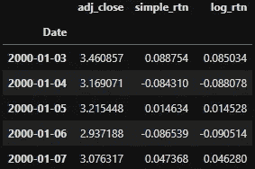

我想争论的另一件事是去除异常值，我使用简单的平均值和 2 倍的标准差来设定边界。

```
*#get mean and std*
mu = d1.describe().loc['mean', 'log_rtn']
sigma = d1.describe().loc['std', 'log_rtn']condition = (d1['log_rtn'] > mu + sigma * 2) | (d1['log_rtn'] < mu - sigma * 2) #set the condition to be 2 times of std around mean
d1['outliers'] = np.where(condition, 1, 0)#like an if, else 
d1.head()
```

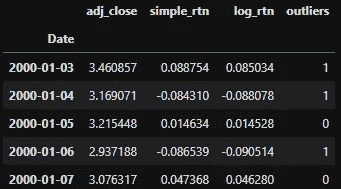

然后，我去除所有的异常值。

```
*#using pd's bool selection to remove outliers*
d1_removed_outliers = d1.loc[d1['outliers'] == 0].iloc[:, :-1]
d1_removed_outliers.head()
```

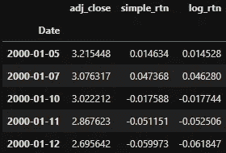

```
d1_removed_outliers.info()
```

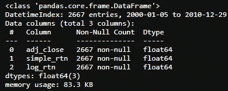

如你所见，2765 个数据点中还剩 2667 个数据点。为了方便起见，让我们再次使用 d1 作为数据帧名称。

```
d1 = d1_removed_outliers
```

同样，如何去除异常值的所有细节都可以在[这里](https://medium.com/python-in-plain-english/identifying-outliers-part-one-c0a31d9faefa)、[这里](https://medium.com/@kegui/identifying-outliers-part-two-4c00b2523362)和[这里](https://medium.com/swlh/identifying-outliers-part-three-257b09f5940b)找到。

对数回报和简单百分比回报之间的差异可以在[这里](https://people.duke.edu/~rnau/411log.htm)找到。简而言之，变量自然对数的微小变化可以直接解释为百分比变化。换句话说，只要变化足够小(在+/- 5%的范围内)，百分比变化和自然对数变化几乎完全相同。事实上，如上表所示，`simple_rtn`和`log_rtn`中的数字非常接近。

我们可以检查 simple_rtn 和 log_rtn 的相关性，

```
#calculate the pearson correlation
d1[['simple_rtn', 'log_rtn']].corr()
```

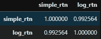

这两种回报高度相关。从热图中甚至可以清楚地看出:

```
#draw heatmap with seaborne
cmap = sns.diverging_palette(220, 20, as_cmap=True)
ax = sns.heatmap(corr, annot=True, cmap=cmap,
                 square=True, linewidths=3,
                 linecolor='w')
ax.set_title('Autocorrelation Plots', fontsize=26)
sns.set(font_scale=2);
```

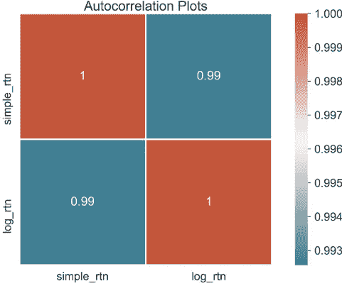

关于熊猫的一个好处是，很容易直接得到那些描述性的统计数据。

```
d1.describe().round(4)
```

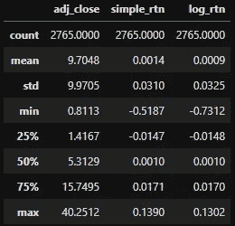

# 2.收益的正态(高斯)分布

讨论最多的**程式化事实之一**是收益的正态(高斯)分布。大量重要的金融模型都是建立在股票收益是正态分布的假设上，而你在本文结尾会看到，可能并不是这样。因此，正态分布可以被认为是金融中最重要的分布之一，也是许多金融理论的主要统计构件之一。

我们来看看调整后价格、百分比回报、自然对数回报的正态性。首先，我们定义一个函数来从`d1.describe()`中提取描述性统计数据

```
*#extract all the stats from describe() function*
def extract_data_stats(col):
    d_stat = col.describe()
    mu = d_stat['mean']
    sigma = d_stat['std']
    rtn_range = np.linspace(d_stat['min'], d_stat['max'], num=1000)
    norm_pdf = scs.norm.pdf(rtn_range, loc=mu, scale=sigma)

    return mu, sigma, rtn_range, norm_pdf
```

准备好平均值、标准差和正态概率密度函数(PDF)后，我们可以绘制直方图和 PDF。

```
#*draw the histogram with Probability Density Function*
def draw_hist(col, xlim=(-0.2, 0.2)):
    mu, sigma, rtn_range, norm_pdf = extract_data_stats(col) sns.distplot(col, kde=True, norm_hist=True, label='Hist')   
    plt.plot(rtn_range, norm_pdf, 'r', lw=3, 
             label=f'N({mu:.3f}, {sigma**2:.4f})')
    plt.axvline(x=0, c='c',linestyle='--', lw=3)
    plt.title(f'Distribution of {col.name}', fontsize=24)
    plt.xlim(xlim)
    plt.legend(loc='upper right', fontsize=20, 
               frameon=True,fancybox=True, 
               framealpha=1, shadow=True, borderpad=1);
```

百分比回报的直方图和 PDF。

```
draw_hist(d1.simple_rtn)
```

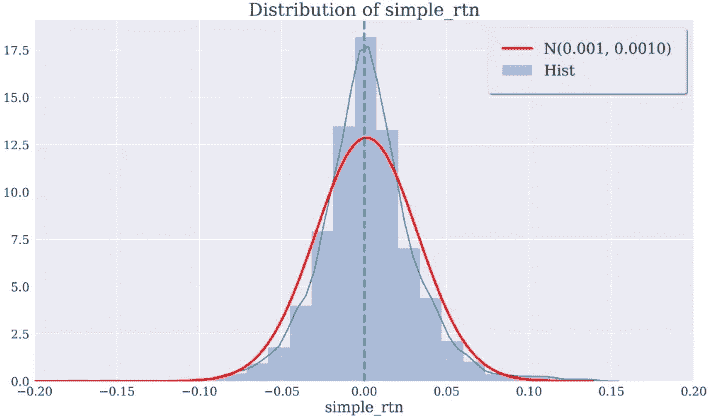

自然对数收益率的直方图和 PDF。

```
draw_hist(d1.log_rtn)
```

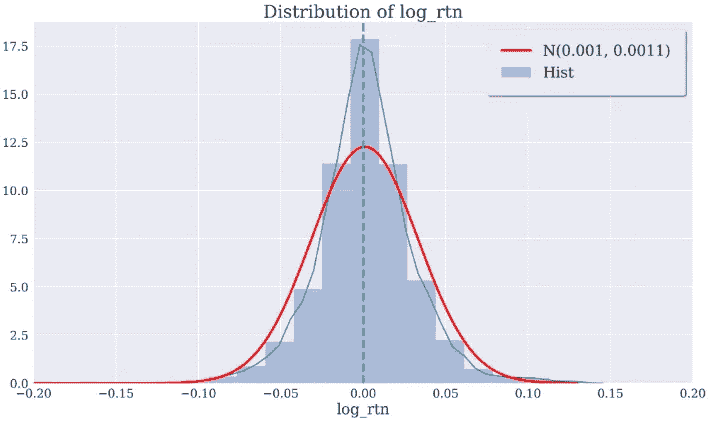

调整后价格的直方图和 PDF。

```
draw_hist(d1.adj_close,xlim=(-10,50))
```

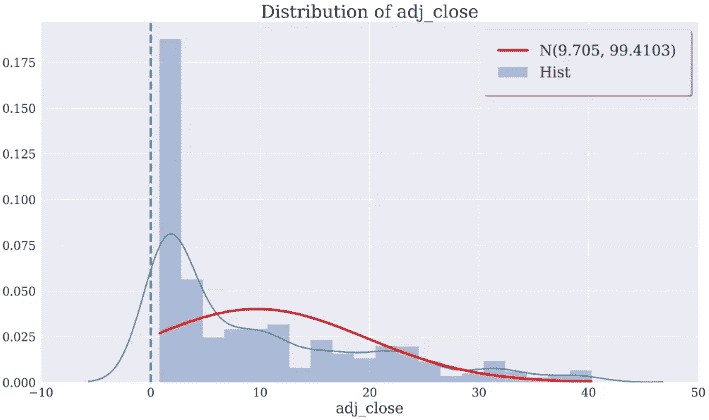

显然，股票价格有趋势或周期，这使其远离正态分布。然而，对数回报率和百分比回报率非常相似，接近正常水平。但是常态能被检验吗？

## ✍Tip！

*以防你的图看起来不一样，这里是我使用的* `*matplotlib*` *参数:*

```
plt.rcParams['figure.figsize'] = [16, 9]
plt.rcParams['figure.dpi'] = 300
plt.rcParams['font.size'] = 20
plt.rcParams['axes.labelsize'] = 20
plt.rcParams['axes.titlesize'] = 24
plt.rcParams['xtick.labelsize'] = 16
plt.rcParams['ytick.labelsize'] = 16
plt.rcParams['font.family'] = 'serif'
```

关于`matplotlib`的更多信息，请访问[👉Python 中关于绘图的一切](https://medium.com/python-in-plain-english/everything-about-plotting-in-python-c12ccdc359bc)。

# 3.综合高斯性

有一个**程式化的事实**来自与常态相关的文章末尾的引用，它说:

> "4.随着计算收益的时间尺度的增加，它们的分布看起来越来越像正态分布。特别是，在不同的时间尺度上，分布的形状并不相同。”

让我们看看这是否站得住脚。我们创建了一个新的数据框架来保存所有滞后的股票价格回报。

```
#*get 5 days lagged return by a for loop*
df_simple_rtn = pd.DataFrame(d1['adj_close'])
lags = 5for lag in range(1, lags+1):
    col = f'lag_{lag}_simple_rtn'
    df_simple_rtn[col] = df_simple_rtn['adj_close']. \
                         pct_change(periods=lag)

df_simple_rtn.dropna(inplace=True)
df_simple_rtn.head()
```

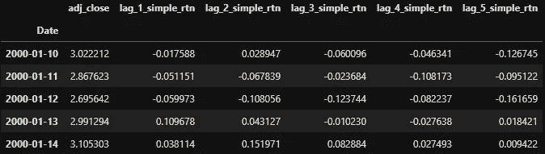

```
#*get 5 days lagged return by a for loop*
df_log_rtn = pd.DataFrame(d1['adj_close'])
lags = 5for lag in range(1, lags+1):
    col = f'lag_{lag}_log_rtn'
    df_log_rtn[col] = np.log(df_log_rtn['adj_close']/\
    df_log_rtn['adj_close'].shift(lag))

df_log_rtn.dropna(inplace=True)
df_log_rtn.head()
```

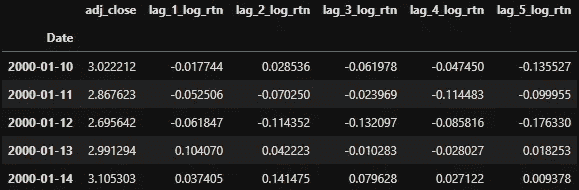

我们可以通过修改前面的函数`draw_hist()`来绘制直方图和 PDF，赋予它一次绘制多个图的额外能力。

```
#using ax to draw multi-grahps
def draw_hist_multi(col, xlim=(-0.2, 0.2), ax=None):
    mu, sigma, rtn_range, norm_pdf = extract_data_stats(col) sns.distplot(col, kde=True, norm_hist=True, \
                 label='Hist', ax=ax)   
    ax.plot(rtn_range, norm_pdf, 'r', lw=3, \
            label=f'N({mu:.3f}, {sigma**2:.4f})')
    ax.axvline(x=0, c='c',linestyle='--', lw=3)
  #*adj_close x axis range is wider* 
    if ( col.name == 'adj_close'):
        ax.set_xlim(-10,50)
    else:
        ax.set_xlim(xlim)
    ax.legend(loc='upper right', fontsize=8, 
              frameon=True,fancybox=True);
```

你可能注意到了，我用`ax`而不是`plt`来画这些图，原因在[中有很好的解释👉 ***用 Python***](https://medium.com/python-in-plain-english/everything-about-plotting-in-python-c12ccdc359bc) 谋划一切。

现在我们可以把所有的情节放在一个有 2×3 个支线情节的单一图形中。

```
#*create subplots figure with each plot drawed by draw_hist_multi()* 
def draw_hist_subplots(df):
    fig, axs = plt.subplots(nrows=2, ncols=3, figsize=(16,9))
    fig.subplots_adjust(hspace = .5) #wspace=.001
    fig.suptitle('Distribution of returns with increased \
                 time scale', fontsize=24)

    axs = axs.ravel()
    for i, col in enumerate(df.columns):
        draw_hist_multi(df[col], ax=axs[i])
```

在一个循环中绘制多个支线剧情的关键是使用`axs = axs.ravel()`，通过展平支线剧情矩阵，我们可以逐个遍历所有支线剧情。

```
draw_hist_subplots(df_simple_rtn)
```

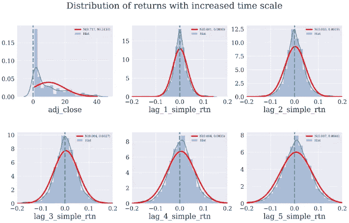

在自然对数回报方面，和预期的一样，没有明显的区别。

```
draw_hist_subplots(df_log_rtn)
```

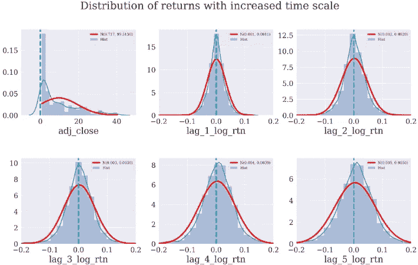

从滞后对数和百分比回报来看，的确，随着计算回报的时间尺度的增加，它们的分布看起来越来越像正态分布。特别是，在不同的时间尺度上，分布的形状并不相同。

# 4.正规性检验

从上面的图表来看，尽管趋势很明显，但实际上很难判断常态。通过利用`scipy.stats`包，我们可以用描述性统计进行更严格的正态性检验。

在我们开始做正态性检验之前，我们需要知道两个概念。在统计学中，偏斜度是概率分布中对称钟形曲线的扭曲程度。而峰度是测量分布的峰值和平坦度。回报分布的高峰值和偏斜度意味着投资者将偶尔经历极端回报(正或负)。

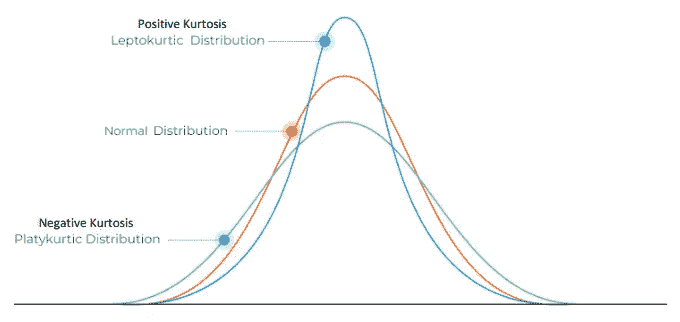

**正负峰度**

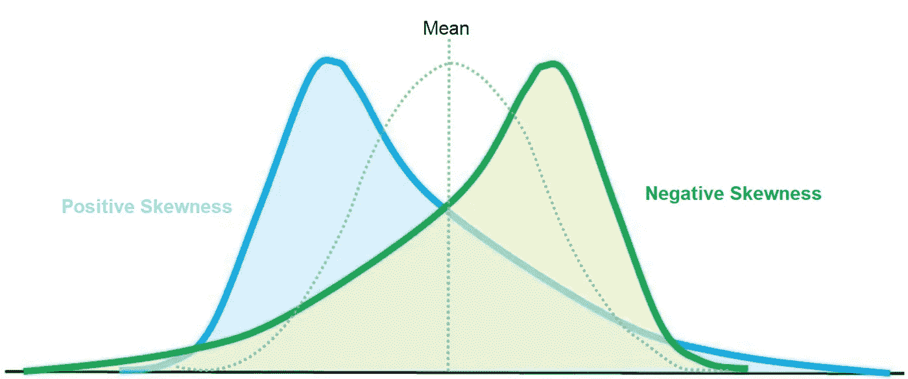

**正负偏斜度**

对于正态分布的数据，偏斜度应该大约为零。
大于零的偏度值意味着分布的右尾有更多的权重，*反之亦然*。

```
#*using DataFrame to contain all the stats*
def build_stats(df):
    stats = pd.DataFrame({'skew':scs.skew(df),
                 'skew_test':scs.skewtest(df)[1],
                 'kurtosis': scs.kurtosis(df),
                 'kurtosis_test' : scs.kurtosistest(df)[1],
                 'normal_test' : scs.normaltest(df)[1]},
                  index = df.columns)
    return stats
```

对于百分比回报

```
build_stats(df_simple_rtn)
```

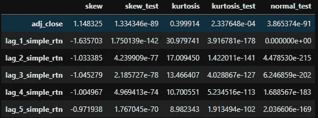

对于日志返回

```
build_stats(df_log_rtn)
```

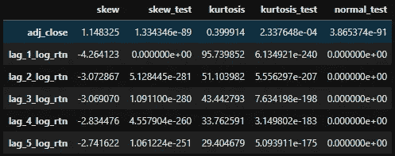

所有的*p*-值都远低于 0.05，接近于零。具有统计显著性的测试结果(*p*-值≤ 0.05)意味着测试假设是错误的或者应该被拒绝。一个*p*-值大于 0.05 意味着没有观察到影响。当*p*-值为零时，我们必须拒绝零假设，即样本数据的返回具有与高斯分布相匹配的偏斜度和峰度。

我注意到的一件事是，对数收益的偏斜度和峰度的绝对值实际上比百分比收益的要大。剔除异常值后，均值变大，标准差变小，偏度和峰度没有变化。

# 5.互相关和自相关

在这篇文章结束之前，我想快速浏览一下滞后回报的相关性，如下面的参考文献中所述。

> "1.缺乏自相关性:(线性)资产回报的自相关性通常是不明显的，除了非常小的日内时间范围(20 分钟)之外，微观结构效应在这种时间范围内发挥作用。”

就相关性而言，有 3 种不同的类型，互相关、自相关和循环相关。

百分比回报的交叉相关性为

```
corr_s = df_simple_rtn.corr()
corr_s
```

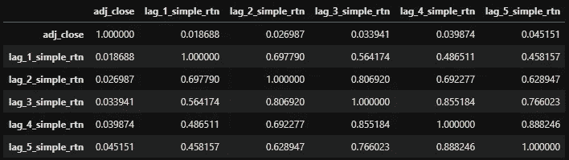

和日志返回的相关性

```
corr_l = df_log_rtn.corr()
corr_l
```

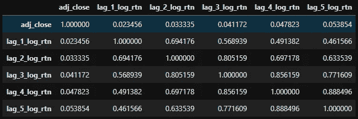

百分比回报和对数回报的互相关性都随时间而下降。如热图所示。

```
#*using seaborne to draw heatmap*
sns.set(style="white")
cmap = sns.diverging_palette(220, 20, as_cmap=True)
ax = sns.heatmap(corr_s, annot=True, cmap=cmap,
                 square=True, linewidths=3,
                 linecolor='w')
ax.set_title('Correlation Plots', fontsize=32)
ax.set_xticklabels(
    ax.get_xticklabels(),
    rotation=45,
    horizontalalignment='right');
```

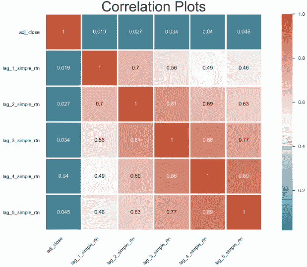

```
#*using seaborne to draw heatmap*
sns.set(style="white")
cmap = sns.diverging_palette(220, 20, as_cmap=True)
ax = sns.heatmap(corr_l, annot=True, cmap=cmap,
                 square=True, linewidths=3,
                 linecolor='w')
ax.set_title('Correlation Plots', fontsize=32)
ax.set_xticklabels(
    ax.get_xticklabels(),
    rotation=45,
    horizontalalignment='right');
```

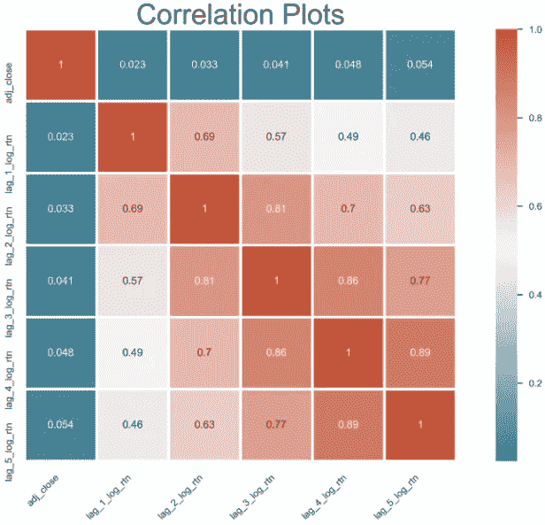

一天滞后(之前或之后)的回报的大多数相关性是相关的，因为它们的系数超过 0.8。但是这种相关性很快就消失了。

我仍然很难完全理解自相关性，尽管绘制自相关性很容易。

```
#*draw autocorrelation for log return with 50 days time lag*
from statsmodels.graphics.tsaplots import plot_acf
fig, ax = plt.subplots()
acf = plot_acf(d1.log_rtn, lags=50, ax=ax) 
ax.set_xlabel('lags')                          
ax.set_ylabel('auto-correlation');
```

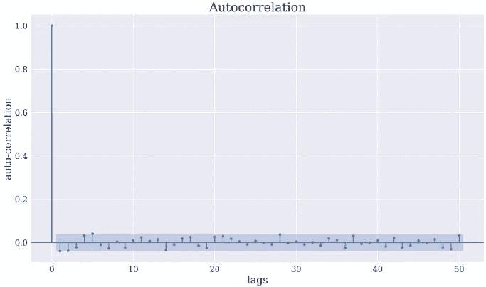

如果你能解释一下自相关、互相关和部分自相关，并在下面留下你的评论，我将不胜感激，谢谢。

现在有一个很大的问题，如何把你的回报转移到一个正态分布？敬请关注更多，即将推出！

# 参考

1.  资产回报的经验属性:程式化的事实和统计问题。量化金融 2001，1 (2)，223–236。