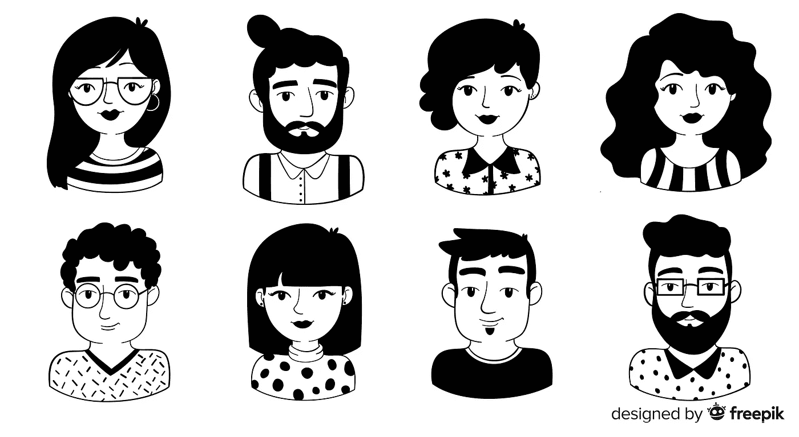
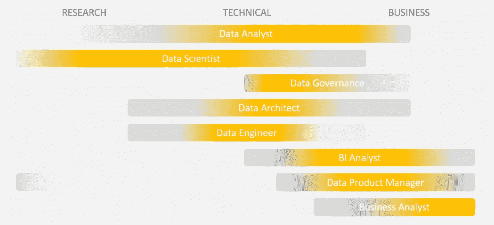

# 谁的数据？

> 原文：<https://towardsdatascience.com/data-who-316f870add7b?source=collection_archive---------38----------------------->

## 数据专业关键职位—解释

一个古老而美好的东西..
一个*数据分析师*和一个*数据科学家*有什么区别？一个 *BI 分析师*和一个*业务分析师*？一个*数据架构师*和一个*数据工程师*？

不，没有笑点。

数据职业和职位在过去几年中发生了巨大的变化，新的职位出现了，旧的定义不再适用，很难定义您合适的头衔，在招聘时更难找到满足您需求的角色。

几年前，当我试图为我的团队招聘一名初级数据分析师时，我创建了下面的数据职位字典。虽然没有满，但随着新职位的不断出现，它有望帮助你们中的一些人在组建团队或根据市场衡量自己和规划自己的技能时安排自己的思路。

准备好了吗？

**数据分析师** *学者，数据艺术家*

使用各种工具，如预测模型、统计算法和数据挖掘来解决数据相关问题。
通常采用个案定制的方法，利用分析结果指导大范围的运营。喜欢原始数据，知道什么时候深入研究，什么时候建模，拥有(或将为您提供)所有答案。具有技术头脑和积极实践方法的角色。

*最喜欢的任务:应用数据模型获得洞察力*

**数据科学家** *革新者，新时代大师*

问题解决者。研究问题的已知和未知的潜在解决方案，考虑业务需求来源的生态系统和手头的可用数据来权衡它们，以选择首选解决方案并将其从研究转化为产品。

*最喜欢的任务:尝试应用新的研究作为商业问题的解决方案*

**数据工程师** *足智多谋的数据管道工*

铺平道路，构建可扩展、可维护且稳定的管道，整个组织的数据流通过这些管道进行分析。
平衡专业工程与实验数据应用需求。

*最喜欢的任务:将新数据流集成到组织数据管道中*

**数据架构师** *数据流的导体*

创建和维护跨组织的数据存储和消费标准。将数据计划与技术框架和业务目标结合起来，确定战略举措和优化机会。组织数据攀登架的设计者。

*最喜欢的任务:设计新数据流的消费*

**BI 分析师** *密码学家，将数据转化为见解*

基于现有数据产生可操作的见解，以引导和支持组织内的决策制定。两者都通过分析数据了解过去和评估现在来维持和改变业务。具有强烈商业视角的报道专家。

*最喜欢的任务:为商业利益相关者提供可行的见解*

**业务分析师**(营销、产品、系统、财务..)
*数据作者和说书人*

精通数据的商业专家。与 BI 分析师相比，不太担心收集数据，更关注业务角度。这位分析师是她所在领域的专家，完全致力于用数据支持定义的业务目标(尽管分析不一定是定量的)，同时始终牢记组织的效率和盈利能力。

*最喜欢的任务:通过收集相关数据研究业务问题，做出清晰简单的决策*

**数据治理分析师** *组织数据的把关人*

监控跨系统和来源的组织数据。分析数据差异、可用性和一致性等问题，以提高对数据的信心。以质量为导向，控制数据流。

*最喜欢的任务:分析不规则的生产测量以发现根本原因*

**数据产品经理** *面向业务的数据梦想家*

确定在公司产品中使用数据的需求和潜在优势。定义可交付的数据，这些数据可以是现有产品的一部分，也可以是供消费者(内部或外部)使用的独立数据产品。数据驱动产品的战略家和远见者，塑造了数据专业人员的运营框架。

最喜欢的任务:为业务问题定义一个数据解决方案

一般来说，所有数据专业人员的技能可以映射到 3 个主要领域，每个领域的熟练程度不同；

1.  研究
    *包括理论数据科学应用、统计学方面的大量知识，并要求与最近的学术界和行业发展保持同步*
2.  技术
    *控制各种工具，实现数据操作、分析、构建数据管道和处理大数据量*
3.  业务
    *深入了解和熟悉公司所处的市场，包括竞争对手、客户、产品以及公司的战略*

将如上所述的不同职位映射到这些技能领域，如下所示:

一系列有明确重点的技能

不是所有公司的所有数据组都会包括以上所有职位，当然也不是作为单个团队成员。在小公司中，由几个利益相关者负责整个端到端的范围是很常见的。然而，这是我给你的建议——你为这个职位选择角色的方式将极大地影响你的预期产出，所以要明智地选择。

例如，数据科学家和数据工程师的职责有时可以统一在同一个人之下。然而，你应该明智地考虑你真正需要的是什么；有工程能力的数据科学家还是有数据科学取向的工程师？

类似地，当定义你是哪种类型的分析师时，考虑这些:你更关注数据还是业务用例？你是现场专家还是精通事实的记者？

我确信我的定义并不完全符合你认识的每一个专业人士，甚至可能不符合你对自己的定义。

然而，我希望它仍然有助于您了解我们工作的数据职业生态系统，并提出一些要点供您下次招聘/学习新技能/重新定位职业等时考虑。