# Python 中的数据争论和监督学习

> 原文：<https://towardsdatascience.com/data-wrangling-and-supervised-learning-in-python-predicting-ebola-outbreaks-in-sierra-leone-325657f7fa2e?source=collection_archive---------47----------------------->

## **预测塞拉利昂的埃博拉疫情**

***这篇文章是由*** [***尼古拉斯·迪亚兹***](https://www.linkedin.com/in/nicol%C3%A1s-d%C3%ADaz-amigo-3602ab121/) ***、MPP’20 在哈佛肯尼迪学院的一个项目基础上加上*** [***杨子倪***](https://www.linkedin.com/in/tzeniyeoh/)[***阿卜杜拉·赛义夫*****](https://www.linkedin.com/in/abdulla-saif-51072119a/)

**在这里* *有一个 GitHub，里面有这个项目的 Jupyter 笔记本。**

*监督学习是世界上使用最广泛的机器学习形式之一。本文将指导您完成构建模型所需的一些最基本的步骤:导入数据、查看数据、以一致的格式输入数据、使用数据样本来训练和测试算法以及优化算法参数。*

*代码用 Python 显示，Python 是一种通用的编程语言。*

*我们选择的挑战是预测 2014-2016 年塞拉利昂爆发期间埃博拉在各地区的传播。*

# ***问题动机和目标***

*西非埃博拉病毒疫情(2014 年至 2016 年)造成 11 325 人死亡和重大社会经济破坏，其中大多数死亡发生在沿海国家塞拉利昂。在疫情期间，国家当局有足够的资源来隔离和治疗所有报告的病例，并阻止病毒的进一步传播。然而，事件总数的意外地方差异造成某些地区的应对能力不足(《世卫组织情况报告》，2014 年)。*

*在当前和未来的埃博拉紧急情况下，需要一个补充工具来指导跨地区的资源分配和提高应对效力。*

# ***数据清理***

## ***导入适当的库***

*首先，我们`import` 将在整个项目中使用的库。`Pandas` 是 Python 中主要的数据帧操作库，`Sklearn` 是运行机器学习模型的直观方式。对于`Pandas`，我们将使用`set_option` 更改默认设置，以获得更舒适的大桌子显示。*

```
*import pandas as pd
import numpy as np
import matplotlib.pyplot as pltpd.set_option('display.max_rows', 500)
pd.set_option('display.max_columns', 500)
pd.set_option('display.width', 1000from sklearn.metrics import mean_squared_error,median_absolute_error,r2_score,mean_absolute_error, accuracy_score, roc_curve, roc_auc_score, confusion_matrixfrom sklearn.model_selection import train_test_split, cross_val_score, GridSearchCVfrom sklearn.feature_selection import SelectKBest, chi2, f_classif
from sklearn.pipeline import Pipelinefrom sklearn.ensemble import RandomForestRegressor*
```

## *检查和理解数据*

*一旦我们导入了库，我们就用 Pandas 的`read_csv()`方法加载数据。许多有用的方法允许快速检查数据帧:`shape`、`head()`、 `tail()`和`info`。*

```
*df = pd.read_csv('sl_ebola.csv')
df.shape*
```

**

```
*df.head(14)*
```

*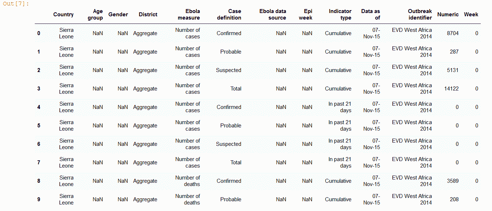*

```
*df.tail()*
```

*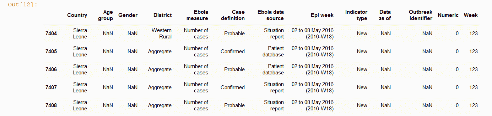*

```
*df.info*
```

*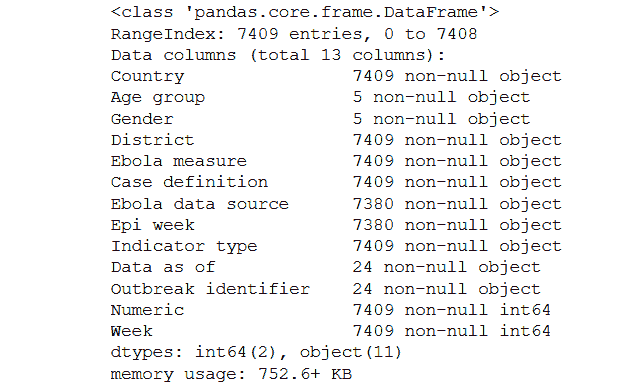*

*看着上面的变量，我们有兴趣更深入地挖掘一些列。将`value_counts()`应用到特定的列将返回每个类有多少个实例。*

```
*print(df.Country.value_counts(), '\n')
print(df.District.value_counts(), '\n')
print(df['Ebola measure'].value_counts(), '\n')*
```

**

*我们可以确认我们所有的行都来自塞拉利昂，并且所有地区都有相同数量的实例，这是我们所期望的。*

## *删除因缺少值或不相关而无用的列*

*现在，前面的`info` 方法揭示了我们的一些列包含了大部分缺失的值。我们可以通过在我们的数据框架中使用`drop()`方法来消除这些。`inplace` 设置为`True` 意味着它将修改我们的起始数据帧，我们不必重新定义它。我们可以使用`head()`方法来查看一切是否正常。*

```
*df.drop(columns=['Age group', 'Gender', 'Data as of', 'Outbreak identifier', 'Country', 'Indicator type'], inplace = True)df.head()*
```

*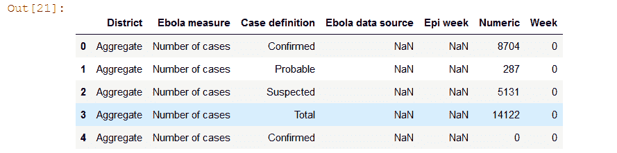*

## *删除不相关的无用行*

*我们还需要删除不会用于我们分析的行(例如，当它们是一个聚合时)。我们可以通过使用条件选择(`!=`表示不同于)并将其保存到一个新的 dataframe 名称`df2`来实现。我们在这一点上重新定义了数据帧，因为这样我们就不必在出错时从头开始。*

```
*df2 = df[df.District != 'Aggregate']*
```

## *使用数据透视表操作重塑我们的数据框架*

*我们目前构建数据的方式还不能用于分析。现在，每个地区、每个星期、两个数据源中的每一个以及两个病例定义(确诊和可能)中的每一个都有单独的行。*

*为了运行我们的模型，我们希望确保每一行都代表每个地区每周的数字。我们可以通过结合`pivot_tables` 和一些快速的数据帧操作来实现。*

```
*df3 = pd.pivot_table(df2, values=['Numeric'], index=['District', 'Epi week', 'Ebola data source'], columns=['Case definition'], aggfunc=np.sum)df3.head()*
```

*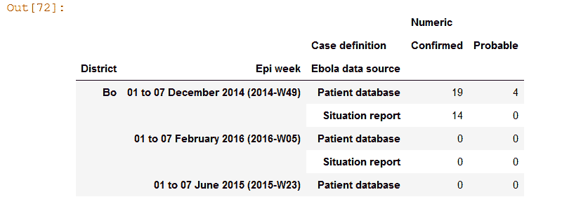*

```
*df4 = pd.DataFrame(df3.to_records())df4.rename({'(\'Numeric\', \'Confirmed\')' :  'Confirmed_cases', '(\'Numeric\', \'Probable\')' :  'Probable_cases', }, axis = 1, inplace = True)df4.head(10)*
```

*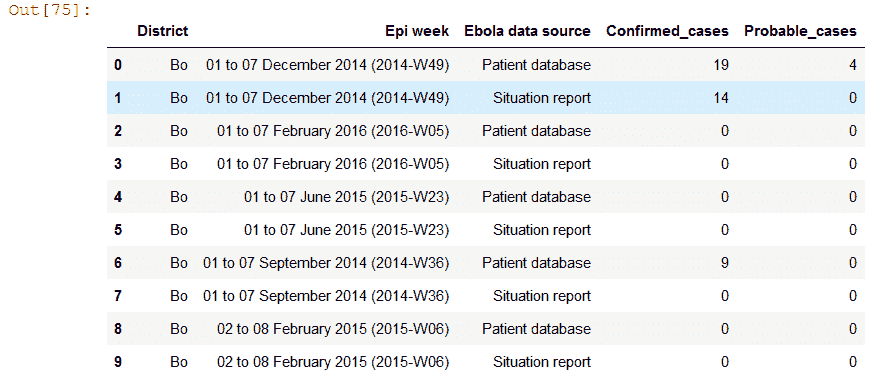*

```
*df5 = pd.pivot_table(df4, values=['Confirmed_cases', 'Probable_cases'], index=['District', 'Epi week'], columns=['Ebola data source'], aggfunc=np.sum)df6 = pd.DataFrame(df5.to_records())df6.rename({'(\'Confirmed_cases\', \'Patient database\')' :  'patient_database_confirmed', '(\'Confirmed_cases\', \'Situation report\')' :  'situation_report_confirmed', '(\'Probable_cases\', \'Patient database\')' :  'patient_database_probable', '(\'Probable_cases\', \'Situation report\')' :  'situation_report_probable', }, axis = 1, inplace = True)df6.head()*
```

*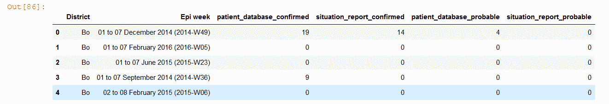*

*瞧啊。这就是我们想要的。*

*让我们看看折叠所有信息后，我们有多少行。*

```
*df6.shape*
```

*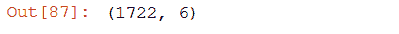*

## *导出到 CSV*

*此时，我们应该导出我们的结果，并在 dataframe 中使用`to_csv()`方法给它们命名。通过这种方式，我们可以与他人共享我们重新调整的表格。*

```
*df6.to_csv('sl_ebola_pivoted.csv')*
```

# *数据连接和特征工程*

*我们在这里没有显示代码，但下一步是将确认的埃博拉病例数据集与世界卫生组织和世界银行提供的许多不同的人口统计指标相结合。*

*我们还根据地理界限(哪个地区与哪个地区接壤)并通过在边界和报告病例之间建立“互动”创造了新的特征(或变量)。例如，最近几周在邻近的州有多少病例。*

# ***运行机器学习模型进行回归***

## *探索回归的代码*

*我们现在准备开始构建我们的机器学习模型。此时，启动一个新的 Jupyter 笔记本并导入数据是一个好主意。*

```
*df = pd.read_csv('ebola3.csv', index_col=0)
df.head(2)*
```

*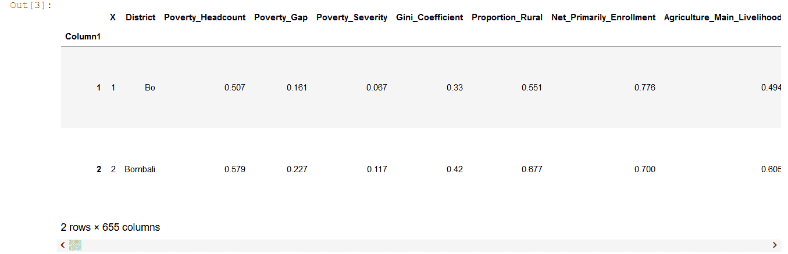*

## *坚持*

*接下来，为了测试我们的模型的预测性，我们将“抽出”几个星期，这样我们的模型就不会在这些星期中进行训练。最后，我们将比较我们的模型对这三周的预测和实际发生的情况。这被称为“维持验证”,是一种确保我们不只是过度拟合的方法——也就是说，我们的模型基本上是在“记忆”数据集。*

*我们的三周是爆发的开始、顶点和结束。*

```
*selected_weeks = ['2014-09-06', '2014-10-27','2014-12-29']
df_holdout = df[df.Datetime.isin(selected_weeks)]
df2 = df[~df.Datetime.isin(selected_weeks)]print(df.shape)
print(df_holdout.shape)
print(df2.shape)*
```

*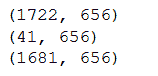*

## *丢弃无关变量*

*我们将做更多的列删除，然后我们将分割我们的`X`(预测值)和`y`(目标变量)。出于本练习的目的，我们将重点关注来自“情况报告”来源的确诊病例。*

```
*df2.drop(columns = ['X', 'District', 'patient_database_confirmed', 'Year', 'Week', 'Day', ‘Epi.week’, 'case_occured_PDC', 'case_occured_SRC'], inplace = True)X = df2.drop(columns = ['any_cases', 'Datetime', 'situation_report_confirmed'])
y = df2.situation_report_confirmed*
```

## *拆分数据的另一部分*

*除了在我们的维持集中分离三个星期，我们还做了一个`train_test_split()` 来分离 20%的数据集。这是为了获得一些关于我们模型性能的样本外统计数据。*

```
*X_train, X_test, y_train, y_test = train_test_split(X, y, test_size=0.2)*
```

## *随机森林回归量*

*我们现在利用我们导入的一种称为随机森林的算法，这是一种集成学习器，即多个决策树的聚合，可用于回归和分类。我们用我们想要的规格为我们的模型创建一个变量，然后我们用我们的火车组`fit()`它。我们可以使用我们导入的指标之一(`mean_squared_error`)来看看它的表现。*

```
*random_forest = RandomForestRegressor(n_estimators = 100)
random_forest.fit(X_train, y_train)
mean_squared_error(y_test, random_forest.predict(X_test))*
```

*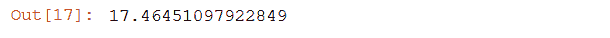*

## *对最佳参数进行网格搜索*

*现在，监督学习算法有许多参数可供选择。例如，在随机森林家族中，我们可以使用`max_depth` 来确定我们的树能长多高(也就是说，我们的决策节点能有多复杂)。先验地，对于树在我们的模型中应该有多高，没有正确或错误的答案。这取决于我们数据的性质。最好的选择是通过交叉验证。*

*在下面的代码中，我们使用`sklearn` 的`GridSearchCV()` 函数告诉 random forest 遍历许多不同的选项，并通过交叉验证返回得分最高的选项。然后，我们用这些最佳参数创建一个新的算法实例。最后，我们看到它的新得分。*

*为了好玩，这次让我们使用不同的度量(`neg_mean_absolute_error`)来测试我们的算法做得如何。*

```
*gsc = GridSearchCV(estimator=RandomForestRegressor(),param_grid={
    'max_depth': range(3,7),
    'n_estimators': (10, 50, 100, 1000),
    }, cv=5, scoring='neg_mean_squared_error', verbose=0, n_jobs=-1) grid_result = gsc.fit(X, y)
best_params = grid_result.best_params_rfr = RandomForestRegressor(max_depth=best_params["max_depth"], n_estimators=best_params["n_estimators"], random_state=False, verbose=False)# Perform K-Fold CV
scores = cross_val_score(rfr, X, y, cv=10, scoring='neg_mean_absolute_error')np.mean(scores)*
```

*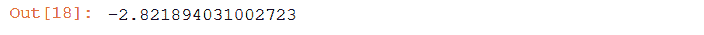*

## *分析我们坚持的结果*

*现在，我们可以返回到我们的维持集，并尝试基于我们的随机森林回归器和最佳参数来生成预测。按照与训练数据相同的方式将数据帧划分为`X`和`y`后，我们可以使用`predict` 方法为维持集中的每一行生成预测。*

```
*X_holdout = df_holdout.drop(columns = ['any_cases', 'Datetime', 'situation_report_confirmed', 'X', 'District', 'Epi.week', 'patient_database_confirmed', 'Year', 'Week', 'Day', 'case_occured_PDC', 'case_occured_SRC'])y_holdout = df_holdout.situation_report_confirmeddf_holdout['prediction'] = random_forest.predict(X_holdout)*
```

*我们现在可以在一个单独的数据框架中可视化这些结果，并将它们与实际数字进行比较。*

```
*results = df_holdout[['District', 'Datetime', 'situation_report_confirmed', 'prediction']]results.head(20)*
```

**

# **最终模型描述**

*我们的最终模型考虑了塞拉利昂每个地区的一系列变量，每个地区过去病例数的信息，以及与周边地区的互动，以预测任何给定的一周是否会爆发埃博拉疫情，如果会，预计会有多少患者。*

*将我们的模型结果可视化的一种方法是在危机期间拿出三周的数据，然后测试我们的预测与实际发生的情况相比如何。我们选择危机开始时的一周，高峰时的一周，以及蔓延放缓时的一周。*

*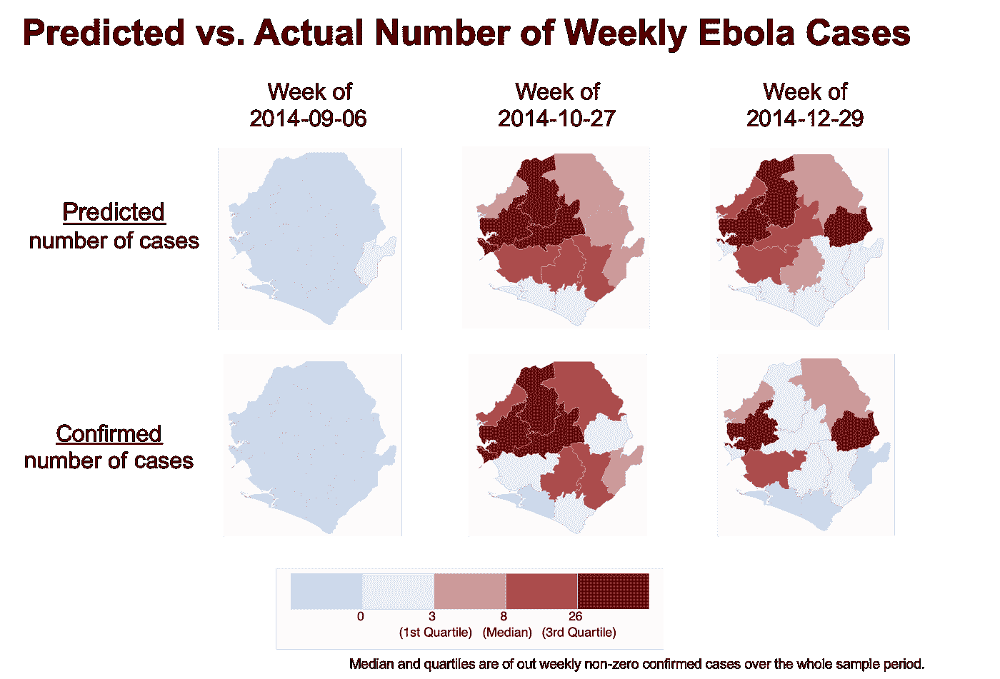*

*从上面的可视化可以看出，我们的模型并没有产生完美的结果。在第三周的情况下，一些被给予低优先的北部地区最终出现了一些最高集中的病例。另一方面，图 1 中的中间一周准确地预测，病例最集中的地区将是塞拉利昂西北部。*

# ***总是想到潜在的偏见***

*当使用数据科学为政策和运营决策提供信息时，考虑到由于不完善的数据而引入偏差的可能性总是很重要的。*

*在我们的案例中，2013—2016 年疫情期间的埃博拉病例漏报已经得到广泛认可。根据工作人员的观察，世卫组织声称“报告的病例和死亡人数大大低估了疫情的严重程度”。根据一项估计，实际病例数超过报告病例数 2.5 倍。*

*由于我们的模型是根据报告的埃博拉病例数训练的，我们的预测平均来说会低估实际的埃博拉病例数。此外，漏报的程度可能与地区特征相关，而地区特征对于公平性的考虑也很重要。例如，较贫困地区的监测系统可能较差，导致未报告的病例数量较高。*

*因此，实际和预测的埃博拉病例数之间的差距在较贫困地区会更大，这可能导致资源分配不公平地对较贫困地区不利。如果没有进一步的信息来说明漏报是如何因地区而异的，我们就无法用有偏差的数据做出无偏差的预测。因此，如果我们的模型被采用，我们建议同时投资于监测系统，以产生更高质量的结果数据。*

# ***技术限制***

*我们目前方法的最大问题是，模型是根据疫情发生的整个时期做出预测的。换句话说，该模型可以查看数据和感染高峰，并知道预计数字何时增长和下降。在现实生活中，如果我们将这个模型应用于新的疾病爆发，那么我们将只有我们所在的那个星期的数据，但显然我们无法预测未来。如果疫情遵循类似的一般增长模式，这不会是一个问题，但不太可能是这样的情况。*

# ***结论***

*准备用于分析的数据是任何监督学习项目中最关键的一步。在这篇文章中，我们学习了一些有效帮助你成功的基本代码，以及模型训练、评估和优化工作流程的基本要素。*