# 使用熊猫进行数据争论的备忘单

> 原文：<https://towardsdatascience.com/data-wrangling-in-pandas-a-downloadable-cheatsheet-84326d255a7b?source=collection_archive---------11----------------------->

## 重要的熊猫

## 将原始数据转换成函数形式


[来源](https://unsplash.com/photos/koy6FlCCy5s)

在获取原始数据之后，数据争论是将原始数据转换为更具功能性的形式以用于数据分析、模型构建和数据可视化的最重要步骤。它涉及预处理、重组和清理操作，最终产品是一个易于访问的格式的数据集，可以随时进行分析和可视化。

本文的**目的是展示在 [pandas](https://pandas.pydata.org) 中执行这些任务的一些**关键操作**，pandas 是一个基于 python 的数据操作工具。这里的想法不是详尽地描述所有可用的 pandas 操作，而是给初级和中级用户一个基本功能的方便指南。**

这篇文章的**内容被分成以下目录。**

A.数据框架简介

*   创建数据帧
*   从数据帧中检索数据
*   汇总数据

B.数据争论

*   组合数据帧
*   重塑数据帧
*   处理空值

**注意**:除了最上面的图片，所有图片都是作者的，包括最后面的可下载备忘单和代码/代码结果。

# 数据框架简介

DataFrame 是 pandas 中最常用的结构化 API，用于在行(观察值)和列(变量)中存储数据，就像在表中一样。行标签被称为'**索引**，而列标签被称为'**列**。我们首先讨论定义数据帧的两种最常见的方法。虽然本文中的讨论仅限于二维数据集，但这里讨论的框架完全擅长处理高维数据。

## 创建数据框架

让我们从定义熊猫数据帧开始，如下所示。

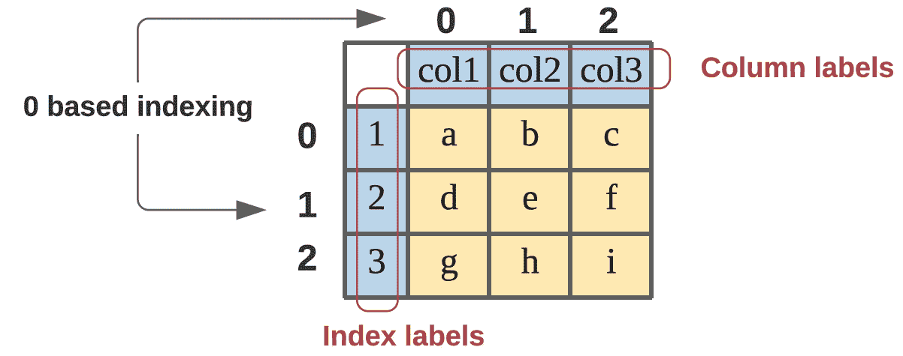

作者图片

该数据帧由三列(**包含三个标记为:col1、col2、col3** 的变量)和三行(**包含三个标记为:1、2 和 3** 的观察值/索引)组成。定义数据帧最简单的方法是提供一个观察值列表**然后在数据帧中按行排列。或者，我们可以提供数据作为一个**字典，每个条目作为数据帧中的一列**。下面是这两种方法的代码。**

```
# Defining DataFrame by specifing a list of observations
df_1= DataFrame([['a', 'b', 'c'],
                 ['d', 'e', 'f'],
                 ['g', 'h', 'i']],
                index = [1,2,3], columns = ['col1', 'col2', 'col3'])# Defining DataFrame by specifing a dictionary of columns 
df_2= DataFrame({'col1': ['a', 'd', 'g'], 
                 'col2': ['b', 'e', 'h'],
                 'col3': ['c', 'f', 'i']}, 
                 index = [1,2,3])
```

上面定义的`df_1`和`df_2`是相同的


## 从数据帧中检索数据

数据帧`df_1`中存储的索引标签 **(1，2，3)** 、列标签 **(col1，col2，col3)** 和数据值 **(a 到 i)** 可以分别使用`df_1.index,` `df_1.columns,`和`df_1.values`进行检索。

对于本文的大部分内容，我们将使用 Iris 数据集，而不是上面定义的 3X3 数据帧。这个[公开可用的数据集](https://scikit-learn.org/stable/auto_examples/datasets/plot_iris_dataset.html)以四种不同参数/变量 **( *萼片长度、萼片宽度、花瓣长度和花瓣宽度* )** 的形式包含关于三种不同品种的鸢尾花 ***(Setosa、Versicolour 和 Virginica)*** 的数据。我们可以使用 iris = `pd.read_csv(‘[https://raw.githubusercontent.com/mwaskom/seaborndata/master/iris.csv'](https://raw.githubusercontent.com/mwaskom/seaborn-data/master/iris.csv'))`导入并保存为熊猫数据帧

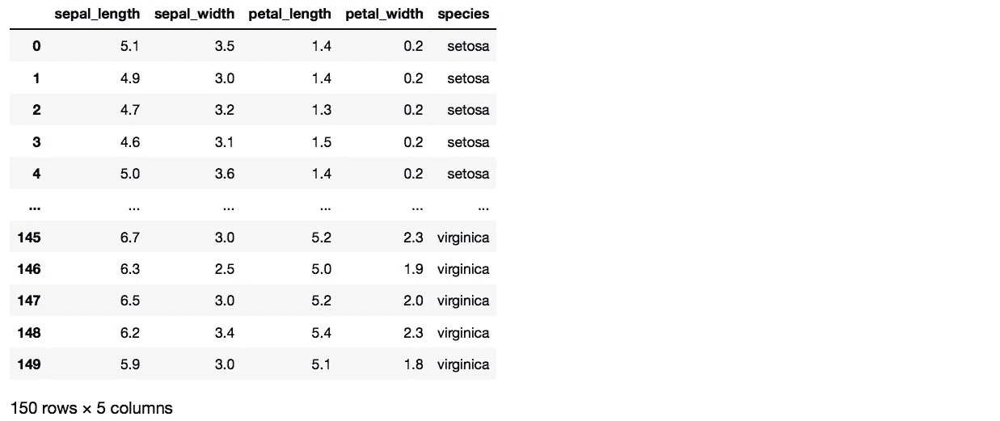

`loc`是基于**标签的**函数，用于访问特定索引和/或列的数据，并返回为该特定索引/列存储的所有条目。`iris.loc[[0,1]]`将返回索引为 0 和 1 的行:

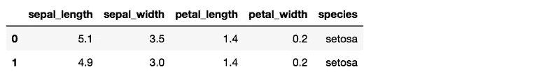

相反，如果我们只想要标记为 0 & 1 的行中的某些特定列，我们可以使用 `iris.loc[[0,1], [‘sepal_width’, ‘petal_length’]]`来指定列标签和行标签。


`iloc`是切片数据帧的第二个选项。它基本上与`loc`做同样的事情，但是利用**基于整数的位置**来访问数据，而不是索引和列标签。如果我们使用`iris.iloc[1:4,0:3]` : `1:4`将返回索引为 1，2 的行& 3 在一个基于 **0 的索引**的数据帧`iris`中，`0:3`将返回索引为 0，1 & 2 的列。

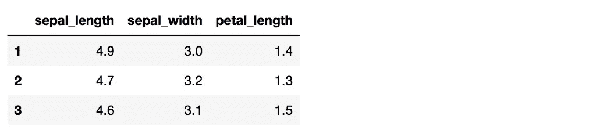

虽然`loc`和`iloc`在大多数情况下足以对数据帧进行切片，但是切片方法的完整列表可以在[这里](https://pandas.pydata.org/docs/user_guide/indexing.html)找到。

## 汇总数据

本节列出了一些常用于检查数据帧的操作，以便更好地理解其内容。

*   `iris.head(n)`和`iris.tail(n)`分别返回数据帧的顶部和底部 n 行。
*   `iris.describe()`返回数据集中所有数值变量(列)的汇总。

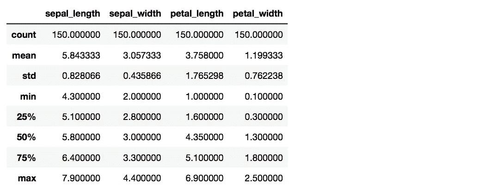

*   `iris[‘species’].value_counts()` 将返回包含变量物种的每个唯一值的行数。


*   `iris[‘sepal_length’].nunique()`将返回该列中唯一值的个数，正好是 35
*   对列或行可以调用的数值运算有:`min()`(最小值)`max()`(最大值)`var()`(方差)`std()`(标准差)`sum()`(加法)等。

# 数据争论

## 组合数据帧

在本节中，我们将讨论两种非常重要的组合数据帧的方法

*   `merge`使用一个 ***公共变量作为参考*** 来组合来自 ***不同数据帧*** 的观测值
*   `groupby`至 ***根据参考变量的输入，将数据分组到单个数据帧*** 中。

让我们从定义两个数据帧开始，这两个数据帧是使用数据切片的`iloc`操作从前面讨论的 Iris 数据帧中提取的。首先，我们使用`df_1 = iris.iloc[[1,51],3:]`对第 1 行和第 51 行的最后两列进行切片。

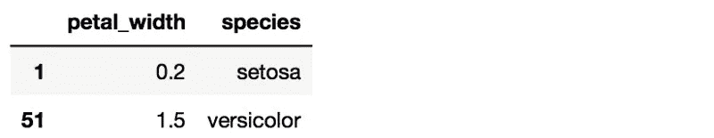

然后，我们使用`iris.iloc[[1,51,101],[0,2,4]]`定义`df_2`，这将为我们提供 iris 数据库中索引为 1、51 和 101 的行的第一、第三和第五列。

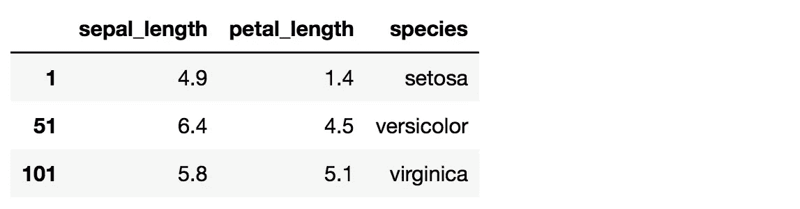

使用`species`作为参考变量`pd.merge(df_1, df_2, how = ‘outer’, on= ‘species’)`，操作`merge`可以合并这两个数据帧。由于`df_2`中提到的物种并不都在`df_1`中出现，我们需要使用 `how`参数指定哪些物种应该包含在合并的数据帧中。`how = ‘outer’`表示两个数据集中任何一个的所有物种都必须包含在合并的数据集中。因为在`df_1`中没有物种`virginica`的条目，所以它的值是合并数据帧中变量`petal_width`的`NaN`。

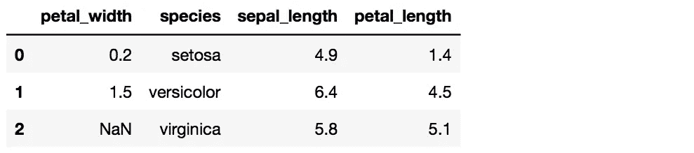

然而，如果我们设置了`how = ‘inner’`，那么只有那些同时出现在`df_1`和`df_2`中的物种才会被包含在合并的数据帧中。`pd.merge(df_1, df_2, how = ‘inner’, on= ‘species’)` 会给:

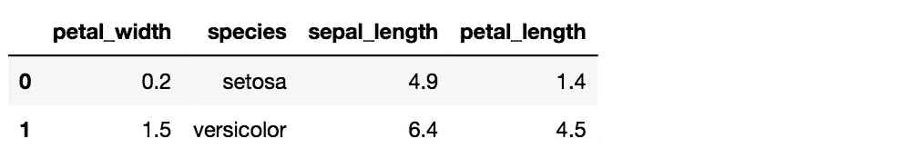

下面的文氏图展示了`how`参数的使用。两个圆圈中的每一个都代表一个数据帧，阴影区域显示将使其成为合并的数据帧的观察结果。


作者图片

现在让我们从原始 iris 数据帧中检索另一个数据帧，这次由 8 行组成`df_3 = iris.iloc[[1,2,3,4,51,52,53,54],[0,2,4]]`

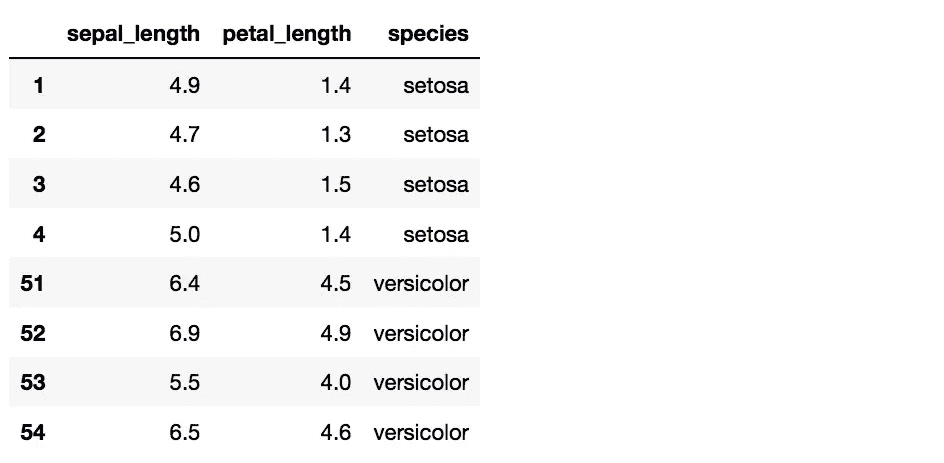

`groupby`操作可用于使用`df_3.groupby(‘species’)`拆分和合并`df_3`中两个物种(`setosa` & `versicolor`)的数据。然后，我们可以使用`get_group`分别访问两个`species`的数据。

```
a.get_group('versicolor')
```

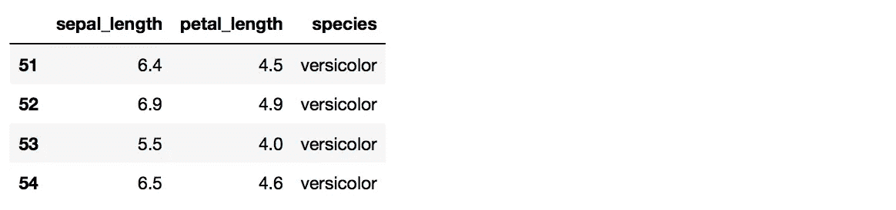

## 重塑数据帧

在本节中，我们将讨论重塑数据的关键操作。让我们从定义数据帧`df_4 = iris.iloc[1:5,0:3]`开始

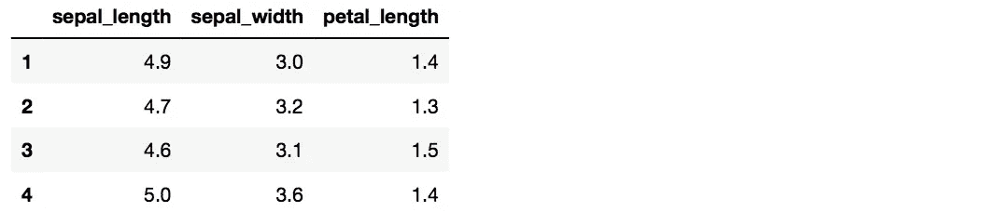

向`df_4`添加新列需要指定变量名和相关数据

`df_4[‘Species’] = [‘versicolor’, ‘versicolor’, ‘setosa’, ‘setosa’]` 。请注意，列表的维度必须与现有数据帧中的行数相匹配。


现在，为了给这个数据帧添加一行，我们使用前面讨论过的`loc`操作。 `df_4.loc[5] = [4.9, 1.4, 1.3, ‘setosa’]`将返回:

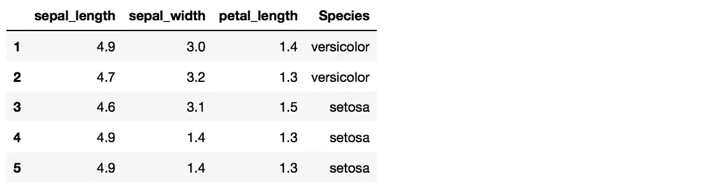

为了删除行和列，我们使用了`drop`操作。`df_4.drop(‘Species’, axis=1)`将删除`Species`列，而`df_4.drop(2, axis = 0)`将删除索引为 2 的行。注意，我们在这里指定的是索引和列名，而不是相应的从 0 开始的索引值。`axis`自变量用于区分行和列。0，默认值用于行，1 用于列。

我们还可以通过指定索引和列标签来同时删除行和列，如`df_4.drop(index = 1, columns = [‘Species’]).`

要制作包含两个或多个原始数据帧副本的数据帧，我们可以使用`concatenate`功能。`pd.concat([df_4,df_4])`将加入`df_4`如下图所示

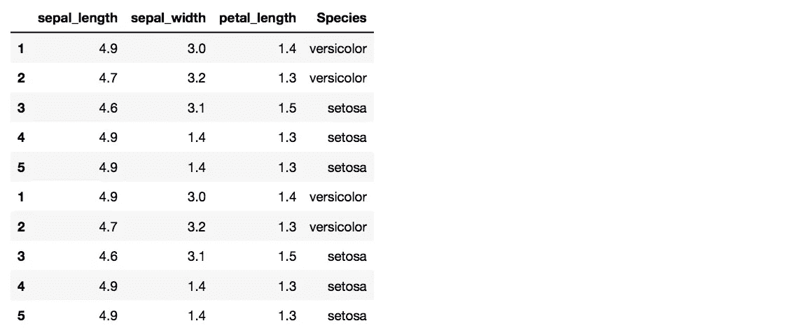

注意当两个`df_4`副本被连接时，原始数据帧的索引标签是如何被保留的。传递一个额外的参数`ignore_index=True`将导致索引标签的范围从 0 到 9。

在接下来的操作中，我们将使用我保存为 excel 文件并通过`df = pd.read_excel(“weather.xlsx”)`导入的数据帧


注意这个数据帧的结构。这里有一个单变量`temperature`。`Day`和`city`是两个不同的观察值，因为`temperature`是在两个不同的`city`(波士顿和纽约市)的五个`Days`(周一至周五)记录的。我们可以使用`pivot`操作`df.pivot(index = ‘city’, columns= ‘Day’)`重新构建该数据帧，给出:


`city`是这个重新构造的数据帧中的唯一索引，而`Day`变量已经被转换成列。这种格式的数据框架更易于阅读，避免了重复的`Day`变量，并且两个城市的`temperature`值易于比较，因为它们彼此相邻。

为了介绍下一个整形操作，让我们导入另一个 excel 文件作为数据帧。`df_1 = pd.read_excel(‘city_weather.xlsx’)`


该数据帧与我们之前讨论的`df`数据帧具有完全相同的数据，尽管格式非常不同。使用`melt`操作，我们可以将这个数据帧转换成类似于我们之前从 excel 文件导入的数据帧。

`pd.melt(df_1, id_vars = [“day”], var_name = [‘city’], value_name = ’temperature’)`


`melt`因此，与`pivot`在数据帧重组方面的做法相反。

对于我们将讨论的最后一个数据重组操作，让我们定义一个自定义数据帧，如下所示:

```
df_2 = DataFrame(np.arange(16).reshape(4,4), 
                 index = [['A', 'A', 'B', 'B'],['a','b','c','d']],         
                 columns = [[1,1,2,2], [11,11,22,22]])
df_2.index.names = ['Index1', 'Index2']
df_2.columns.names = ['City', 'Town']
```

上面的代码是这样做的:它定义了一个由 0 到 15 的整数组成的数据帧，这些整数以`4X4`的格式排列。指定了两个不同的索引(`[‘A’, ‘A’, ‘B’, ‘B’]` & `[‘a’,’b’,’c’,’d’]`)和列(`[1,1,2,2]` & `[11,11,22,22]`)标签以及每个标签的名称。生成的数据帧如下所示:


分层索引和列标签在复杂的数据集中并不少见，尤其是在描述许多不同变量之间的关系时。我们现在可以使用`stack`操作来重构这个数据帧。`df_2.stack(level = 0)`将在`City`变量处重构数据帧，给出:-

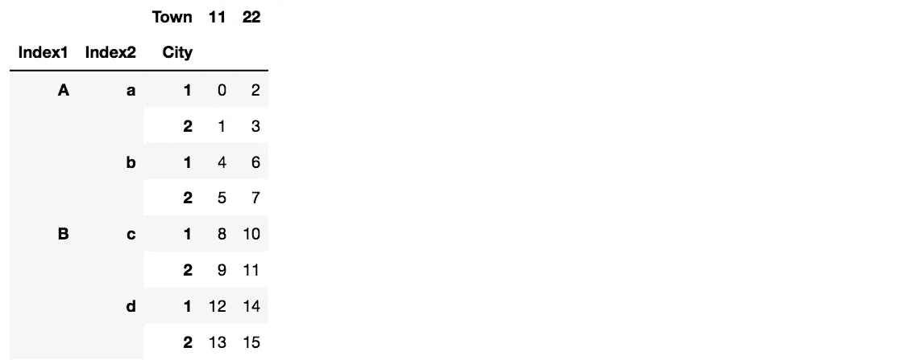

类似地，`df_2.stack(level = 1)`将如下转换`Town`变量

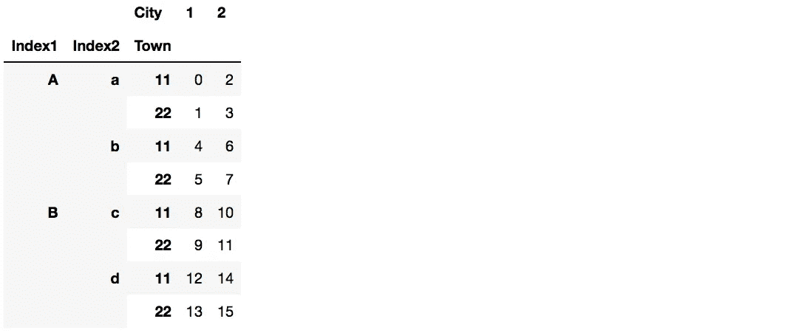

## 处理空值

由于缺乏数据可用性，原始数据集通常包含一些空值(`NaN`:非数字)。在进行数据建模和可视化之前，需要考虑和替换这些空值。让我们从定义包含 5 个空值的`df_na_1`数据帧开始。

```
npn = np.nan
df_na_1 = DataFrame([[1, 2, 3, 4], 
                     [4, 5, 6, npn], 
                     [6, npn, 7, 8], 
                     [9, npn, npn, npn]])
```

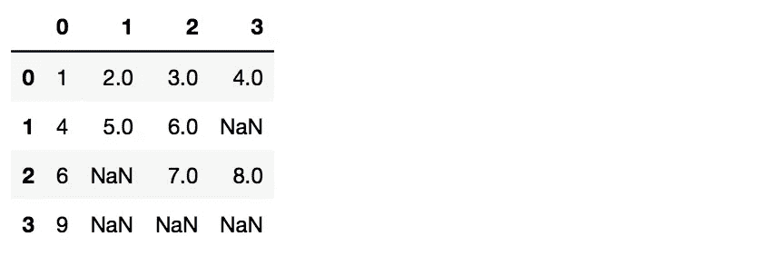

对该数据帧(`df_na_1.isnull()`)调用`isnull`操作将为所有空值返回 true

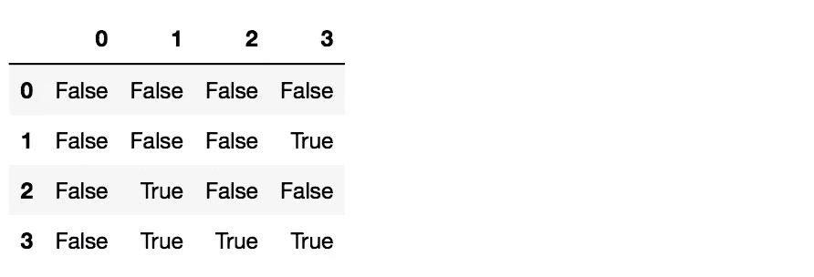

然后，我们可以使用`dropna` 操作`df_na_1.dropna()`去掉所有具有单个空值的行/观察值，只剩下第一行。


如果我们想删除只有一个空值的列，设置`axis = 1` `(df_na_1.dropna(axis=1))`，现在我们只剩下第一列。


我们可以用选择的值代替空值，而不是丢弃它们。使用`df_na_1.fillna({1:100, 2:200, 3:300})`,我们可以用不同列的不同值替换空值。标有`1`的列中的所有空值都由`100,` 替换，标有`2` 的列由`200` 替换，依此类推。


让我们定义另一个数据帧`df_na_2`

```
df_na_2 = DataFrame([[100, 100, 100, 100], 
                     [200, 200, 200, 200], 
                     [300, 300, 300, 300], 
                     [400, 400, 400, 400]])
```

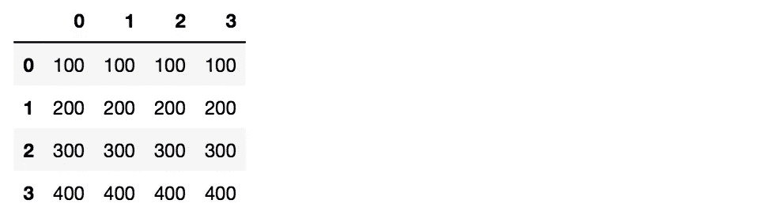

使用`df_na_1.combine_first(df_na_2)`,我们可以组合两个数据帧，使得`df_na_1`的值为空时，它将被`df_na_2`中的相应值替换。


## 下载备忘单

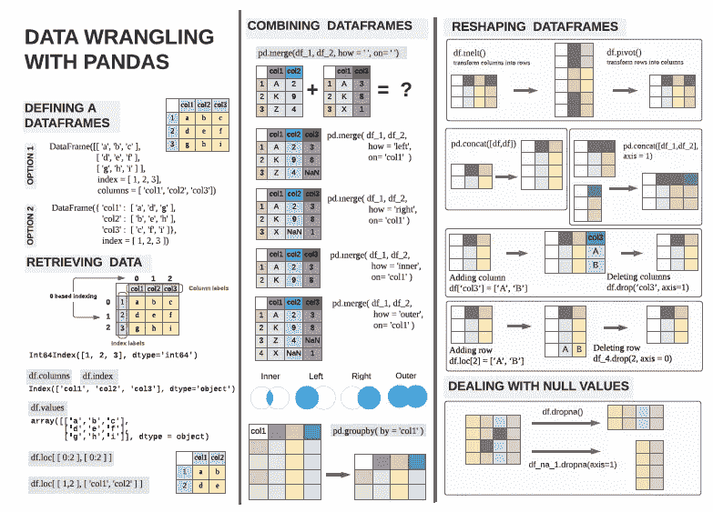

作者图片

上面显示的备忘单包含了本文中讨论的大部分关键概念，可以从[这里](https://github.com/Aseem139/pandas_cheatsheet/blob/master/Pandas_Cheatsheet_Medium.pdf)下载。为了简洁起见，在 cheetsheet 中不可能给出详细的解释，所以请参考本文的正文。感谢阅读。