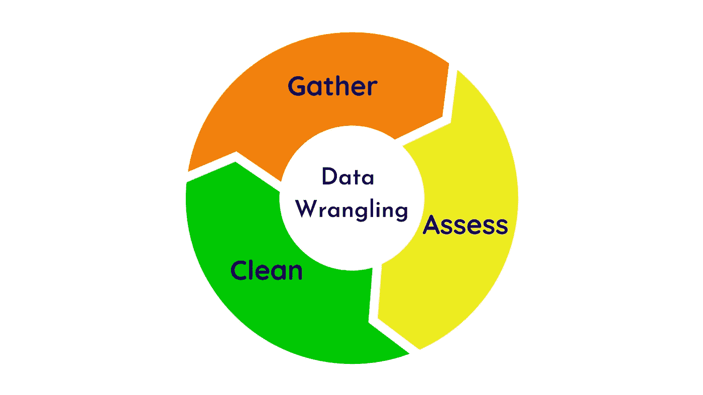
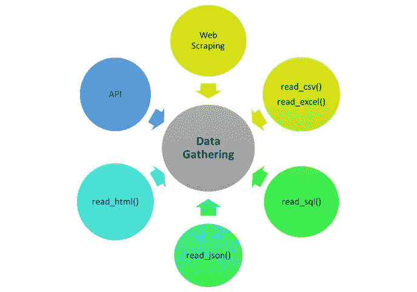
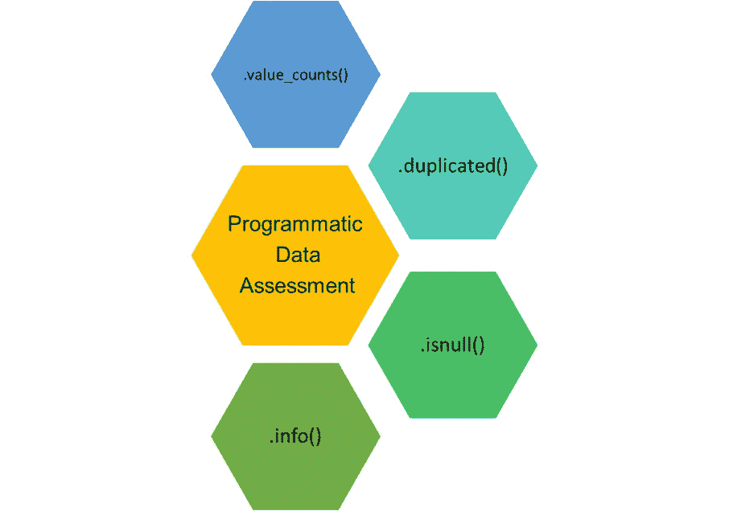
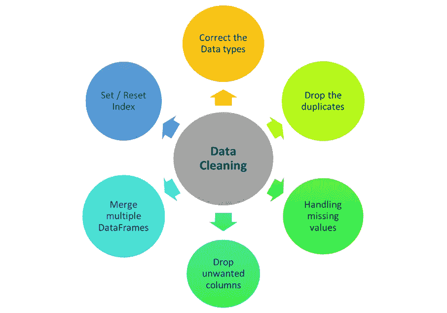

# 数据争论—从原始到干净的转变

> 原文：<https://towardsdatascience.com/data-wrangling-raw-to-clean-transformation-b30a27bf4b3b?source=collection_archive---------33----------------------->

## 简单的三个字的解释

[阿德利·瓦希德](https://unsplash.com/@adliwahid?utm_source=unsplash&utm_medium=referral&utm_content=creditCopyText)在 [Unsplash](https://unsplash.com/s/photos/vegetables?utm_source=unsplash&utm_medium=referral&utm_content=creditCopyText) 上的照片

当我第一次用谷歌搜索术语“*争吵*”时，我得到了一些奇怪的结果。牧马人的意思是*围捕*或*看管牲畜如马*而牧马人是看管牲畜、围捕牲畜并把它们组织成一个群体的人。完全相同的概念适用于数据争论。因此，在进行进一步分析之前，你应该争论你的数据，以获得更好的见解。

在这个故事中，我为你提供了一个简单的关于数据争论的三个词的解释。

让我们开始吧…

数据争论是收集数据、评估数据质量和清理数据的过程。

数据争论的 3 个步骤

从各种来源为项目收集的原始数据通常是不同的格式，不适合进一步的分析和建模。有时，这些收集的数据并不是真正干净和结构良好的。这使得处理这样的数据变得困难，从而导致犯错误，得到误导性的见解，并浪费你的宝贵时间。

人们常说，数据争论花费了整个项目时间的 70%到 80%,只留下 20%到 30%的时间用于探索和建模。

在数据争论过程结束时获得的数据然后用于进一步的分析、可视化或使用机器学习建立模型。

> 数据争论将原始数据转换成干净的、结构良好的数据

下面三张简单易懂的图片会让你对整个数据角力过程有所了解。

# **1。数据收集**

根据您的数据科学项目，所需的数据可以从单个文件中获取，也可以分布在多个资源中以不同的格式获取。

> 有时，数据收集可能是一项具有挑战性的任务。

别担心！！！

Python 来寻求您的帮助。通过它的库，python 提供了许多有用的函数来从不同的资源中提取数据。根据数据资源及其格式，数据收集可能有不同的步骤。如果数据在一个文件中，那么收集就是下载该文件并将其读入您的项目。对于这个 Python，pandas 提供了广泛的`read_`函数，如下图所示。

这就是 Python 中收集数据的方式

另一种方法是从数据库中收集数据，从网站上抓取数据，或者在 API 的帮助下收集数据。API 代表应用程序编程接口，它帮助你从 Twitter、脸书、Foursquare 等应用程序中获取数据。

> API 是特定于应用程序的现成代码

也可以通过实验和数据记录器收集数据。如果您使用任何应用程序进行实验和数据记录，请搜索它的 API。在我的工作中，我通常使用加热室进行实验，并使用 PicoLog 数据记录器 API 来收集所需的数据。

对如何直接从网页中收集数据感到好奇？？这是一篇关于网络抓取的有趣的 4 分钟阅读材料。

 [## 网页抓取—制作您自己的数据集

### 从网页中提取数据并存储到 excel 中—只需 4 个简单的步骤

towardsdatascience.com](/web-scraping-make-your-own-dataset-cc973a9f0ee5) 

# 2.数据评估

收集之后，是时候评估你收集的数据了。但是等等...你要评估什么？？答案是，

> ***质量*** 和 ***整洁度***

这不是数据探索，但是您将检查您的数据有多脏多乱。质量差的数据的内容有问题，这样的数据是脏数据。通常观察到的质量相关问题有:缺少值、数据不一致、数据类型不正确和重复。另一方面，杂乱的数据存在结构问题，即整洁性问题。正如 Hadley Wickham 在他的论文[整理数据](https://cran.r-project.org/web/packages/tidyr/vignettes/tidy-data.html)中所说，数据在以下情况下是整理好的，

1.  每个变量形成一列。
2.  每个观察值形成一行。
3.  每种类型的观测单位形成一张表

数据评估中需要检查的内容

此外，数据可以通过视觉 ***和编程*** 和 ***进行评估。***

视觉评估很简单，只要用你喜欢的任何应用程序打开数据，滚动它，并寻找质量，整洁的问题。在 Jupyter 笔记本中，可以使用`head()`、`tail()`和`sample()`方法查看数据。

程序化评估使用小代码片段和 Python 函数来检查数据质量。熊猫提供了一系列检查数据质量的方法。

一些用于编程数据评估的 Python 方法

# 3.数据清理

现在是清理和组织数据的时候了。数据清理步骤始终专注于解决在数据评估阶段发现的质量和整洁问题。作为牧马人，直到现在，你也只是收集了数据，看了看它的问题。现在是时候行动起来，总结并组织好它，以获得更好的结果。

一些数据清理技术

根据问题和数据类型，使用不同的数据清理技术。

使用***seaborn . pair plot()***可以快速检查不同变量之间的相关性。有了这样的图，您将对哪些变量对您的分析不重要有一个部分的了解，并帮助您决定删除哪些列。

如果在同一个项目中有多个相似类型的数据集，那么最好将这些数据合并到一个数据集中。当执行这种数据合并时，最终数据集中可能存在重复或重复的数据点。这些重复的条目可以简单地删除。

这是一个关于合并数据集的有趣的 5 分钟阅读，

 [## 加入表格

### 了解 Python pandas 中的 merge()和 concat()

towardsdatascience.com](/join-the-tables-ab7fd4fac26b) 

另一个常见的问题是，数据类型不正确。在数据清理时，您应该确保数字存储为数值，日期和时间值应该存储为一个`datetime`对象，等等。诸如`pandas.to_numeric()`、`pandas.to_datetime()`、`pandas.to_timedelta()` 、`pandas.DataFrame.astype()`等 Python 函数随时可供您使用。

最终，通过删除或替换不正确的条目、删除不相关的变量以及添加新的变量，脏的和乱的数据会得到纠正。

*总结一下，*

数据的质量和结构是更好地洞察数据的两个重要方面。即使在数据被清理之后，重新评估数据以确保所需的质量和整洁也是一个好主意。这就是为什么在第一张图中，数据争论被视为一个迭代过程。请记住，高质量和组织良好的数据有助于进一步的分析、可视化和建模。

**感谢您的时间和阅读！！**

我希望你喜欢这个关于数据争论的三个词的解释。请随时添加您的反馈，并在 LinkedIn 上与我联系。

 [## Suraj Gurav -副机械工程师-康耐视公司| LinkedIn

### 查看 Suraj Gurav 在全球最大的职业社区 LinkedIn 上的个人资料。Suraj 有 8 个工作列在他们的…

www.linkedin.com](https://www.linkedin.com/in/surajgurav17/)