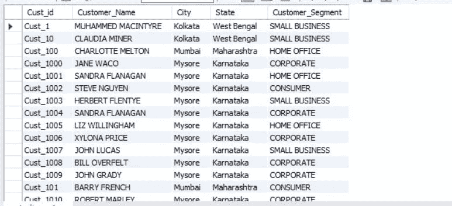
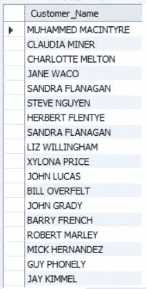
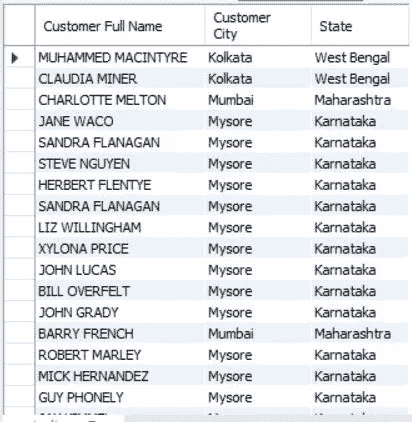
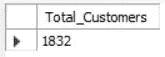
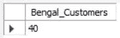
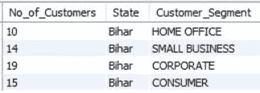
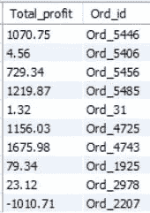
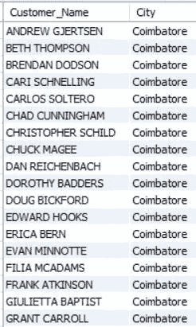

# 使用基本命令进行数据分析:MySQL 工作台

> 原文：<https://towardsdatascience.com/database-design-and-creation-mysql-workbench-488bffa8dbc5?source=collection_archive---------27----------------------->

## 学习如何使用 MySQL Workbench 创建和操作数据库

图片来自 [Pixabay](https://pixabay.com/?utm_source=link-attribution&utm_medium=referral&utm_campaign=image&utm_content=1850170) 的[像素](https://pixabay.com/users/Pexels-2286921/?utm_source=link-attribution&utm_medium=referral&utm_campaign=image&utm_content=1850170)

管理不同文件中的数据总是有风险的。这通常会导致不一致。一个组织无法通过维护成千上万的文件来有效地跟踪其业务活动。因此，数据库用于高效地访问和管理数据。 **DBMS(数据库管理系统)**软件在行业中广泛用于分析数据。

在本文中，我们将了解如何使用 MySQL Workbench 中的一些基本命令创建和操作数据库，并使用 SQL 语句分析数据。

## 使用 MySQL Workbench 创建数据库

在创建数据库之前，我们需要熟悉 **DDL 和 DML 语句。**

> 你可以从[这里](https://www.mysql.com/)安装 MySQL。

SQL 中可用的命令大致分为两类:

1.  数据定义语言
2.  数据操作语言

作者图片— **SQL 命令**

**数据定义语言(DDL)** DDL 用于创建一个新的数据库以及修改一个现有的数据库。DDL 中可用的典型命令有**创建**、**更改**和**删除。**

**创建数据库** 我们将看到如何使用 MySQL Workbench 创建数据库。我们需要指定我们已经创建的数据库，因为 MySQL Workbench 不会自动选择我们新创建的数据库。

**语法:**

*   创建数据库<database_name></database_name>
*   使用<database_name></database_name>

通过使用上述命令，我们创建了一个“market_star_schema”数据库。

> 请注意，MySQL 中的每条语句都以“；”结尾

**创建表格**

现在我们有了一个数据库，我们将在其中创建组成表。我们将创建一个包含三列及其各自数据类型的表。

通过上面的代码，我们已经创建了三列。

1.  `Mode_of_Shipping`用数据类型作为字符类型
2.  `Vehicle_name`用数据类型作为字符类型和
3.  `Toll_Required` 接受真或假，即布尔类型

**更改表格**

现在我们已经在数据库中创建了一个表，我们需要分配一个列作为主键。我们将在**改变表格**命令的帮助下完成。 **Alter** 命令用于修改现有的表或任何模式对象。

我们将`Mode_of_Shipping`作为该表的主键。在上面的代码中，我们可以添加一列、移动一列等，而不是添加约束。除了主键，我们还可以添加外键、唯一键等。

**下降表**

要删除该表，我们必须使用 **drop table** 命令。请记住，一旦我们使用 drop 命令删除了表，就无法再次检索数据。

**数据操作语言(DML)** DML 用于处理数据集中出现的实际数据。DDL 中可用的典型命令有**插入**、**更新**和**删除。**

**插入数据**

插入命令用于将数据插入到列中。我们使用 **insert into** 命令选择数据库，同时使用 **values** 命令输入数据。

**更新数据**

现在我们已经将值插入到表中，我们可以在 update 命令的帮助下更新数据的现有值。

在上面的代码中，

**更新**命令用于选择我们想要更新数据的表格。
**set**命令用于选择我们想要改变数据的列。
使用命令的**，以便将上述改变的数据应用于该特定行。**

**删除数据**

我们可以使用**删除**命令删除数据。

在上面的代码中，

*   **删除**命令用于删除必要的数据。
*   来自命令的**用于知道它必须从哪个表中删除数据。**
*   使用 **where** 命令，删除特定列中所需的数据。

**修改列**

像 DDL 一样，我们可以在 alter 命令的帮助下在现有的表中添加另一列。

在上面的代码中，

*   在 **alter table** 和 **add** 命令的帮助下，我们创建了一个新列。
*   我们使用**更新**和**设置**命令来更新列的值
*   通过使用 **alter table** 和 **drop column** 命令，我们也可以删除列。

如果有任何差异，了解如何立即修改列以输入正确的数据是非常重要的。这样做，我们可以确保在分析数据时获得正确的见解。

## 在 MySQL 中查询

我们已经看到了如何创建、数据库和操作数据。现在，我们将看到如何使用 **SQL 语句**编写查询。

有 7 条 SQL 语句:

1.  挑选
2.  从
3.  在哪里
4.  分组依据
5.  拥有
6.  以...排序
7.  限制

我们使用一个样本数据库‘market _ star _ schema’，可以从[这里](https://github.com/Kaushik-Varma/SQL)下载。

## **从**中选择&

SQL 中的 SELECT 命令的主要功能是从我们的数据库中获取数据。

**FROM** 命令表示选择命令正在获取数据的表。

我们将从数据库中访问一个表，并使用 select 语句打印表上的所有内容。

在工作台中，输出看起来像这样，

打印数据库中的表—使用 Select 语句

**打印列** 要从表格中打印一列，我们必须提到列名而不是*。

现在输出将只有表中的客户名称，

打印表格中的列

**打印多列** 要打印表中的多列，我们必须在 select 语句中提到所需列的名称。

输出将是，

打印表格中的多列

如果我们在 select 语句本身中观察上面的输出，我们已经更改了列名，而不是显示默认名称。

**Count
Count**使用 select 中的 **count** ，我们可以打印该列中存在的行数。

输出将是总行数，

总行数

## 在哪里

**Where** 子句主要用于过滤掉我们从 Select 命令中得到的结果。为了从表中选择特定的数据，我们使用了 Where 子句。

假设我们需要在我们一直使用的表中查看有多少客户来自某个特定的州。这里，where 子句将发挥作用。

现在，这个州的顾客总数是，

打印使用**的客户数量，其中**

我们还可以在 **where** 子句中使用**运算符**。

输出将如下所示，

在 Where 子句中使用 AND 运算符

同样，我们也可以根据需要使用**或>、<、**运算符来代替**和**。

## 分组依据

要对表中某一列的值进行分组，我们使用 **Group by。**

让我们找出每个客户群中来自某个州的客户总数。

现在，输出看起来像这样，

使用分组依据的每个细分市场的客户总数

## 拥有

**Having** 子句用于对使用 group by 子句创建的组设置条件。

让我们从数据集中取出另一个表。

桌子看起来像这样，

市场 _ 事实 _ 完整表格

现在，让我们看看每个订单产生了多少利润。我们将根据`Ord_id`列进行分组。

输出将是这样的，

每个订单 Id 的利润

现在，如果我们想要查看利润超过 1000 的订单 id，我们将使用 having 子句。

输出将只显示利润超过 1000 的订单 id

Having 子句

> Having 子句始终位于 Group by 子句之后，并且必须位于 Order by 子句之前

## 以...排序

如果我们想要对一列或多列的值进行排序，我们将使用 **Order by** 子句。

假设我们想按字母顺序排列客户姓名。我们可以使用 order by 来实现。

输出将按字母顺序显示客户名称。

按字母顺序排列的客户名称

默认情况下，该顺序将按升序排列。如果我们在 order by 之后传递命令`desc`，那么输出将按降序排列。

对于上面的相同代码，我们将在最后传递`desc`命令。

输出将是，

按降序排序

## 限制

limit 用于限制输出将返回的行数。

让我们打印数据库中`market_fact_full`表中订购最多的三种产品。

现在输出将只显示前三个订购的产品，

前三种产品使用限制

这些是必要的 SQL 命令，用于分析数据集中某个表的数据。

# **结论**

本文展示了如何在 MySQL 中使用各种 DDL 和 DML 命令来使数据可供分析。

DDL 语句用于改变数据库结构，而 DML 语句用于改变其数据。

使用这七个命令， **SELECT，FROM，WHERE，GROUP BY，HAVING，ORDER BY，**和 **Limit，**我们可以对特定的表进行数据分析。

一旦我们掌握了这些命令，我们就可以使用**内连接、外连接**，创建**视图**和**cte，一次对多个表进行分析。**

**感谢您阅读**和**快乐编码！！！**

# 在这里查看我以前关于 Python 的文章

*   [**探索性数据分析(EDA): Python**](/exploratory-data-analysis-eda-python-87178e35b14)
*   [**假设检验:数据科学**](/hypothesis-testing-data-science-1b620240802c)
*   [**(CLT)中心极限定理:数据科学**](/central-limit-theorem-clt-data-science-19c442332a32)
*   [**推断统计:数据分析**](/inferential-statistics-data-analysis-e59adc75c6eb)
*   [**Seaborn: Python**](/seaborn-python-8563c3d0ad41)
*   [**熊猫:蟒蛇**](https://levelup.gitconnected.com/pandas-python-e69f4829fee1)
*   [**Matplotlib:Python**](https://levelup.gitconnected.com/matplotlib-python-ecc7ba303848)
*   [**NumPy: Python**](https://medium.com/coderbyte/numpy-python-f8c8f2bbd13e)

# 参考

*   **数据仓库:**[https://en.wikipedia.org/wiki/Data_warehouse](https://en.wikipedia.org/wiki/Data_warehouse)
*   **数据仓库:**[https://search Data management . techtarget . com/definition/Data-warehouse](https://searchdatamanagement.techtarget.com/definition/data-warehouse)
*   **MySQL:**[https://www.tutorialspoint.com/mysql/index.htm](https://www.tutorialspoint.com/mysql/index.htm)
*   **MySQL 教程:**[https://www.w3resource.com/mysql/mysql-tutorials.php](https://www.w3resource.com/mysql/mysql-tutorials.php)