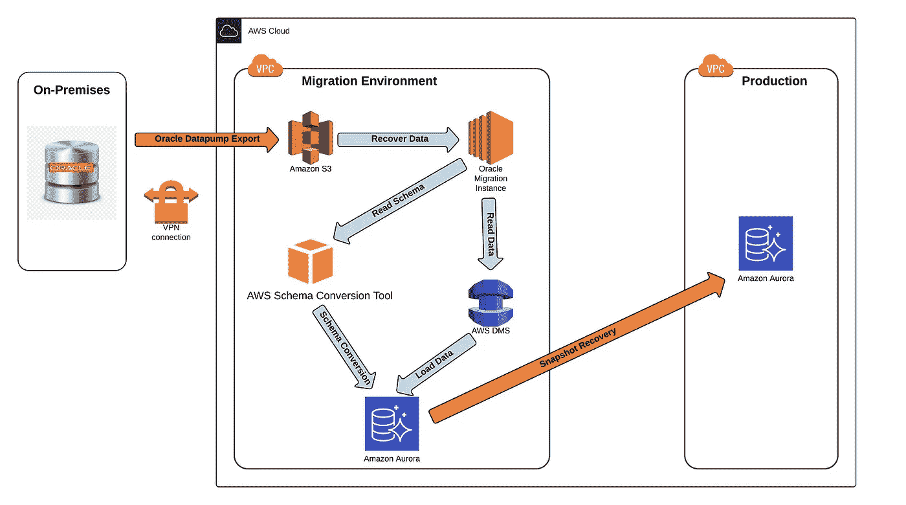
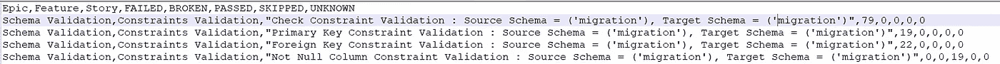
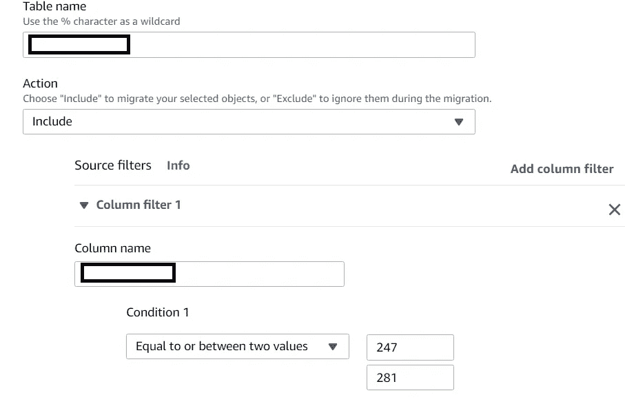
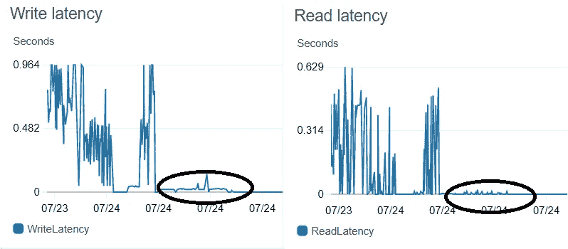
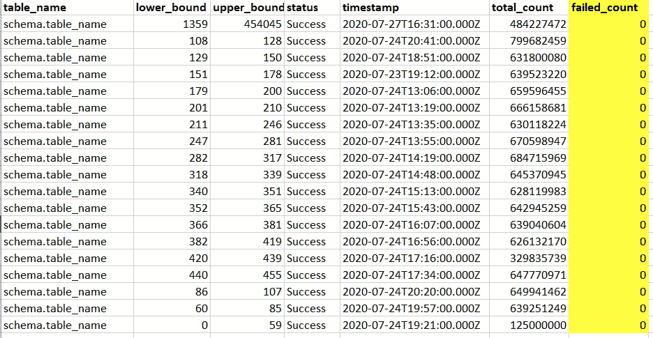

# 使用 AWS 数据迁移服务(DMS)进行数据库迁移—一路走来的一些经验教训

> 原文：<https://towardsdatascience.com/database-migration-using-aws-data-migration-service-dms-a-few-lessons-learnt-along-the-way-8c9a1624b8db?source=collection_archive---------45----------------------->

## Oracle 数据库到 Amazon Aurora PostgreSQL 的异构迁移

图片由 Pixabay 提供

最近，我们将一个相当大的内部 Oracle 数据库迁移到了 Amazon Aurora PostgreSQL。开始不同数据库平台之间的异构迁移从来都不容易。将此与将数据库迁移到云结合起来，无疑增加了挑战。

本文的目的是分享迁移方法，并强调我们遇到的一些问题和陷阱。

# 关于内部 Oracle 数据库

**数据库版本:** Oracle 企业版 12

**数据大小:** 1.6 TB

**最大的表大小:**90 亿行，超过 2000 个分区和子分区

# 迁移方法

(*图片作者*)

由于数据的大小相当大，我们决定不要让 AWS DMS 使用 VPN 连接从本地位置获取源数据。相反，我们选择了 Amazon EC2 上的一个临时 Oracle 实例。毫无疑问，从性能角度来看，这很有意义。

## 数据恢复

1.  客户向我们发送了一个在内部创建的 Oracle 数据泵完整数据库导出(expdp ),并将转储文件复制到亚马逊 S3。转储是使用**文件大小=64G** 创建的
2.  一旦转储文件被复制到亚马逊 S3，我们就在一个临时 Oracle 迁移实例上恢复这些文件。为此，我们在 AWS 上构建了一个**m5a . 8x 大型 RHEL 7.6 实例**。
3.  数据恢复完成后，我们验证了本地 Oracle 数据库与 Oracle 迁移数据库之间的行数。

## 模式转换

我们使用 [AWS 模式转换工具](https://aws.amazon.com/dms/schema-conversion-tool/)进行异构数据库迁移。这个工具工作起来非常顺畅。任何无法转换的对象都被清楚地标记出来，以便可以手动转换它们来完成迁移。假设您没有很多存储过程、函数和包，那么 AWS 模式转换工具将会转换您的大多数模式对象。

**一些经验教训……**

1.  Oracle 中的触发器代码迁移方式略有不同。触发器代码被转换成 PostgreSQL 函数，该函数又从 PostgreSQL 中的触发器调用。
2.  *Oracle 中的数字*数据类型被转换为 PostgreSQL 中的 *double_precis* ion。在正常情况下，这应该不成问题。然而，在数据迁移步骤中，我们确实遇到了数据截断问题。我们将在本文后面更详细地讨论这一点。
3.  如果在列名中有一个保留字，那么这个名称就会用双引号括起来，比如“PRECISION”。不幸的是，没有简单的方法来标记这些列并预先修复它们。因此，创建一个脚本并根据 PostgreSQL 保留字列表验证列名是一个好主意。获得保留单词列表的一个简单方法是使用下面的 SQL:
    **SELECT * FROM pg _ get _ keywords()**

## 模式验证

1.  我们使用 *pytest* 框架进行模式验证。我们首先创建单元测试，用于比较常见的模式对象，如表、索引、约束、视图等。在目标数据库中。这个脚本每天都按计划运行，这样我们就能及时发现任何差异。

(*图片作者*)

**吸取的一些教训…**

1.  我们错过了为 double_precision 问题添加验证源数据的单元测试。实际问题是在数据迁移阶段发现的，这并不好…对于下一次迁移，最好事先知道这个问题
2.  我们还错过了为保留关键字添加单元测试。这个问题是在应用程序测试期间发现的，当时有些列用双引号括起来。最好预先标记这些列，并建议修改列名。

## 数据迁移

我们使用 [AWS 数据库迁移服务](https://aws.amazon.com/dms/)将庞大的数据集从 Oracle 迁移到 PostgreSQL。

## DMS 复制实例和 DMS 端点

一个 **r4.4xlarge** 实例。Oracle 和 PostgreSQL 各一个端点。

## 数据迁移任务

所有维度表都很小，因此我们创建一个 DMS 作业，一次性迁移所有这些表的数据。

对于最大的事实表，我们创建了多个 DMS 作业，每个作业复制 5-6 亿行。分割是使用如下选择过滤器完成的:

(*图片作者*)

**一些经验教训……**

1.  数据迁移后，我们发现一些列的数据被截断。这些列的数据值大于 40 个精度值。这一次，我们使用 *numeric(38，25)* 执行了另一次数据复制迭代，但这没有帮助。最终，我们通过将这些列转换为源和目的地的 *varchar i* n、复制数据并最终在 PostgreSQL 中将这些列重置为 *numeric* 类型来解决这个问题
2.  确保为复制实例提供足够的已分配存储，否则您的作业将运行非常缓慢，甚至会失败。我们最初使用默认的 50 GB 大小，但是作业开始变慢和/或失败。我们花了一段时间才找到问题的根源，但当我们将存储容量更改为 200 GB 时，所有作业都成功完成了。以下指标将清楚地向您展示在实施分配的存储更改后，写入和读取延迟下降的确切时间点…此后一帆风顺

(*图片作者*)

## 数据有效性

这是我们花时间最多的部分。我们的目标是比较 Oracle 和 PostgreSQL 的每一行数据。

我们首先创建了一个数据验证框架，它使用 JDBC 连接从 Oracle 表中获取数据。然后将每个块与 PostgreSQL 中相应的块进行比较。我们确实预料到 JDBC 方法会很慢，但是该框架在正确性和性能的测试迁移中工作得相当好。然而，在生产运行期间，由于数据量的增加，事情很快就变糟了。在某一点上，我们计算出框架需要一个月的时间来做比较…同样不好。

我们通过改变方法解决了上述问题。我们没有选择 JDBC，而是选择将 Oracle 和 PostgreSQL 表作为 Parquet 格式文件转储到亚马逊 S3 上。然后，我们编写了一个简单的 Pyspark 程序，使用 Datafames 执行比较。我们使用一个 EMR 集群启动了 Spark 程序，该集群有 1 个 **m5.xlarge** 主节点**和** 4 个使用 **c4.8xlarge** 点实例**的核心节点。**一个月的工作缩短到不到 1.5 天…..还不错。

最后，Pyspark 脚本的结果……听起来很不错。查看 **failed_count** 列。

(*作者图片*)

希望这篇文章对你有所帮助。我希望它能在您的迁移过程中节省一些时间和烦恼。如果您需要 Pyspark 脚本，请随时 ping 我。我很乐意提供给你。

我希望这篇文章是有帮助的。AWS 数据迁移服务是由 [Datafence Cloud Academy](http://www.datafence.com) 提供的 AWS 大数据分析课程的一部分。课程是周末自己在网上教的。