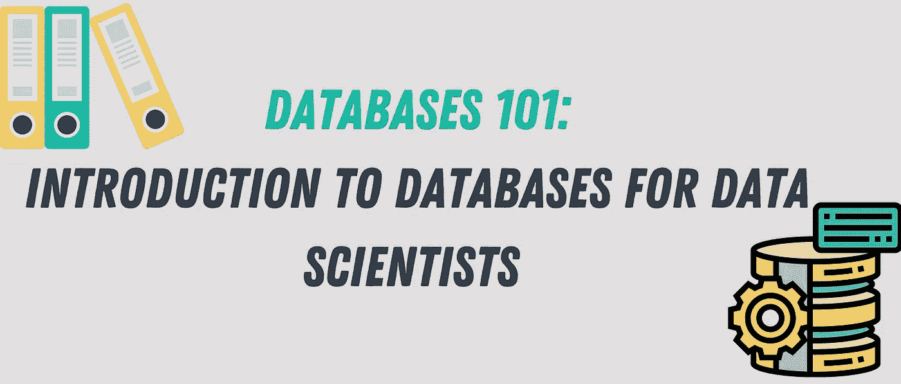
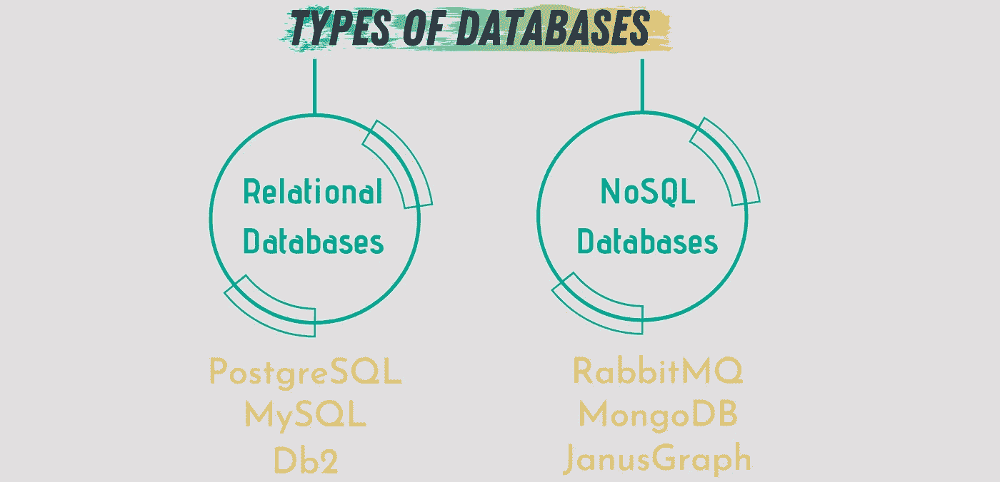

# 数据库 101:数据科学家数据库简介

> 原文：<https://towardsdatascience.com/databases-101-introduction-to-databases-for-data-scientists-ee18c9f0785d?source=collection_archive---------7----------------------->

## 如何开始接触数据库世界？

图片由作者提供(使用 [Canva](https://www.canva.com/) 制作)

数据科学是快速发展的领域之一，我看不到它会很快放缓。我们对数据的依赖与日俱增。数据科学是关于数据的，收集它，清理它，分析它，可视化它，并使用它来改善我们的生活。

对于数据科学家来说，处理大量数据可能是一项具有挑战性的任务。大多数时候，我们需要处理和分析的数据比我们设备的容量(RAM 的大小)大得多。将信息存储在硬盘上可能会导致我们的代码变慢。

更不用说为了理解数据，并有效地处理数据，我们需要以某种方式对数据进行排序。这就是数据库发挥作用的地方。

数据库被定义为保存在计算机内存或云中的结构化数据集，可以通过多种方式进行访问。

作为一名数据科学家，在您将要从事的大多数项目中，您都需要设计、创建数据库并与之交互。有时您需要从头开始创建一切，而在其他时候，您只需要知道如何与已经存在的数据库进行通信。

当我第一次开始我的数据科学之旅时，处理数据库是最具挑战性的方面之一。这就是为什么我决定写一系列关于一切数据库的文章。

本文将对数据库进行简要介绍。什么是 SQL？我们为什么需要数据库？以及不同类型的数据库。

# 为什么使用数据库？

数据围绕着我们；我们日常生活中使用的一切都是基于海量的数据。你打开网飞，它会根据你之前的选择建议你接下来应该看什么。你打开 Spotify 应用；它告诉你根据你的喜好想要你可能喜欢的歌曲。

收集和分析数据是个性化我们每个人的体验的方式之一。这是一种打造适合所有人的产品的方式。

但是，

要做到这一点，需要将这些数据存储和组织在某个地方，某个易于访问、提供快速通信且安全的地方。

数据库使结构化存储变得安全、高效和快速。它们为如何存储、构造和检索数据提供了一个框架。有了数据库，您就不必在每个新项目中考虑如何处理数据了。

# 数据库的类型

图片由作者提供(使用 [Canva](https://www.canva.com/) 制作)

## 关系数据库

在关系数据库中，数据被组织和存储到可以使用某种关系相互链接的表中。例如，一家航空公司可以有一个所有航班的乘客表，还有一个特定航班的乘客表。航班代码可以连接这两个表。

作为开发人员和数据科学家，拥有连接表的这种能力使我们能够更好地理解表的不同元素之间的关系。理解这种关系可以给我们提示和洞察力，使分析和可视化数据的过程变得更容易。

与关系数据库通信和交互的方法是使用 SQL 语言。

## 非关系数据库

非关系数据库，也称为 NoSQL 数据库。这些数据库是通过类别而不是关系来连接存储在其中的信息的数据库。

NoSQL 数据库最流行的形式是键值对，你可以像对待 Python 字典一样看待它。键必须是惟一的，只要它们是惟一的，一个键-值对就可以在一个文档中存储所有的关系。

关系数据库使用表作为核心存储单元。数据库中的表由行和列的集合组成，您可以使用关系连接几个表。然而，在 NoSQL，数据存储在类似文档的存储设备上。只要知道文档的结构，您仍然可以执行所有日常任务，如添加、删除、更新数据。

# 结构化查询语言(SQL)

SQL 是一种功能强大的编程语言，用于在关系数据库管理系统(RDBMS)中操作数据。SQL 相对简单，却如此强大和高效。开发人员和数据科学家使用 SQL 在关系数据库上添加、删除、更新或执行特定操作。

SQL 不仅仅是对数据库执行简单的操作；它还可以用于设计数据库或对存储的数据进行一些分析。

## 为什么是 SQL？

SQL 非常受欢迎，通常广泛用于软件开发，尤其是数据科学，原因有很多，包括:

1.  **灵活性:** SQL 允许您添加或删除新的列、表、重命名关系，并在数据库启动和运行以及进行查询时进行其他更改。此外，它可以轻松地集成到许多脚本语言中。
2.  **易用性:**学习 SQL 的基础知识既简单又直接。使用 SQL 不需要掌握令人困惑的隐藏提示语法。
3.  **没有冗余:**由于 SQL 的关系特性，您可以在同一个位置获得关于一个条目的所有信息，因此您不需要在所有表中重复相同的信息。
4.  **可靠性:**大多数关系数据库都可以导出和导入，使备份和恢复变得轻而易举。这些导出可以在数据库运行时执行，从而使故障恢复变得容易。

# SQL 与非 SQL 数据库

每当你被分配一个新项目或试图设计一个 w 数据库，你可能问自己的第一个问题是*“我应该使用哪个数据库？SQL 还是 NoSQL？”。*

事情是这样的，当试图选择一个正确的数据库类型时，我经常参考 CAP 定理。CAP 定理描述了数据库的三个方面之间的关系:可用性、一致性和分区容差。

1.  **一致性:**这意味着对数据库的每次查询都应该返回最新的值。一致性有 5 个不同的级别，从强有力的即时结果到最终过时的结果。
2.  **可用性:**这意味着任何人都可以请求数据并得到响应，即使数据库的一项或多项出现故障。
3.  **分区容错:**一个*分区*是一个系统内的通信中断。容差意味着即使数据库各方面之间的通信中断，数据库也应该正常工作。

要选择一种数据库类型，您需要优先考虑 CAP 定理三个方面中的两个。如果您更关心一致性和可用性，那么您应该选择关系数据库。但是，如果您更关心可用性和分区容差，或者一致性和分区容差，那么 NoSQL 数据库将更适合您的项目。

图片由作者提供(使用 [Canva](https://www.canva.com/) 制作)

# 结论

数据是数据科学最关键的部分；没有数据就没有数据科学。对于任何数据科学家来说，设计、创建和交流数据库都是发展其职业生涯和丰富其知识库的必要条件。

数据库是一个广阔的领域；我无法在一篇文章中囊括所有内容。这就是为什么我决定将这个主题分成三篇文章，涵盖数据科学家应该了解的所有重要和必要的数据科学知识。

接下来的文章将涵盖数据库设计和交互的基础知识(SQL 介绍)。最后一篇文章将介绍 Python 中常用的数据库库，以及如何为您的数据和应用程序选择正确的库。