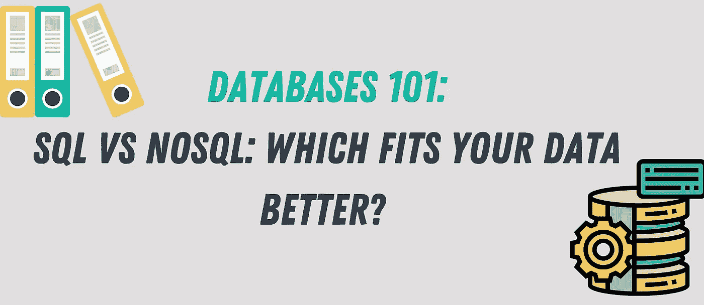
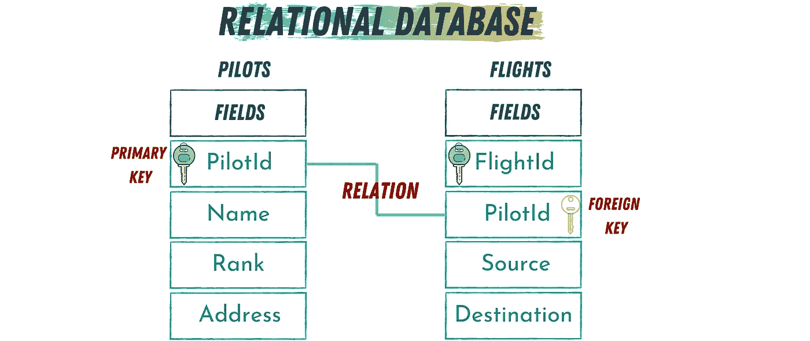
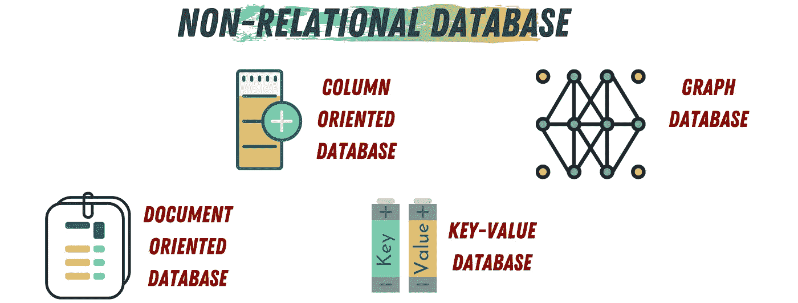

# 数据库 101: SQL 与 NoSQL:哪个更适合你的数据？

> 原文：<https://towardsdatascience.com/databases-101-sql-vs-nosql-which-fits-your-data-better-45e744981351?source=collection_archive---------14----------------------->

## 差异和最佳实践

图片由作者提供(使用 [Canva](https://www.canva.com/) 制作)

数据是数据科学所有子领域的支柱。无论你正在建造的建筑的规模或用途如何，你都需要获取和分析数据。通常，您需要的这些数据存储在 DBMS(数据库管理系统)中。

要与 DBMS 交互和通信，您需要使用它的语言或它能理解的语言。用于与 DBMSs 交互的语言是 SQL(结构化查询语言)。

近年来，数据库领域出现了另一个术语，即 NoSQL 数据库。如果您刚开始接触数据科学，您可能听说过 SQL 和 NoSQL 数据库。

*但是，它们有什么区别，什么时候使用呢？*

让我们为绝对的开始而开始。为什么我们有两种与数据库交互的方法？

简单、SQL 和 NoSQL 与不同类型的数据库交互。SQL 是用于与关系数据库交互的方法，而 NoSQL 用于与非理性数据库交互。

# 关系数据库

数据存储在关系数据库中不同的**表中，每个**表包含多个**记录**(行)。这些表使用一个或多个关系相互连接。

键定义了表之间的关系。一个*键*是包含每条记录的唯一值的表**字段**(列)。如果一个字段被定义为一个表的*主键*，这个字段可以包含在多个表中，并且可以用来同时访问不同的表。一旦使用主键将其表连接到另一个表，它将在另一个表中被称为*外键*。

例如，下图显示了航空公司数据库的一部分。我们有两张表，飞行员表和航班表。这两个表被连接起来，用作飞行员表“PilotId”中的主键我可以使用飞行员的 Id 来访问飞行员表中关于该飞行员的信息，以及该飞行员正在处理的航班。

图片由作者提供(使用 [Canva](https://www.canva.com/) 制作)

因此，在飞行员表中，PoilotId 是主键，而在 flights 表中是外键。PilotId 在这里用于形成两个表之间的关系。

# 非关系数据库

与关系数据库不同，非关系数据库(NoSQL 数据库)不在表和记录中存储数据。相反，在这些类型的数据库中，数据存储结构是为特定需求而设计和优化的。

与关系数据库使用的 SQL 不同，NoSQL 数据库使用对象关系映射(ORM)来促进与其数据的通信。

NoSQL 数据库的四种流行类型，面向列、面向文档、键值对和图形数据库。这些类型可以单独使用或组合使用。选择将取决于您的应用程序和您需要存储的数据类型。

## 面向列的数据库

顾名思义，在面向列的数据库中，数据以列的形式存储和组织。如果需要存储稀疏数据，这种类型的数据库非常有用。稀疏数据更趋向于面向列的数据组织方法。

## 面向文档的数据库

在面向文档的数据库中，排序的数据的结构不需要很严格。它是文档结构中字段和数据值的集合。这些面向文档的数据库通常存储为 JSON 字符串，可以使用 YAML、XML 或纯文本编码来保护数据。

使用面向文档的数据库的一个好处是，您不需要让所有的文档都使用相同的结构。这给了开发人员在同一个数据库中对不同数据类型进行排序的自由。在 Python 中，MongoDB 是面向文档的数据库的一个例子。

## 键值数据库

如果你熟悉 Python，你可以把键值数据库想象成一个 Python 字典。数据库中的每个数据对象都将被存储为一对键和值。

## 图形数据库

当您的数据高度互联时，您将需要使用一个允许您高效实现这一点的数据库。图形数据库被认为是最复杂的 NoSQL 数据库。然而，它非常通用，这使得它非常适合许多应用程序。

图片由作者提供(使用 [Canva](https://www.canva.com/) 制作)

# 如何在 SQL 和 NoSQL 之间选择？

那么，我们如何在 SQL 和 NoSQL 数据库之间做出选择呢？

为了回答这个问题，你需要考虑 4 个方面:灵活性、可伸缩性、一致性和可用的技术。

1.  **灵活性:**有时候，当你的数据有不同的结构和不同的类型。根据定义，NoSQL 数据库给你更多的自由来设计你的模式和在同一个数据库中存储不同的数据结构。另一方面，SQL 数据库具有更严格的结构和模式。
2.  **扩展性:**你见过日本车停车电梯吗？它可以让你把车一辆挨着一辆停放。现在，我想让你问问自己，增加电梯层数和建造新的电梯哪个效率更高？ **SQL** 数据库是*垂直*可伸缩的，这意味着你可以增加它的级别(增加它的负载)。虽然 **NoSQL** 数据库是*水平*可伸缩的，但是您可以通过将工作分配给多个服务器来增加其负载。
3.  **一致性** : SQL 数据库拥有高度一致的设计。然而，基于 DBMS，NoSQL 数据库可以是一致的，也可以是不一致的。比如 MongoDB 是一致的，而 Cassandra 这样的数据库就不是。
4.  **可用技术**:您可能会考虑的一个方面是数据库技术的当前发展阶段。因为 SQL 数据库已经存在了很长时间，所以它比 NoSQL 数据库发展得更快。所以，对于初学者来说，从 SQL 开始，然后转移到 NoSQL 可能是最好的选择。

根据经验，如果您正在处理 RDBMS(关系数据库管理系统)，想要分析数据的行为或想要构建定制的仪表板，SQL 是更好的选择。此外，SQL 通常允许更快的数据存储和恢复，并且更好地处理复杂的查询。

另一方面，我们有 NoSQL 数据库，如果您想扩展 RDBMS 的标准结构，或者您需要创建一个灵活的模式，这是更好的选择。当您存储的数据和日志来自分布式来源，或者您只需要临时存储时，NoSQL 数据库也更好。

# 外卖食品

最后，我不能说 SQL 绝对比 NoSQL 好，或者相反。它们每一个都有自己的优点和缺点，您的选择将基于您的数据、您的应用程序以及什么使开发过程对您来说更容易。

SQL 数据库更古老，因此研究得更多，也更确定了固定的模式设计和结构。由于其灵活的模式，NoSQL 数据库易于扩展、灵活且使用相对简单。

那么，您的数据需求是什么？你的数据结构良好吗？您正在处理大量数据吗？

永远听从你的数据，你会做出正确的选择。