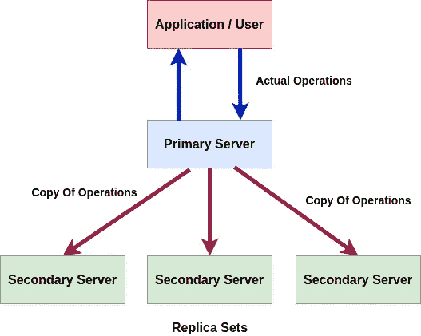
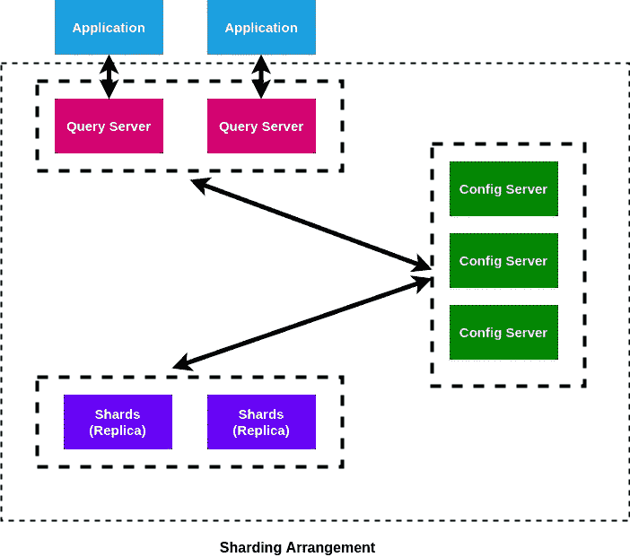
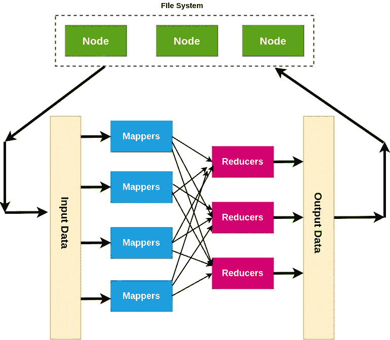
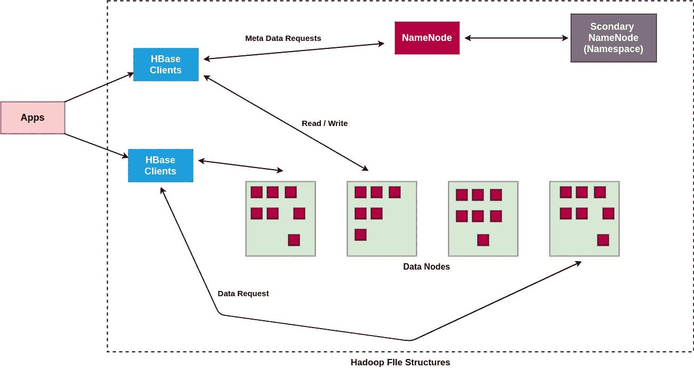
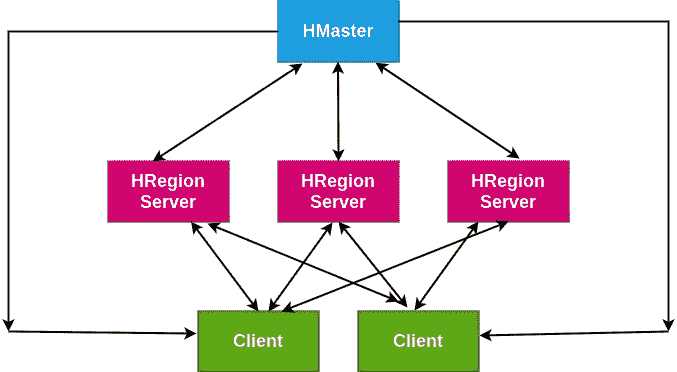
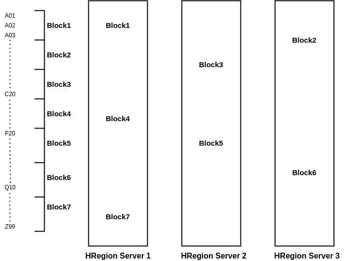
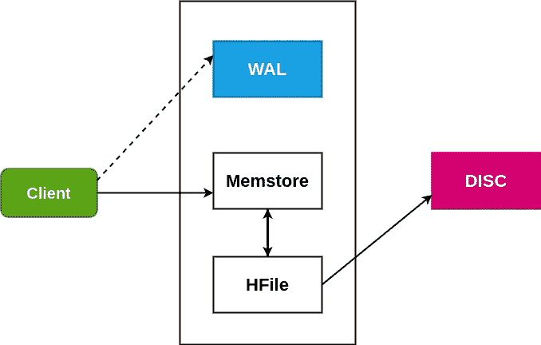
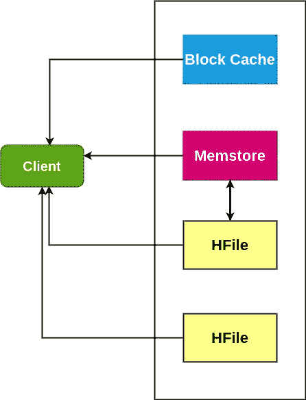

# 数据库:概述

> 原文：<https://towardsdatascience.com/databases-an-overview-97c54628b824?source=collection_archive---------19----------------------->


[活动发起人](https://unsplash.com/@campaign_creators?utm_source=unsplash&utm_medium=referral&utm_content=creditCopyText)在 [Unsplash](https://unsplash.com/s/photos/database?utm_source=unsplash&utm_medium=referral&utm_content=creditCopyText) 上的照片

## 第 2 部分:MongoDB 和 HBase 分布式文件系统的底层架构以及 Python 中的数据库操作

在本文中，我们将讨论当今世界提供大数据解决方案所基于的架构，即分布式文件系统，并了解它们实际上是如何实现的。在本系列的[第 1 部分中，我们已经讨论了基本的数据库概念和安装过程。作为先决条件，请随意检查。](/databases-an-overview-cdb5ca696e1b)

MongoDB 和 Hbase 都是分布式 NoSQL 数据库，广泛用于处理大型数据问题。让我们进入架构和实现细节。

## MongoDB

MongoDB 是一个基于文档的 NoSQL 数据库。它不需要固定的模式定义。Mongo DB 将数据存储为二进制 JSON 或 BSON。它支持水平缩放。几个服务器实例组成一个集群来支持 Mongo DB 作为一个分布式系统。

MongoDB 使用 MongoDB 查询语言，并支持即席查询、复制和分片。分片是 MongoDB 的一个特性，有助于它作为分布式数据系统运行。让我们看看 MongoDB 是如何实现这些特性的。

**Mongo 中的复制**

复制是一项非常重要的功能，可以防止一台服务器上的数据丢失，提高数据的可用性，并提供故障保护。

MongoDB 使用概念副本集实现复制。副本集是一组托管相同数据集的 mongod 实例。选择其中一个节点作为主要节点。这称为主节点。所有其他节点称为次节点。主节点接收来自用户的所有操作，并且通过使用相同的操作从主节点更新辅助节点以保持一致性。如果主节点关闭，则选择一个次节点作为主节点，并继续执行操作。当故障节点恢复时，它作为辅助节点加入集群。我们可以使用 **mongo Atlas 来控制我们的 Mongo 实例集群。** Mongo 集群是基于水平扩展和添加实例的思想创建的。



副本集示意图:作者提供的图像

**Mongo DB 中的分片**

MongoDB 使用分片来跨多台机器存储数据。它使用水平扩展来添加更多的机器，以根据负载和需求的增长来分发数据和操作。

MongoDB 中的分片安排主要有三个组件:

1.  **碎片或副本集:**每个碎片充当一个单独的副本集。他们存储所有的数据。他们的目标是提高数据的一致性和可用性。
2.  **配置服务器:**它们就像集群的管理者。这些服务器包含集群的元数据。他们实际上拥有集群数据到碎片的映射。当查询到来时，查询路由器使用来自配置服务器的这些映射来定位所需的碎片。
3.  **查询路由器:**查询路由器是作为用户应用程序接口的 mongo 实例。它们接受来自应用程序的用户查询，并向应用程序提供所需的结果。通常，每个集群有多个查询路由器用于负载分布。



作者图片

上图展示了 MongoDB 的分片安排。尽管该映像只有 2 个查询服务器和分片，但实际集群中通常有更多，尽管默认情况下集群中有 3 个配置服务器。

我们上面谈到的思想是 MongoDB 操作及其分布式数据系统架构背后的两个最重要的思想。

现在，让我们看看 Apache HBase 是如何实现分布式系统的思想的。

## Apache HBase

Apache HBase 是一个基于列值的 NoSQL 数据库。它基本上存储了基于表或模式的 MySQL 数据库所存储内容的转置。不同的行或记录有不同数量的列或字段。在操作过程中，可以在任何地方插入或更新列。该模式是完全动态的，因此不需要预先声明。最适合非结构化数据。它是水平可伸缩的，特别适合稀疏数据。

HBase 实际上是为处理海量数据而设计的，广泛用于社交媒体运营，每天都会产生大量数据。因此，HBase 通常用于集群中至少有 5 台服务器，并且复制系数至少为 3 的情况。

Apache HBase 是使用 MapReduce 和 Google FileTable 背后的思想开发的，作为一个由 Apache 保护伞支持的开源数据库。Apache HBase 使用了几个有趣的概念，作为领先的技术巨头使用的其他数据库的基本思想。

**MapReduce**

MapReduce 是一个框架，它的目标是以一种更快、更好维护的方式处理大量数据。它还打算引入并行访问，以便加快速度。MapReduce 的思想主要包含两个部分:映射和简化，正如它的名字所描述的那样。

映射部分由称为映射器的组件执行。映射器检查数据库中插入的每一行数据，并将它们分解成一种键值对。因此，它接收原始输入数据并创建更小的数据块。这是第一阶段。

还原部分基本包含洗牌和还原两个部分。这些操作由称为减速器的部件来完成。reducers 的功能是将映射器的输出进一步分解成更紧凑的键值对。Reducers 的输出存储在底层文件系统中。

输入数据进入文件系统，从那里它被发送到映射器，然后到缩减器。缩减器的输出被保存回文件系统。文件系统中有控制转发流量和网络流量的主节点。

整个系统是用 JAVA 开发的。



MapReduce 架构:作者图片

**Hadoop 文件系统**

HBase 使用 Hadoop 文件系统作为底层架构。Hadoop 文件系统是由 Apache 开发人员在 Google 的文件表论文中提出这个想法后构建的。让我们检查一下文件系统架构的工作基础。



作者图片

上图描述了 HBase 底层的 Hadoop 文件系统。它有一些基本组件:

**Namenode:**Namenode 是一个包含 Hadoop 集群元数据的 Linux 系统。它管理客户端数据访问，也管理文件系统的命名空间。

**数据节点:**数据节点是 Linux 系统，它根据用户或客户端的请求对数据进行读写指令，并根据 Namenodes 的请求进行创建、删除和复制。

系统中还有其他重要部分，如 Jobtracker 和 TaskTracker。在启动 Hbase 之前，我们需要运行 HDFS 系统，并使名称和数据节点联机。

让我们看看 HBase 的架构组件:

**HBase 架构**



作者图片

上图显示了 HBase 的架构。它主要包含两个主要部分:

1.  **HMaster** :组件不存储数据。它是一种控制器。它控制 HRegion 服务器和客户端请求。它有元数据，充当集群的主节点。
2.  **HBase 客户端:**这是 HBase 通过其与应用程序进行交互的组件。
3.  **HRegion Server:** 这个组件实际存储数据。一个集群有多个 HRegion 服务器。数据基于块分布在多个 HRegion 服务器上。



作者图片

因此，基本上，插入的数据块被分解成块，这些块分布在 HRegion 服务器中，并由集群的 HMaster 管理。

**读/写架构**

**写作:**



作者图片

在 HBase 中，写操作如上图所示。HBase 创建一个名为 Memstore 的有限内存缓存。客户端在 Memstore 中写入。现在，由于内存有限，Memstore 很快就满了。每当 Memstore 完全填满时，就会创建一个 Memstore 快照并保存为 HFile。HFile 随后被转移到磁盘上进行永久存储。Memstore 是临时存储器。因此，如果出现故障，可能会丢失数据。为了防止 Hbase 维护称为 WAL 或预写日志的东西。它是保存在光盘中的记录或日志。如果一些记录丢失了，就从磁盘上的 WAL 中检索出来。

**阅读:**



作者图片

阅读就是这样做的。一旦内存存储的快照保存为 HFile，内存存储就会被刷新。因此，必须搜索所有的 HFile 和光盘来获取信息。这就导致了大量的时间消耗。因此，为了节省时间，创建了称为块缓存的东西来保存频繁访问的信息。因此，首先搜索 Memstore 来访问数据，然后在失败时，搜索块缓存。之后，搜索 Hfiles。

**更新和删除**

更新和删除不是在客户端传递命令的瞬间完成的。这些命令被保存为标志、更新标志或删除标志。Hfiles 是不可变的，也就是说，一旦写入，就不能更改。因此，当这些 Hfiles 被合并以写入光盘时，这些值被更新或删除。因此，为了访问数据，HBase 还需要检查 Hfiles，以在返回查询结果之前查看是否有这样的标志。

我们已经讨论了 HBase 的所有整体思想和概念。

我们看到的 Hbase 和 MongoDB 的概念是大多数当前 NoSQL 数据库使用的一般概念。

## **用 Python 实现**

让我们看看 python 如何使用和访问数据库。首先，我们需要了解 MySQL、MongoDB 和 HBase 之间的基本结构差异。

MySQL 在最顶层有数据库。在第二层，有表格。在最低级别或最后一级，有记录或行。所以，每个数据库都有表，每个表都有记录

MongoDB 有数据库。每个数据库都有集合而不是表。每个集合都有最低层的文档，描述键值对。

HBase 的最高级别只有表。然后它有行索引或索引，就像每个记录的主键。要在 HBase 中执行任何操作，我们需要知道必须是唯一的行或记录 id。HBase 也有柱族的概念。它没有固定的模式，但是列族有助于全面了解表的数据记录中的列。每个表只能有一个列族。

**MySQL:**

实现 MySQL-python 和 mysql-connector-python 是为了从 python 提示符或使用 python 代码访问正在运行的 MySQL 数据库。

MySQL-python 可以从 [*这里*](https://pypi.org/project/MySQL-python/) 安装。

mysql-connector-python 可以从[这里的*安装。*](https://pypi.org/project/mysql-connector-python/)

语法:

关系

```
**import** **MySQLdb**
**import** **mysql.connector**
conn= mysql.connector.connect(host="localhost",user="abhijit",passwd="1234",db="users" )
mycursor = conn.cursor()
```

插入:

```
mycursor = conn.cursor()
mycursor.execute('INSERT INTO user_details (id,email,password) VALUES("**%s**","**%s**","**%s**")'%(id1,email,passwd))
conn.commit()
```

查询:

```
query="""SELECT * FROM user_details WHERE email='**%s**'"""%(email)
mycursor = conn.cursor()
mycursor.execute(query)
dup=mycursor.fetchall()
i=mycursor.rowcount
```

**MongoDB**

PyMongo 库用于从 Python 提示符访问 MongoDB。

pymongo 库可以从这里的 [*安装。*](https://pypi.org/project/pymongo/)

Pymongo 的官方教程可以在这里 找到 [*。*](https://api.mongodb.com/python/current/tutorial.html)

语法:

连接:

```
**import** **pymongo**
**from** **pymongo** **import** MongoClient
client = MongoClient()
client = MongoClient('localhost', 27017)
db_mongo = client['user_connections']   #selecting database
m_user_recs= db_mongo['user_records']   #selecting collections
```

插入:

```
data={
	'c_id':'abhi',
	'connections':['123','myac.a','abhir'],
	'posts':[]}
m_user_recs.insert(data)
```

因此，我们可以在 mongo 文档中插入任何数据类型。它可以是列表，甚至是子文档。

查询:

```
recs=m_user_recs.find({"c_id":id1})     #(1)
f**or** r **in** recs: 
   frnds=r['connections']               #(2)
```

查询(1)返回字段“c_id”的值为 id1 的文档。(2)代码片段从返回的文档中选择“连接”字段。

更新:

```
myquery = { "c_id": id1 }
new_val={"$set": { "req_sent": cons }}

m_user_recs.update(myquery, new_val)
```

该查询将“req_sent”字段的值设置为由变量“cons”给出，其中字段“c_id”具有由变量 id1 给出的值。

**HBase**

HappyBase 库用于从 Python 访问 Apache HBase。

Happybase 可以从 [*这里*](https://pypi.org/project/happybase/) 安装。

Hbase 的官方教程是 [*这里是*](https://happybase.readthedocs.io/en/happybase-0.4/tutorial.html) *。*

```
$ create 'table_name', 'column-family' 
```

上述语法可用于从 HBase shell 创建 HBase 表。

语法:

连接:

```
**import** **happybase**
conn=happybase.Connection('localhost')
table=conn.table('users')
```

插入:

```
table.put(id_u, {b'cf_user_1:name': record[1],b'cf_user_1:from': record[2],b'cf_user_1:Education': record[3],b'cf_user_1:Profession': record[4],b'cf_user_1:location': record[5],b'cf_user_1:birthday': record[6],b'cf_user_1:profile_pic': record[7]})
```

上述语法可用于从 python 插入 HBase 表。这里的“id_u”是具有行键的变量。b'cf_user_1 '是列系列，而' name '、' from '是行的字段。

查询:

```
row_f=table.row("Roy Key")

loc=(row_f[b'cf_user_1:location'])
fr=(row_f[b'cf_user_1:from'])
edu=(row_f[b'cf_user_1:Education'])
```

代码片段的第一行可以访问该行。接下来的几行访问相应的字段。

我们已经看到了这些库以及它们在 python 中的相应用法。

## 结论

在当前世界中，随着社交媒体网站和云的概念日益发展，大数据的概念越来越受到关注。每天都有大量的数据上传到云端。所以，我们已经越过了这个点，数据量可以由世界各地的一百或一千台计算机来处理。现在，分布式系统将会越来越受欢迎。像 Cassandra、FileTable、CouchDB 和 Hadoop 这样的数据库开始被 Linkedin 和脸书这样的普通和最大的社交媒体网站所使用。

在本文中，我们已经看到了 python 中的概念及其工作方式和库。如果你想要一个工作实例，请在这里 找到我的 GitHub 库 [*。*](https://github.com/abr-98/Database_ops_with_python)

希望这有所帮助。