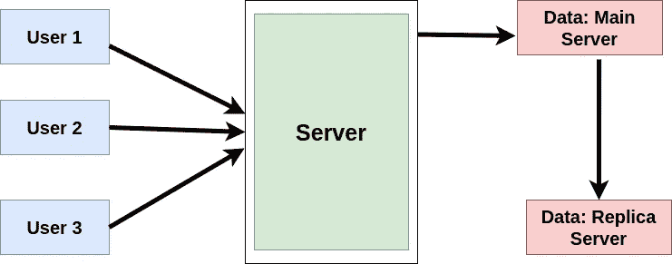
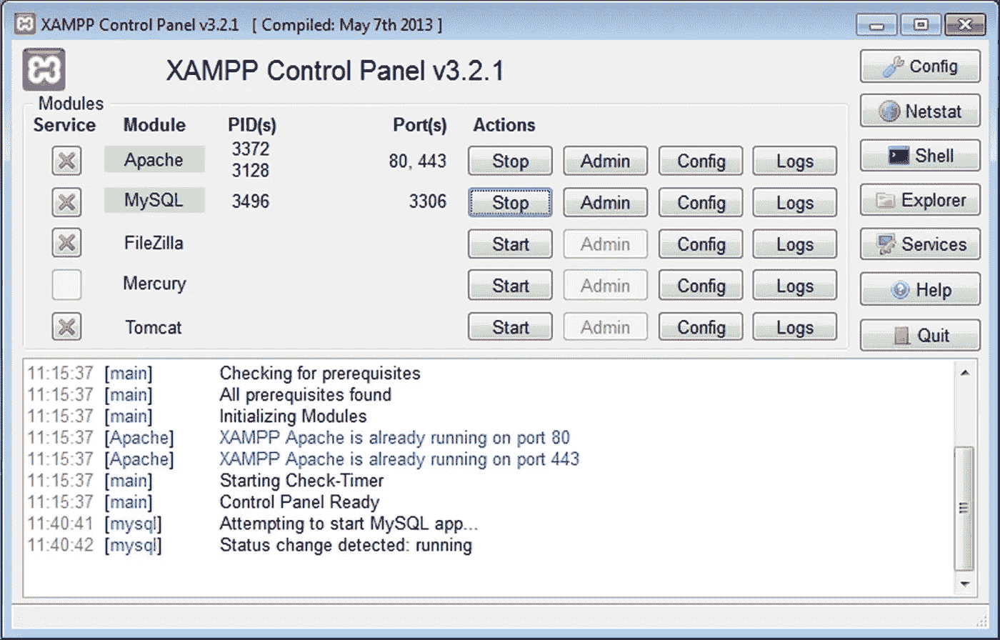
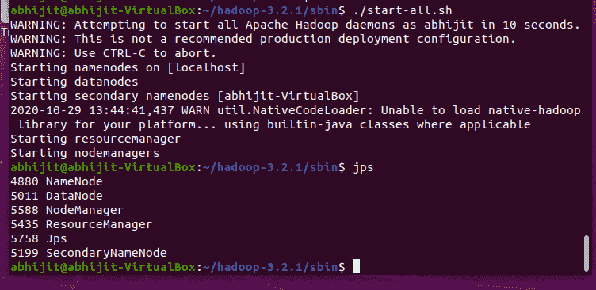
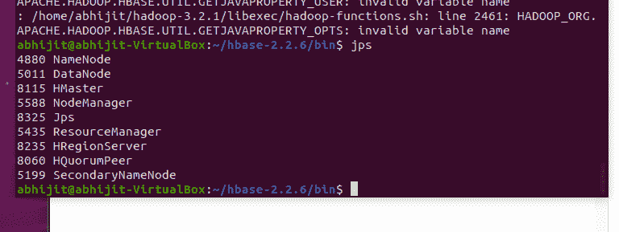
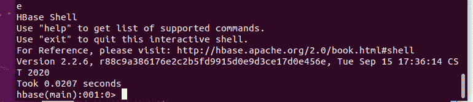
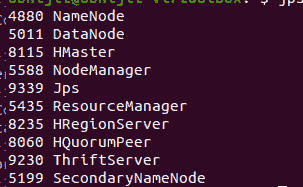

# 数据库:概述

> 原文：<https://towardsdatascience.com/databases-an-overview-cdb5ca696e1b?source=collection_archive---------39----------------------->


[活动发起人](https://unsplash.com/@campaign_creators?utm_source=unsplash&utm_medium=referral&utm_content=creditCopyText)在 [Unsplash](https://unsplash.com/s/photos/database?utm_source=unsplash&utm_medium=referral&utm_content=creditCopyText) 上的照片

## [入门](https://towardsdatascience.com/tagged/getting-started)

## 第 1 部分:概念和安装:MySQL、HBase、MongoDB

在当今世界，我们必须处理大量的数据，并以一种有利的方式存储这些数据。如今，每天都有大量的数据来自脸书和 Twitter 等社交媒体网站。以前，我们主要处理结构化数据，即可以包含在表格结构中的数据，因此，我们在所有情况下都使用 MySQL。在当前的场景中，首先，数据是以非结构化的方式获取的，并且需要以非结构化的方式存储；其次，数据是以海量的方式获取的。因此，不可能在一台服务器上存储一个数据库的全部内容，需要同时访问多台服务器。当前的数据库还需要容错，即如果一个数据库服务器由于某种原因出现故障，数据不会丢失，并且如果该服务器上的数据被用户访问，其他服务器会响应请求。

所有这些原因导致了 NoSQL 和分布式数据库系统的设计。目前，Oracle、PostgreSQL、Microsoft SQL services 等 SQL 数据库被广泛用于处理结构化数据，而 MongoDB、Hadoop、Amazon 的 DynamoDB 和 Hbase 等 NoSQL 数据库被用于处理非结构化数据。

## 属性和概念

如今，我们广泛使用 SQL 和 NoSQL 数据库。它们没有一个比另一个更好，它们是根据情况的要求来选择的。NoSQL 数据库支持变量模式，因此在声明期间不需要模式定义。它们最适合动态数据。SQL 数据库需要模式定义，但是拥有一种结构化语言并具有像 JOIN 这样的属性，易于使用并与复杂查询兼容。

让我们检查一些重要的概念。

原则:SQL 和 NoSQL 都遵循一些原则。它们是:

**酸性**

1.  **原子性**:SQL 数据库上的事务或操作要么完全执行，要么根本不执行。
2.  **一致性**:在 SQL 数据库上执行操作或事务前后，数据库的状态保持不变。例如:A 在银行有 2000 单位的存款，B 有 1000 单位，总数是 3000。现在，如果 A 转账 500 给 B，同样在操作之后，总额保持不变。这就叫一致性。
3.  **隔离:**该属性确保即使几个事务同时发生，所有的事务都是互斥的，换句话说，是隔离的
4.  **持久性:**该属性确保一旦事务被提交，它就被保存并且不再被修改

**上限理论**

1.  **一致性:**表示服务器网络中存储相同数据的所有节点读取最近写入的值，并相应地进行更新。
2.  可用性:它声明每个请求都应该收到一个响应，无论是成功还是失败，并且它可以处理多个请求。
3.  **分区容差:**表示数据库成功运行，没有数据或消息丢失或系统的任何部分出现故障。

**缩放**


伸缩的概念在分布式系统的开发中起着巨大的作用。扩展是一种系统，它允许服务器不断发展，以应对不断增长的数据量。主要有两种方式。第一个是垂直缩放。这个概念以前使用过。这个概念表明，我们一直使用一个实例，并随着数据负载的增加而更新实例的大小和性能。这个过程非常昂贵，但易于实施。一些 SQL 数据库使用垂直缩放

第二个概念是水平缩放。一些 NoSQL 数据库，如 MongoDB 和 CouchDB，使用水平伸缩。分布式系统是使用这个概念实现的。创建了几个服务器计算机集群。每台服务器计算机称为一个实例。水平扩展意味着我们应该向集群添加更多的实例来处理更多的数据。

**复制**



复制的概念是当前分布式数据库系统中另一个非常重要的概念。来自一个数据库服务器的数据被复制到其他副本服务器。因此，数据是分布式的。这一概念创建了备份并提高了可用性。在 MongoDB 的例子中。服务器中的数据分布在该集群中的其他服务器中。其中一台服务器充当主服务器，其他服务器充当副本服务器。如果主服务器出现故障，将选择其中一个副本服务器作为主服务器。一旦故障服务器保持运行，它将作为副本加入群集。在数据更新的情况下，主服务器从应用程序获取更新，然后更新的数据与所有副本同步以保持一致性。

## NoSQL 数据库:类型

NoSQL 不仅代表 SQL。非结构化数据是指不能以表格方式存储的数据。设计了几种 NoSQL 方法来处理这些类型的数据。其中最常见的是:

**文档数据库:**这些数据库以 JSON 格式保存数据。他们使用键值对。它们是可定制的，最适合动态数据。每个键可能有也可能没有相同数量的字段。例如:MongoDB 和 CouchDB。结构:


**列数据库:**这些数据库将数据写入列而不是行。每一行都有一个特定的行 id。这里的每个操作都是使用行 id 执行的。这种类型的数据库背后的想法是，每条记录可能不包含所有列的值。因此，我们修复 row_id 并按列输入数据。每条记录的列数可能相同，也可能不同。比方说，在 facebook 注册中，需要很多数据。不同的用户填写不同数量的字段，在这种情况下，基于列的数据库广泛用于仅存储输入的数据。例如:Apache Cassandra、Apache Hbase


对于基于列的结构，我们需要为表定义一个列族。它类似于表定义的一部分，尽管它并不严格。

**键值存储:**这些类型的数据库工作起来像哈希函数或哈希表，它们是不可定制的。例如:Redis

**基于图形的数据库:**这些数据库把每一条记录看作一个节点，把值看作节点的特征。例如:Neo4J

在系列文章中，我们将讨论三个最常用的数据库:MySQL、MongoDB 和 HBase 以及它们在 python 中的实现。

**安装**

我用的是 Ubuntu 18.04 系统。我正在为 ubuntu 系统提供安装。

**MySQL**

它是一个关系数据库。它是一个免费的发行版，由 oracle 提供支持。它可以独立安装并从终端使用，也可以使用 PHPMyAdmin。对于第二个选项，需要安装 apache 服务器，或者可以通过 LAMP (Linux、Apache、MySQL、PHP/Python/Perl)堆栈应用程序(如 XAMPP)使用。



Xampp 应用程序

对于 MySQL 安全安装。执行给定的步骤:

```
$ sudo apt update
$ sudo apt install mysql-server
$ sudo mysql_secure_installation
```

这些步骤将以安全的方式安装 MySQL。最后一步将让您创建安全用户并为他们设置密码。

**MongoDB**

MongoDB 是使用最多的 NoSQL 数据库。它的工作原理是分布式数据库系统。我们可以使用下面给出的步骤在我们的系统上设置一个单一的机器集群数据库。MongoDB 是一个文档数据库，使用键值对。该安装仅适用于 ubuntu 18.04。对于其他版本，相应的 Ubuntu 版本是不同的。安装步骤:

```
$ wget -qO - [https://www.mongodb.org/static/pgp/server-4.4.asc](https://www.mongodb.org/static/pgp/server-4.4.asc) | sudo apt-key add -
$ echo "deb [ arch=amd64,arm64 ] [https://repo.mongodb.org/apt/ubuntu](https://repo.mongodb.org/apt/ubuntu) bionic/mongodb-org/4.4 multiverse" | sudo tee /etc/apt/sources.list.d/mongodb-org-4.4.list
$ sudo apt-get update
$ sudo apt-get install -y mongodb-org
```

以上代码为相应的发行版安装了最新版本的 MongoDB。

要启用或启动 mongo:

```
$ sudo systemctl status mongodb
$ sudo systemctl mongodb start
```

MongoDB 通常在本地主机和端口 27017 上运行。启动 MongoDB 的大多数错误都是在端口上运行其他操作时发生的。MongoDB 创建一个“data”文件夹来保存 Mongo 的数据和元数据。有些错误是由于无法访问数据文件夹而引发的。

第一个错误可以使用以下命令来纠正:

```
$ ~ netstat -an | grep 27017
```

这将列出端口上所有活动的进程。您需要终止这些进程并重新启动 mongo。

对于第二个错误，我们需要在外部创建 data 文件夹，并让 mongo 使用它。步骤:

```
$ cd /Users
$ cd home
$ mkdir data
$ cd data
$ mkdir db
$ mongod --dbpath ~/data/db
```

重启 mongo，我们就可以开始了。

通常在重启 mongo 服务时会停止。在进行调试步骤之前，请检查 mongo DB 的状态，如果没有运行，请重新启动它们。

我们可以使用 Mongo Compass 来使用 Mongo 的 GUI 版本。这里的是免费且容易获得的[。](https://www.mongodb.com/try/download/compass)

**HBase**

HBase 是一个 NoSQL 数据库。这是一个基于列的数据库。它用于非结构化数据，并且是可伸缩的。HBase 是一个由自由分布的数据库驱动的 apache。它也可以使用系统集群，但是我们可以创建一个单独的系统集群。

HBase 在底层使用 Hadoop 数据库文件系统，所以我们需要先安装 Hadoop，它也可以在 java 上工作，所以我们需要安装 Java 来操作 Hbase。

因此，要安装 Hadoop，请遵循以下步骤:

```
$ sudo apt update
$ sudo apt install openjdk-8-jdk -y
$ java -version; javac -version
```

这些命令将安装 java，最后一行将提供安装的 Java JDK 的路径和版本。我们需要拯救这条路。

接下来，开始步骤:

```
sudo apt install openssh-server openssh-client -y
ssh-keygen -t rsa -P '' -f ~/.ssh/id_rsa
cat ~/.ssh/id_rsa.pub >> ~/.ssh/authorized_keys
chmod 0600 ~/.ssh/authorized_keys
ssh localhost
```

这些步骤将允许用户连接到本地主机。

接下来，进入 Hadoop 的[官方页面，选择版本并下载二进制版本。这可以手动完成，或者我们可以使用“wget”命令来安装。对于版本 3.2.1，我们可以使用代码片段](https://hadoop.apache.org/releases.html)

```
**wget** [**https://mirrors.estointernet.in/apache/hadoop/common/hadoop-3.2.1/hadoop-3.2.1.tar.gz**](https://mirrors.estointernet.in/apache/hadoop/common/hadoop-3.2.1/hadoop-3.2.1.tar.gz)
```

我们的 Hadoop 将被下载。

为了安装，我们需要配置 Hadoop 文件和 Bash 来更新环境变量。按照步骤进行配置

```
$ sudo gedit .bashrc
```

在 Bashrc 中粘贴以下行:

```
export HADOOP_HOME=/home/abhijit/hadoop-3.2.1
export HADOOP_INSTALL=$HADOOP_HOME
export HADOOP_CONF_DIR=$HADOOP_HOME/etc/hadoop
export HADOOP_MAPRED_HOME=$HADOOP_HOME
export HADOOP_COMMON_HOME=$HADOOP_HOME
export HADOOP_HDFS_HOME=$HADOOP_HOME
export YARN_HOME=$HADOOP_HOME
export HADOOP_COMMON_LIB_NATIVE_DIR=$HADOOP_HOME/lib/native
export PATH=$PATH:$HADOOP_HOME/binexport JAVA_HOME=/usr/lib/jvm/java-8-openjdk-amd64
export PATH=$PATH=$JAVA_HOME/bin
```

这些只是环境变量和下载路径。请根据您的下载位置进行检查。如果出现错误，请相应地更改 Hadoop 主路径，因为该文件夹保存在您的系统上。要让更新后的 bash 工作，请使用:

```
$ source ~/.bashrc
```

接下来，使用

```
$ cd hadoop-3.2.1
$ cd etc
$ cd hadoop
$ ls
```

在这里，我们必须更新文件:

*   hadoop-env.sh
*   核心网站. xml
*   hdfs-site.xml
*   mapred-site-xml
*   yarn-site.xml

因此，使用“gedit”打开每个文件，粘贴相应的行并进行更改。

**hadoop-env.sh**

```
export JAVA_HOME=/usr/lib/jvm/java-8-openjdk-amd64
```

该行存在，但被注释掉了。我们只需要取消注释并进行修改。我们必须确保路径与我们保存在 bash 文件中的路径相同。

**core-site.xml**

```
<configuration>
<property>
<name>hadoop.tmp.dir</name>
<value>/home/abhijit/tmpdata</value>
</property>
<property>
<name>fs.default.name</name>
<value>hdfs://127.0.0.1:9000</value>
</property>
</configuration>
```

请相应地更新值部分。我在用我的分机。这些文件在安装时自动创建。如果未创建“tmpdata”文件夹，请手动创建并更新路径

```
$ mkdir tmpdata
```

**hdfs-site.xml**

```
<configuration>
<property>
<name>dfs.data.dir</name>
<value>/home/abhijit/dfsdata/namenode</value>
</property>
<property>
<name>dfs.data.dir</name><value>/home/abhijit/dfsdata/datanode</value>
</property>
<property>
<name>dfs.replication</name>
<value>1</value>
</property>
</configuration>
```

该文件包含基本的 Hadoop 文件系统配置。

**mapred-site-xml**

```
<configuration>
<property>
<name>mapreduce.framework.name</name>
<value>yarn</value>
</property>
</configuration>
```

**yarn-site.xml**

```
<configuration>
<property>
<name>yarn.nodemanager.aux-services</name>
<value>mapreduce_shuffle</value>
</property>
<property>
<name>yarn.nodemanager.aux-services.mapreduce.shuffle.class</name>
<value>org.apache.hadoop.mapred.ShuffleHandler</value>
</property>
<property>
<name>yarn.resourcemanager.hostname</name>
<value>127.0.0.1</value>
</property>
<property>
<name>yarn.acl.enable</name>
<value>0</value>
</property>
<property>
<name>yarn.nodemanager.env-whitelist</name>
<value>JAVA_HOME,HADOOP_COMMON_HOME,HADOOP_HDFS_HOME,HADOOP_CONF_DIR,CLASSPATH_PERPEND_DISTCACHE,HADOOP_YARN_HOME,HADOOP_MAPRED_HOME</value>
</property>
</configuration>
```

保存所有文件，我们就可以开始了

接下来，返回“hadoop-3.2.1”主文件夹，使用以下命令:

```
hdfs namenode -format
```

这将格式化创建的 namenode 文件夹。

接下来，使用:

```
$ cd sbin
$ ./start-all.sh
```

最后一个命令启动所有服务。

运行后，它将看起来像:



我们可以使用“jps”命令来列出正在运行的守护进程

现在，我们准备安装 HBase。

要安装，我们可以使用 wget 命令，也可以从[下载 URL](http://www.apache.org/dyn/closer.lua/hbase/) 手动下载

我使用过 HBase-2.2.6，使用:

```
wget [http://www.apache.org/dyn/closer.lua/hbase/](http://www.apache.org/dyn/closer.lua/hbase/)[hbase-2.2.6-bin.tar.gz](https://mirrors.estointernet.in/apache/hbase/2.2.6/hbase-2.2.6-bin.tar.gz)
```

如果您是手动下载，请将其粘贴到主目录中。

接下来，在 Hbase 中，我们还需要进行一些配置。我们需要在环境变量中添加 Hbase 路径:

```
$ gedit .bashrc
```

然后，我们需要粘贴这些行来更新环境变量:

```
export HBASE_HOME=/home/abhijit/hbase-2.2.6
export PATH=$PATH:$HBASE_HOME/binNow, close the file and use *source ~/.bashrc*
```

我们需要去 conf 文件夹。

```
$ cd hbase-2.2.6
$ cd conf
```

在 conf 中，我们需要打开“hbase-env.sh”文件，并粘贴下面给出的行，就像我们在前面的例子中所做的一样:

```
export JAVA_HOME=/usr/lib/jvm/java-8-openjdk-amd64
```

接下来，我们需要更新 hbase-site.xml

**hbase-site.xml**

```
<property>
<name>hbase.cluster.distributed</name>
<value>true</value>
</property>
<property>
<name>hbase.tmp.dir</name>
<value>./tmp</value>
</property>
<property>
<name>hbase.unsafe.stream.capability.enforce</name>
<value>false</value>
</property>
<property>
<name>hbase.zookeeper.quorum</name>
<value>localhost</value>
</property>
<name>dfs.replication</name>
<value>1</value>
</property>
<property>
<name>hbase.zookeeper.property.clientPort</name>
<value>2181</value>
</property>
<property>
<name>hbase.rootdir</name>
<value>hdfs://127.0.0.1:9000/hbase</value>
</property>
<property>
<name>hbase.zookeeper.property.dataDir</name><value>/home/abhijit/zookeeper</value>
</property>
</configuration>
```

请相应地注意“tmp”和“zookeeper”文件夹的文件位置。

现在，我们可以走了。

我们需要转移到“hbase-2.2.6/bin”并使用。/start-hbase.sh 启动服务。

```
$ cd hbase-2.2.6/bin
$  ./start-hbase.sh
```



在这里，我们可以看到 HMaster、HRegionServer 和 HQuorumPeer 正在运行。这表明我们的 HBase 服务器已经启动并正在运行。

我们可以使用 HBase shell 来访问我们的 HBase:



通常 Hbase 在端口 9000 上运行。

如果我们想用 python 访问 Hbase，它有一个‘happy base’库。它使用节俭网关访问 Hbase。为此，我们还需要在 9090 端口上运行 thrift，使用:

```
hbase thrift start -p 9090
```



我们也将能够看到我们的节俭服务器运行。我们现在可以使用 Hbase 了。

**结论**

在本文中，我们已经了解了如何安装数据库以及数据库中的一些基本概念。本系列的第 2 部分讨论了 python 中的概念和工作示例。

希望这有所帮助。