# fastai 中使用 Lego Minifigures 数据集的数据块 API 和图像分类

> 原文：<https://towardsdatascience.com/datablocks-api-image-classification-in-fastai-using-lego-minifigures-dataset-3360f97175fe?source=collection_archive---------40----------------------->

## 我可以一整天都这样——史蒂夫·罗杰斯

本帖涵盖的主题如下

*   [简介](#f92c)
*   [任务](#a8a1)
*   [fastai 数据块 API](#6216)
*   [训练分类模型](#0f11)
*   [解释分类模型](#c9cc)
*   [参考文献](#8d63)

您可以点击上面的任何主题，导航到相应的部分


[张家瑜](https://unsplash.com/@danielkcheung?utm_source=medium&utm_medium=referral)在 [Unsplash](https://unsplash.com?utm_source=medium&utm_medium=referral) 上的照片

# 介绍

图像分类自古以来就是一项非常常见的任务，然而直到深度学习之后，计算机才能够熟练地完成这项任务。随着卷积神经网络的出现，这项任务变得如此出色，以至于近年来计算机在一些分类应用中也击败了人类。建立一个模型来进行图像分类(MNIST 数字识别)标志着许多初学者深度学习之旅的开始。因此，让我们做同样的事情，只是让它变得更令人兴奋，通过使用一个在 Kaggle 上策划的数据集，叫做乐高迷你人物分类。

由杰瑞米·霍华德和西尔万·古格开发的 fastai 是一个基于 PyTorch 构建的库，用于深度学习实践者简化构建/训练和从 DL 模型进行推断的过程。用相对较短的代码，您可以为几乎所有的任务(分类、回归(结构化和非结构化数据)、协作过滤等)建立最先进的模型。)使用这个库；这就是制作它所付出的努力。所以让我们充分利用它，从图像分类这个任务开始。

# 任务

我们有 27 个由乐高建造的不同迷你人物的图像，这些图像是从 Kaggle 这里获得的。我们必须建立一个分类器，当给定一个特定的迷你人物的图像时，它可以告诉哪个超级英雄/角色。让我们读入数据集，看看其中的几个条目。

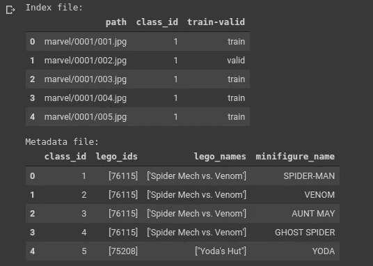

图片由 Vinayak 提供

正如我们所看到的，索引文件保存了加载需要提供给模型的数据所需的信息，元数据包含了关于不同类的信息。

当我们仔细观察迷你人像时，可以观察到 class_id 1 和 class_id 17 都代表蜘蛛侠。id 17 中的蜘蛛侠是漫威超级英雄系列中的一个，因此被相应地重新命名为漫威蜘蛛侠。一旦完成，我们就可以将 class_id 上的索引和元数据文件作为主键连接起来。

此外，数据块 API 期望列 train-valid 是一列布尔值，如果该行属于验证集，则该列的值为 true，否则为 false。因此也进行了更改，完成所有这些后，最终的数据帧如下所示。

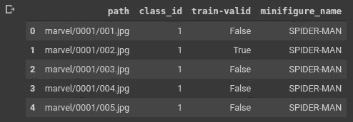

图片由 Vinayak 提供

让我们分别看看训练集和验证集中的图像数量。一般来说，它们的比例相等是好的，而且它们应该属于同一个种群。让我们看看数据的分布情况。

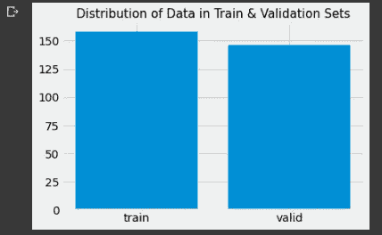

图片由 Vinayak 提供

数据集看起来非常平衡，在训练集和验证集中各有近 150 个元素。嗯，关于图像标准，这个数字对于训练神经网络分类器来说是相当低的。当有大量图像时，深度神经网络学习良好的表示函数。相对于正常的深度学习标准，每个分类标签有数百或数千张图像是非常正常的。在这里，我们有 27 个类的 300 多张图片，这意味着我们每个类的图片不超过 10-12 张。让我们看看使用这些数据可以建立多好的模型。

# fastai 数据块 API

在任何应用中，将大量时间消耗在以适合于馈送到深度学习模型的格式来管理数据上。为了简化这一过程，以便任何 DL 实践者都可以专注于模型构建和解释，而不是数据管理，fastai 提出了 DataBlock API，它在数据管理方面非常出色。

通常，数据以下列两种方式之一进行组织

## Imagenet 目录结构

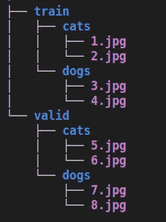

图片由 Vinayak 提供

在这种格式中，数据是以文件夹方式管理的。训练集和验证集有单独的文件夹，并且它们中的每一个都有对应于各自类别的文件夹，这些类别具有对应于那些类别的相关数据。除此之外，树结构是针对一个以 Imagenet 目录形式管理的猫狗数据集的。

## 将信息包装在 csv 中

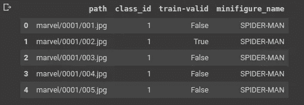

图片由 Vinayak 提供

在这种方法中，关于数据结构的信息被包装在一个 csv 中。它包含所有信息，如数据的路径、数据的类别、项目是否属于定型集或验证集等等。我们当前的数据集是以这种特殊格式管理的，我们将利用它来创建数据块。

fastai 的 datablock API 提供了对这两种结构甚至更多结构的支持，但是，我们将看看 API 的一般结构，以及我们如何使用它来解决这个问题。

datablock API 接受几个参数，有些是强制的，有些是可选的。我们将按顺序逐一讲解。

1.  **块:**为了指定输入和输出。这里，我们有一个图像作为输入，一个类别/标签作为输出。我们的输出是 CategoryBlock，但其他输出可以是 ImageBlock(用于自动编码器)，MultiCategoryBlock(用于多标签分类)等。
2.  **splitter:** Jeremy 总是强调验证集的重要性，以便评估模型的性能，这是对的！如果不这样做，我们永远不会真正了解我们的模型表现得有多好。要做到这一点，我们可以指定一个 *RandomSplitter* 或者在我们的例子中指定一个条目是属于训练集还是验证集的列。
3.  **get_x:** 该参数要求输入的位置，即此处的图像块。在我们的数据帧中，第一列即 path 列包含路径，因此我们指定 cols = 0。我们也可以选择使用 pref 和 suff 参数在这里添加前缀和后缀。因为我们有图像的相对路径，要获得绝对路径，需要前缀。在 CSV 中，有时会删除路径列中项的扩展名，这正是后缀参数派上用场的地方。
4.  **get_y:** 该参数要求输出值。在 dataframe 中，由于第 4 列即 minifigure_name 是我们想要预测的标签，我们在 get_y 参数的 ColReader 对象中指定 cols = 3。
5.  **item_tfms:** 在为神经网络训练制作一批项目之前，我们需要应用一些变换来确保它们都是相同的大小(通常是正方形)，并且在某些其他情况下，还需要一些其他变换。这些在这个论点中都有提及。
6.  **batch_tfms:** 这些是您希望用于通过裁剪、缩放、透视扭曲和其他此类变换使模型学习一般特征的增强方法。如果您已经有一个包含大量图像的大型数据集，您可以选择忽略此参数，否则，添加变换来学习一般化的模型而不是过度拟合的模型总是有帮助的。

一旦我们有了 DataBlock API 对象，我们就可以使用这个对象创建数据加载器，并将其输入到模型中进行训练。在创建 dataloader 之后，我们可以看到如何使用 *show_batch* 方法将数据输入到模型中，随后可以使用 *vocab* 属性来查看数据集中作为一个整体出现了多少个类/标签。

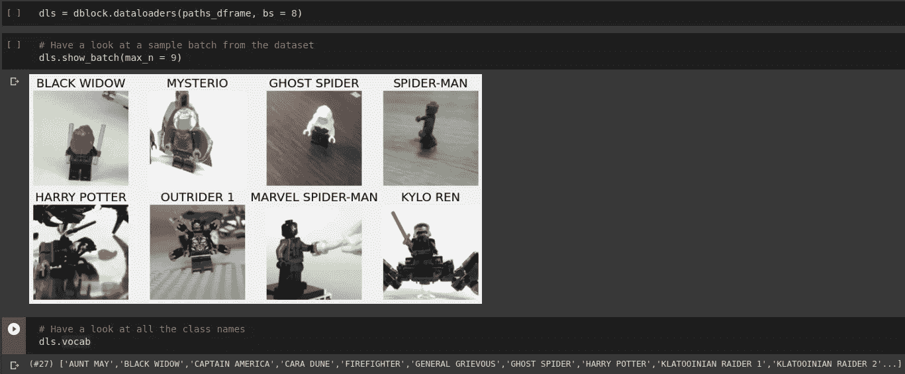

图片由 Vinayak 提供

dataloaders 对象包含训练和验证数据加载器。vocab 中的项目对应于与列车数据加载器相关的类别，验证数据加载器的标签/类别数量可能少于或等于列车数据加载器的标签/类别数量。另外，请注意，在 show_batch 方法中，您可以提供想要查看的项目数量，但是如果该数量大于批处理大小(9，而不是 bs 的 8)，那么您将只能看到与批处理大小一样多的图像。

# 训练分类模型

一旦你有了一个数据加载器，下一步就是创建一个模型，并用一个合适的优化算法来训练它。fastai 已经抽象了很多这些东西，并为你提供了一个非常简单的学习对象，它也有很多参数，但让我强调下面最重要的几个。

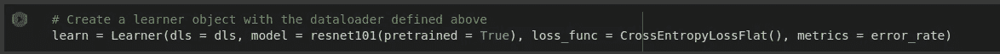

图片由 Vinayak 提供

我们的学习者对象采用的强制参数如下:

1.  **dls:** 我们使用上面的数据块 API 定义的 dataloader 对象。它包含训练和验证数据集及其标签。
2.  **模型:**这是您想要使用的模型架构。因为我们正在进行迁移学习，所以我们将使用一个根据 ImageNet 权重训练的预定义 resnet101 模型。但是，如果您愿意，您可以通过继承 nn 来构建自己的 PyTorch 模型。模块类及其转发方法的实现；这超出了本文的范围，所以我们不在这里讨论。
3.  **loss_func:** 也称为目标/成本函数，这是优化算法试图最小化的函数(在大多数情况下；除非你定义了一个最大化的目标)。对于分类，交叉熵损失和回归 MSE 损失是最常用的损失函数。

其他可选但重要的参数是 opt_func 和 metrics，opt _ func 指定用于训练模型的优化算法，metrics 指定衡量性能的指标(可以是准确度、精确度、召回率、任何自定义指标)。还有一个调用不同回调的功能，这不在本文的讨论范围之内。你可以[参考这里](https://docs.fast.ai/callback.core#)了解更多关于相同的东西。

一旦我们有了学习者对象，我们就可以利用 lr_find 函数为我们的模型找到一个最优的学习率。查看损失与学习率曲线，我们应该选择损失最小的学习率或略低于该点的学习率。对学习速率保持保守是有好处的，因为在我个人看来，延迟收敛比超过最佳点更容易容忍。

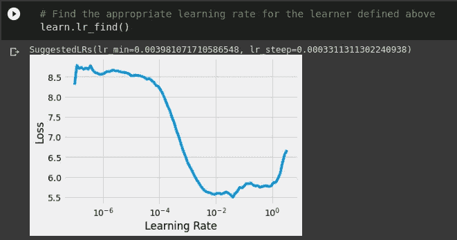

图片由 Vinayak 提供。

该函数还给出 lr_min 和观察到损耗下降最大的点的建议。lr_min 是对最小学习速率的估计，应该选择该最小学习速率，以便看到适当的训练速度，而不会非常担心跳过损失面中的最佳点，同时确保模型正在学习某些东西并且参数更新正在发生。因此，在这种情况下，让我们选择 0.01 的学习率并开始训练。

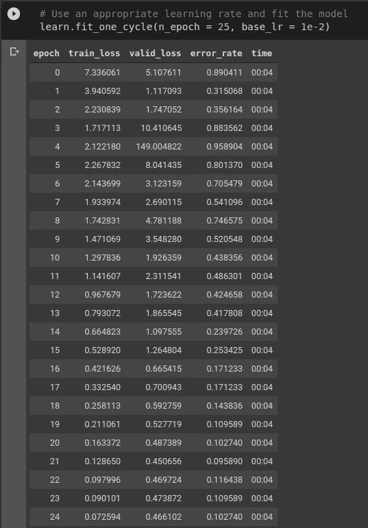

图片由 Vinayak 提供

由于我们只有大约 154 个训练图像，每个历元花费大约 4 秒进行验证和度量计算。在这种情况下，对于 resnet101 预训练模型，其顶部 fc 层和几个倒数第二卷积层获得权重更新，而网络的其余部分被冻结，即权重更新不会再向后传播。根据经验，这种微调方法在为定制任务采用预先训练的模型时是最好的；然而，经过实质性的改进后，例如当错误率下降到 10%或准确率达到近 90%时，我们也可以解冻网络的这一部分，并使用现在贯穿整个神经网络的参数更新来再次训练模型。

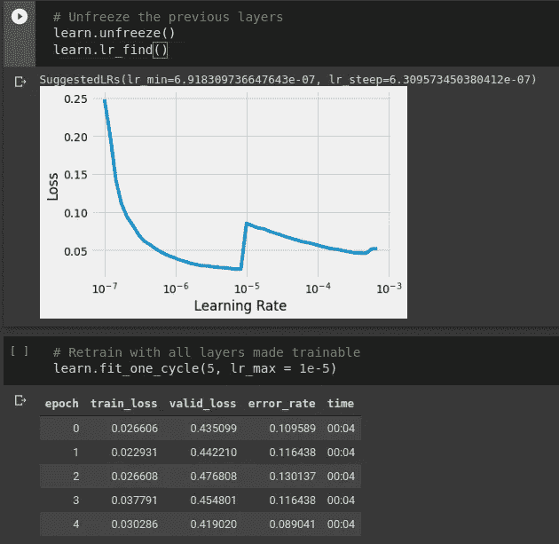

图片由 Vinayak 提供

这正是我们在这里所做的。在训练了 25 个时期后，我们解冻了模型，并在 lr_find 的帮助下检查了良好的学习率，并运行了 5 个时期的训练循环。然而，我们没有发现错误率有任何实质性的改善。从 10.27%下降到 8.9%；这表明模型现在已经饱和，无论您对模型做什么，除非您提供新的数据，否则不会对模型的准确性产生任何重大影响。

为了保存这个模型以便将来解释，您可以简单地使用命令

```
learn.export("filename.pkl")
```

这将把模型保存为一个名为 filename 的 pkl 文件，以后可以重新加载该文件进行推理。现在我们已经完成了所有的训练部分，让我们来解释这个模型，看看它已经做出的预测。

# 解释分类模型

在建立模型之后，需要测量模型的性能以确保其可用性，fastai 为此提供了一个类分类解释。我们可以用适合培训部分的学习者对象创建这个类的一个实例。

一旦我们做到了这一点，我们就可以观察验证数据的混淆矩阵，看看错误发生在哪里以及有多少个错误。

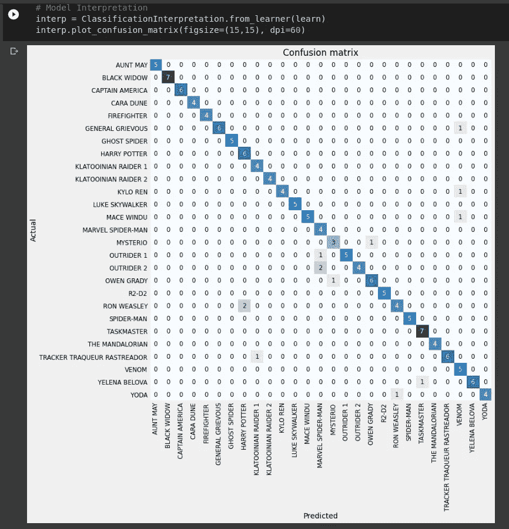

图片由 Vinayak 提供

这个整体结构看起来不错。在理想情况下，对角线完全饱和，所有其他非对角线元素为零。这里我们可以看到事实并非如此。这意味着我们的模型把一些动作人物分类错了，例如罗恩·韦斯莱被错误地归类为哈利·波特，一个 YODA 的人物被错误地归类为罗恩·韦斯莱，等等。为了特别突出那些被错误分类的，ClassificationInterpretation 类还多了一个方法。

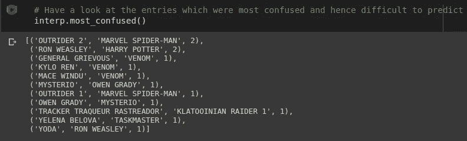

图片由 Vinayak 提供

这里我们可以看到错误分类项目的元组。每个元组的结构分别为(基础事实、预测、误分类数)。可选地，您还可以提供一个参数，该参数只查看那些被错误分类超过某个阈值次数的对。这可以帮助我们确定需要更多关注的配对。因此，我们可以做出决定，如添加更多的数据或删除错误标记的数据等。

虽然在我的应用程序中，所有的东西都被整齐地标记了，但还是会有如下的错误标记。上面的代码有助于在笔记本中创建一个内嵌的 GUI，基本上可以用来保存/删除/移动项目。这存在于 fastai.vision 包的 widgets 类中。如果您有时不确定数据集中的标签，像这样审核数据集值得一试。

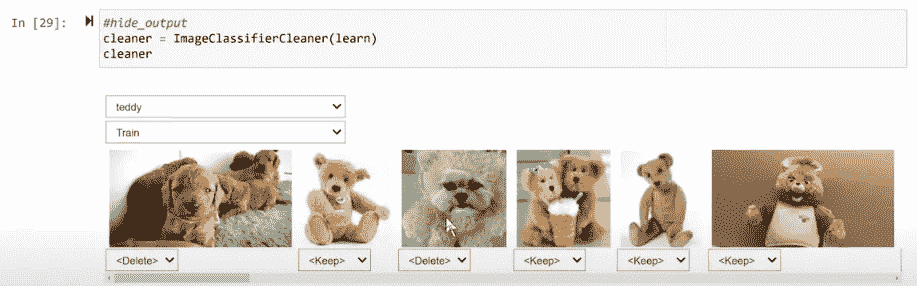

图片由 Vinayak 提供

这就是这篇文章的内容。我希望你了解开始使用 fastai 制作你自己的图像分类器的步骤。它在数据预处理、模型训练和模型解释方面为我节省了大量时间，特别是在深度学习方面。与 PyTorch 不同，在 py torch 中，我们必须定义数据集和数据加载器，datablock API 消除了对这一步骤的需要，因为它很好地将一切打包到一个函数调用中。希望你喜欢这篇文章，感谢你通读！

# 参考

1.  [乐高迷你人偶数据集](https://www.kaggle.com/ihelon/lego-minifigures-classification)
2.  [宠物分类笔记本](https://colab.research.google.com/github/fastai/fastbook/blob/master/05_pet_breeds.ipynb#scrollTo=iC8TjN36Lo-K)
3.  [Github 回购本帖子中的代码](https://github.com/ElisonSherton/fastai-basic-notebooks)