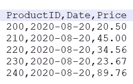
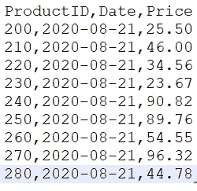

# 数据湖之上的数据库—第 1 部分

> 原文：<https://towardsdatascience.com/databricks-delta-lake-database-on-top-of-a-data-lake-fbc45eab3841?source=collection_archive---------12----------------------->

## 第 1 部分(共 2 部分)—了解 Databricks Delta Lake 的基础知识—ACID 事务、检查点、事务日志和时间旅行


图片由[皮克斯拜](https://pixabay.com/?utm_source=link-attribution&utm_medium=referral&utm_campaign=image&utm_content=2899901)的 Gerd Altmann 提供

回到 8 年前，我仍然记得我采用 Hadoop 和 Spark 等大数据框架的日子。由于许多原因，来自数据库背景的这种适应具有挑战性。最大的挑战是大数据框架中缺少类似数据库的事务。为了弥补这个缺失的功能，我们必须开发几个例程来执行必要的检查和测量。然而，这一过程既繁琐又耗时，而且很容易出错。

另一个让我夜不能寐问题是可怕的变更数据捕获(CDC)。数据库有一种方便的方式来更新记录并向用户显示记录的最新状态。另一方面，在大数据中，我们接收数据并将其存储为文件。因此，每日增量摄取可能包含新插入、更新或删除的数据的组合。这意味着我们最终会在数据湖中多次存储同一行。这产生了两个问题:

1.  重复数据—在某些情况下，同一行存在多次(更新和删除的数据)
2.  数据分析—除非数据已经过重复数据消除，否则用户在看到同一行的多个实例时会感到困惑

那么，到目前为止，我们是如何处理这种情况的:

*   一天—接收完整数据集—完整表格
*   第 2 天-第 n 天—确保交付的增量数据(增量)带有记录更新时间戳和模式(插入/更新/删除)
*   在原始区域中接收数据后，运行 Hive/Mapreduce/Spark 修复作业，将增量数据与完整数据合并。
*   然而，在这个阶段，它巧妙地使用了移除重复项的功能，比如对主键分区的 RANK()和记录更新时间戳 DESC
*   过滤秩=1 的行会给出最近更新的行
*   用 Mode=Delete 删除行
*   将上述数据集保存到监管区——然后与用户社区共享这些数据，以便进一步分析

如你所见，上述过程非常复杂。需要一种更好的方法。

## 三角洲湖的救援

由 Databricks 开发的 Delta Lake 为批处理和流操作的数据湖带来了 ACID 事务支持。Delta Lake 是一个开源存储层，用于 HDFS、AWS S3、Azure 数据湖存储或谷歌云存储上的大数据工作负载。

Delta Lake 包含许多对数据工程师有用的酷功能。让我们在两部分系列中探索其中的一些特性:

第 1 部分:ACID 事务、检查点、事务日志和时间旅行

第二部分:真空，图式进化，历史

**用例:**一个电子商务网站销售来自多家供应商的产品。每个供应商每天都会发送其产品的最新价格。



产品 _aug20.csv



产品 _aug21.csv

该电子商务公司希望根据供应商每天发送的最新价格来调整其网站上的定价信息。此外，他们希望跟踪 ML 型号的价格。左边是每天收到的数据文件的示例。

让我们从下载数据开始:

```
$ git clone https://github.com/mkukreja1/blogs.git
```

假设今天是 8 月 20 日，您收到了文件— products_aug20.csv

将数据文件保存到 HDFS

```
$ hadoop fs -mkdir -p /delta_lake/raw
$ hadoop fs -put blogs/delta-lake/products_aug20.csv /delta_lake/raw
```

完整的笔记本可在**/delta _ lake/delta _ lake-demo-1 . ipynb 获得。**让我解释一下下面的每个步骤:

首先用 Delta Lake 包启动 Spark 会话，然后导入 Python APIs

```
from pyspark.sql import SparkSession
import pyspark
from pyspark.sql.functions import *
spark = pyspark.sql.SparkSession.builder.appName("Product_Price_Tracking") \
  .config("spark.jars.packages", "io.delta:delta-core_2.12:0.7.0") \
  .config("spark.sql.extensions", "io.delta.sql.DeltaSparkSessionExtension") \
    .config("spark.sql.catalog.spark_catalog", "org.apache.spark.sql.delta.catalog.DeltaCatalog") \
    .getOrCreate()from delta.tables import *
```

使用最近收到的数据——products _ aug 20 . CSV——创建 Spark 数据框架

```
df_productsaug20 = spark.read.csv('hdfs:///delta_lake/raw/products_aug20.csv', header=True, inferSchema=True)
df_productsaug20.show()+---------+----------+-----+
|ProductID|      Date|Price|
+---------+----------+-----+
|      200|2020-08-20| 20.5|
|      210|2020-08-20| 45.0|
|      220|2020-08-20|34.56|
|      230|2020-08-20|23.67|
|      240|2020-08-20|89.76|
+---------+----------+-----+
```

现在让我们将数据存储在三角洲湖中。Delta Lake 使用版本化的拼花文件将您的数据存储在您的云存储中。此外，还会存储一个事务日志来跟踪数据随时间的变化。

```
df_productsaug20.write.format("delta").option("path", "hdfs:///delta_lake/products").saveAsTable("products")
```

让我们看看日期在 HDFS 是如何存储的。记下存储一段时间内的更改的 _delta_log 目录。

每次提交= 1 个 JSON 文件，以 00000000000000000.json 开始

每 10 次提交，就会执行一个检查点，将以前的 JSON 文件合并成一个 parquet 文件。

```
$ hadoop fs -ls /delta_lake/products
Found 2 items
drwxr-xr-x   - mkukreja supergroup          0 2020-08-26 20:43 /delta_lake/products/_delta_log
-rw-r--r--   2 mkukreja supergroup       1027 2020-08-26 20:43 /delta_lake/products/part-00000-37f5ec8d-5e21-4a01-9f19-7e9942196ef6-c000.snappy.parquet$ hadoop fs -cat /delta_lake/products/_delta_log/00000000000000000000.json
2020-08-26 20:44:42,159 INFO sasl.SaslDataTransferClient: SASL encryption trust check: localHostTrusted = false, remoteHostTrusted = false
{"commitInfo":{"timestamp":1598489011963,"operation":"CREATE TABLE AS SELECT","operationParameters":{"isManaged":"false","description":null,"partitionBy":"[]","properties":"{}"},"isBlindAppend":true,"operationMetrics":{"numFiles":"1","numOutputBytes":"1027","numOutputRows":"5"}}}
{"protocol":{"minReaderVersion":1,"minWriterVersion":2}}
{"metaData":{"id":"7788c86b-ae7e-47be-ac43-76c1f3f0506f","format":{"provider":"parquet","options":{}},"schemaString":"{\"type\":\"struct\",\"fields\":[{\"name\":\"ProductID\",\"type\":\"integer\",\"nullable\":true,\"metadata\":{}},{\"name\":\"Date\",\"type\":\"string\",\"nullable\":true,\"metadata\":{}},{\"name\":\"Price\",\"type\":\"double\",\"nullable\":true,\"metadata\":{}}]}","partitionColumns":[],"configuration":{},"createdTime":1598489010883}}
{"add":{"path":"part-00000-37f5ec8d-5e21-4a01-9f19-7e9942196ef6-c000.snappy.parquet","partitionValues":{},"size":1027,"modificationTime":1598489011874,"dataChange":true}}$ hadoop fs -cat /delta_lake/products/_delta_log/00000000000000000000.json
2020-08-26 20:44:42,159 INFO sasl.SaslDataTransferClient: SASL encryption trust check: localHostTrusted = false, remoteHostTrusted = false
{"commitInfo":{"timestamp":1598489011963,"operation":"CREATE TABLE AS SELECT","operationParameters":{"isManaged":"false","description":null,"partitionBy":"[]","properties":"{}"},"isBlindAppend":true,"operationMetrics":{"numFiles":"1","numOutputBytes":"1027","numOutputRows":"5"}}}
{"protocol":{"minReaderVersion":1,"minWriterVersion":2}}
{"metaData":{"id":"7788c86b-ae7e-47be-ac43-76c1f3f0506f","format":{"provider":"parquet","options":{}},"schemaString":"{\"type\":\"struct\",\"fields\":[{\"name\":\"ProductID\",\"type\":\"integer\",\"nullable\":true,\"metadata\":{}},{\"name\":\"Date\",\"type\":\"string\",\"nullable\":true,\"metadata\":{}},{\"name\":\"Price\",\"type\":\"double\",\"nullable\":true,\"metadata\":{}}]}","partitionColumns":[],"configuration":{},"createdTime":1598489010883}}
{"add":{"path":"part-00000-37f5ec8d-5e21-4a01-9f19-7e9942196ef6-c000.snappy.parquet","partitionValues":{},"size":1027,"modificationTime":1598489011874,"dataChange":true}}
```

这就是我们如何使用 Spark SQL 查询 Delta Lake 中最近保存的数据

```
spark.sql('SELECT * FROM products').show()+---------+----------+-----+
|ProductID|      Date|Price|
+---------+----------+-----+
|      200|2020-08-20| 20.5|
|      210|2020-08-20| 45.0|
|      220|2020-08-20|34.56|
|      230|2020-08-20|23.67|
|      240|2020-08-20|89.76|
+---------+----------+-----+
```

您可以使用时间旅行来查询增量表的以前快照。如果想在数据被覆盖之前访问它，可以使用`versionAsOf`选项查询表的快照。

```
deltaTable.update("ProductID = '200'", { "Price": "'48.00'" } )df = spark.read.format("delta").option(**"versionAsOf", 1**).load("hdfs:///delta_lake/products")
df.show()*# Notice the value of Price for ProductID=200 has changed in version 1 of the table*+---------+----------+-----+
|ProductID|      Date|Price|
+---------+----------+-----+
|      200|2020-08-20| **48.0**|  
|      210|2020-08-20| 45.0|
|      220|2020-08-20|34.56|
|      230|2020-08-20|23.67|
|      240|2020-08-20|89.76|
+---------+----------+-----+df = spark.read.format("delta").option(**"versionAsOf", 0**).load("hdfs:///delta_lake/products")
df.show()*# Notice the value of Price for ProductID=200 is the older snapshot in version 0*+---------+----------+-----+
|ProductID|      Date|Price|
+---------+----------+-----+
|      200|2020-08-20| **20.5**|
|      210|2020-08-20| 45.0|
|      220|2020-08-20|34.56|
|      230|2020-08-20|23.67|
|      240|2020-08-20|89.76|
+---------+----------+-----+
```

让我们执行另一个 DML 操作，这次删除 ProductID=210。

```
deltaTable.delete("ProductID = 210") 
df = spark.read.format("delta").option(**"versionAsOf", 2**).load("hdfs:///delta_lake/products")
df.show()*# Notice the value of Price for ProductID=210 is missing in Version 2*+---------+----------+-----+
|ProductID|      Date|Price|
+---------+----------+-----+
|      200|2020-08-20| 48.0|
|      220|2020-08-20|34.56|
|      230|2020-08-20|23.67|
|      240|2020-08-20|89.76|
+---------+----------+-----+
```

请注意，事务日志有所进展，每个事务一个日志

```
$ hadoop fs -ls /delta_lake/products/_delta_log
Found 3 items
-rw-r--r--   2 mkukreja supergroup        912 2020-08-21 13:14 /delta_lake/products/_delta_log/00000000000000000000.json
-rw-r--r--   2 mkukreja supergroup        579 2020-08-24 11:03 /delta_lake/products/_delta_log/00000000000000000001.json
-rw-r--r--   2 mkukreja supergroup        592 2020-08-24 11:14 /delta_lake/products/_delta_log/00000000000000000002.json
```

特别注意事务日志的 JSON 中的*操作*属性

```
$ hadoop fs -cat /delta_lake/products/_delta_log/*.json{"commitInfo":{"timestamp":1598489978902,**"operation":"CREATE TABLE AS SELECT"**,"operationParameters":{"isManaged":"false","description":null,"partitionBy":"[]","properties":"{}"},"isBlindAppend":true,"operationMetrics":{"numFiles":"1","numOutputBytes":"1027","numOutputRows":"5"}}}
{"protocol":{"minReaderVersion":1,"minWriterVersion":2}}
{"metaData":{"id":"47d211fc-7148-4c85-aa80-7d9aa8f0b7a2","format":{"provider":"parquet","options":{}},"schemaString":"{\"type\":\"struct\",\"fields\":[{\"name\":\"ProductID\",\"type\":\"integer\",\"nullable\":true,\"metadata\":{}},{\"name\":\"Date\",\"type\":\"string\",\"nullable\":true,\"metadata\":{}},{\"name\":\"Price\",\"type\":\"double\",\"nullable\":true,\"metadata\":{}}]}","partitionColumns":[],"configuration":{},"createdTime":1598489977907}}
{"add":{"path":"part-00000-8c43a47a-02bf-4bc2-a3be-aaabe9c409bd-c000.snappy.parquet","partitionValues":{},"size":1027,"modificationTime":1598489978816,"dataChange":true}}
2020-08-26 21:07:41,120 INFO sasl.SaslDataTransferClient: SASL encryption trust check: localHostTrusted = false, remoteHostTrusted = false
{"commitInfo":{"timestamp":1598490235896,**"operation":"UPDATE"**,"operationParameters":{"predicate":"(ProductID#609 = 200)"},"readVersion":0,"isBlindAppend":false,"operationMetrics":{"numRemovedFiles":"1","numAddedFiles":"1","numUpdatedRows":"1","numCopiedRows":"4"}}}
{"remove":{"path":"part-00000-8c43a47a-02bf-4bc2-a3be-aaabe9c409bd-c000.snappy.parquet","deletionTimestamp":1598490235237,"dataChange":true}}
{"add":{"path":"part-00000-272c0f65-433e-4901-83fd-70b78667ede0-c000.snappy.parquet","partitionValues":{},"size":1025,"modificationTime":1598490235886,"dataChange":true}}
2020-08-26 21:07:41,123 INFO sasl.SaslDataTransferClient: SASL encryption trust check: localHostTrusted = false, remoteHostTrusted = false
{"commitInfo":{"timestamp":1598490393953,**"operation":"DELETE"**,"operationParameters":{"predicate":"[\"(`ProductID` = 210)\"]"},"readVersion":1,"isBlindAppend":false,"operationMetrics":{"numRemovedFiles":"1","numDeletedRows":"1","numAddedFiles":"1","numCopiedRows":"4"}}}
{"remove":{"path":"part-00000-272c0f65-433e-4901-83fd-70b78667ede0-c000.snappy.parquet","deletionTimestamp":1598490393950,"dataChange":true}}
{"add":{"path":"part-00000-73a381e1-fa68-4323-81b9-c42dea484542-c000.snappy.parquet","partitionValues":{},"size":1015,"modificationTime":1598490393946,"dataChange":true}}
```

现在是第二天，你收到了一个新的数据文件。现在让我们将第二天的新数据集(products_aug21.csv)合并到 Delta Lake 中

```
$ hadoop fs -put csv/products_aug21.csv /delta_lake/raw

$ hadoop fs -ls /delta_lake/raw
Found 2 items
-rw-r--r--   2 mkukreja supergroup        132 2020-08-21 13:00 /delta_lake/raw/products_aug20.csv
-rw-r--r--   2 mkukreja supergroup        220 2020-08-24 11:33 /delta_lake/raw/products_aug21.csv
```

执行**向上插入**操作。这意味着，如果新文件(products_aug21.csv)中的数据与 Delta Lake 中的任何现有数据匹配(基于 ProductID 上的连接条件),则更新价格，否则插入新行。

```
df_productsaug21 = spark.read.csv('hdfs:///delta_lake/raw/products_aug21.csv', header=True, inferSchema=True)
df_productsaug21.show()deltaTable.alias("products").merge(
    df_productsaug21.alias("products_new"),
                    "products.ProductID = products_new.ProductID") \
                    .**whenMatchedUpdate**(set = { "Price" : "products_new.Price" } ) \
                    .**whenNotMatchedInsert**(values =
                       {
                        "ProductID": "products_new.ProductID",
                        "Date": "products_new.Date",
                        "Price": "products_new.Price"
                       }
                     ).execute()
```

更新后检查表格的最新版本。您可能注意到 ProductID=240 经历了 **whenMatchedUpdate** 操作，而 ProductID=240 直到 280 经历了 **whenNotMatchedInsert 操作。**

```
spark.table("products").show()+---------+----------+-----+
|ProductID|      Date|Price|
+---------+----------+-----+
|      230|2020-08-20|23.67|
|      210|2020-08-21| 46.0|
|      250|2020-08-21|89.76|
|      220|2020-08-20|34.56|
|      240|2020-08-20|90.82|
|      200|2020-08-20| 25.5|
|      260|2020-08-21|54.55|
|      280|2020-08-21|44.78|
|      270|2020-08-21|96.32|
+---------+----------+-----+
```

对于每 10 次提交，Delta Lake 都会在`_delta_log`子目录中以 Parquet 格式保存一个检查点文件。因为检查点文件是 Parquet 格式的，所以与低效的 JSON 文件相比，它允许 Spark 执行更快的读取。

让我们通过更新几行来看看这是如何发生的:

```
deltaTable.update("ProductID = '230'", { "Price": "'33.67'" } )
deltaTable.update("ProductID = '210'", { "Price": "'56.00'" } )
deltaTable.update("ProductID = '250'", { "Price": "'99.76'" } )
deltaTable.update("ProductID = '220'", { "Price": "'44.56'" } )
deltaTable.update("ProductID = '240'", { "Price": "'100.82'" } )
deltaTable.update("ProductID = '200'", { "Price": "'35.5'" } )
deltaTable.update("ProductID = '260'", { "Price": "'64.55'" } )
deltaTable.update("ProductID = '280'", { "Price": "'54.78'" } )
deltaTable.update("ProductID = '270'", { "Price": "'106.32'" } )
```

检查`_delta_log`子目录。在 10 次提交之后，创建了 0000000000000010 . check point . parquet 文件。检查点文件以 Parquet 格式保存表在某个时间点的状态，这样就可以非常高效地检索历史。

```
$ hadoop fs -ls /delta_lake/products/_delta_log
Found 15 items
-rw-r--r--   2 mkukreja supergroup        912 2020-08-21 13:14 /delta_lake/products/_delta_log/00000000000000000000.json
-rw-r--r--   2 mkukreja supergroup        579 2020-08-24 11:03 /delta_lake/products/_delta_log/00000000000000000001.json
-rw-r--r--   2 mkukreja supergroup        592 2020-08-24 11:14 /delta_lake/products/_delta_log/00000000000000000002.json
-rw-r--r--   2 mkukreja supergroup       2255 2020-08-24 11:39 /delta_lake/products/_delta_log/00000000000000000003.json
-rw-r--r--   2 mkukreja supergroup        578 2020-08-24 12:05 /delta_lake/products/_delta_log/00000000000000000004.json
-rw-r--r--   2 mkukreja supergroup        578 2020-08-24 12:05 /delta_lake/products/_delta_log/00000000000000000005.json
-rw-r--r--   2 mkukreja supergroup        578 2020-08-24 12:05 /delta_lake/products/_delta_log/00000000000000000006.json
-rw-r--r--   2 mkukreja supergroup        578 2020-08-24 12:05 /delta_lake/products/_delta_log/00000000000000000007.json
-rw-r--r--   2 mkukreja supergroup        578 2020-08-24 12:05 /delta_lake/products/_delta_log/00000000000000000008.json
-rw-r--r--   2 mkukreja supergroup        578 2020-08-24 12:05 /delta_lake/products/_delta_log/00000000000000000009.json
**-rw-r--r--   2 mkukreja supergroup      14756 2020-08-24 12:05 /delta_lake/products/_delta_log/00000000000000000010.checkpoint.parquet**
-rw-r--r--   2 mkukreja supergroup        578 2020-08-24 12:05 /delta_lake/products/_delta_log/00000000000000000010.json
-rw-r--r--   2 mkukreja supergroup        579 2020-08-24 12:05 /delta_lake/products/_delta_log/00000000000000000011.json
-rw-r--r--   2 mkukreja supergroup        579 2020-08-24 12:05 /delta_lake/products/_delta_log/00000000000000000012.json
-rw-r--r--   2 mkukreja supergroup         25 2020-08-24 12:05 /delta_lake/products/_delta_log/_last_checkpoint
```

很多好东西。我在数据工程和数据科学领域已经玩了几年了，我可以有把握地告诉你，这些特性是一种生活品味。无需再为存储和显示数据库中的最新变更数据集而费尽周折。

在下一部分中，我们将深入探讨 Delta Lake 的一些高级主题，包括分区、模式演化、数据血统和真空。

我希望这篇文章是有帮助的。**三角洲湖**作为大数据 Hadoop、Spark & Kafka 课程的一部分，由 [Datafence 云学院](http://www.datafence.com)提供。课程是周末自己在网上教的。