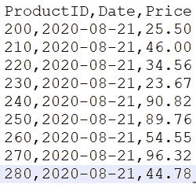
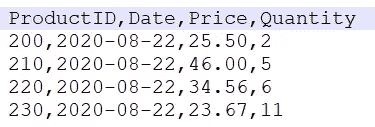

# 数据湖之上的数据库第二部分

> 原文：<https://towardsdatascience.com/databricks-delta-lake-database-on-top-of-a-data-lake-part-2-f44e44f51a63?source=collection_archive---------32----------------------->

## 第 2 部分，共 2 部分——了解 Databricks Delta Lake 的基础知识——分区、模式演变、数据沿袭和真空


图片由[皮克斯拜](https://pixabay.com/?utm_source=link-attribution&utm_medium=referral&utm_campaign=image&utm_content=2899901)的 Gerd Altmann 提供

在第 1 部分中，我们探讨了 Delta Lake 特性(如 ACID 事务、检查点、事务日志和时间旅行)如何对变更数据捕获、处理和管理产生积极影响。在本文中，我们将继续推进我们对一些高级特性的理解，比如分区、模式演化、数据沿袭和真空

## 数据起源/数据血统

从摄取到管理和转换数据经历了一个旅程。这个旅程被称为 ad**T5 数据血统。如今，监管机构对跟踪和审计数据实施了非常严格的指导方针。因此，验证数据沿袭是满足法规遵从性和治理要求的关键活动。**

Delta Lake 将每次写入表的数据沿袭信息存储 30 天。

```
$ git clone [https://github.com/mkukreja1/blogs.git](https://github.com/mkukreja1/blogs.git)
```

完整的笔记本可从**/delta _ lake/delta _ lake-demo-2 . ipynb 获得。**让我解释一下下面的每个步骤:

```
deltaTable = DeltaTable.forPath(spark, "hdfs:///delta_lake/products")df_history = deltaTable.history()
df_history.show(20, False)+-------+-----------------------+------+--------+----------------------+-------------------------------------------------------------------------+----+--------+---------+-----------+--------------+-------------+-----------------------------------------------------------------------------------------------------------------------------------------------------------------------------------------------------------+------------+
|version|timestamp              |userId|userName|operation             |operationParameters                                                      |job |notebook|clusterId|readVersion|isolationLevel|isBlindAppend|operationMetrics                                                                                                                                                                                           |userMetadata|
+-------+-----------------------+------+--------+----------------------+-------------------------------------------------------------------------+----+--------+---------+-----------+--------------+-------------+-----------------------------------------------------------------------------------------------------------------------------------------------------------------------------------------------------------+------------+
|12     |2020-09-01 16:48:45.792|null  |null    |UPDATE                |[predicate -> (ProductID#529 = 270)]                                     |null|null    |null     |11         |null          |false        |[numRemovedFiles -> 1, numAddedFiles -> 1, numUpdatedRows -> 1, numCopiedRows -> 0]                                                                                                                        |null        |
|11     |2020-09-01 16:48:43.906|null  |null    |UPDATE                |[predicate -> (ProductID#529 = 280)]                                     |null|null    |null     |10         |null          |false        |[numRemovedFiles -> 1, numAddedFiles -> 1, numUpdatedRows -> 1, numCopiedRows -> 0]                                                                                                                        |null        |
|10     |2020-09-01 16:48:41.15 |null  |null    |UPDATE                |[predicate -> (ProductID#529 = 260)]                                     |null|null    |null     |9          |null          |false        |[numRemovedFiles -> 1, numAddedFiles -> 1, numUpdatedRows -> 1, numCopiedRows -> 0]                                                                                                                        |null        |
|9      |2020-09-01 16:48:39.497|null  |null    |UPDATE                |[predicate -> (ProductID#529 = 200)]                                     |null|null    |null     |8          |null          |false        |[numRemovedFiles -> 1, numAddedFiles -> 1, numUpdatedRows -> 1, numCopiedRows -> 0]                                                                                                                        |null        |
|8      |2020-09-01 16:48:37.695|null  |null    |UPDATE                |[predicate -> (ProductID#529 = 240)]                                     |null|null    |null     |7          |null          |false        |[numRemovedFiles -> 1, numAddedFiles -> 1, numUpdatedRows -> 1, numCopiedRows -> 0]                                                                                                                        |null        |
|7      |2020-09-01 16:48:35.437|null  |null    |UPDATE                |[predicate -> (ProductID#529 = 220)]                                     |null|null    |null     |6          |null          |false        |[numRemovedFiles -> 1, numAddedFiles -> 1, numUpdatedRows -> 1, numCopiedRows -> 0]                                                                                                                        |null        |
|6      |2020-09-01 16:48:33.499|null  |null    |UPDATE                |[predicate -> (ProductID#529 = 250)]                                     |null|null    |null     |5          |null          |false        |[numRemovedFiles -> 1, numAddedFiles -> 1, numUpdatedRows -> 1, numCopiedRows -> 0]                                                                                                                        |null        |
|5      |2020-09-01 16:48:31.559|null  |null    |UPDATE                |[predicate -> (ProductID#529 = 210)]                                     |null|null    |null     |4          |null          |false        |[numRemovedFiles -> 1, numAddedFiles -> 1, numUpdatedRows -> 1, numCopiedRows -> 0]                                                                                                                        |null        |
|4      |2020-09-01 16:48:29.492|null  |null    |UPDATE                |[predicate -> (ProductID#529 = 230)]                                     |null|null    |null     |3          |null          |false        |[numRemovedFiles -> 1, numAddedFiles -> 1, numUpdatedRows -> 1, numCopiedRows -> 0]                                                                                                                        |null        |
|3      |2020-09-01 16:48:26.544|null  |null    |MERGE                 |[predicate -> (products.`ProductID` = products_new.`ProductID`)]         |null|null    |null     |2          |null          |false        |[numTargetRowsCopied -> 0, numTargetRowsDeleted -> 0, numTargetFilesAdded -> 10, numTargetRowsInserted -> 5, numTargetRowsUpdated -> 4, numOutputRows -> 9, numSourceRows -> 9, numTargetFilesRemoved -> 1]|null        |
|2      |2020-09-01 16:48:19.493|null  |null    |DELETE                |[predicate -> ["(`ProductID` = 210)"]]                                   |null|null    |null     |1          |null          |false        |[numRemovedFiles -> 1, numDeletedRows -> 1, numAddedFiles -> 1, numCopiedRows -> 4]                                                                                                                        |null        |
|1      |2020-09-01 16:48:12.635|null  |null    |UPDATE                |[predicate -> (ProductID#529 = 200)]                                     |null|null    |null     |0          |null          |false        |[numRemovedFiles -> 1, numAddedFiles -> 1, numUpdatedRows -> 1, numCopiedRows -> 4]                                                                                                                        |null        |
|0      |2020-09-01 16:47:31.819|null  |null    |CREATE TABLE AS SELECT|[isManaged -> false, description ->, partitionBy -> [], properties -> {}]|null|null    |null     |null       |null          |true         |[numFiles -> 1, numOutputBytes -> 1027, numOutputRows -> 5]                                                                                                                                                |null        |
+-------+-----------------------+------+--------+----------------------+-------------------------------------------------------------------------+----+--------+---------+-----------+--------------+-------------+-----------------------------------------------------------------------------------------------------------------------------------------------------------------------------------------------------------+------------+ 
```

不需要担心数据审计，因为对数据的每一次更改都有完整的更改审计跟踪作为备份。

简单看一下表上的最后一个操作如下:

```
df_lastOperation = deltaTable.history(1)
df_lastOperation.show()+-------+--------------------+------+--------+---------+--------------------+----+--------+---------+-----------+--------------+-------------+--------------------+------------+
|version|           timestamp|userId|userName|operation| operationParameters| job|notebook|clusterId|readVersion|isolationLevel|isBlindAppend|    operationMetrics|userMetadata|
+-------+--------------------+------+--------+---------+--------------------+----+--------+---------+-----------+--------------+-------------+--------------------+------------+
|     12|2020-09-01 16:48:...|  null|    null|   UPDATE|[predicate -> (Pr...|null|    null|     null|         11|          null|        false|[numRemovedFiles ...|        null|
+-------+--------------------+------+--------+---------+--------------------+----+--------+---------+-----------+--------------+-------------+--------------------+------------+
```

## 模式演变——检测和适应模式变化

一直在创建数据管道的人肯定会对这个问题感兴趣。我们使用通常在项目开始时提供给我们的给定模式来创建和部署管道。在一段时间内，一切都很好，直到有一天管道出错。原来传入文件的模式已经改变。就我个人而言，我已经多次被同一个问题所困扰。在我的第一次攻击中，数据遭到了大范围的破坏，因为我们没有在破坏数据之前**发现它。我仍然记得我们不得不花费无数的时间来处理损坏——修复代码和回溯数据。**

那天我学到了重要的一课— **在接收数据之前验证模式**。这是以后另一篇文章的主题。现在，让我们把注意力集中在三角洲湖如何能有所帮助。

Delta Lake 可以通过在写入时执行模式验证来保护数据。那是什么意思？

1.  这意味着在写入时，新输入数据的模式会与过去的数据进行比较。
2.  如果发现差异，则取消事务—没有数据写入存储—为用户引发异常。现在让我们来看看它的运行情况。这是我们之前摄取的最后一个文件。



产品 _aug21.csv

这是第二天的新文件。请注意，文件的模式已经更改，添加了新的列数量。



产品 _aug22.csv

让我们回顾一下 pypark 代码:

```
df_productsaug22 = spark.read.csv('hdfs:///delta_lake/raw/products_aug22.csv', header=True, inferSchema=True)
df_productsaug22.show()deltaTable = DeltaTable.forPath(spark, "hdfs:///delta_lake/products")df_productsaug22.write.format("delta").mode("append").save("hdfs:///delta_lake/products")AnalysisException                         Traceback (most recent call last)
<ipython-input-15-85affcb142df> in <module>
----> 1 df_productsaug22.write.format("delta").mode("append").save("hdfs:///delta_lake/products")

/opt/spark/python/pyspark/sql/readwriter.py in save(self, path, format, mode, partitionBy, **options)
    825             self._jwrite.save()
    826         else:
--> 827             self._jwrite.save(path)
    828 
    829     @since(1.4)

~/.local/lib/python3.6/site-packages/py4j/java_gateway.py in __call__(self, *args)
   1303         answer = self.gateway_client.send_command(command)
   1304         return_value = get_return_value(
-> 1305             answer, self.gateway_client, self.target_id, self.name)
   1306 
   1307         for temp_arg in temp_args:

/opt/spark/python/pyspark/sql/utils.py in deco(*a, **kw)
    135                 # Hide where the exception came from that shows a non-Pythonic
    136                 # JVM exception message.
--> 137                 raise_from(converted)
    138             else:
    139                 raise

/opt/spark/python/pyspark/sql/utils.py in raise_from(e)

**AnalysisException: A schema mismatch detected when writing to the Delta table** (Table ID: 320f5591-72dd-4f4c-bdac-38f560e90dba).
To enable schema migration using DataFrameWriter or DataStreamWriter, please set:
'.option("mergeSchema", "true")'.
For other operations, set the session configuration
spark.databricks.delta.schema.autoMerge.enabled to "true". See the documentation
specific to the operation for details.

Table schema:
root
-- ProductID: integer (nullable = true)
-- Date: string (nullable = true)
-- Price: double (nullable = true)

Data schema:
root
-- ProductID: integer (nullable = true)
-- Date: string (nullable = true)
-- Price: double (nullable = true)
-- Quantity: integer (nullable = true)

         ;
```

Delta Lake 立即拒绝新文件，因为模式不匹配。相当酷。

如果您对新列没有意见，也就是说，即使存在模式不匹配，您也希望接收数据，那会怎么样呢？使用 option("mergeSchema "，" true ")进行如下操作。

```
df_productsaug22.write.format("delta").mode("append").option("mergeSchema", "true").save("hdfs:///delta_lake/products")spark.table("products").show()+---------+----------+------+--------+
|ProductID|      Date| Price|Quantity|
+---------+----------+------+--------+
|      200|2020-08-22|  25.5|       2|
|      210|2020-08-22|  46.0|       5|
|      220|2020-08-22| 34.56|       6|
|      230|2020-08-22| 23.67|      11|
|      200|2020-08-20|  25.5|    null|
|      250|2020-08-21| 99.76|    null|
|      230|2020-08-20| 23.67|    null|
|      210|2020-08-21|  46.0|    null|
|      220|2020-08-20| 34.56|    null|
|      260|2020-08-21| 64.55|    null|
|      280|2020-08-21| 54.78|    null|
|      270|2020-08-21|106.32|    null|
|      240|2020-08-20|100.82|    null|
+---------+----------+------+--------+
```

新列现在是三角洲湖元数据的一部分。注意，数量数据为以前的数据(< 2020–08–22) has been set to ***)null。***

## 分割

为了显著提高 Delta Lake 中的查询性能，您应该考虑创建一个按列分区的表。选择正确的分区柱非常重要。

1.  选择具有低基数的列，如 date，绝对不要选择顺序 ID 列
2.  选择大小均匀且数据量大(希望大于 1 GB)列

```
df_productsaug_partition = spark.read.csv('hdfs:///delta_lake/raw/*.csv', header=True, inferSchema=True)df_productsaug_partition.write.format("delta").partitionBy("Date").option("path", "hdfs:///delta_lake/products_p").saveAsTable("products_p")$ hadoop fs -ls /delta_lake/products_p
Found 4 items
drwxr-xr-x   - mkukreja supergroup          0 2020-09-01 17:19 /delta_lake/products_p/**Date=2020-08-20**
drwxr-xr-x   - mkukreja supergroup          0 2020-09-01 17:19 /delta_lake/products_p/**Date=2020-08-21**
drwxr-xr-x   - mkukreja supergroup          0 2020-09-01 17:19 /delta_lake/products_p/**Date=2020-08-22**
drwxr-xr-x   - mkukreja supergroup          0 2020-09-01 17:19 /delta_lake/products_p/_delta_log
```

请注意，Delta Lake 已经基于日期列创建了一个分区文件夹结构。

## 真空

Delta Lake 实现了数据版本化，因此它可以按需提供旧版本的数据。随着时间的推移，存储同一数据的多个版本可能会变得非常昂贵。因此，Delta Lake 包含了一个叫做*真空*的清理机制，可以删除旧版本的数据。

```
deltaTable.vacuum()
```

我希望这篇文章是有帮助的。**三角洲湖**作为大数据 Hadoop、Spark & Kafka 课程的一部分，由 [Datafence 云学院](http://www.datafence.com)提供。课程是周末自己在网上教的。