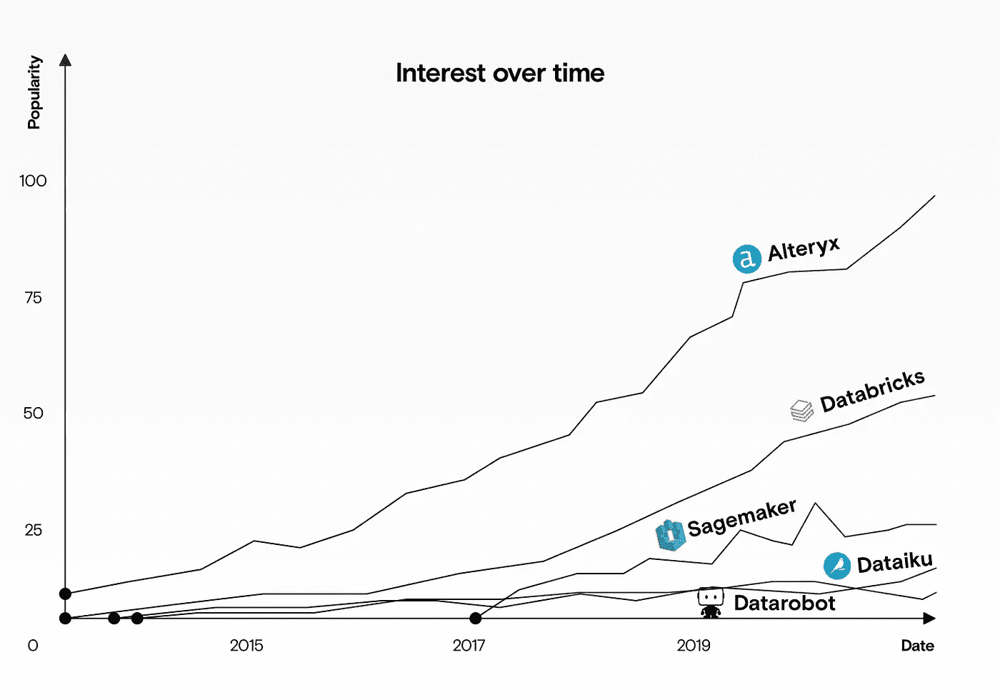
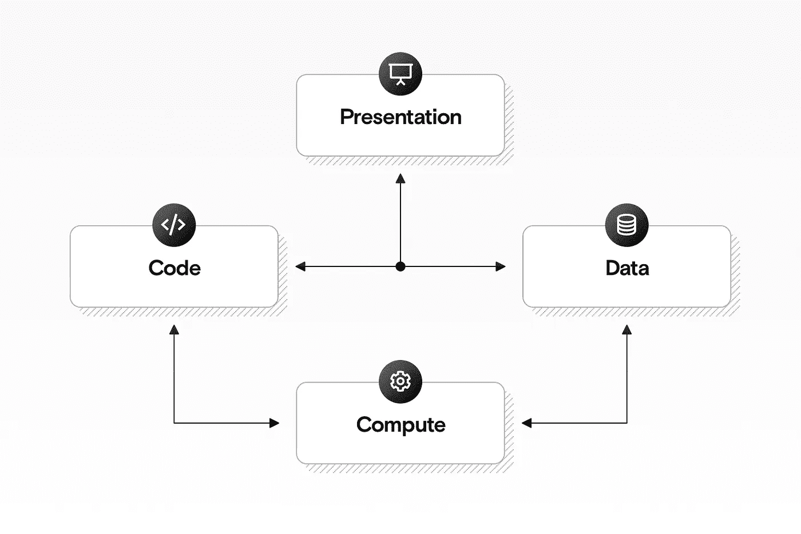
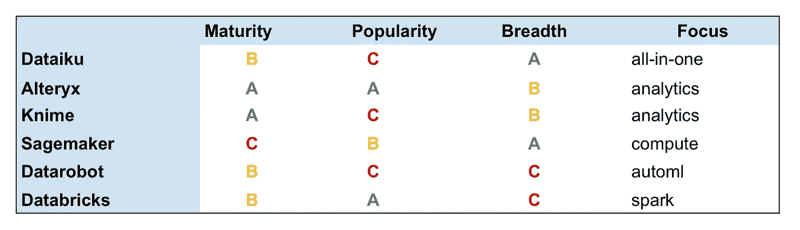

# 比较托管机器学习平台

> 原文：<https://towardsdatascience.com/dataiku-vs-alteryx-vs-sagemaker-vs-datarobot-vs-databricks-b3870bd34813?source=collection_archive---------10----------------------->

## data iku vs . alter yx vs . Sagemaker vs . data robot vs . data bricks

来源:作者

Alteryx 和 Databricks 处于领先地位，并且仍在不断普及。来源:作者

# 什么是托管机器学习平台？

代码只是任何机器学习解决方案的一小部分。通常，公司必须使用不同的工具和服务来端到端地管理机器学习解决方案，包括:

*   **计算服务**整理数据，训练机器学习模型；
*   **数据管理**清理、修改、跟踪和保护数据的工具；
*   **软件工程**编写和维护代码的工具；
*   **仪表板工具**与解决方案互动并查看结果。

托管机器学习服务的四个核心组件。来源:作者

托管机器学习服务的目标是将这些组件集中到一个打包的解决方案中。

但并不是所有的托管机器学习服务都是完全可比的。像 AWS Sagemaker 这样的工具可以帮助你管理任何机器学习解决方案中固有的复杂性，但仍然希望你的团队中有能够构建和理解代码的工程师。这些工具更侧重于**计算**层。像 Alteryx 这样的工具更专注于**表示层**，他们试图隐藏的复杂性，提供无代码的用户界面来集成基本的机器学习。

更一般地说，这些平台通常集成了[仪表板工具](https://datarevenue.com/en-blog/data-dashboarding-streamlit-vs-dash-vs-shiny-vs-voila)和/或[工作流程编排工具](https://datarevenue.com/en-blog/airflow-vs-luigi-vs-argo-vs-mlflow-vs-kubeflow)，我们在之前的文章中已经比较过了。所以像 Alteryx 这样的工具可以被认为是一个更高层次的抽象，与直接使用低级工具相比，以牺牲灵活性为代价实现了更多的统一。

我们比较了最受欢迎的托管平台，以帮助您做出明智的选择，选择最适合您的平台。

# 告诉我用哪一个

和往常一样，“视情况而定”——但是如果你在寻找一个快速的答案，你可能应该使用:

*   如果您还没有自己的一套开发、编排和机器学习工具，并且想要一个预定义的一体化解决方案。你的团队需要有一些技术知识，但不一定主要由软件工程师组成。
*   如果您专注于市场营销和分析，并且希望在不编写代码的情况下访问机器学习和数据管理。
*   **Knime** 如果你想要一个不太贵、不太精致但更灵活的 Alteryx 版本。
*   **Sagemaker** 如果你的团队有工程知识，但希望在你的机器学习基础设施上有更高层次的抽象。
*   **Datarobot** 如果您将数据存储在电子表格中，并希望以最简单(但最不灵活)的方式运行预测分析。
*   如果您已经投资了 Apache Spark 作为一个平台，并且正在寻找一种更简单的方式来运行它。

【还要不要更多这样的文章？[注册我们的每周简讯](https://datarevenue.com/signup)。]

# 快速概述

在我们进入详细的比较之前，这里有一个每个平台的快速概述。

*   **Dataiku** 是一个跨平台的桌面应用程序，包括广泛的工具，如笔记本(类似于 Jupyter Notebook)、工作流管理(类似于 Apache Airflow)和自动机器学习。总的来说，Dataiku 的目标是**取代**你现有的许多工具，而不是与它们集成。
*   **Alteryx** 是一个专注于分析的平台，与 Tableau 等仪表板解决方案更具可比性，但包括集成的机器学习组件。它专注于为机器学习、高级分析和其他通常需要代码的组件提供**无代码替代方案**。
*   Knime 类似于 Alteryx，但是它有一个开源的自托管选项，并且它的付费版本更便宜。它包括机器学习组件和模块化设计的分析集成。
*   **Datarobot** 专注于自动化机器学习。你以类似电子表格的格式上传数据，它会自动找到一个好的模型和参数来预测特定的列。
*   Databricks 主要是一个托管的 Apache Spark 环境，它还包括与 MLFlow 等工具的集成，用于工作流编排。
*   **Sagemaker** 专注于抽象出训练和服务模型所需的基础设施，但现在还包括**自动驾驶**(类似于 Datarobot)和 **Sagemaker Studio** (类似于 Dataiku)。

来源:作者

我们根据几个标准给每个图书馆打了大致的分数:

*   **成熟度:**存在多久了，有多稳定。
*   **受欢迎程度:**有多少人在谷歌上搜索该工具。
*   **广度:**工具是否有特定的侧重点或者试图做到全部。

这些不是严格或科学的基准，但它们旨在让您快速了解这些工具是如何重叠的，以及它们有什么不同。有关更多详细信息，请参见下面的一对一比较。

# 达泰库对奥特里克斯

Dataiku 和 Alteryx 都是托管的机器学习平台，但 Dataiku 侧重于工程方面，而 Alteryx 侧重于分析和演示。

Dataiku 提供了 Data Science Studio (DSS)，这是一个跨平台的桌面应用程序，包括一个供工程师编写代码的笔记本(类似于 Jupyter 笔记本)和一个管理数据和任务的工作流编排工具(类似于 Apache Airflow)。虽然它提供了一些用户界面，但仍然强调编写代码。相比之下，Alteryx 提供了更好的仪表板体验，但灵活性较差:在 Alteryx 中，您使用 UI 来创建无代码的机器学习组件。

*   **如果您的团队是技术性的，并且您希望您的数据科学家、工程师和分析师都使用相同的工具，请使用 Dataiku** 。
*   **如果您的团队技术含量较低，并且您希望使用预建组件进行高级分析，请使用 Alteryx** 。

# Dataiku vs. Databricks

Dataiku 和 Databricks 都旨在让数据科学家、工程师和分析师使用一个统一的平台，但 Dataiku 依赖于自己的定制软件，而 Databricks 则集成了现有的工具。Databricks 充当了 [Apache Spark](https://datarevenue.com/ml-tools/spark) 、AWS 或 Azure 和 [MLFlow](https://datarevenue.com/ml-tools/mlflow) 之间的粘合剂，并提供了连接这些组件的集中接口。

Dataiku 是一个更高级的工具，集成了 Tensorflow 等机器学习库和 AutoML 接口，可以对电子表格格式的数据进行机器学习。

*   **如果您喜欢管理自己的基础设施，但希望有一个平台来管理您的机器学习管道和分析，请使用 Dataiku** 。
*   **如果您想要一个平台来管理您的基础设施，并且您对 Apache Spark 很熟悉，那么请使用 Databricks** 。

# 数据机器人大战数据机器人

Datarobot 和 Dataiku 都提供了 AutoML:一个无代码的机器学习平台，你可以将数据上传为电子表格，选择目标变量，并让平台为你选择和优化机器学习模型。

值得注意的是，这是 Datarobot 的核心焦点，但它只是 Dataiku 的一个组件，data iku 还提供了一整套数据科学工具，包括 IDE、任务协调器和可视化工具。

*   **使用 Datarobot** 如果您有现有的干净数据集，并且希望使用预定义的机器学习模型来分析您的数据，不需要任何工程技能。
*   **如果你需要更灵活的东西来帮助你设计和构建你自己的定制机器学习模型，请使用 Dataiku** 。

# 达泰库对萨格马克

Dataiku 专注于为数据科学家和工程师提供编码和分析工具，而 Sagemaker 专注于底层基础设施:运行和服务这些模型的服务器。Dataiku 为[提供了对 Sagemaker 的集成](https://doc.dataiku.com/dss/latest/installation/sagemaker.html)，但 Sagemaker 也在发布与 Dataiku 直接竞争的工具: [Sagemaker Studio](https://aws.amazon.com/de/blogs/aws/amazon-sagemaker-studio-the-first-fully-integrated-development-environment-for-machine-learning/) 和 [Sagemaker Autopilot](https://aws.amazon.com/de/sagemaker/autopilot/) 。

您可以结合使用这些平台，使用 Dataiku 来构建和管理您的模型，使用 Sagemaker 来培训和服务它们，或者您可以使用 Sagemaker 做任何事情。

*   **如果您需要一个更成熟的平台，专注于用户界面和用户体验，一个您的工程师和分析师都可以使用的平台，请使用 Dataiku** 。
*   **使用 Sagemaker** 如果你的工程师比分析师多，你需要更大的灵活性，你不介意界面还在迭代，缺乏润色。

# Alteryx vs. Datarobot

Alteryx 是一个更广泛的解决方案，提供分析、数据管理和仪表板组件以及无代码机器学习。Datarobot 对无代码机器学习的关注范围更窄。

*   **如果您的重点是数据和分析，并且您需要一个适用于整个组织的平台，请使用 Alteryx** 。
*   **如果您有一个现有的数据集，并且希望使用预定义和精选的机器学习模型来分析它，请使用 Datarobot** 。

# Alteryx 对 Knime

Alteryx 和 Knime 是类似的工具，它们的功能在很大程度上是重叠的。Alteryx 更商业化，只提供付费平台，而 Knime 也有免费的开源选项。Knime 缺少 Alteryx 的一些优点，但是它提供了更多的灵活性。

*   如果你的团队中业务分析师多于工程师，并且你需要精致的报告和仪表板，那么使用 Alteryx 。
*   如果你预算有限，而且灵活性对你来说比表达更重要，那就使用 Knime 。

# Sagemaker vs. Databricks

Sagemaker 为您提供了一种在 AWS 基础设施上使用各种机器学习框架来部署和服务您的机器学习模型的方法。Databricks 让您可以在 Apache Spark 集群上运行 Jupyter 笔记本电脑(而 Apache Spark 集群又可以在 AWS 上运行)。

Databricks 专注于大数据分析，让您可以在计算集群上运行数据处理代码。Sagemaker 专注于实验跟踪和模型部署。这两种工具都允许数据科学家在熟悉的笔记本环境中编写代码，并在可扩展的基础设施上运行。

*   **如果您需要一个通用平台来开发、训练、部署和服务您的机器学习模型，请使用 Sagemaker** 。
*   **如果你特别想用 Apache Spark 和 MLFlow 来管理你的机器学习管道，就用 Databricks** 。

# Sagemaker vs. Datarobot

Sagemaker 包括 [Sagemaker 自动驾驶](https://aws.amazon.com/de/sagemaker/autopilot/)，类似于 Datarobot。这两个工具都允许您上传电子表格格式的简单数据集，选择目标变量，并让平台自动运行实验，为您的数据选择最佳的机器学习模型。

因为这个所谓的“AutoML”是 Datarobot 的核心焦点，Datarobot 已经策划和调整了比 Sagemaker 更广泛的模型库。因此，在这个特定的用例中，Sagemaker 仍在追赶 Datarobot，但总的来说，Sagemaker 是一个功能更全、更灵活的平台，用于模型构建、部署、服务和实验跟踪。

*   如果你需要一个包含 AutoML 的更灵活的平台，使用 Sagemaker 。
*   **如果你想要一个更简单的平台，拥有更精确、随时可用的模型，请使用 Datarobot** 。

# 结束语

如果你访问这些平台的任何一个网站，你会看到他们大言不惭地宣称它们有多么强大，多么容易使用。请记住，它们都旨在解决非常困难的问题，加入其中任何一个都可能是一个漫长而昂贵的过程，需要克服一些障碍。

所有这些工具和服务都旨在提供数据处理、机器学习和分析的捷径。但这意味着它们也比你想象的更加严格。如果机器学习是你业务的核心，那么建立你自己的管道通常仍然是最好的选择。有许多优秀、成熟的开源平台可以用来构建完全定制的解决方案。

这些托管的机器学习平台销售的概念是，非技术人员可以在没有工程师的情况下构建机器学习解决方案。但在实践中，通常是经验丰富的机器学习工程师最成功地使用这些工具和服务。对底层系统和权衡有深刻理解的人可以使用托管平台作为构建概念证明的捷径；因为他们了解该工具旨在简化的过程，他们知道如何有效地使用它。但是那些没有这种经验的人经常发现托管平台太有限，不能满足他们的确切需求，并且对于非技术团队成员来说太复杂，不容易使用。

如果你正在研究机器学习问题，需要帮助，[联系我们](https://datarevenue.com/en-contact)。