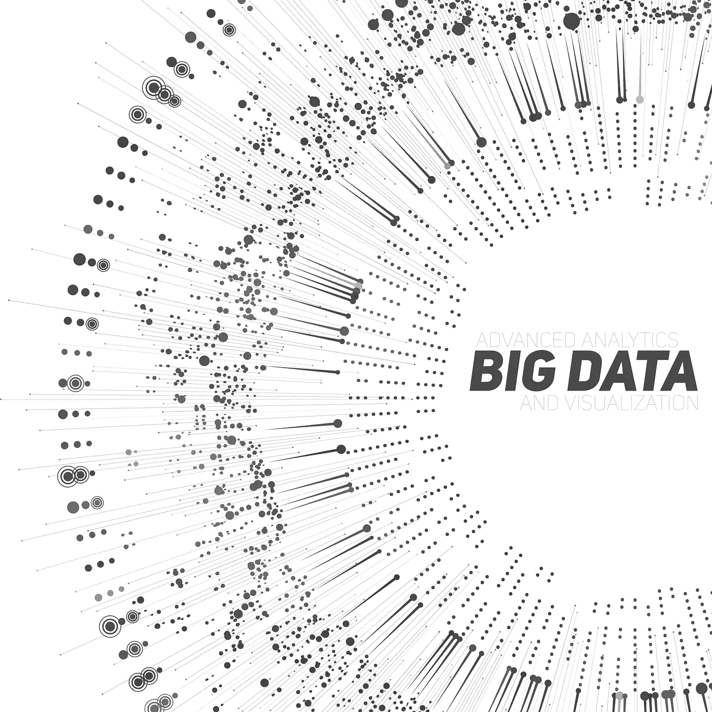
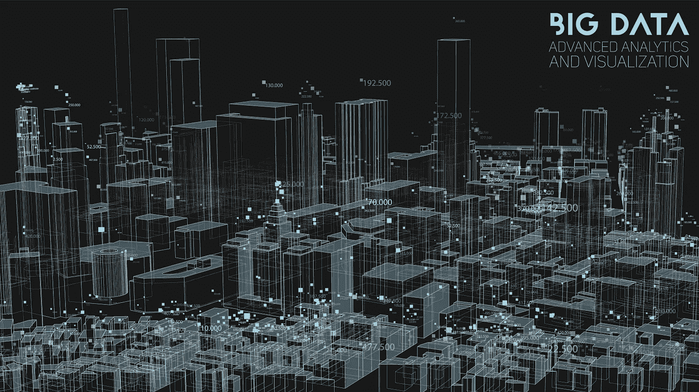

# 数据主义世界——大数据和数据主义时代

> 原文：<https://towardsdatascience.com/dataistic-world-the-age-of-big-data-and-dataism-7ddac8897a53?source=collection_archive---------48----------------------->

## 意见

## 虽然大数据看似让收集更多数据以发现更多有用信息成为可能，但事实是，更多数据并不一定意味着更多有用信息。

人工智能最近的快速发展，在很大程度上归功于大数据，增强了人们对数据及其基于数据的机器学习算法的信心。支持大数据的最知名技术之一是大数据分析形式的人工智能(AI)。

能够处理今天巨大数据流的算法直接从数据中提取信息和知识。此外，机器生成的信息或知识被认为比人类思维更加透明和可靠。空前数量的数字数据正以手机、平板电脑、电脑和其他数字设备的形式存储。大数据—支持技术使我们能够搜索和分析它们，从而建立联系并产生我们以前无法获得的洞察力。

现在，要分析的数据不仅很大，而且由各种类型的数据组成，包括流数据(67%)。大数据有许多影响，可能会改变统计数据分析的方法。首先，构建者和用户不再局限于单个数据源，比如数据库服务器。这种全新的分析类别意味着世界正在发生变化，但不仅仅是在数据收集和分析以及数据处理方面。

在数据主义的世界观中，人类的经验能够产生数据，这些数据可以放在一起向数据流致敬。对于数据专家来说，数据和算法被注入了处理数据和寻找意义的高级工具。2013 年，大卫·布鲁克斯在《纽约时报》上总结并首次使用了大数据的新兴意义。然而，在 2016 年，尤瓦尔·诺亚·哈拉里(Yuval Noah Harari)在他的著作《德乌斯人:明日简史》(Homo Japan:A Brief History of Tomorrow)中扩大了对它的描述。

作者 Matveydar——自己的作品，CC0，[https://commons.wikimedia.org/w/index.php?curid=85041358](https://commons.wikimedia.org/w/index.php?curid=85041358)

越来越多的设备连接到互联网，并被设计为不断地生成和来回发送数据。不可否认的是，社会正在走向一个数据流不断增长和扩大的世界。任何类型的网络公司都声称有权跟踪、收集、分析、货币化和出售网站上的用户行为数据，这已经成为常态。例如，脸书、Google +、Twitter、Facebook Messenger 或谷歌地图等常规应用程序需要用户在线并分享他们的位置数据才能运行。

大量的数据和信息被生成和共享，各种各样的社交媒体平台参与其中。真实的或欺诈性的网络机构通过诱惑渴望点击的广告商，找到将故事带入主流的方法。

如今，简单地问数据显示了什么似乎数据可以取代思维已经变得时髦得多。如果算法已经知道我们在想什么，想要什么，需要什么，为什么还要麻烦政客和代议制政府？我们的代议制民主输给了技术宗教，这可能正是恢复代议制民主的防御所需要的震动。

技术必然性将质疑和限制技术发展等同于阻碍社会本身的繁荣。技术沙文主义声称技术带来了社会和经济性质的一切，无论是社会的还是经济的，它总是改善人们的生活。它以代议制民主为前提，有不寻常的分散的既得利益和抽象的意见，更不用说自由开放的社会了。

那些相信科学已经向我们展示了我们继承了我们的生物学的人也持有类似的观点。他们认为有机体只是一个数据处理系统，一个在我们的社会中无处不在的算法，他们描述了这种控制是如何发生的。

这导致许多人预测，机器将很快取代目前由人类执行的认知任务。鉴于这种预测被广泛接受，在我们的社会中，信心和对数据的依赖正在增加也就不足为奇了。

虽然它的起源模糊不清，但这种层次结构仍然是想象大数据时代正在收集和使用的信息的良好起点。大数据是同一个主题的变体，多年来一直从事数据工作的人已经明白这一点。即使大数据似乎可以收集更多的数据来找到更多有用的信息，但事实是，更多的数据并不一定意味着更多的有用信息。

数量、速度和多样性带来了技术挑战和解决方案，使我们能够访问比几年前想象的更多的信息。虽然技术和工具强大多了，数据还是数据，只是换了一种方式是数据。现在应该很明显，大数据和人工智能具有更高的道德价值。我不相信，经过仔细考虑后，人们会给一个算法政治权力，即使是一个掩盖其进展的算法。在未来，我们可能不像所有技术精英那样聪明，但我们肯定会比他们聪明。

**引用来源**

*   [http://www . info today . com/online searcher/Articles/Technology-and-Power/The-Peril-of-data ism-135012 . shtml](http://www.infotoday.com/OnlineSearcher/Articles/Technology-and-Power/The-Peril-of-Dataism-135012.shtml)
*   【https://en.wikipedia.org/wiki/Dataism 号
*   [https://www . ibmbigdatahub . com/blog/age-data-and-opportunities](https://www.ibmbigdatahub.com/blog/age-data-and-opportunities)
*   [https://www.vxchnge.com/blog/managing-social-media-data](https://www.vxchnge.com/blog/managing-social-media-data)
*   [https://www . smart data collective . com/good-management-essential-age-of-big-data-ml/](https://www.smartdatacollective.com/good-management-essential-age-of-big-data-ml/)
*   [https://www . si sense . com/white papers/every-company-a-data-company-building-in-age-of-big-data-ai/](https://www.sisense.com/whitepapers/every-company-a-data-company-building-in-the-age-of-big-data-ai/)
*   [https://journalofbigdata . springer open . com/articles/10.1186/s 40537-015-0030-3](https://journalofbigdata.springeropen.com/articles/10.1186/s40537-015-0030-3)
*   [https://www.iedp.com/articles/the-big-data-revolution/](https://www.iedp.com/articles/the-big-data-revolution/)
*   [https://www . information-management . com/opinion/in-the-age-of-big-data-the-more-things-change-the-more-they-that-they-they-that-they-that-they-that-his-stay-same](https://www.information-management.com/opinion/in-the-age-of-big-data-the-more-things-change-the-more-they-stay-the-same)
*   [https://www . discovery . org/leadership/blog/from-Darwinism-to-data ism-will-we-lose-our-representative-democracy-to-techno-religion](https://www.discovery.org/leadership/blog/from-darwinism-to-dataism-will-we-lose-our-representative-democracy-to-techno-religion)