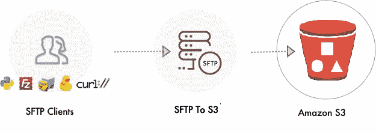
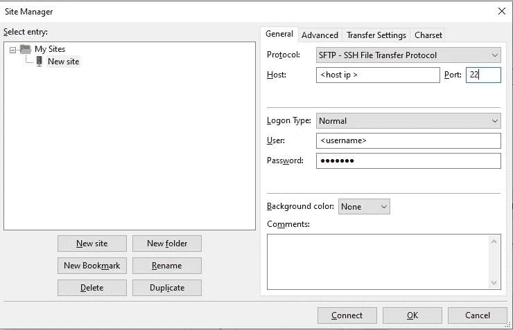

# 数据湖文件摄取:从 FTP 到 AWS S3

> 原文：<https://towardsdatascience.com/datalake-file-ingestion-from-ftp-to-aws-s3-253022ae54d4?source=collection_archive---------9----------------------->

## 使用 Python 中的 Paramiko 将文件从 FTP 服务器传输到 AWS s3



大家好。在开发 Datalake 管道时，数据接收是整个过程中的一个重要步骤。我们需要一个可靠，安全和容错的方法来把我们的文件从源(客户端 FTP 服务器)到我们的目标(AWS S3)。考虑到这一步的重要性，我用 python 开发了一个实现，可以用来将文件从 FTP 服务器接收到 AWS s3。我以这样的方式设计代码，它可以在托管(AWS Glue)或未托管(本地机器)环境中使用，以将文件从 FTP 服务器传输到 AWS s3。

在本文中，我将解释如何使用 Python 中的 Paramiko 库将存在于 FileZilla 等 FTP 服务器上的文件传输到 Amazon s3。

文件摄取代码可以在我的 GitHub [库](https://github.com/furqanshahid85-python/Python-FTP-File-Ingestion)中找到。文件接收代码执行以下操作:

*   使用 Paramiko 创建与文件服务器的安全 ssh SFTP 连接。
*   根据文件大小自动处理单部分和多部分上传(多部分在 100MB 或以上)。
*   在多零件上传期间，如果零件上传失败，会自动处理报废。
*   基于当前年、月、日、小时对 s3 中的数据进行分区。
*   确保哪个文件已经上传
*   可以在 AWS Glue 中用作 python 作业，使用 AWS Glue 将文件从 FTP 传输到 S3。

为了更好地理解，我将一步一步地介绍代码的每一部分。所以让我们开始吧。

# 先决条件

在开始之前，我们需要在本地机器上做一些安装设置，并在 FTP 服务器上设置一个目录。

## 本地机器设置

我假设你们已经在机器上安装了 python。如果你还没有安装 python，访问这个[链接](https://www.python.org/downloads/)在你的机器上安装 python。
在进入代码之前，我们需要确保我们已经安装了以下模块:

首先我们将安装 Paramiko。

```
pip install paramiko
```

因为我们将上传文件到 s3，我们将需要 boto3 客户端。

```
pip install boto3
```

## FTP 服务器目录设置

我们需要在我们的 FTP 服务器上创建几个我们将在实现中使用的目录。

**注意:**这个目录设置是一次性的，我们不必每次都做。

连接到您的 FTP 服务器。我在我的案例中使用 FileZilla。转到站点管理器。在协议下拉菜单中选择 SFTP 选项。输入您的主机、ip、用户名和密码，然后按连接。



连接后，在 FTP 服务器上创建两个目录:

*   您将上传文件的父目录。
*   经过处理的目录。这个目录将用于跟踪哪些文件已经上传到 s3。

完成以上两个步骤后，我们现在已经安装了所有必要的模块和目录结构。我们现在可以开始实际的实现了。

# FTP 到 S3 的实现

让我们首先简单地浏览一下 git 存储库中的两个文件。

## **python _ glue _ injestion _ job . py**

我们的整个 FTPIngestion 类实现如下。我将逐一解释代码的每个部分。

python_glue_injestion_job.py

**注意:**我称之为 python glue 作业，因为我们可以在 AWS Glue python shell 环境中运行相同的代码，并使用 AWS Glue 实现相同的 FTP 文件传输功能。

## 配置. py

这个文件将定义我们所有的配置，如主机名、IP、端口、用户名、密码、s3 存储桶名、ftp 目录路径等。将所有配置保存在一个单独的文件中是一个很好的编程习惯。这使得我们的代码更易于管理。

我们通过将该文件导入 python_glue_ingestion_job.py 文件来使用它。我们的 config.py 文件如下所示:

配置. py

在简要概述了我们的两个文件之后，让我们深入到代码的每一部分。

## 代码流

我们的代码从 main 方法开始。我们首先创建一个 FTPIngestion 类的对象**。在创建对象时，调用 **__init(self)__** 方法来设置所有的配置值。**

主要方法

然后 **ftp_obj** 调用**initiate _ ingestion(self)**方法，该方法将首先使用 **create_ssh_connection(self)方法**创建一个与我们的 ftp 服务器的 ssh 连接。成功连接后，将使用**create _ sftp _ connection(self)**方法创建一个 SFTP 连接，我们将用它来访问 FTP 服务器。

一旦建立了 SFTP 连接，我们执行以下操作

*   将当前目录更改为父目录

```
self.sftp_client.chdir(self.ftp_directory_path)
```

*   获取所有要上传到 S3 的文件

```
files_to_upload = self.sftp_client.listdir()
```

*   使用**create _ s3 _ partition(self)**方法创建 S3 分区结构。我使用当前日期时间来设置分区结构，如下所示:

**/ <目录 _ 名称>/年= <年> /月= <月> /日= <日> /小时= <小时>/文件**

*   之后，我们开始一个接一个地上传文件。列表中的每个文件都被传递给**S3 _ upload _ file _ multipart()**方法。如果文件大小大于 100Mb，文件将通过多部分上传，否则作为标准文件上传。

```
for ftp_file in files_to_upload:                    
    sftp_file_obj = self.sftp_client.file(ftp_file, mode='r')
    if self.s3_upload_file_multipart(sftp_file_obj,
                                     s3_partition+ftp_file):
        print('file uploaded to s3')
        files_to_move.append(ftp_file)
```

*   在每次成功上传时，使用我们在 FTP 服务器上创建的**move _ files _ to _ processed()**方法将文件移动到已处理的目录中。这样做是为了跟踪已经成功上传到 s3 的所有文件。

```
if files_to_move:                    
    for uploaded_file in files_to_move:
        self.move_files_to_processed(uploaded_file)
else:
    print("nothing to upload")
```

*   所有文件成功上传后，我们使用 **close_connections(self)** 方法关闭所有连接。

# 更深入地了解我们的代码:

现在让我们详细讨论一下 FTPIngestion 类的每一部分。

## 初始化方法

这是 init 方法，也称为我们类的构造函数。当我们创建一个 FTPIngestion 类的对象时，所有的属性都是在对象创建时设置的。每个属性的值都是从 config.py 类中获取的，我们在这个类中定义了它们的值。我们将 config.py 文件作为 **cfg** 导入，并为每个属性设置相应的值。

初始化方法

**推荐:**我们可以使用 AWS SSM 来代替 config.py 类，在这里我们为每个属性定义键值对，就像在 config.py 文件中一样。使用 SSM 更加可靠和安全。

## 创建 ssh 连接方法

这个方法使用给定的凭证创建一个与我们的 FTP 服务器的安全 ssh 连接。成功连接后，它会将 **self.ssh_ok** 属性设置为 True 并返回。否则 **self.ssh_ok** 设置为 False 并返回。

这个方法中需要注意的一点是**self . ssh _ client . set _ missing _ host _ key _ policy(paramiko。AutoAddPolicy())。**我们将其配置为使用自动生成的策略设置缺失的主机密钥。如果您打算在 AWS Glue 中作为 python shell 作业运行此任务，请使用主机策略，而不是添加自动添加策略。为此，请在代码中执行以下操作

```
#self.ssh_client.set_missing_host_key_policy(paramiko.AutoAddPolicy())
# in production, use load_system_host_keys            
 self.ssh_client.load_system_host_keys()
```

## 创建 _ sftp _ 连接方法

这个方法调用 **create_ssh_connection** 方法创建 ssh 连接，然后继续打开 SFTP 连接。如果连接成功，它会将 **self.sftp_ok** 设置为真，如果连接失败，则将其设置为假并返回值。

创建 _ sftp _ 连接方法

## 移动文件到已处理的方法

文件成功上传到 s3 后，在 **initiate_ingestion** 方法中调用该方法。这个方法以文件名作为参数。将 FTP 服务器上的源路径和目的路径设置为 **src** 和 **dest** ，然后执行以下命令，将文件从 **src** 路径移动到 **dest** 路径。

```
try:
    _, _, _ = self.ssh_client.exec_command("mv " + src+" " + dest)        except Exception as error:
    print("error moving files to processed directory, error: ", error)
```

我们的**move _ files _ to _ processed**方法如下:

移动文件到已处理的方法

## 创建 _ s3 _ 分区方法

这个方法创建 s3 分区结构。分区由根目录名后跟年、月、日、小时组成。通过这种方式，我们可以获得基于时间的分区数据。

创建 _ s3 _ 分区方法

## s3 _ 上传 _ 文件 _ 多部分方法

该方法将文件上传到指定的 s3 存储桶。它使用 **TransferConfig** 类来处理多部分上传。我们为 TransferConfig 指定如下配置:

```
config = TransferConfig(multipart_threshold=cfg.MULTIPART_THRESHOLD,
                        multipart_chunksize=cfg.MULTIPART_CHUNKSIZE,
                        max_concurrency=cfg.MAX_CONCURRENCY,
                        use_threads=cfg.USER_THREADS
                        )
```

*   **multipart_threshold** 参数确定文件的最小大小，超过该值后，文件将通过 multipart 上传。AWS 建议所有大于 100MB 的文件通过 multipart 上传，所以我把这个参数设置为 100MB。这可以在 config.py 文件中更改。
*   **multipart_chunksize** 参数决定了多部分上传期间每个部分的大小。我把它设置为 20MB。
*   **max_concurrency** 参数决定了用于上传每个部分的并发 S3 API 传输操作的最大数量。默认值为 10。
*   最后， **use_threads** 参数决定传输操作是否使用线程来实现并发。通过将 use_threads 属性设置为 False，可以禁用线程使用。如果禁用线程使用，则不会发生传输并发。因此，max_concurrency 属性的值将被忽略。

我们将这个配置对象作为参数传递给我们的 s **3.upload_fileobj**

```
self.s3.upload_fileobj(source_file, self.s3_bucket_name,
                       s3_target_file, Config=config)
```

**TransferConfig** 类自动检查文件是作为单个部分上传还是通过多部分上传。它会自动处理失败的上传，并在失败时进行重试。

s3 _ 上传 _ 文件 _ 多部分方法

## initiate _ 摄取方法

这个方法启动建立 ssh 和 sftp 连接的调用。将 FTP 目录路径更改为文件所在的指定路径。获取 FTP 指定路径中所有文件的列表，并开始上传到 s3。成功上传到 S3 的文件被移动到 FTP 服务器上的已处理目录中。所有文件上传后，关闭所有连接。

## 关闭连接方法

这种方法用于关闭 ssh 和 sftp 连接。

## 将代码用作 AWS 粘合工作

如前所述，同样的实现可以用在 AWS Glue 这样的托管环境中。如果用户有文件在特定时间段(小时、天、月等)到达 FTP 服务器，他可以安排作业在特定时间运行，将所有文件从 FTP 服务器接收到 s3。

我们必须修改代码中的一些内容，以便能够将这个实现作为 AWS Glue Python shell 作业来运行

*   在我们的**python _ glue _ in jestion _ job . py**文件的 imports 部分中，取消对以下导入的注释。我们使用 easy install 在 Glue 环境中安装 paramiko 模块，因为它没有默认的 Python 安装。

```
install_path = os.environ['GLUE_INSTALLATION']easy_install.main( ["--install-dir", install_path, "https://files.pythonhosted.org/packages/ac/15/4351003352e11300b9f44 a13576bff52dcdc6e4a911129c07447bda0a358/paramiko-2.7.1.tar.gz"] )reload(site)
```

*   在 **create_ssh_connection** 方法中注释如下

```
#self.ssh_client.set_missing_host_key_policy(paramiko.AutoAddPolicy())
```

并取消对以下内容的注释

```
self.ssh_client.load_system_host_keys()
```

我们所做的不是使用**自动生成的策略**，而是使用我们所处环境的**主机密钥。**

完成上述步骤后，我们可以在 AWS Glue 中将这段代码作为 Python shell 作业运行。

# 摘要

在本文中，我们研究了如何执行 Datalake 管道的数据接收步骤。我们学习了如何使用 paramiko 库创建与 FTP 服务器的安全 ssh SFTP 连接，并将文件从服务器上传到我们的 AWS S3 存储桶。我们还简要介绍了如何在 AWS Glue 这样的托管环境中使用给定的实现。

**链接到我的 Github 库:**

[](https://github.com/furqanshahid85-python/Python-FTP-File-Ingestion) [## furqanshahid 85-Python/Python-FTP-文件-摄取

### 这个模块提供了从 FTP 服务器上传文件到 s3 的功能。SFTP 连接是通过…创建的

github.com](https://github.com/furqanshahid85-python/Python-FTP-File-Ingestion)