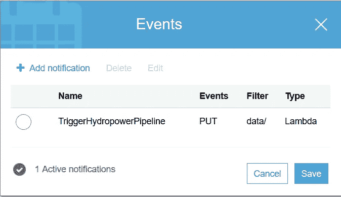

# DataOps —使用 AWS Lambda 和 Amazon EMR 的全自动低成本数据管道

> 原文：<https://towardsdatascience.com/dataops-fully-automated-low-cost-data-pipelines-using-aws-lambda-and-amazon-emr-c4d94fdbea97?source=collection_archive---------28----------------------->

## 使用 S3 事件通知、AWS Lambda 和亚马逊 EMR 实现数据处理管道完全自动化的指南。


图片由 [ar130405](https://pixabay.com/users/ar130405-423602/?utm_source=link-attribution&utm_medium=referral&utm_campaign=image&utm_content=2082642) 来自 [Pixabay](https://pixabay.com/?utm_source=link-attribution&utm_medium=referral&utm_campaign=image&utm_content=2082642)

进展是连续的。回顾我在信息技术领域 25 年的职业生涯，我经历了几个阶段的进步和适应。

从一个仔细观察每条 SQL 命令运行完成的新员工，到一个自信的 DBA，他编写了数百条 SQL 脚本，并使用 Cron 调度程序将它们作为批处理作业一起运行。在现代，我适应了像 Oozie 和 Airflow 这样的 DAG 工具，它们不仅提供作业调度，还可以以自动化的方式运行一系列作业作为数据管道。

最近，云的采用改变了*自动化*的全部含义。

## 存储很便宜，计算很贵

在云时代，我们可以设计出以前闻所未闻的自动化方法。我承认云存储资源一天比一天便宜，但是计算资源(高 CPU 和内存)仍然相对昂贵。记住这一点，如果 DataOps 可以帮助我们节省计算成本，那岂不是太酷了。让我们来看看如何做到这一点:

通常，我们按如下方式运行数据管道:

数据收集定期(每天，每小时或每分钟)保存到存储像 S3。这之后通常是使用永久衍生的分布式计算集群(如 EMR)的数据处理作业。

优点:处理任务按计划运行。永久集群可用于其他目的，如使用 Hive 进行查询、流式工作负载等。

**缺点:**数据到达和处理之间可能会有延迟。计算资源可能没有得到最佳利用。有时可能会出现利用率不足的情况，从而浪费昂贵的美元


(图片由作者提供)

这里有一个替代方案，可以帮助实现运营和成本之间的平衡。这种方法可能并不适用于所有的用例，但是如果确实如此，那么请放心，它将为您节省大量的美元。


(图片由作者提供)

在这种方法中，存储层基本保持不变，只是在存储中添加了一个事件通知，在新数据到达时调用 Lambda 函数。反过来，Lambda 函数调用用于数据处理的瞬态 EMR 集群的创建。瞬态 EMR 集群是一种特殊类型的集群，它部署、运行数据处理作业，然后自毁。

**优点:**一旦数据可用，处理作业就可以开始。没有等待。计算资源得到最佳利用。只为您使用的东西付费，节省$$$。

**缺点:**集群不能用于其他目的，如使用 Hive 进行查询、流式工作负载等。

以下是整个过程的技术处理方式:

假设数据文件被传送到 S3://<bucket>/raw/files/renewable/hydrogen-consumption/<date>_</date></bucket>

克隆我的 git repo:

```
$ git clone https://github.com/mkukreja1/blogs.git
```

创建一个新的 S3 桶来运行演示。请记住更改时段名称，因为 S3 时段名称是全球唯一的。

```
$ S3_BUCKET=lambda-emr-pipeline  #Edit as per your bucket name$ REGION='us-east-1' #Edit as per your AWS region$ JOB_DATE='[2020-08-07_2PM'](https://s3.console.aws.amazon.com/s3/#) #Do not Edit this$ aws s3 mb s3://$S3_BUCKET$ aws s3 cp blogs/lambda-emr/emr.sh s3://$S3_BUCKET/bootstrap/$ aws s3 cp blogs/lambda-emr/hydropower-processing.py s3://$S3_BUCKET/spark/
```

为 Lambda 函数创建角色

```
$ aws iam create-role --role-name trigger-pipeline-role --assume-role-policy-document file://blogs/lambda-emr//lambda-policy.json$ aws iam attach-role-policy --role-name trigger-pipeline-role  --policy-arn arn:aws:iam::aws:policy/service-role/AWSLambdaBasicExecutionRole$ aws iam attach-role-policy --role-name trigger-pipeline-role  --policy-arn arn:aws:iam::aws:policy/AmazonElasticMapReduceFullAccess
```

在 AWS 中创建 Lambda 函数

```
$ ROLE_ARN=`aws iam get-role --role-name trigger-pipeline-role | grep Arn |sed 's/"Arn"://'  |sed 's/,//' | sed 's/"//g'`;echo $ROLE_ARN$ cat blogs/lambda-emr/trigger-pipeline.py | sed "s/YOUR_BUCKET/$S3_BUCKET/g" | sed "s/YOUR_REGION/'$REGION'/g" > lambda_function.py$ zip trigger-pipeline.zip lambda_function.py$ aws lambda delete-function --function-name trigger-pipeline$ LAMBDA_ARN=` aws lambda create-function --function-name trigger-pipeline --runtime python3.6 --role $ROLE_ARN --handler lambda_function.lambda_handler --timeout 60 --zip-file fileb://trigger-pipeline.zip | grep FunctionArn | sed -e 's/"//g' -e 's/,//g'  -e 's/FunctionArn//g' -e 's/: //g' `;echo $LAMBDA_ARN$ aws lambda add-permission --function-name trigger-pipeline --statement-id 1 --action lambda:InvokeFunction --principal s3.amazonaws.com
```

最后，让我们创建 S3 事件通知。这个通知将调用上面的 Lambda 函数。

```
$ cat blogs/lambda-emr/notification.json | sed "s/YOUR_LAMBDA_ARN/$LAMBDA_ARN/g" | sed "s/\    arn/arn/" > notification.json$ aws s3api put-bucket-notification-configuration --bucket $S3_BUCKET --notification-configuration file://notification.json
```



(图片由作者提供)

让我们从将数据复制到 S3 开始这一过程

```
$ aws s3 rm s3://$S3_BUCKET/curated/ --recursive
$ aws s3 rm s3://$S3_BUCKET/data/ --recursive$ aws s3 sync blogs/lambda-emr/data/ s3://$S3_BUCKET/data/
```

如果一切运行正常，您应该能够在 EMR 中看到一个正在运行的集群，状态= **开始**


(图片由作者提供)

一段时间后，EMR 集群应该变为 Status= **Terminated。**


(图片由作者提供)

要检查 Spark 计划是否成功，请检查 S3 文件夹，如下所示:

```
$ aws s3 ls s3://$S3_BUCKET/curated/2020-08-07_2PM/
2020-08-10 17:10:36          0 _SUCCESS
2020-08-10 17:10:35      18206 part-00000-12921d5b-ea28-4e7f-afad-477aca948beb-c000.snappy.parquet
```

进入数据工程和数据科学的下一阶段，数据管道的自动化正在成为一项关键操作。如果操作得当，它不仅有可能简化操作，还可能降低资源成本。

希望你能从上面的文章中获得一些有价值的见解。如果您需要进一步的澄清和建议，请随时联系我。

我希望这篇文章是有帮助的。 **AWS 数据湖& DataOps** 是由 [Datafence Cloud Academy](http://www.datafence.com) 提供的 AWS 大数据分析课程的一部分。课程是周末自己在网上教的。