# Dataprep.eda:加速您的 eda

> 原文：<https://towardsdatascience.com/dataprep-eda-accelerate-your-eda-eb845a4088bc?source=collection_archive---------6----------------------->

## 关于 dataprepare.eda 你需要知道的一切。


来源:MicroStockHub，via:[Getty Images/istock photo](https://www.istockphoto.com/ca/photo/financial-and-technical-data-analysis-graph-showing-search-findings-gm850495466-139617167)

***作者:*** [*斯拉夫·科埃略*](https://www.linkedin.com/in/slavvy-coelho/)*[*鲁奇塔·罗萨里奥*](https://www.linkedin.com/in/ruchitarozario/?originalSubdomain=ca)*

****导师:*** [*王剑南博士*](https://www.linkedin.com/in/jiannan-wang-8499472a/?originalSubdomain=ca) *，*主任，的专业硕士项目(大数据与网络安全和视觉计算)*

> *“数字有一个重要的故事要讲。他们依靠你给他们一个清晰而有说服力的声音*

*如今，大多数行业都认识到数据是一种宝贵的资产。然而，你如何处理这些数据，如何利用这些数据，才能帮助你获得额外的利润数字，或者带来一场革命的新发现。*

*当您开始处理数据集时，大多数趋势和模式并不明显。探索性数据分析有助于人们通过分析透镜仔细分析数据。它有助于我们得出结论，对数据发生的情况有一个总体的了解。揭示这些隐藏的关系和模式对于在数据基础上构建分析和学习模型至关重要。*

*EDA 的一般工作流程如下:*

*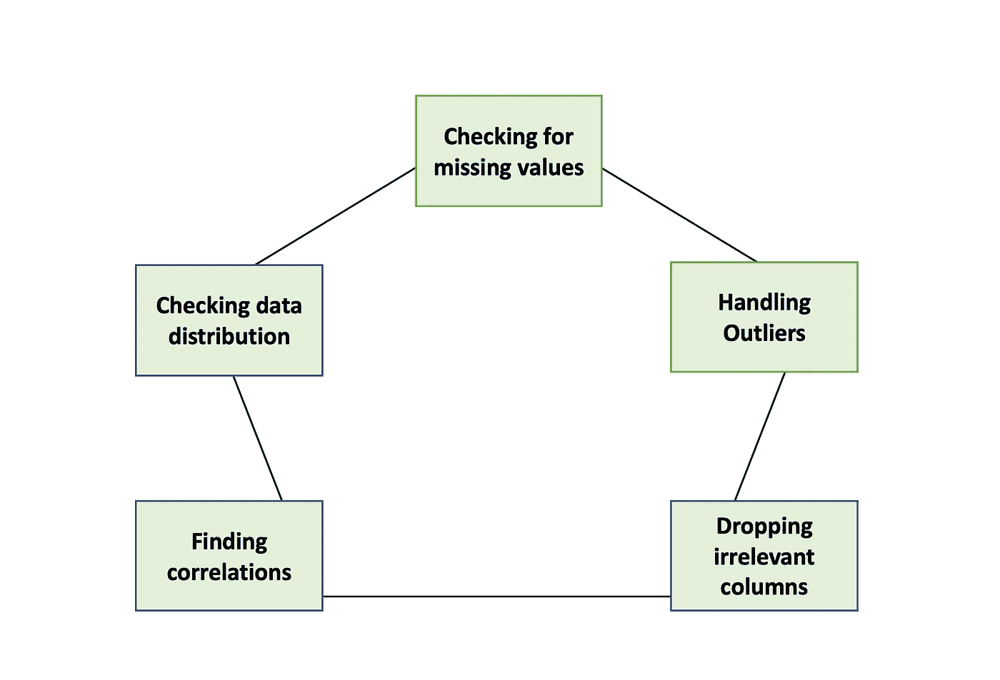*

## *Dataprep.eda 简介:*

*[*Data prepare*](https://github.com/sfu-db/dataprep)*是由 [SFU 数据科学研究组](https://data.cs.sfu.ca/index.html)为加速数据科学而发起的一项倡议。 [*Dataprep.eda*](https://sfu-db.github.io/dataprep/installation.html) 试图用非常少的代码行来简化整个 eda 过程。因为我们知道 EDA 是数据科学管道中非常重要和耗时的一部分，所以拥有一个简化这一过程的工具是一件好事。**

**这个博客旨在为你提供一个简单的实践经验，让你了解你可以用 *dataprepare.eda* 做的所有事情。所以我们开始吧，好吗？**

```
**#installing dataprep.eda
#open your terminalpip install dataprep**
```

**为了简化事情，我们研究了一个欺诈检测数据集。该数据包括金额、原始余额、原始账户、目的账户等列。最后是一个标签列，指示该交易实际上是否是欺诈交易。**

```
**#importing all the libraries
import pandas as pd
from dataprep.eda import plot, plot_correlation, plot_missing#importing data and dropping missing values
df = pd.read_csv("capdata.csv")**
```

**数据如下所示:**

**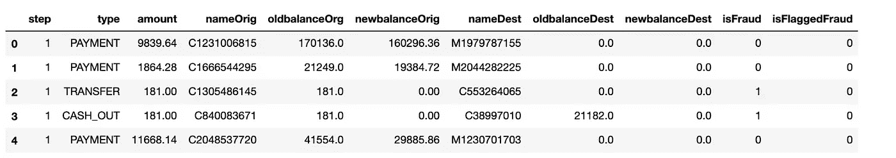**

**dataprep.eda 包有 4 个子模块。我们将逐一解释:**

1.  **[***【剧情()***](https://sfu-db.github.io/dataprep/user_guide/eda/plot.html) ***:分析分布*****

**我们提供了一个 API *plot()* 来允许用户分析数据集的基本特征。它为每一列绘制分布图或条形图，让用户对数据集有一个基本的了解。**

```
**#API Plot
plot(df)** 
```

**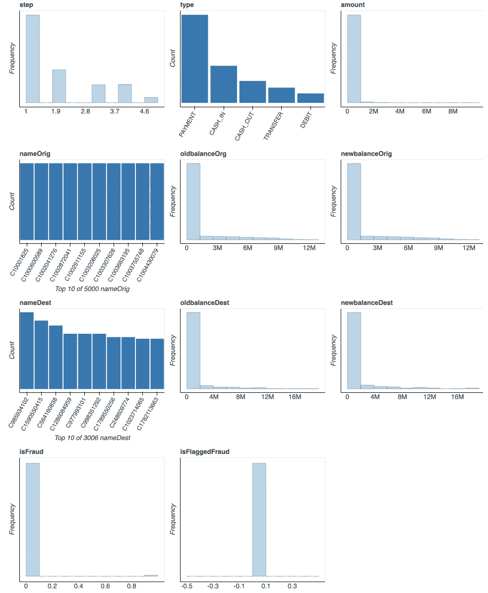**

****图 1:所有列的数据分布****

**如果用户对一两个特定的列感兴趣，它会通过将列名作为参数传递来为特定的列提供更详细的绘图。**

```
**plot(df, "newbalanceDest", bins=20)**
```

**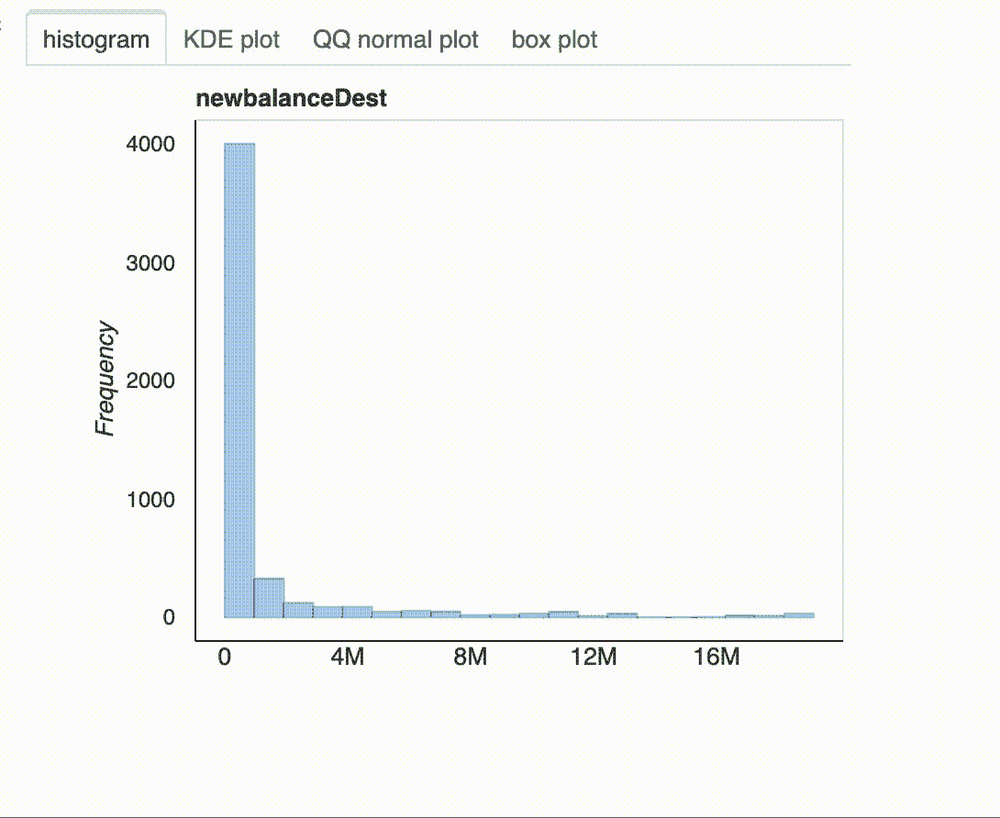**

****图 2:单个列的数据分布****

**如果 x 包含分类值，则绘制条形图和饼图。**

```
**plot(df,"type")**
```

**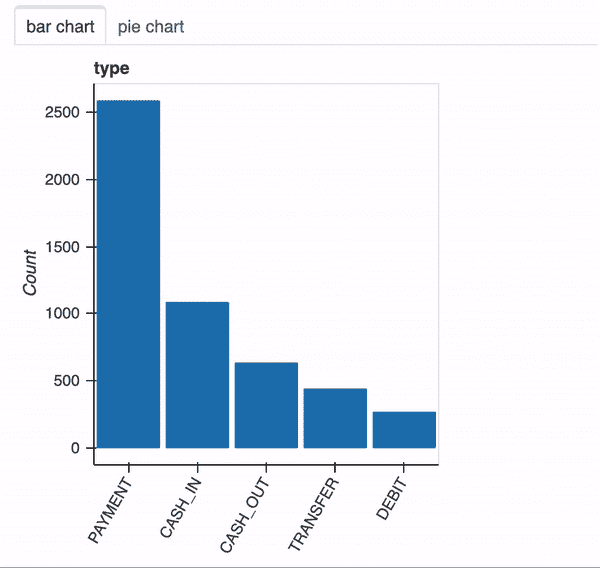**

****图 3:分类属性的数据分布****

**如果 x 包含数值，则绘制直方图、核密度估计图、箱线图和 qq 图。**

```
**plot(df, "newbalanceDest", "oldbalanceDest")**
```

**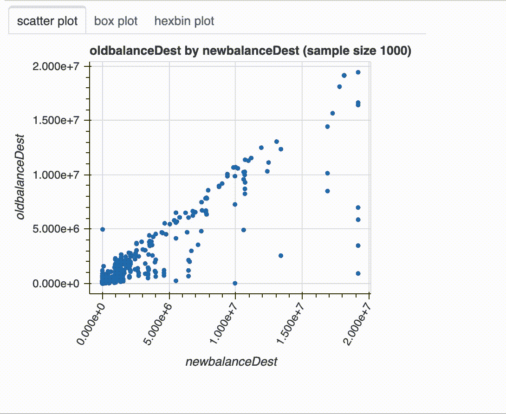**

****图 4:两个属性之间的详细数据分布****

**如果 x 和 y 包含数值，则绘制散点图、六边形图和箱线图。如果 x 和 y 中的一个包含分类值，而另一个包含数值，则绘制一个箱线图和多线直方图。如果 x 和 y 包含分类值，则会绘制嵌套条形图、堆积条形图和热图。**

****2。**[***plot _ correlation():***](https://sfu-db.github.io/dataprep/user_guide/eda/plot_correlation.html)***分析相关性*****

**我们提供一个 API *plot_correlation* 来分析列之间的相关性。它绘制了列之间的相关矩阵。如果用户对特定列的相关列感兴趣，例如与列“A”最相关的列，API 可以通过将列名作为参数传递来提供更详细的分析。**

```
**#API Correlation
plot_correlation(df)**
```

**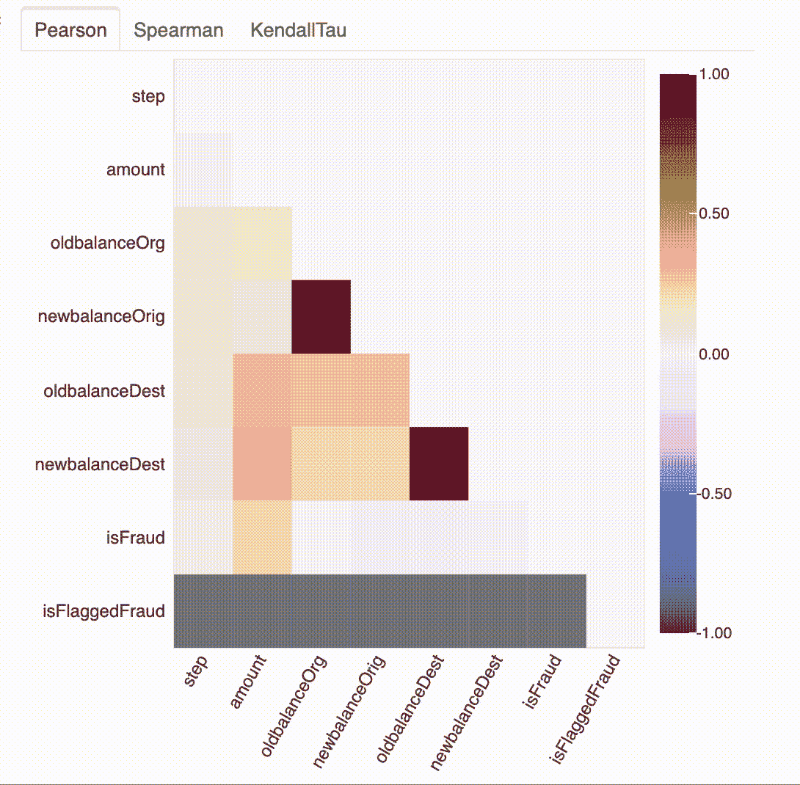**

****图 5:所有列的关联热图****

```
**plot_correlation(df, k=1)**
```

**前“k”个属性的关联热图(这里 k=1)**

**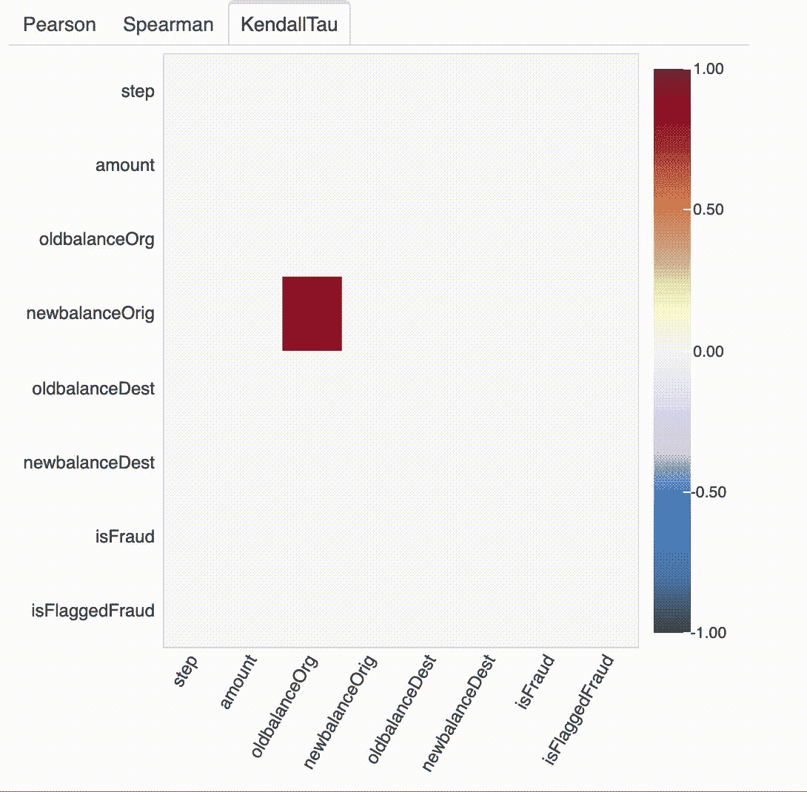**

****图 6:前“k”个属性的相关性热图(这里 k=1)****

```
**plot_correlation(df, "newbalanceOrig")** 
```

**指定元素与所有其他属性的相关性。(即。newbalanceOrig 与其他一切)。**

**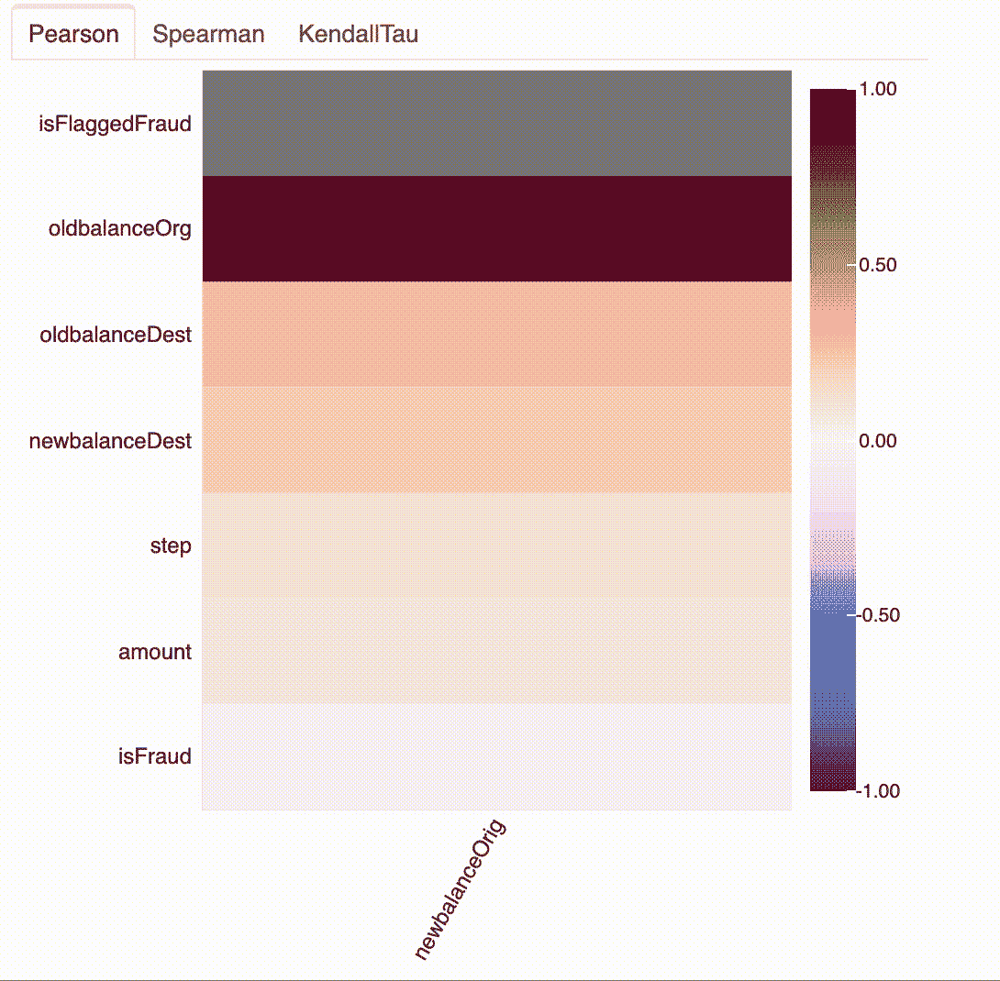**

****图 7:指定元素与所有其他属性的相关性****

```
**plot_correlation(df, "newbalanceOrig", value_range=[-1, 0.3])**
```

**给定范围内的所有相关值。对于 newbalanceOrig，(-1，0.3)将出现在绘图中。**

**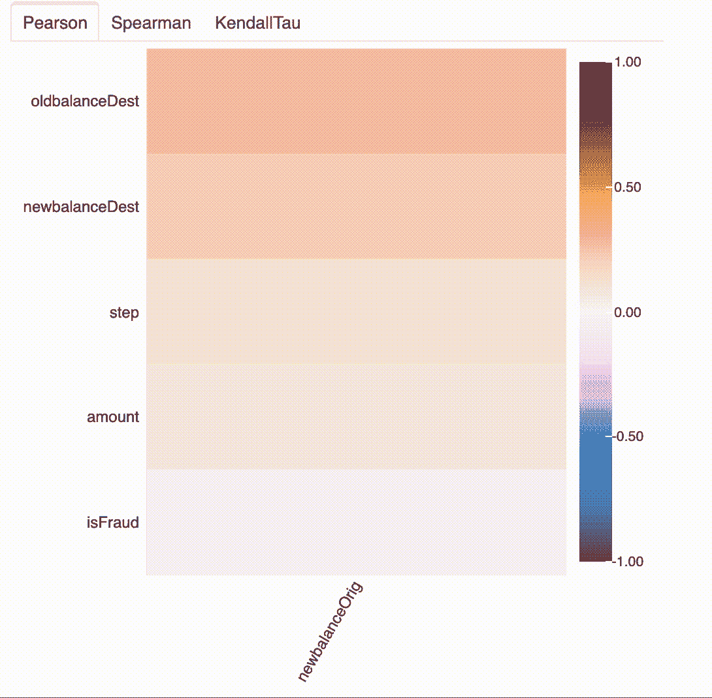**

****图 8:给定范围内的相关值****

```
**plot_correlation(df, x="newbalanceDest", y="oldbalanceDest", k=5)**
```

**具有最佳拟合线和最有影响点的两个属性之间的相关性。**

**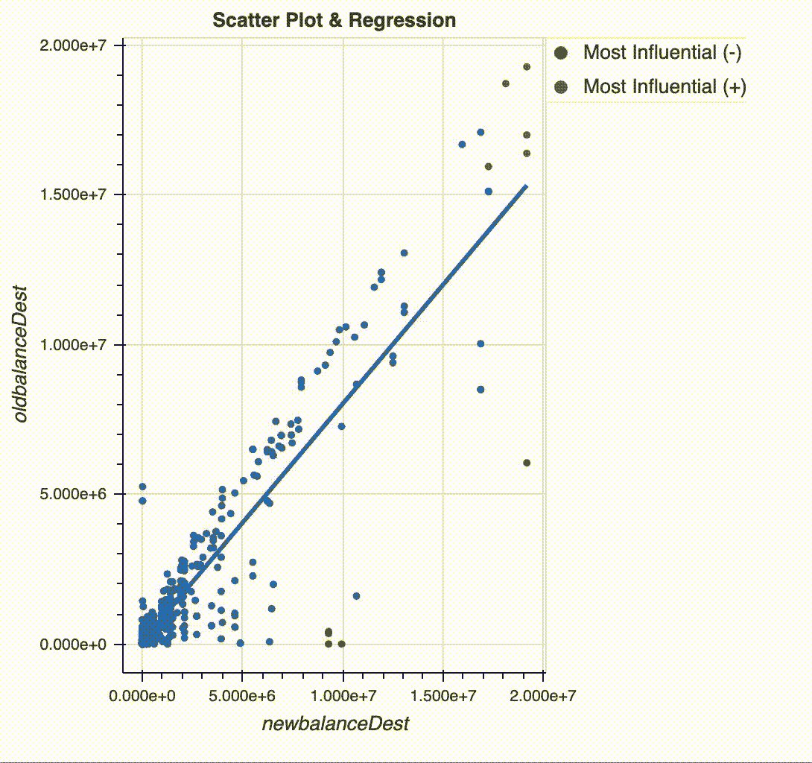**

****图 9:具有最佳拟合线和最有影响点的两个属性之间的相关性****

****3。**[***【plot _ missing():***](https://sfu-db.github.io/dataprep/user_guide/eda/plot_missing.html)***分析缺失值*****

**我们提供了一个 API *plot_missing* 来分析缺失值的模式和影响。乍一看，它显示了缺失值的位置，这使用户能够了解每一列的数据质量，或者找到缺失值的任何潜在模式。**

```
**#API Missing Value
plot_missing(df)** 
```

**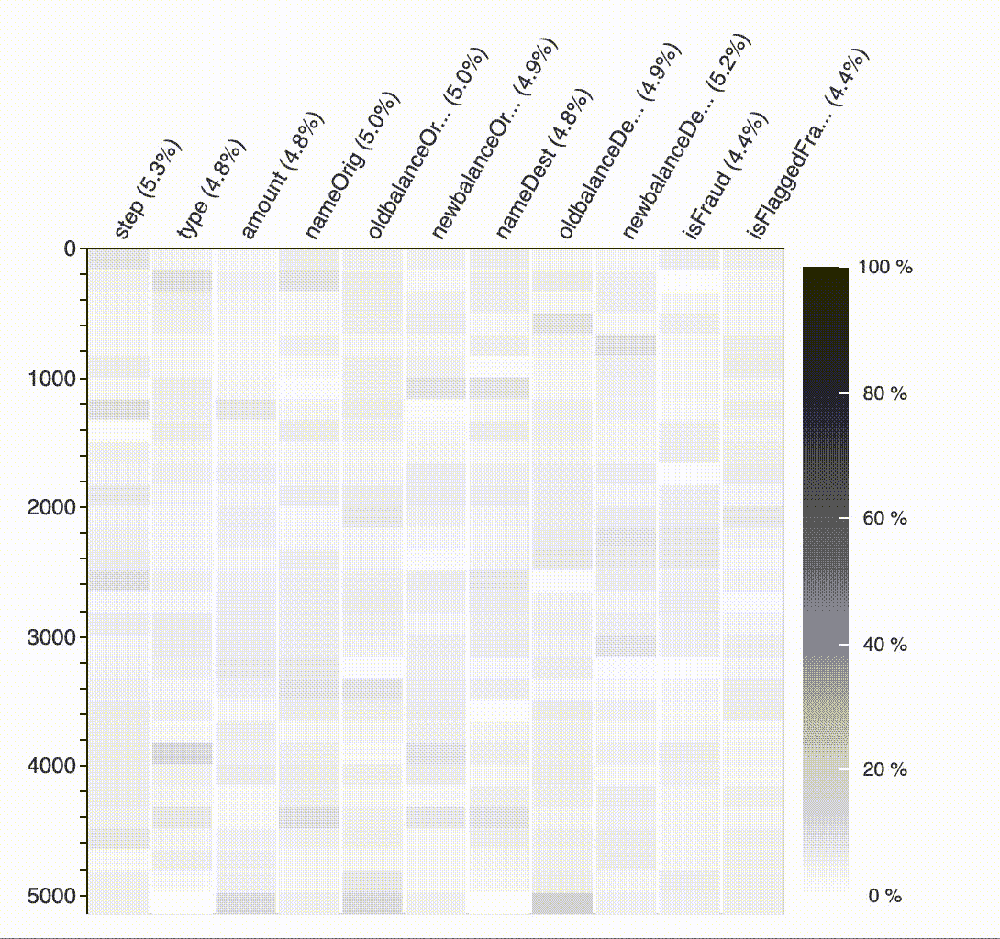**

****图 10:每列的缺失值****

**若要了解特定列中缺少值的影响，用户可以将列名传递到参数中。它将比较给定列中有无缺失值的每一列的分布，以便用户可以了解缺失值的影响。**

```
**plot_missing(df, "isFraud", "type") #count of rows with and without dropping the missing values**
```

**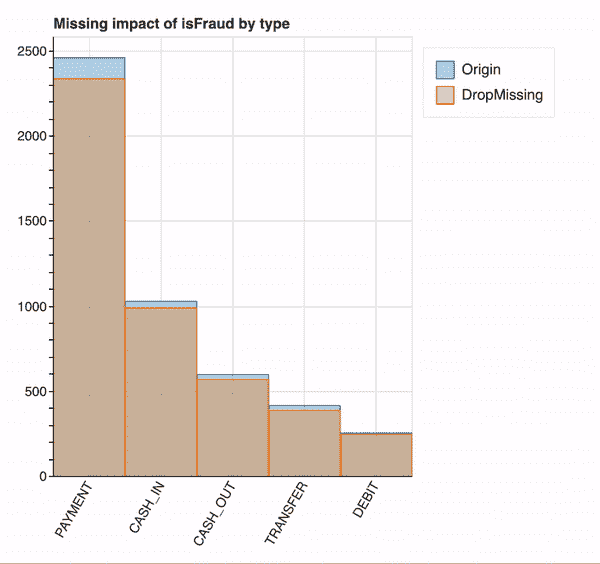**

****图 11:按类型划分的一个属性(isFraud)的影响****

**4.[***create _ report:***](https://sfu-db.github.io/dataprep/user_guide/eda/create_report.html)***从一个熊猫数据帧生成 profile 报告。*****

**create_report 的目标是从 pandas 数据框架生成配置文件报告。create_report 利用 dataprep 的功能并格式化图。它提供的信息包括概述、变量、分位数统计(最小值、Q1、中值、Q3、最大值、范围、四分位数范围)、描述性统计(平均值、众数、标准差、总和、中值绝对偏差、变异系数、峰度、偏斜度)、长度文本分析、样本和字母、相关性和缺失值。**

```
**from dataprepare.eda import create_report
df **=** pd**.**read_csv**(**"https://raw.githubusercontent.com/datasciencedojo/datasets/master/titanic.csv"**)** create_report**(**df**)****
```

**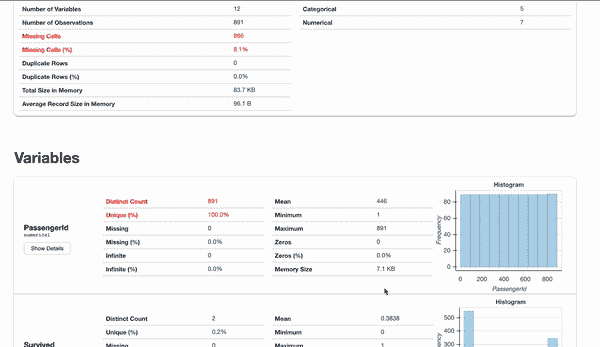**

****图 12:泰坦尼克号数据集的详细报告****

## **数据准备与传统方式**

**以上 3 个 API 的组合有助于简化 EDA 过程。**

**为了支持这一点，我们进行了一项调查来比较 dataprep.eda 和传统的 python EDA 实现。我们调查了 10 个人(包括现实世界的数据科学家和学习数据科学的大学生)。该调查基于 3 个关键绩效指标:**

1.  ****需要:**这里我们分析了数据专业人员每个项目在 EDA 上花费的分钟数。**

**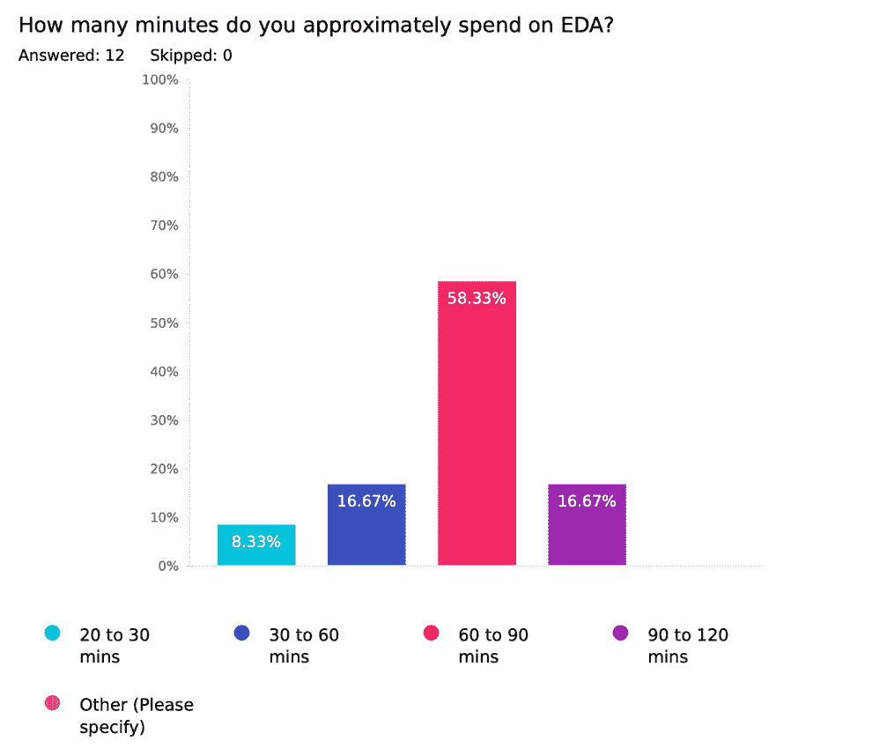**

**正如我们所看到的，大多数人平均在 EDA 上花费大约一个半小时。这一结果表明，我们需要工具来加速 EDA 过程。**

**2.可读性:这里我们对这两种方法进行了比较，看看它们的可读性如何。**

**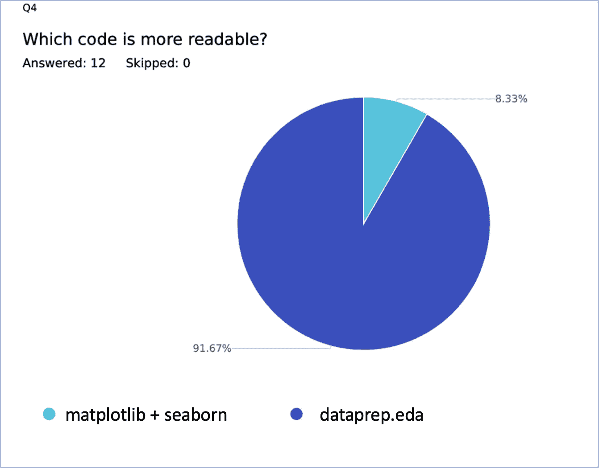**

**显然，dataprepare.eda 提供了一个更加清晰易读的代码。**

**3.**代码行数:**data prep . EDA 真的减少了代码长度吗？**

**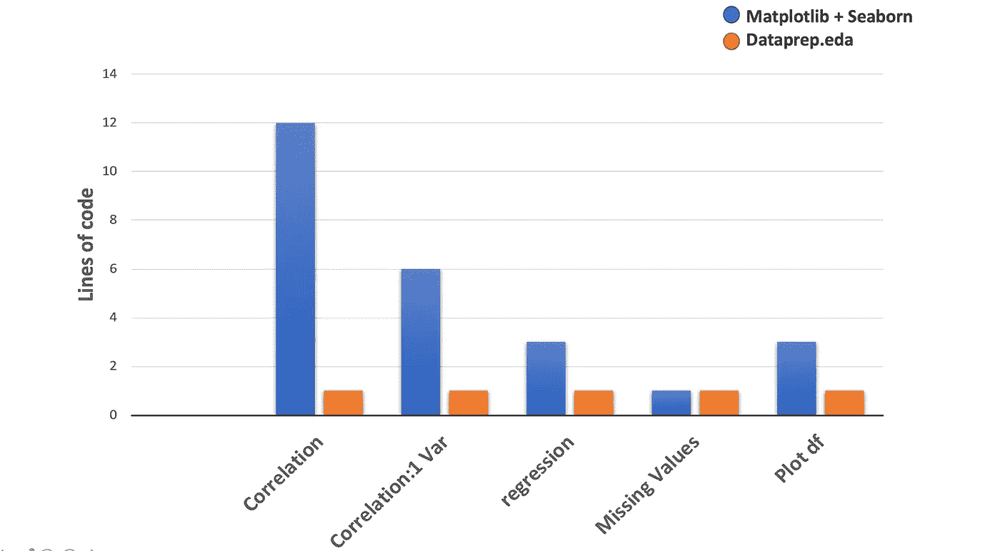**

**除了上述关键性能指标之外，dataprep.eda 还在其他几个方面比普通 python 实现甚至现有的数据分析库(如 pandas profiling)更好。让我们来看看这三种方法相互竞争时的表现。**

1.  **当我们将其他两种方法的效率与 Dataprep.eda 进行比较时，它被证明更加高效。**

****

**2.当我们谈到这些方法及其支持内存外数据的能力时，Dataprepare.eda 是唯一支持内存外数据处理的方法。事实证明，这在当今的大数据时代非常有用。**

****

**修改自:来源:【dreamstime.com】T4，转自:ilustración 9436463 Pixbox—Dreamstime.com**

**3.dataprep.eda 生成的图都是交互式的，但 matplotlib 和 seaborn 只创建静态图。这有助于加深对情节的理解。**

**我们请了几位行业专业人士和大学生对这个神奇的工具给出反馈。**

**以下是他们中的一些人要说的话:**

> **“图书馆看起来真不错。大大简化了工作。亚马逊软件开发人员 Dhruva Gaidhani 说**
> 
> **“发现缺失值非常有效。我通常花很多时间在 EDA 上。该库确实简化了一些功能。”——SFU 大学校友马南·帕拉舍**

## **结论**

**就在我们说话的时候，数据科学正在适应每一秒。我们正在探索几乎所有领域的长度和宽度，从体育分析到医学成像。这些时代要求我们将人工智能和机器学习的力量用于开发能够产生影响并节省时间的东西。拥有像数据准备这样的工具可以让我们更有效地完成准备工作。**

**一般来说，Dataprepare.eda 擅长检查数据分布、相关性、缺失值和 eda 过程等任务。编码的简易性和可读性也方便了新手使用 dataprepare 库。总而言之，Dataprepare.eda 是执行所有准备性分析任务的一站式库。这是一个即将到来的图书馆，有着光明的未来！**