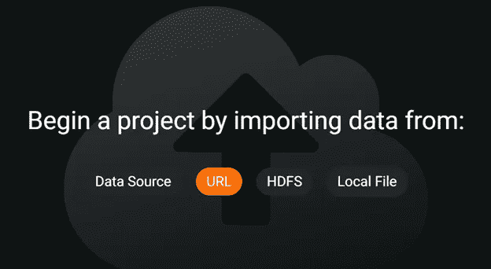
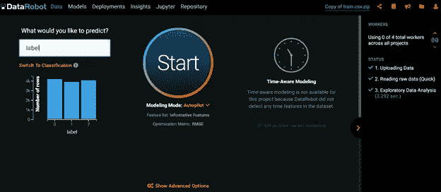
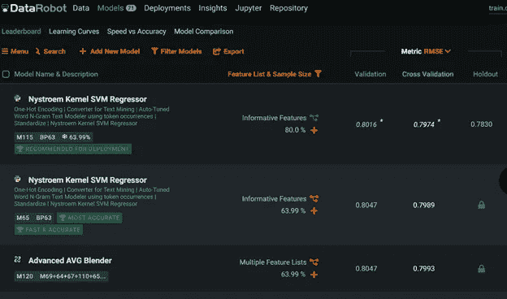
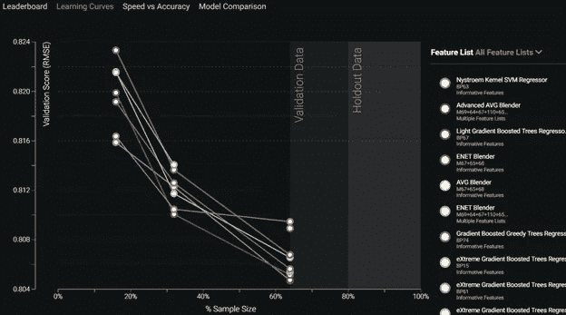
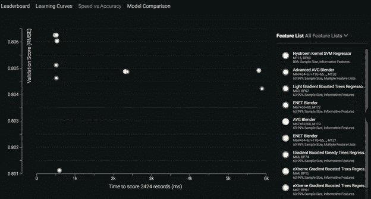
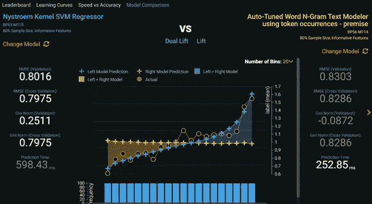
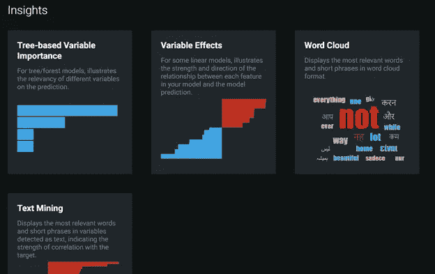
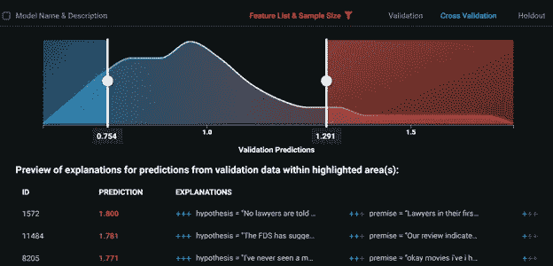
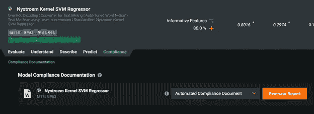
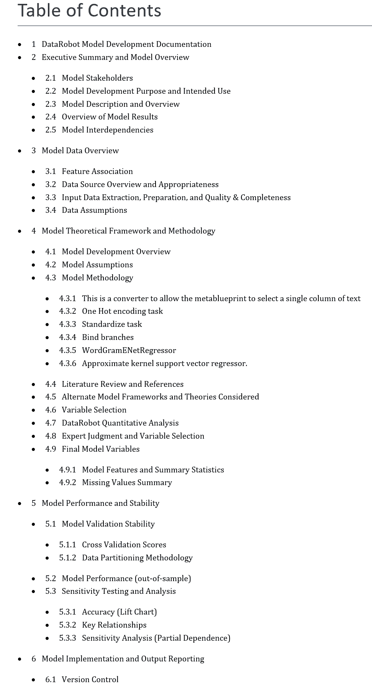

# 数据机器人让生活变得简单

> 原文：<https://towardsdatascience.com/datarobot-makes-life-easy-8505637241e5?source=collection_archive---------47----------------------->

## 汽车系列之四——设计之美

图片由[皮克斯拜](https://pixabay.com/?utm_source=link-attribution&utm_medium=referral&utm_campaign=image&utm_content=5176090)的 Gerd Altmann 提供

我偏离了本系列的前几篇文章。我将回顾两个远远超过其他工具的工具。设计和美丽的视觉效果并不便宜。这并不意味着我们不能钦佩他们，并把他们作为我们奋斗的目标。我将从 DataRobot 开始。这是一个企业工具，你可能会发现自己在工作或学校中可以使用它。

# 为什么是 DataRobot？

我有使用这个工具的经验，并且喜欢它用于我使用它的商业案例。我的商业案例是为非数据科学家提供一个简单明了的接口，以自动化的方式运行和部署模型。DataRobot 定期添加新功能，每个功能都很好地构建在现有的用户体验中。我可以继续谈论它的好处，但是我会控制我内心的粉丝。

为了与其他工具保持一致，我将专注于最基本的任务来运行一个简单的。csv 文件，无需任何手动干预或超参数调整。

# 设置和成本

坦率地说，DataRobot 超出了数据科学家个人的预算范围。实现和成本肯定是在商业领域。AWS Marketplace 提供 98，000 美元的一年订阅。口袋里的零钱，我肯定。但如果你用 AWS govCloud，就是[【9.33 美元/小时](https://aws.amazon.com/marketplace/pp/Vertosoft-GovCloud-Only-DataRobot-Automated-Machin/B082LP1GNV)(不一)。有意思。

# 数据

为了保持本系列中各种工具的平等性，我将坚持使用 Kaggle 培训文件。矛盾，我亲爱的华生。使用 TPUs 检测多语言文本中的矛盾和蕴涵。在这个入门竞赛中，我们将句子对(由一个前提和一个假设组成)分为三类——蕴涵、矛盾或中性。

6 列 x 13k+行—斯坦福 NLP [文档](https://nlp.stanford.edu/projects/snli/)

*   身份证明（identification）
*   前提
*   假设
*   朗 abv
*   语言
*   标签

# 加载数据

您可以通过上传数据集来创建项目。这个界面是您开始的地方。

作者截图

加载数据后，有机会更改数据类型或移除要素。有一些数据分布数据。额外的好处是，如果可能有数据泄漏，会有警告。如果检测到数据泄漏，DataRobot 会从最终的训练数据集中删除该特征。

作者项目截图

作者截图

# 训练您的模型

一旦你选择了你的目标，你点击大启动按钮，将建模模式设置为自动驾驶。当你这样做的时候，你会在右边看到进步。随着模型的训练，它们在完成后会出现在排行榜上。

访问早期模型结果的一个好处是，您可以查看重要的问题。很多时候，一些数据问题随着洞察力变得非常明显，我可以停止这个过程，再试一次。这种快速简单的审查有助于快速迭代。

# 评估培训结果

排行榜开始填满已完成的模型。您可以在下拉列表中选择几个有效的指标。也有一些有用的标签，让你知道为什么领导人在顶部。

排行榜截图作者

你可以将这些模型相互比较。

作者的学习曲线截图

我经常使用的一个标签是速度与准确性。如果准确性下降很小，当你获得数百万条记录时，速度会胜过准确性。

速度与准确性由作者截图

头对头模型对比作者截图

Insights 选项卡很方便。您可以快速查看您的某个功能是否弹出。这取决于你的商业专业知识，知道这是否合适。此选项卡是我在 autoML 模型培训早期发现数据问题的地方。如果我看到一些似乎不正确的东西，我可以比等待整个过程结束更快地迭代。

见解作者截图

DataRobot model explainability 是迄今为止我评论过的最好的工具。每个预测都被分配了影响最终得分的特征，不仅表明了强度，还表明了方向。

作者预测解释截图

不要低估，文档会消耗你的时间。对于这个简单的数据集，DataRobot 生成一个 7000 多字的文档，其中包含所有的图表、模型参数和 challenger 模型的详细信息。这个文档是一个独特的特性，我在任何其他工具中都没有发现，尽管我在被问到时要求过。只需一次点击即可完成。

作者提供的合规报告截图

作者提供的合规文档截图

# 结论

为了松散地比较工具之间的结果，我在分类模式下重新运行数据集。指标只是略高于 Azure。在很大程度上，模型结果是相似的。

对于我的商业案例，这是目前为止最重要的。图像处理或时间序列中的头对头可能会提供不同的结果。这将是另一个系列的挑战。

易用性、可视化、对 challenger 模型细节的访问、模型可解释性和自动化文档从其他方面脱颖而出。当然，你为此付出了高昂的代价。

接下来我给大家展示 H2O.ai 无人驾驶 ai。在我看来，他们是此时与 DataRobot 最接近的对比。他们竭尽全力让顶尖的数据可视化设计师参与这个项目，所以我期待着伟大的事情。

如果你错过了这个系列中的一篇文章，我会把它们贴在下面。

 [## AWS Sagemaker Studio 自动驾驶仪准备好迎接黄金时段了吗？

### 带有一些评论的自动驾驶界面演示

towardsdatascience.com](/is-aws-sagemaker-studio-autopilot-ready-for-prime-time-dcbca718bae7)  [## 免费体验 Google autoML 表格

### autoML 工具用户体验评论系列之二。

towardsdatascience.com](/experience-google-automl-tables-for-free-d5648ae3d0e5)  [## Azure Automated ML 倾听他们的设计师

### 本 autoML 系列的第 3 部分，微软，绝地大师

towardsdatascience.com](/azure-automated-ml-listens-to-their-designers-7f1c68d19eb4)