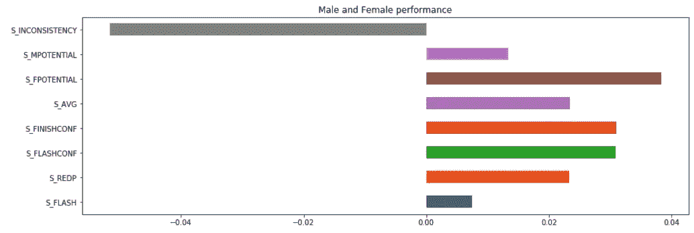
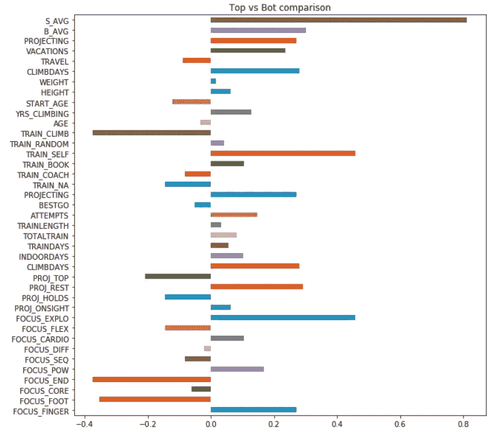
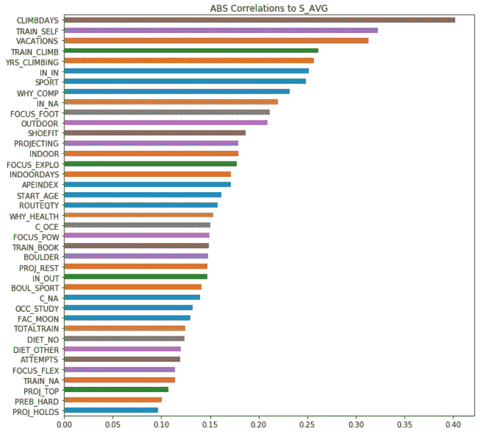
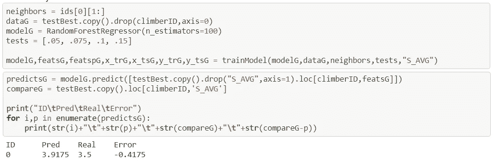

# 数据是测试版:利用数据提高攀岩和其他运动

> 原文：<https://towardsdatascience.com/datas-the-beta-the-power-of-data-to-improve-at-climbing-and-other-sports-337df948f630?source=collection_archive---------23----------------------->

凯瑟琳·玛丽和康纳·德法尔科在香港的魔鬼峰爬山。—作者照片

## 展示用于提高您在攀岩或一般运动中的表现的数据科学策略。

攀岩是一项每个人都在不断努力提高的运动。此外，与许多其他运动相反，在这些运动中，你的个人表现要么是主观的，要么依赖于他人，有非常明确的量化指标来评估你的攀岩水平:每一条路线都有攀岩难度等级，你是用身体、个人能力而不是其他任何东西来攀岩的。这可能是超级激励，也可能是一个大挫折。然后，这种变得更好的追求通常伴随着寻找原因和答案，为什么你仍然没有你希望的那么好。在攀岩中，你会不断听到:

*   “啊，如果我再高一点点”
*   “啊，如果我再轻一点”
*   “啊，如果我再坚强一点”
*   “啊，如果我从年轻时开始”

在众多借口中，有很多是关于为什么攀岩者的表现没有他们希望的那么好。

# 攀岩数据

然后，过去许多数据驱动的攀岩爱好者承担了分析几个变量与攀岩性能之间关系的任务，通常专注于体重、身高、身体质量指数和年龄。另一篇媒体文章中的图片[就是这种分析的一个例子。](https://medium.com/@buckthecanuck/climb-through-the-data-with-me-80fb144ea408)

[马克·达德](https://medium.com/@buckthecanuck)对身体质量指数和身高与最大坡度的分析

将你的假设如此清晰地可视化，并在数据中找到趋势和相关性可能会非常令人兴奋，它甚至可以揭示一些反直觉的结果。例如，我相信大多数攀岩者期望与身高成正相关，而数据似乎表明并非如此。然而，所讨论的数据的性质也是一件非常重要的事情。知道对于强壮的攀岩者来说，在高度上有一个最佳点，我得到了什么？这不像我可以简单地增加或缩小 10 厘米来达到最佳高度。知道这一点只能作为一个额外的借口(大多数攀岩者都喜欢)来证明我们的表现，或者作为一个额外的打击士气的因素，以防你有最佳的参数但仍然表现不佳。

"比我高 5 厘米的攀岩者往往比和我一样高的攀岩者更努力."那又怎样？我希望我的分析结果能指导我实际上可以做些什么来改进，而不是简单地陈述我档案中不变方面的统计趋势。带着这个动机，我创建了一个[调查](https://forms.gle/dgZAkwvBHcoapj8D9)来收集攀岩者的数据，这样我就可以进行更全面的分析，作为攀岩表现改善策略的基础。

# 调查的描述

该调查包括 44 个问题，分为 5 个不同的部分，以收集不同类型的信息:

*   ***个人简介*** :关于攀岩社区个人方面的问题，如年龄、性别、国籍、职业、攀岩原因等。
*   ***训练简介*** :关于他们多久攀登一次、多久训练一次、持续多长时间、如何训练、训练时注重什么能力等问题。
*   ***投影轮廓*** :关于对投影路线的态度和策略的问题。
*   ***抱石性能*** :记录攀岩者在不同条件下的最大攀爬等级，用于抱石。
*   ***运动攀登表演*** :记录攀登者在不同条件下的最大攀登等级，用于运动攀登。

在进行分析时，该调查已有 160 名登山者回答，因此它在统计上并不显著，此处显示的关系不应视为真实，它只是这类方法的概念证明。

# 受访者人口统计

查看受访者的人口统计数据，我们可以看到数据看起来像一个正态分布的样本，没有显示出大的偏差。

*   受访者来自欧洲、大洋洲、亚洲、北美洲和南美洲。
*   男女比例合理

年龄和性别分布

*   有各种体重、身高和年龄的登山者。

受访者的年龄、身高和体重分布

因此，考虑到数据似乎是有效的，并且接近真实的表示，我开始着手进行适当的分析。

# 比较和关联

在展示现代数据科学技术(包括机器学习模型或人工智能算法等工具)的真正力量之前，我想展示即使是一些简单的技术，如方法和直接比较，如果使用正确的数据和焦点，也可以提供非常有价值的见解。

我将用例子来展示这些:

男女攀岩运动成绩的差异。

该图展示了样本中男性和女性攀岩者在运动攀岩表现上的差异。我们不能概括这些倾向，但我们可以看到，至少在这 160 名登山者中:

*   男性攀爬的难度比女性高 1-2%
*   女性在成功攀爬某一特定坡度时的一致性要高 5%

子集分析的另一个例子是比较声称训练的登山者和声称不训练的登山者:

声称训练的攀岩者和不训练的攀岩者之间的表现差异

尽管这很直观，也在意料之中，但由于这里的数据，我们可以看到并最终展示培训益处的事实证据。训练的登山者:

*   平均攀爬难度增加了 7%,
*   在持续闪光/曝光方面提高了约 6%
*   在重新定位方面提高了 8%

有趣的是，数据显示不训练的登山者:

*   有更大的未实现的改进潜力

事情开始变得有趣起来，现在让我们来看看投影的影响:

攀岩者和不攀岩者的百分比差异

似乎投射的影响比训练的影响更大。投射的人:

*   平均攀爬难度增加 11%,
*   对完成路线和获得红点有更高的信心
*   间接显示闪光的提高，所以他们作为整体攀登者提高，而不仅仅是他们的最高等级

有趣的是，数据显示不投射的攀岩者:

*   有更大的未实现的改进潜力
*   是更坚持不懈的攀登者

# 描述性与可操作性的洞察力

所以，看起来很好看，但是这些见解和前面说的体重身高见解有什么区别呢？可控诉的情形

虽然你不能改变你的身高、性别或年龄，但你实际上可以决定开始训练，开始计划，或开始做任何可行的策略，这些策略可以改善数据，并提供事实数据来证明所做的建议。

到目前为止，我们已经任意选择了一些变量，然后查看它们对性能的影响，但是我们可以采用其他几种方法。

让我们比较一下最强的 20%攀登者和最弱的 20%攀登者，看看他们有什么不同:

最强和最弱攀岩者之间的差异

现在，我们开始看到一些我们还没有做出任何假设的见解，数据简单地表明了这一点。更强壮的登山者…

*   投射更多
*   度假的重点是爬山
*   少旅行(他们专注于同一个悬崖，而不是去所有的地方)
*   多爬几次
*   更高更重
*   更年轻/攀岩时间更长/开始攀岩更早
*   要么自己训练，要么利用书本信息(而较弱的攀岩者要么不训练，要么和教练一起训练)
*   训练更多天和更长时间
*   多尝试几次路线，通常在以后的尝试中会比第一次更好
*   他们的训练主要集中在爆发力、手指力量、力量耐力和有氧运动上
*   每次抽签时，我都会努力观察或攀爬并休息

而表现较差的攀岩者…

*   去尝试许多不同的峭壁
*   要么在教练的指导下训练，要么简单地多爬一些来提高自己
*   尝试更少的路线，并在更早的攀爬中获得最佳表现
*   将他们的训练主要集中在耐力、步法、柔韧性、特定序列、核心和不同的攀爬上
*   要么先顶绳，要么在尝试之前尝试每一个抓手

有些事情是意料之中的，但有些确实出乎我的意料，但一旦你仔细想想，它们确实有道理。表现较差的攀岩者仍然需要专注于他们的步法和基本耐力，而不是爆发力或手指力量，因为困难和容易的攀岩对身体的要求非常不同，这是在攀岩者生命的不同阶段发展的。

# 相关性和信息增益

然后，尽管这仍然只是一个比较分析，但已经出现了一些有趣的事情，例如训练的不同重点，他们训练的方式，对投射和旅行的心态等。但是，使用线性相关和信息增益分析等策略，甚至有“更好”的方法来获得这些见解。不用深入细节，这些只是简单地找出一个变量对确定另一个变量的值有多重要的方法，因此我们可以找出哪些变量对确定某人的攀登等级最重要。

40 个最相关变量与运动攀登成绩的相关性。

那么如何解释相关性呢？很简单，这基本上意味着知道关于那个变量的信息可以让你更好地预测性能。在这种情况下，人们可以修改并对攀岩者在运动路线上的表现产生较大影响的因素依次为:

*   他们一周爬多少天(包括室内)
*   如果他们制定了自己的训练计划或他们读到的东西(或负相关，如果他们只是通过攀爬更多来“训练”)
*   如果他们专门为登山旅行度假
*   专注于攀岩运动(或者负相关，如果他们专注于抱石运动)
*   如果他们攀登是为了竞争(或者负相关，如果他们认为这只是一个健康的爱好)
*   如果他们把注意力集中在户外
*   如果他们训练力量耐力，爆发力(或负相关，如果他们训练步法和弯曲)
*   如果他们穿更紧的鞋子
*   如果他们投射
*   如果他们尝试了几次路线
*   如果他们在月球板上训练
*   如果他们每次攀登都爬更多的路线
*   如果他们热身(或负相关，如果他们直接进入硬的东西)

其他具有高度相关性但无法改变的是…

*   他们爬山有多长时间了/他们多年轻就开始爬山了
*   如果他们有更高的猿类指数

有趣的是，身高、体重和当前年龄似乎不在最高度相关的变量中，这是一件非常好的事情。这表明，体型通常并不是表现的真正限制因素。

根据这些见解，我们可以做几件事:

*   首先，体育专业人员或教练可以直接查看数据，并根据他们的个人经验使用这些数据来制定策略。
*   第二，信息最丰富的变量可以用来创建一个计算机模型，该模型可以模拟攀岩者，以便根据攀岩者的特征来预测攀岩表现。

# 体育运动中的数据驱动智能系统

无需深入研究计算机建模方法背后的科学原理，只需考虑我们创建了一个计算机模型，它能够根据登山者有关以下变量的信息来预测他们的表现:

*   他/她开始爬山的年龄
*   他/她爬了多少年了
*   他/她如何训练(独自或有教练指导)
*   他/她一周训练几天和几个小时
*   如果他/她集中训练爆发力
*   他/她一天爬多少条路线
*   他/她一天内尝试他的项目几次
*   他/她如何穿鞋
*   他/她如何看待假期(是登山旅行，还是非登山旅行)

模型的训练和测试。

图像显示了用于创建模型的代码片段，与其他登山者一起训练它，然后用列表中的登山者#10 (climberID，任意选择)测试它。目前，climber10 在 0 到 25 (5.8 和 5.15d)的范围内具有 3.5 的实际爬升平均等级(在 5.10b/6a+和 5.10c/6b 之间)，我们的模型仅使用列表中的变量预测它相当准确(它预测 3.9，仍在 5.10b/6a+和 5.10c/6b 之间)。虽然对于这个特定的模型来说，精度可能不太精确，但这主要是因为样本数据的大小。只有大约 160 个攀登者来覆盖从 5.8 到 5.15d 的 25 个等级的整个范围，这给出了算法正确学习模式的每个等级的非常少的例子。但是，用一个大几十倍、几百倍或几千倍的数据库来复制同样的策略，会产生好得多的结果。

这本身就已经很有价值了，因为它允许根据攀岩者的个人资料对他们的表现进行正确的评估。然而，它也让我们有可能探索如果这些变量中的任何一个发生变化，性能会如何。

测试攀登者描述

只是陈述一些特性，现在我们的登山者…

*   20 岁开始攀岩
*   每周攀岩 3 天
*   每天攀登 3 条路线
*   已经爬了 3 年了
*   通过简单的攀爬来训练，而不是自己制定训练计划
*   每天尝试两次艰难的路线
*   攀升至 5.10b/5.10c 左右

在此基础上，使用该模型，让我们探索和预测以下变化的爬坡性能…

*   答:每周攀岩 5 天，而不是 3 天
*   b:每天爬 6 条路线，而不是 3 条
*   c:再爬 6 个月
*   d:转而遵循个人训练计划，而不仅仅是攀岩
*   e:每天尝试 3 次艰难路线
*   f:结合 A、B 和 E(增加攀爬量和尝试次数)
*   g:结合 C、D(开始一个个人训练计划，并坚持 6 个月)

不同策略的模型输出

有了这些例子，我们可以根据其他攀岩者成功经验的历史数据，了解每种可能策略的预期结果。举例来说，这可以指导攀登者或教练哪一个是最有效的改进路径，因为一个人不能简单地同时做所有的事情，改变通常应该是渐进的。

在这个例子中，如果攀岩者每次去峭壁都爬 6 条路线而不是 3 条路线，似乎会带来最大的改善，几乎一直到 5.10d/6b+，这是攀岩者完全可以控制的，而不是增长 8 厘米。

到目前为止，我们尝试了我们提出的策略，但我们也可以使用该模型来逆向工程该过程，并找到最佳值。用下面的代码，我测试了在其他条件不变的情况下，一天爬多少次会给攀登者带来最大的进步。

给定每天不同攀爬次数的攀爬性能

在本例中，在预测了每天攀爬 1-31 条路线的坡度后，算法发现，假设其他条件不变，每天攀爬 8 条路线将达到最佳坡度。

在这种情况下，我们只关注单个变量进行优化，实际上，您可以尝试同时优化所有变量，因为它们的影响是相互关联的。对于这些类型的多变量优化有许多其他算法，例如遗传算法。我们不会探究它们，但是它们可以用于更健壮的优化。

# 结论

这就是你如何使用数据来准备自己成为一个更好的攀岩者，来评估你与那些有着相似经历但做得更好的人相比缺乏什么，来以最佳的方式集中你有限的努力，并开始攀登。

数据科学已经在工业中广泛使用，但由于某种原因，它没有在许多其他可以增加价值的领域中使用，例如登山或一般的体育运动。这只是展示了数据科学的许多潜在用例，以帮助高性能攀岩者和许多其他运动员的教练和培训。数据可以以多种方式使用:仅仅作为描述符，作为专业人员做出自己明智决策的原始数据输入，作为通过智能系统提出潜在更好或新策略的工具，或者作为所有这些的组合。

数据科学非常依赖于数据的数量和质量。这是仅使用我自己创建的调查的 156 个响应(非常少的数据库)来执行的，我是一个具有数据科学知识但没有任何关于攀岩或运动科学的适当知识的人，也没有获得更详细的量化信息的工具(没有健身房设备或设施来进行适当的健身测试，等等。).通过更多的响应，或者在真正的体育专业人士的帮助下创建更合适的调查来收集实际有用的信息，这些类型的分析的性能将大大提高，结果将更加明显，并且发现变得更加有用。

答案和你提出的问题一样好，在这种情况下，我提出了非常基本的问题。如果有人开始提出正确的问题，就会产生更多有价值的见解。

# 代码和数据

我将本文制作过程中使用的所有代码和数据都留给了对处理数据感兴趣的人，或者为了自己制作类似的东西而学习数据科学的人。它以教程的形式呈现，以便初学者能够理解。

[https://github.com/alexcasar/Data-Science-Climbing-Demo](https://github.com/alexcasar/Data-Science-Climbing-Demo)