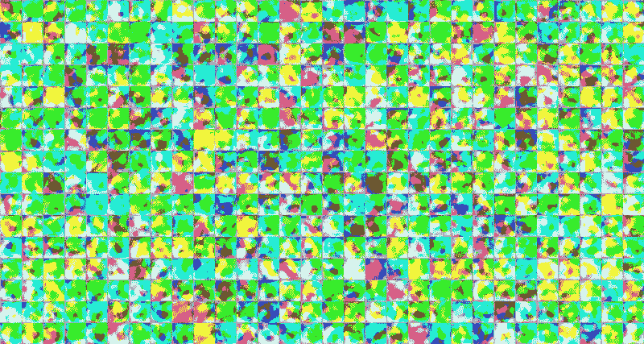
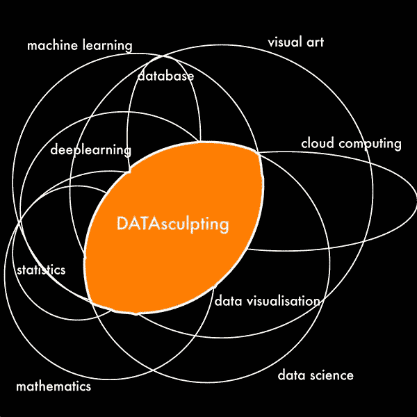
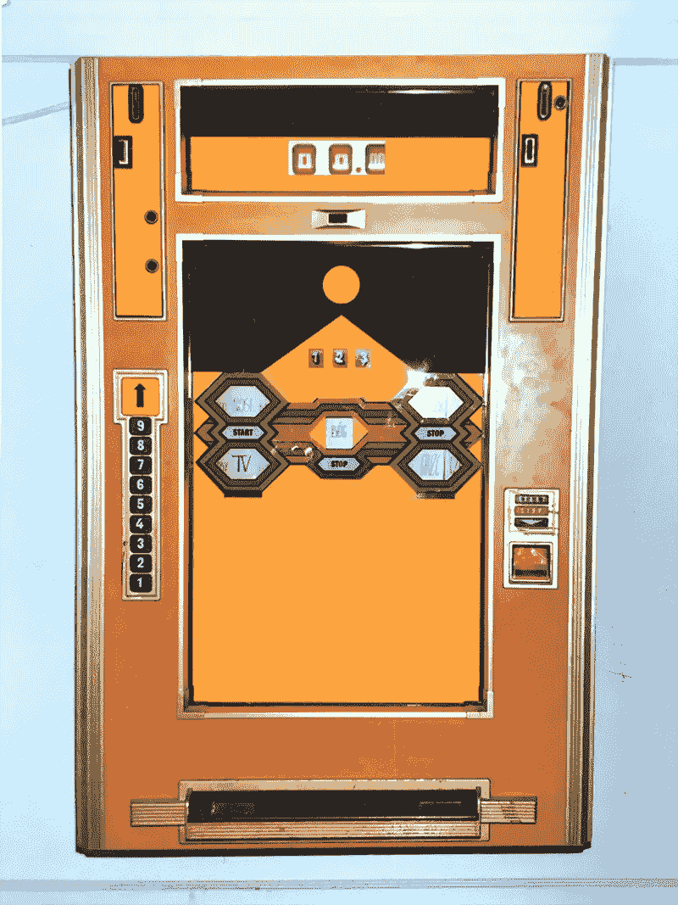
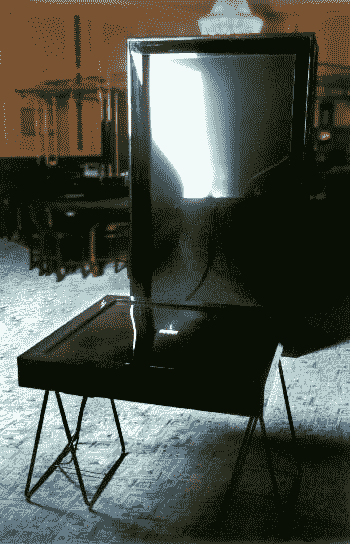
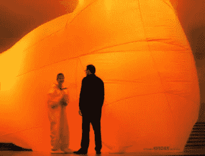
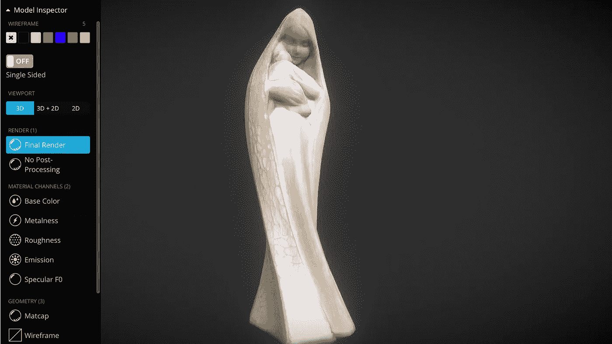
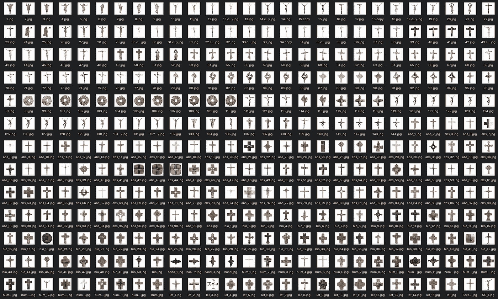
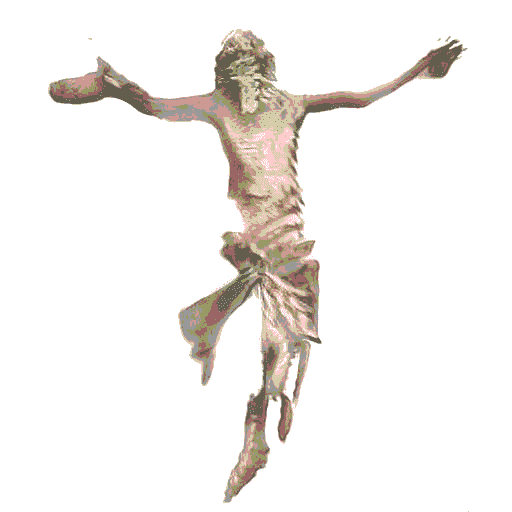

# 数据剽窃

> 原文：<https://towardsdatascience.com/datasculpting-af39f677f4f3?source=collection_archive---------33----------------------->

## [机器学习艺术](https://medium.com/mlearning-ai)

## [**机器学习在艺术上的例子 myFATHERintheCloud.ai**](https://mlearning.substack.com)

🔵这里: [**获得全媒体访问权限**](https://datasculptor.medium.com/membership) **🟠**

GAN 如何从数据库中学习[数据触发器](https://twitter.com/Gross_sculptor)

数据出错。这是我在工作中使用的一个过程，所以我想把这个故事分成三个部分。首先，是数据雕刻的定义，然后是我在 2019 年开始的 myFATHERintheCloud 项目的介绍，最后，在第三部分，是我如何使用数据雕刻来生成雕塑的例子。

 [## 如何从 AI 艺术入手？

### 这是很多人都在疑惑的问题。你应该如何开始你的 AI 艺术冒险？嗯，这一切都是从…

mlearning.substack.com](https://mlearning.substack.com/p/how-to-start-with-ai-art?r=z7zu8&utm_campaign=post&utm_medium=web&utm_source=copy) 

# 数据剽窃

[数据窃贼](https://www.instagram.com/datasculptor/)

数据剽窃存在于视觉艺术领域，但也包括数据科学的一些部分，当然还有机器学习。它使用随着数据科学的发展而产生的工具:深度学习、数据库(这是数据雕刻的一个非常重要的元素)。它在可用工具的帮助下可视化数据……所有这些都构成了“数据雕刻”的开放概念。

> **数据雕刻是一个创造性的过程，其中数据是作品成形的材料**

由 [MLearning.ai](http://mlearning.ai/) 生成的数据错误

如果我基于实例向您描述什么是数据雕刻，这可能是最好的。

这是第一幅作品，创作于 1993 年。这是一个老虎机，其中的数据集由三部分组成:名词，动词，形容词。玩这个独臂强盗游戏的人被展示随机生成的单词，这些单词组成了一个想要的句子。如果这个句子被认为是“有吸引力的”，那么这个玩家就会得到一笔奖金，或者赢得一场比赛。在这里，数据也是这个解决方案的一个重要元素。这个过程是完全自动化的——我的工作主要是选择那些单词，这些单词可以随机组成句子。

1993 年 [**独臂大盗**](http://gross.art.pl/gross/doku/one-armed%20bandit/gross%20bandit.htm) 卡·杜塞尔多夫[数据窃贼](https://www.instagram.com/datasculptor/)

另一件作品——在某种程度上也是一种碰运气的游戏——叫做“危险的玩家”,是一件在索波特赌场创作的装置作品。你在前景看到的游戏桌，

1996 年项目 [**【风险玩家】**](http://gross.art.pl/gross/doku/risky%20player/casino%2096%20gross%20dariusz.htm) 赌场大酒店 Sopot

从周围环境中收集数据，并将其指定为一个从 0 到 100 的连续数字。根据数字，图像中可见的镜子——一面黑色的镜子，它根据人流量和周围发生的事情的强度而凸出。因此，它与周围环境相互作用。这是一个非常有趣的实验。赌场里的人对周围发生的事情反应非常强烈。这些东西对他们来说非常重要；他们认为这对他们的表现有很大的影响，所以他们与工作的互动非常有趣。我工作中的这种互动感很重要，因为它收集的数据因地而异。同样的装置被设置在[美术馆](http://gross.art.pl/gross/doku/bunkier%20sztuki/gross%20your%20self-portrait.htm)，在课程中收集的数据与赌场中的数据在强度和特征上完全不同。因此，作品没有如此动态地反应，曲面镜没有像在赌场中那样清晰地凸出。

 [## GPT 3 是免费的吗？

### 你需要了解的人工智能工具

medium.com](https://medium.com/mlearning-ai/is-gpt-3-for-free-7ec8c2d904b6) 

下一件作品是 2004 年在波兹南创作的。它与收藏有关

2004 年第十四届 [**波兹南国际雕塑双年展**](http://gross.art.pl/gross/doku/poznan/gross%20poznan.htm)

由这种形式的观察者产生的内容形式的数据。这种形式是同质的，只有一种颜色。[内容](http://gross.art.pl/gross/doku/cards/index2.htm)由访问过的人生成。人们一个接一个地进入其中——这造成了一定程度的隔离，让他们在没有额外刺激的情况下集中注意力。单一颜色的形式消除了任何外部刺激，任何额外的噪音——所以这个房间是完全隔离的。

# myFATHERintheCloud.ai

我在 2019 年开始了这个项目，此后它一直专注于我父亲的作品。

> **我父亲已经做了六十年的雕刻家，所以这个项目的目标是训练一个机器学习模型，它将按照我父亲的风格雕刻，从而延续他的遗产。**

他的雕塑是具象的，宗教风格和主题。他使用的主要材料是木头。作为项目的一部分，我的目标是在工业机器人的帮助下实现他的作品，这种机器人将有能力用同样的工具按照我父亲的风格进行雕刻。

2020 年，我获得了文化部的奖学金。它涉及建立数据库的准备工作。为此，创建了网站 [w-imie-ojca.gross.art.pl](http://w-imie-ojca.gross.art.pl) 。请访问——在这一页上，您可以看到该数据库的组成部分，即 3D 扫描，以及球形全景，所有这些都可以在这一页上找到。你可以看到我父亲的作品在哪里展出——由于他作品的特殊性，这一点非常重要。记录这一切开始的时间和地点对我来说也很重要——在我看来，这可能对将来训练模型很重要。

2020 年[**#维米耶奥赫卡**](https://w-imie-ojca.gross.art.pl/)

所有扫描的模型都可以通过浏览器访问。你可以在 3D 里看到我父亲的作品是什么样子。此外，网站上还有一份时事通讯。如果你对数据雕刻这个话题感兴趣，欢迎订阅。你不仅可以收到关于数据雕刻的最新消息，还可以看到 GANs 和机器学习在艺术中的应用。

该项目的最重要的部分是数据库。它由数千张雕塑照片组成。这些照片然后被进一步处理。照片的每一个元素在模特训练的时候都很重要。你会在生成的雕塑示例中看到，背景很重要，灯光也很重要，从照片是否着色到如何格式化，一切都在这个过程中起着关键作用。我准备这些照片的方式使它们不会失去比例——这对造型很重要。我将光线正常化，通过处理照片来“扩充”数据集，包括对称反射，正如我之前提到的——光线的变化，颜色的变化。我用不同的方法让最后的效果尽可能接近我父亲的风格。

[数据窃贼](https://www.linkedin.com/in/dariusz-gross/)

# 雕塑的产生

我用各种 GAN 生成雕塑，包括 StyleGAN2(NVidia)。我已经准备了一个数据库和模型，查看由我父亲的人物照片组成的数据库，生成与我父亲的人物风格相似的新人物。本视频展示了 GAN 如何从数据库中学习。这个训练过程需要很多时间，输出图片。该数据库还包括最近制作的抽象雕塑，这扩展了该数据库，并允许现在正在创作的作品，尽管是我父亲的风格，但唤起了一种新的品质。这是 GAN 训练的样子，这是一个视频例子，所有生成的图像都被排列成了一个电影。它们展示了从抽象到具象表现的生成过程。

我生产的所有东西都是开源的，你可以在 [**我的 Substack feed**](https://mlearning.substack.com) 上跟随这个过程。

 [## m learning . ai Art | data scull tor

### 创意经济的人工智能艺术解决方案。点击阅读 MLearning.ai Art，作者 Datasculptor，是一个子堆栈出版物，包含…

mlearning.substack.com](https://mlearning.substack.com) 

[数据窃贼](https://www.linkedin.com/in/dariusz-gross/)

**看本视频全过程(代码+更多实验)//英文字幕**

**感谢您的阅读，**您可能还会喜欢其他一些文章:

 [## 机器学习与艺术杂志

### 这是会员专用的吗？不，还有一个你可以订阅的免费版本。如果你喜欢你收到的东西…

www.getrevue.co](https://www.getrevue.co/profile/mlearning_ai/members)  [## 艾:“我期待着将来和你一起工作”

### 人类创造力的终结？(代码示例)

medium.com](https://medium.com/the-innovation/ai-i-look-forward-to-working-with-you-in-the-future-4068bc639074)  [## 参加这些 ML 故事的虚拟现实之旅

### 使用虚拟现实的 MLearning.ai 顶级作家故事之旅

medium.com](https://medium.com/mlearning-ai/take-vr-tour-of-these-ml-stories-a7550340a6a2) 

*所有图片均由作者创作。*

 [## 通过我的推荐链接加入 Medium-Dariusz Gross # data culptor

### 作为一个媒体会员，你的会员费的一部分会给你阅读的作家，你可以完全接触到每一个故事…

datasculptor.medium.com](https://datasculptor.medium.com/membership) 

*   *查看我的*[*insta gram*](https://www.instagram.com/datasculptor/)*每周都有新素材*
*   *如果你喜欢这个，* [*跟我上媒*](https://medium.com/@DATAsculptor) *了解更多*
*   *想要合作？让我们连线上*[*LinkedIn*](https://www.linkedin.com/in/dariusz-gross/)
*   *想去探索 3D 模型吗？访问*[*sketch fab*](https://sketchfab.com/degross)

麦当娜由 [MLearning.ai](http://linktr.ee/mlearning) 生成

🔵 [**获得全媒体访问**](https://datasculptor.medium.com/membership)