# 使用 Octoparse 软件为初学者创建数据集

> 原文：<https://towardsdatascience.com/dataset-creation-for-beginners-using-software-4795ee119f6d?source=collection_archive---------38----------------------->

## 这是一种有趣的学习方式，可以在几分钟内抓取 1000 个网页。


迈克尔·波德格在 [Unsplash](https://unsplash.com/) 上的照片

# 介绍

# 为什么是这篇文章？

本文是网络抓取系列的第二部分。
正如我之前在我的第一篇文章中提到的，我选择写一篇关于抓取的文章，因为在构建我的项目**假新闻检测系统**期间，我花了几天时间进行相应的研究，因为我无法找到我需要的数据集。

所以，如果你没有看完我的第一篇文章，我强烈建议你看一遍，如果你有编程背景，那么你必须阅读这个系列的第一篇文章。

# 这篇文章对谁有用？

因为，对于有编程背景的用户，我已经写了一个博客，并且有关于 python 的具体知识，我会建议使用它而不是任何软件来做抓取，因为我发现使用 python 比花几天时间去理解任何特定软件的接口更容易。

但是那些没有任何编程背景的人，你可以跟着我一起熟悉这个软件的界面和工作。

# 概观

本文是这个系列的第二部分，使用软件抓取网页: **Octoparse** 。

然而，有许多软件，你可以很容易地在互联网上找到自动化的目的，如

**ParseHub** ， **ScarpeSimple** ， **Diffbot** ， **Mozenda** 。

**不同自动化软件简介:**

**1。parse hub:**网站:[https://www.parsehub.com/](https://www.parsehub.com/)

目的: Parsehub 是一个非凡的工具，它无需编码就能构建网页抓取器来提取大量数据。它被数据科学家、数据记者、数据分析师、电子商务网站、求职板、市场营销、金融等更多的人使用。

特点:它的界面使用起来非常简单，你只需点击你想要的数据就可以构建网页抓取器。然后，它以 JSON 或 Excel 格式导出数据。它有许多方便的功能，如自动 IP 轮换，允许在登录墙后抓取，浏览下拉列表和标签，从表格和地图中获取数据，等等。此外，它有一个慷慨的免费层，允许用户在短短 40 分钟内收集多达 200 页的数据！Parsehub 的优点还在于它为 Windows、Mac OS 和 Linux 提供了桌面客户端，因此无论运行什么系统，您都可以在自己的电脑上使用它们。

**2。简单的刮擦:**
网站:[https://www.scrapesimple.com](https://www.scrapesimple.com/)

**目的:**对于想要定制铲运机的人来说，ScrapeSimple 是完美的服务。Web 抓取非常简单，只需填写一张表格，说明您需要哪种数据。

**功能:** ScrapeSimple 名副其实，它提供完全托管的服务，为客户构建和维护定制的 web 抓取工具。只要告诉他们你需要从哪些网站获取什么信息，他们就会设计一个定制的 web scraper，定期(可以是每天、每周、每月或任何时间)将 CSV 格式的信息直接发送到你的收件箱。这项服务非常适合那些只需要一个 HTML 刮刀而不需要自己编写任何代码的企业。响应时间很快，服务非常友好和有帮助，这使得这项服务非常适合那些只需要完整数据提取过程的人。

**3。Diffbot:**
网站:[https://www.diffbot.com](https://www.diffbot.com/)

**用途:**有特定数据抓取和屏幕抓取需求的企业，尤其是抓取经常改变 HTML 结构的网站的企业。

**特性:** Diffbot 与大多数页面抓取工具不同，它使用计算机视觉(而不是 HTML 解析)来识别页面上的相关信息。这意味着即使一个页面的 HTML 结构改变了，只要页面看起来没有变化，你的网页抓取器就不会崩溃。对于长期运行的关键任务 web 抓取作业来说，这是一个不可思议的功能。虽然它们可能有点贵(最便宜的计划是每月 299 美元)，但它们在提供优质服务方面做得很好，对于大客户来说，这可能是值得的。

**4。莫曾达:**网站:[https://www.mozenda.com/](https://www.mozenda.com/)

**目的:**寻找基于云的自助式网页抓取平台的企业无需再犹豫。Mozenda 已经抓取了超过 70 亿个页面，拥有服务全球企业客户的丰富经验。

**功能:** Mozenda 允许企业客户在其强大的云平台上运行 web 抓取器。他们在客户服务中脱颖而出(为所有付费客户提供电话和电子邮件支持)。它的平台是高度可扩展的，也允许本地托管。像 Diffbot 一样，它们有点贵，它们的最低计划起价为 250 美元/月。

*   虽然我打算在这篇文章中详细讨论**八解符**，因为我只使用过它。

# 八解析

网址:[http://agent.octoparse.com/ws/435](http://agent.octoparse.com/ws/435)

**目的:** Octoparse 是一个非常棒的工具，适合那些希望从网站中提取数据而无需编码，同时仍能通过其易于使用的用户界面控制整个过程的人。

**特性:**octoporse 对于那些不需要学习编码就想抓取网站的人来说是一个完美的工具。它具有一个指针和点击屏幕抓取器，允许用户抓取登录表单，填写表单，输入搜索词，滚动无限滚动，呈现 javascript 等等。它还包括一个站点解析器和一个托管解决方案，供希望在云中运行其抓取器的用户使用。最重要的是，它有一个慷慨的免费层，允许用户免费建立多达 10 个爬虫。对于企业级客户，他们还提供完全定制的爬虫和托管解决方案，他们负责为您运行一切，并直接向您提供数据。

**从 1000 篇新闻文章中提取数据的逐步解释**

**第一步:下载 Octoparse**

*   转到网站:[http://agent.octoparse.com/ws/435](http://agent.octoparse.com/ws/435)
*   并遵循社区的指导方针。
*   如果你想购买这项服务，你可以在这里探索所有的计划:[http://agent.octoparse.com/ws/436](http://agent.octoparse.com/ws/436)。

**第二步:报名**

*   完成下载和安装后，如果您以前没有创建过帐户，请注册一个。

**第三步:探索它**

*   在您自己开始之前，我强烈建议您探索它的不同部分，这些部分最终将帮助您在以后的工作中与这个界面进行交互。
*   浏览热门模板部分，那里有一些热门网站的热门模板，你可能会在那里找到你需要的数据。
*   浏览模板模式和高级模式的教程

**第四步:输入网址**

*   如果你只想从一个网站抓取数据，你可以简单地将你复制的网址粘贴到主页上，然后点击开始。

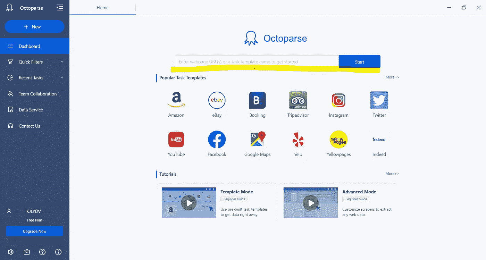

Octoparse 软件截图

*   但是如果你想从多个网站收集数据。然后，转到新的选项卡&然后，单击高级选项。

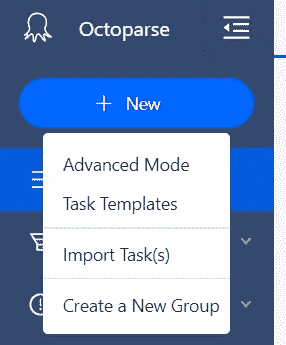

来自 Octoparse 的截图

*   你会看到一个像这样的新窗口，在这个窗口中，你可以用更高级的选项轻松地组织你的工作，也可以跟踪你的目录。


来自 Octoparse 的截图

*   因此，你可以在这里上传多达 10k 个不同的网址，但条件是这些不同的网址的布局应该是相同的，以便能够提取数据，否则，它会自动完成这个过程，但会给你不同网站的布局单独的结果。所以你不会得到所有的数据合并在一起。

**第五步:指定刮削细节&属性**

点击保存，你会看到这样一个窗口:
左边部分是维护工作流程，中间会显示你输入的第一个 URL 的网页，下面部分会显示数据预览。

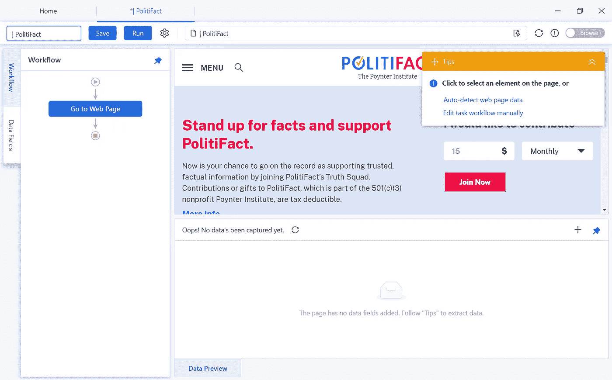

来自 Octoparse 的截图

*   在那里，你有两个选项来进一步移动:**自动检测网页数据**

你可以选择“自动检测网页数据”,根据它的理解抓取 imp 特性并返回五个不同的结果。其中你可以选择跳过对你没用的东西，或者保留它，如果它按照你的意愿刮去了所有属性的话。

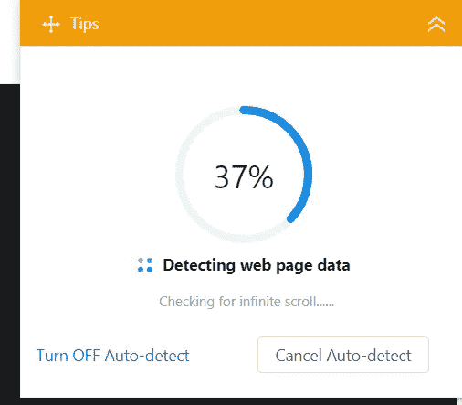

来自 Octoparse 的截图

在下面的对话框中，您可以根据需要选择进行编辑。

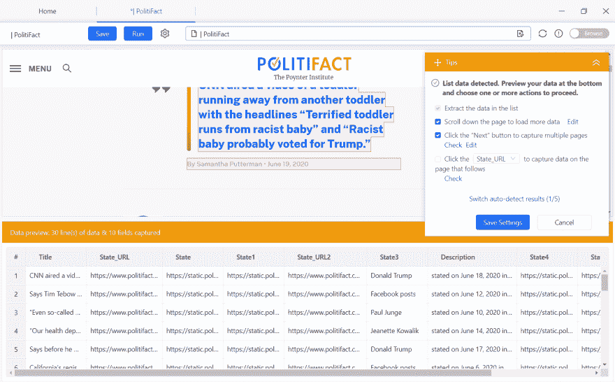

来自 Octoparse 的截图

因此，在上面的图像中，您可以根据需要启用或禁用 3 个选项。

*   首先:**向下滚动页面以加载更多数据。**因此，如果一个网页没有分成不同的页面，所有的数据可能都在同一个页面上&要提取所有数据，您只需启用“加载更多数据”选项。
*   第二:**点击下一页按钮抓取多个页面**
    启用它将对您选择作为**下一页按钮**的页面进行分页。
*   因此它将允许您**检查**或**编辑**下一步按钮。点击**检查**，您将看到**下一步按钮**在自动检测的网页部分高亮显示。
*   如果自动检测不正确，点击**编辑** >现在点击网页屏幕上您想要检测为“**下一个**按钮的任何内容。例如，假设没有"**下一页**"按钮，而是" **>** "作为"**下一页按钮**"或者如果您不想自动抓取网页的最后一页，您可以选择分页到特定的页面，如:" **1** "、" **2** "、" **3** " &等等…
*   第三:**点击 state_url，在**之后的页面上抓取数据
*   它将允许您捕获随后页面的内容或文本，并创建另一个包含文本的属性(意味着在单击特定 URL 时页面内容会打开)。

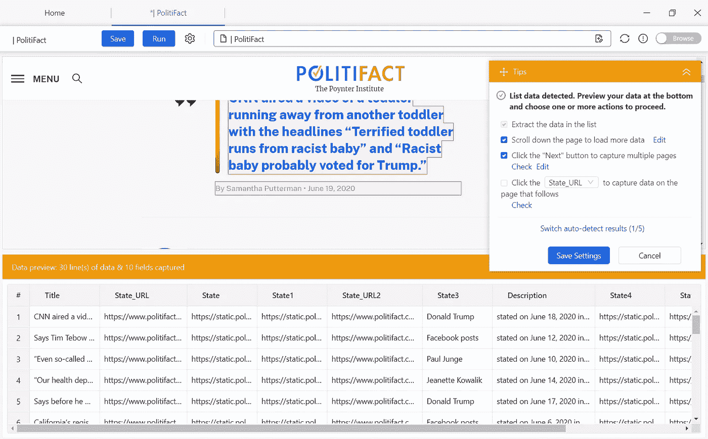

来自 Octoparse 的截图

*   在提示中还有一个选项，“切换自动检测结果(1/5) ”，因此单击此链接，您将能够看到 5 组不同的自动检测数据集。你可以根据需要保留它。
*   编辑完成后，点击**保存设置**
*   您可以在**数据预览**中看到抓取的结果，也可以编辑“属性名称”。

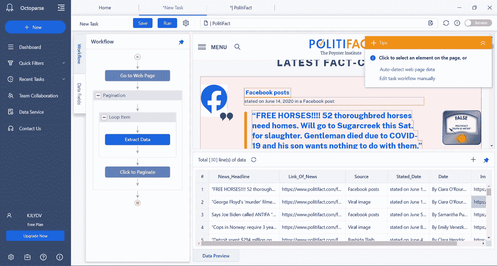

来自 Octoparse 的截图

*   您将看到工作流程中的如下变化:

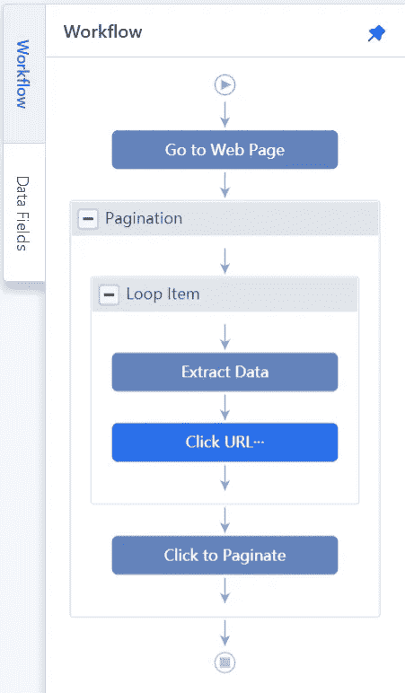

来自 Octoparse 的截图

**手动编辑任务工作流**

*   或者您可以根据需要选择手动编辑工作流&从 web 页面中选择一个特定的元素作为属性显示在您的数据集中。

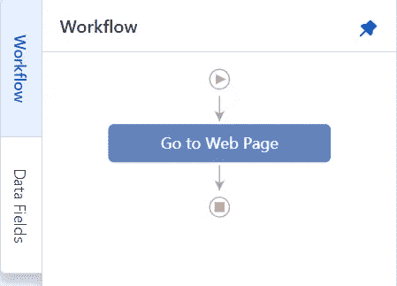

来自 Octoparse 的截图

*   在那里，在指向下的箭头上，您会发现一个“+”号，可以根据您的需要添加元素。

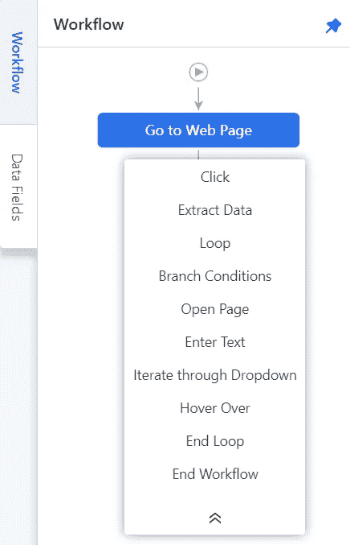

来自 Octoparse 的截图

*   这将有助于你明确和组织你的工作。与前面自动检测数据的情况一样，它自动抓取了太多不相关的属性。所以具体到你需要什么，我会建议选择第二个选项。
*   它还允许您重命名、删除或编辑任何特定元素，或者您可以根据需要选择更改设置。
*   我将向您演示一个提取 1000 篇具有 6 个属性的文章的示例:**新闻标题**、**链接**、**来源**、**陈述于**、**日期**、**图片 _url** 。

**手动提取数据**

*   要提取所有内容，请转到网页部分>选择第一篇文章的具体细节，如:“新闻标题”、“新闻链接”、“新闻来源”、“声明日期”、“日期”>只需在第一篇文章上单击这些项目>该部分将被突出显示，如下所示:

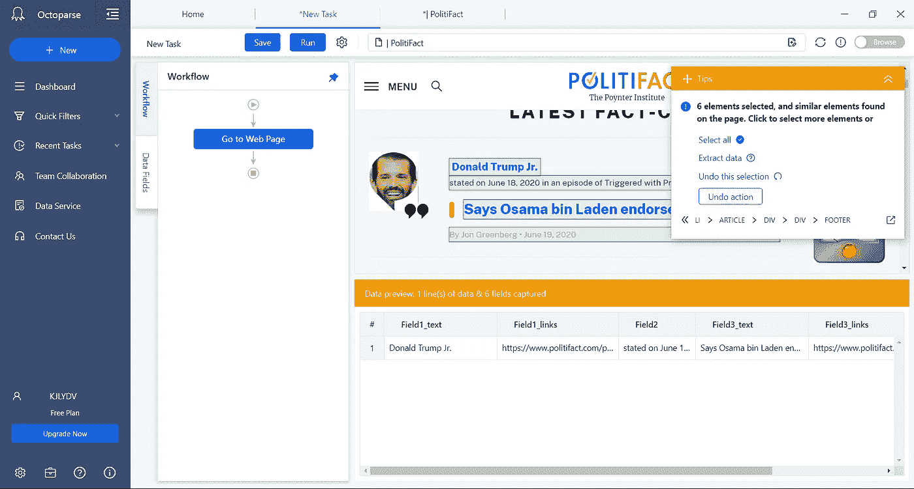

来自 Octoparse 的截图

**对所列网址首页的所有新闻文章进行数据提取**

*   然后，选择“**全选**”选项将会选择每篇文章的相同具体细节，直到网页的最后。您将在数据预览中看到捕获的 30 行，如下所示:

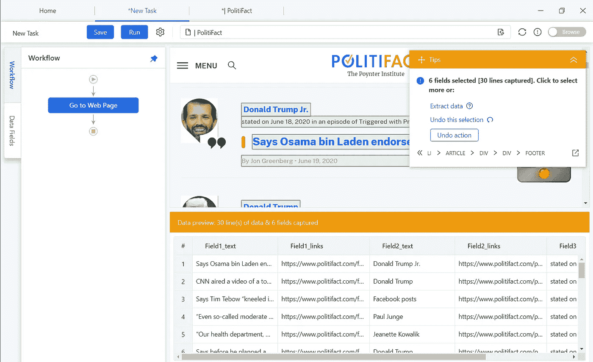

来自 Octoparse 的截图

*   现在，点击“**提取数据**”选项，将提取所输入网址的第一页上列出的所有文章的所有详细信息。
*   您现在可以看到工作流程中的更改:

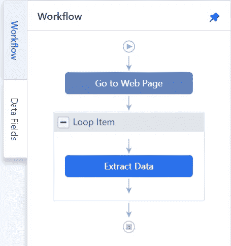

来自 Octoparse 的截图

*   将打开一个对话框，要求提取更多元素:

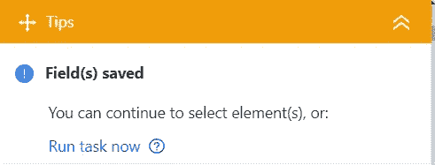

来自 Octoparse 的截图

*   由于我们还没有抓取 image_url，我们将单独选择它，并按照上面列出的相同步骤操作:
*   选择网页部分上的图像:

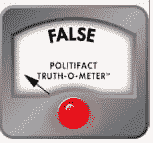

*   将出现一个对话框，带有 diff options > Select "**Select All**选项。

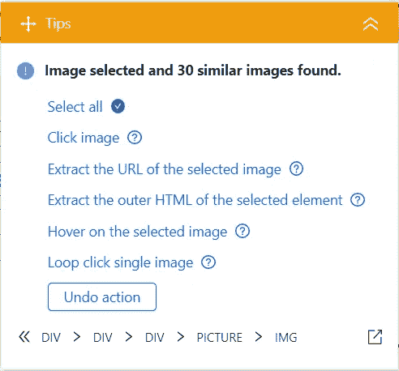

来自 Octoparse 的截图

*   另一个弹出窗口将会出现，要求 diff 选项选择>选择"**提取图像 URL**"

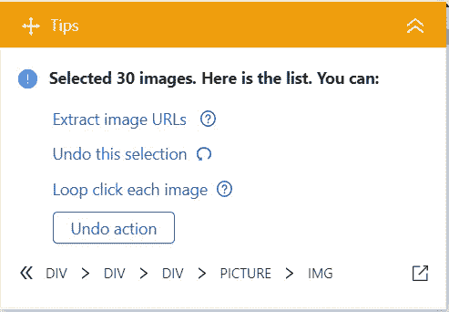

来自 Octoparse 的截图

*   对于第一页上的所有新闻文章，您已经完成了抓取图像 URL 的工作&这将为您的数据预览添加一个新属性。
*   这是编辑属性名称后数据预览的外观:

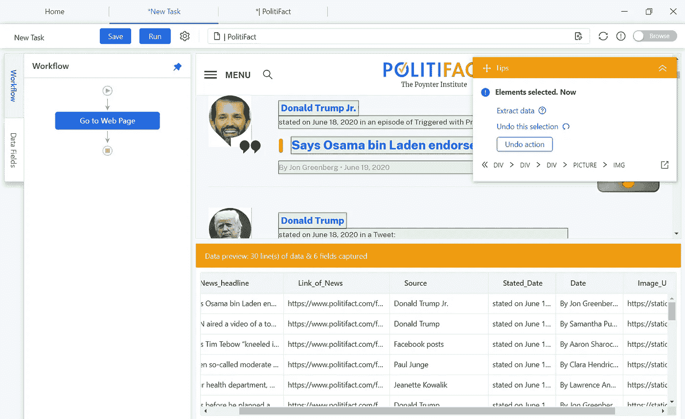

来自 Octoparse 的截图

*   一个弹出窗口将再次出现，要求提取更多的元素，因为我们希望从多个页面提取数据，我们将进行分页。

**分页**

*   现在，如果您需要大量数据，您可以循环到特定页面或所列 URL 的最后一页。
*   要进行分页，您所需要的只是搜索为特定网页指定下一页的关键字，例如:“ **next** ”、“ **>** ”或任何内容。>点击关键字>在我的例子中，它是“**下一个**”按钮本身>点击它>它将被高亮显示&一个新窗口将会弹出。

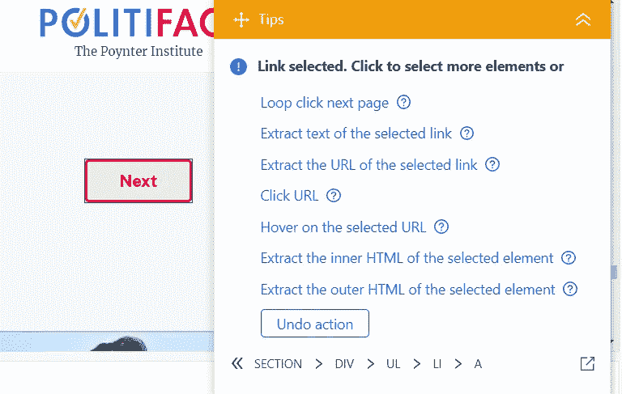

来自 Octoparse 的截图

*   选择**循环点击下一页**
*   完成后，您的工作流现在看起来有点像 auto one 的工作流。

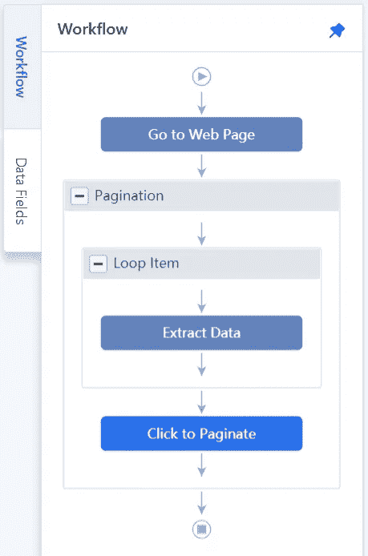

来自 Octoparse 的截图

*   完成所有编辑并组织好数据后，单击保存并运行。

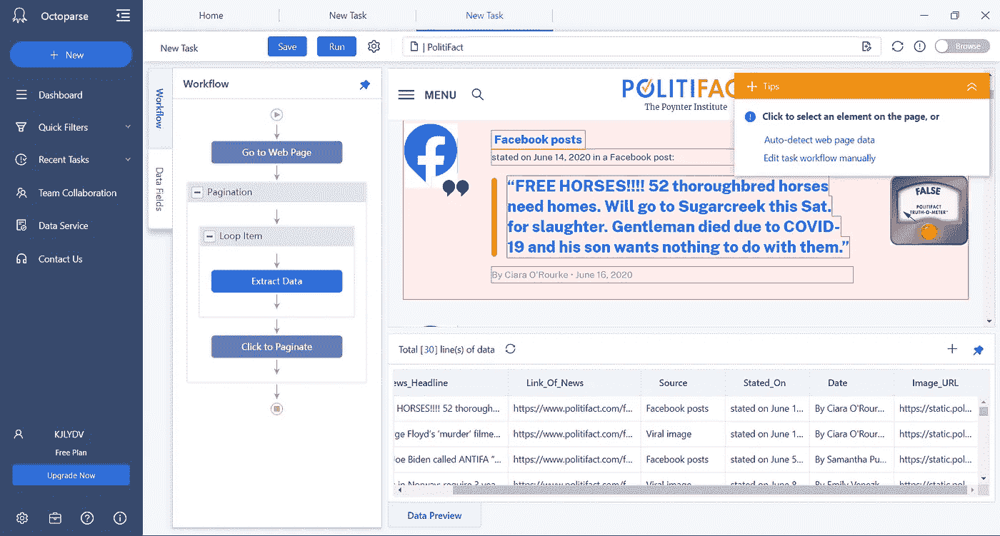

来自 Octoparse 的截图

**第六步:将数据导出到你的机器**

*   点击**保存** & **运行**选项将打开带有新窗口清单 3 的选项来选择如何运行它。

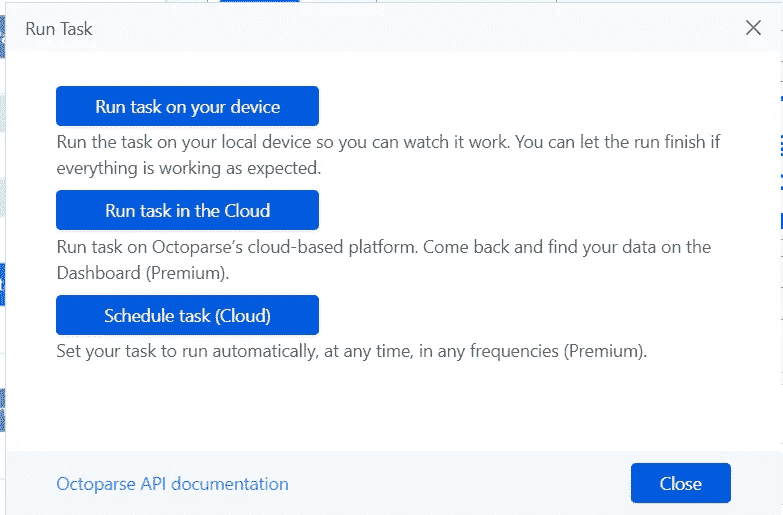

来自 Octoparse 的截图

*   如果你是一个高级用户，只有这样你才能访问最后两个选项，这些选项提供了像每天，每周，每月抓取任何网站的功能和许多其他功能。他们的服务器会照顾你的数据，并在根据你选择做的事情进行组织后发送给你。
*   如果您不是自由用户，请选择第一个选项，“在您的设备上运行任务”
*   它将开始提取所有数据，而且在提取数据时，您需要稍微注意一下，虽然这是通过自动化完成的，因为如果数据限制超过 10k，它将停止，您将不得不再等一个小时来从头提取数据。

您还需要唤醒您的系统，因为如果您的屏幕在提取数据时休眠，它可能会停止提取数据&您将不得不再次启动它来提取更多或尽可能多的数据。

*   选择**导出数据**:

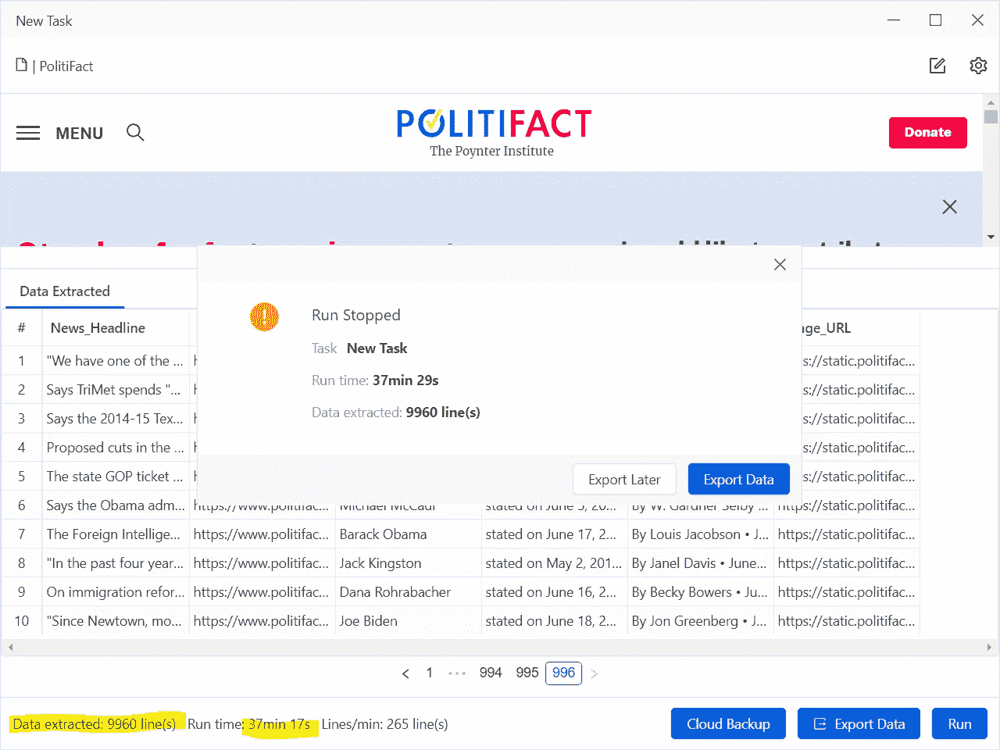

来自 Octoparse 的截图

*   选择保存文件的格式:

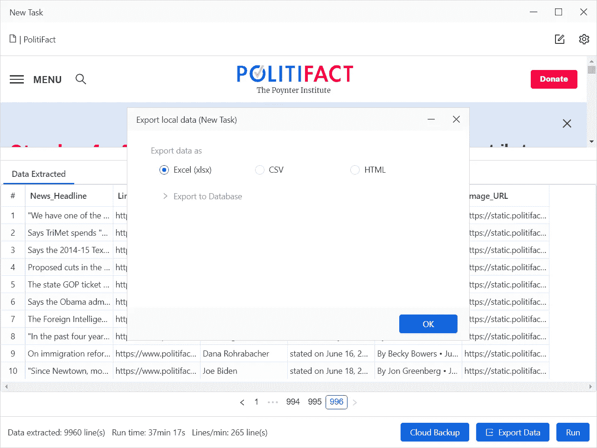

来自 Octoparse 的截图

*   因此，我选择将我的文件提取为. csv 文件，并将其保存到我的桌面上，不要关闭此窗口，我们将使用它来提取数据。又是 xlsx 格式。

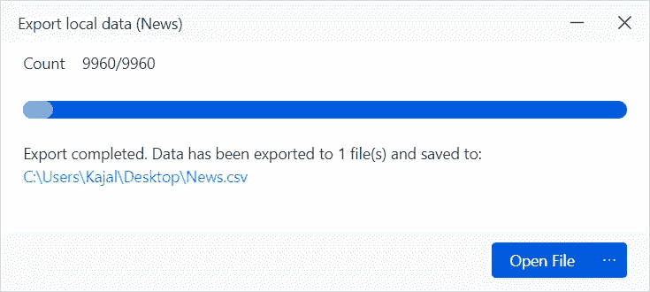

来自 Octoparse 的截图

*   现在，让我们来看看我们提取的数据。


哦哦！😐这是一种可疑的形式，不可读&根本没有条理。

让我们再次转到导出窗口:导出数据>选择。xlsx 格式这次>点击确定。

*   现在，让我们看看中导出的数据。xlsx 格式。

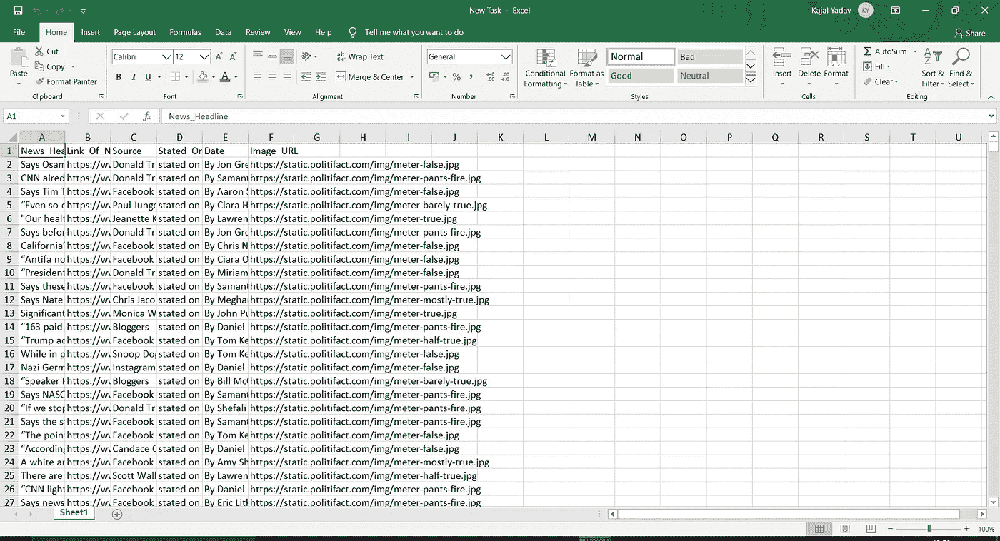

瞧啊。现在，这确实有意义，所有的模糊性都从我们的数据中消除了。

**步骤 7:使用公式格式化 Excel 文件**

**检查数据集**

*   你要做的第一件事是检查你的数据集，在检查我的数据集时，我发现一些不相关的东西，我无法在抓取时编辑。

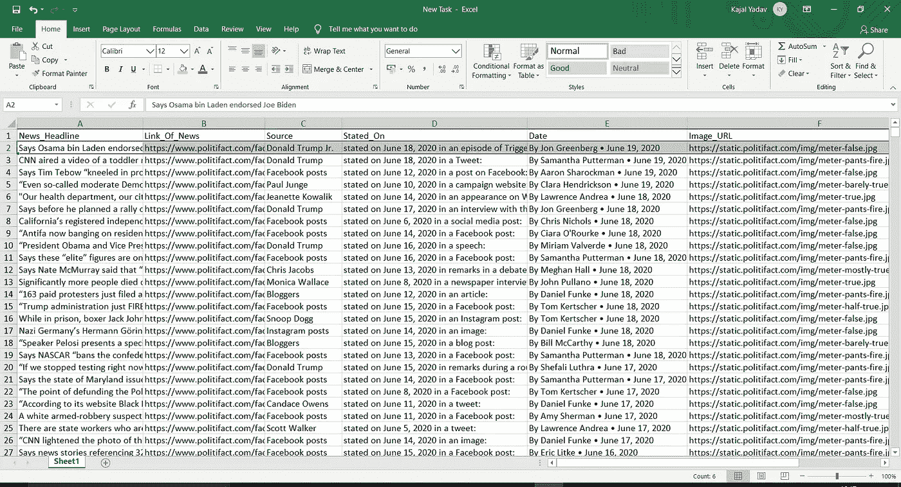

因此，我们将对 excel 文件执行一些格式化任务。

**I.** 查看我的“**图片 URL** ”属性，所以我提取图片 URL，从中提取标签。由于标签值写在图像 URL 中，我没有找到任何更好的选项来提取它。

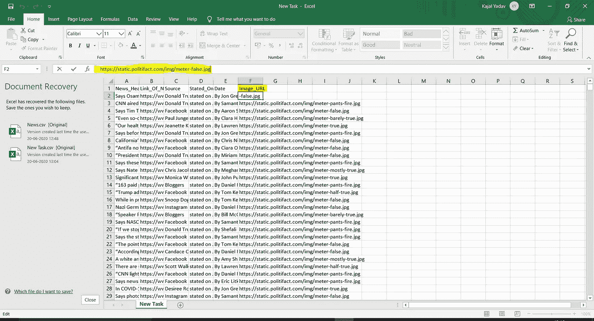

*   所以如果你仔细注意到“**图片 URL** ”属性，有一个小字符串“**”。jpg** " &一个更大的字符串"[**https://static.politifact.com/img/meter-**](https://static.politifact.com/img/meter-)"，它对于所有行的"**图像 URL** 属性都是通用的。
*   因此，我们将用“<empty space="">”替换这两个字符串，以获得我的标签值。</empty>
*   按 ctrl+H >填充字段"**查找什么**"用"。jpg" &然后，将字段"**替换为**"填充为"<空白区域>"(表示您不必在那里指定任何内容)>单击"**替换所有** " >按"**确定** " &您就完成了您的标签。

**1。**

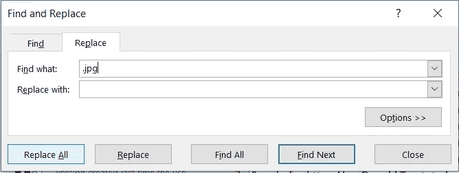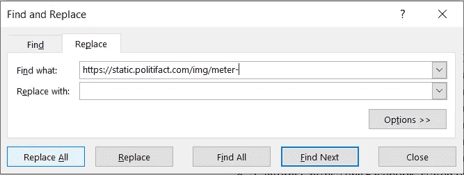

**2。**

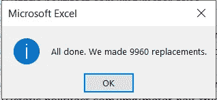

这是您的属性格式化后的样子，

**3。**

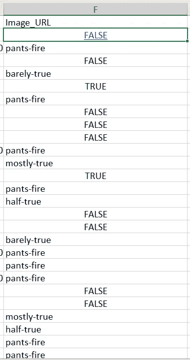

*   正如你所看到的，它还有两个问题，首先是第一个单元格中的值是一个超链接。第二是多余的空间。

1.  要从特定单元格中“移除超链接”>右击它>从下拉菜单中选择“**移除超链接**”。要从整列中移除>选择整列>右击它>从下拉菜单中选择“**移除超链接**”。
2.  要删除特定属性中的“多余空格”，请>转到任何空白单元格>编写公式: **=TRIM(属性的第一个单元格的地址)** >按 enter 键>您将看到第一个单元格的格式化值>将更改应用到所有单元格>拖动&将第一个单元格拖放到特定属性的最后一个单元格。>您将看到所有以应用格式插入的值>现在通过选择整个新列用旧列替换新列>>复制它>然后，在需要粘贴的地方选择整个旧列>转到粘贴选项>从下拉列表中选择粘贴值(V)选项。

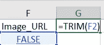

太棒了。您已经完成了“**标签**列。
现在看一看:

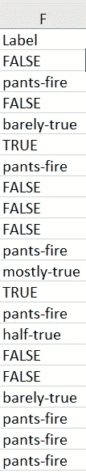

**二。**看看我的另一个属性**在**上的表述，其中我关注的数据是唯一的日期。

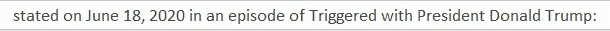

要删除除此之外的文本，我们将分两步进行:

*   正如您已经看到的，对于在整个列中重复的字符串的相似模式，我们可以使用前面的模式来查找它&用 nothing 替换它。因此，对于子字符串“stated on ”,我们将用 nothing 替换它。

这就是我们专栏的样子:

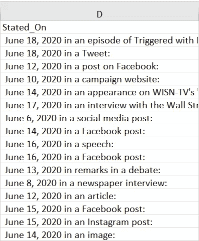

*   注意到上面的图片，你会发现这个列的所有行的另一个子字符串是不同的，那么该怎么办呢，因为我们只需要一个日期，我们这次将提取它:

让我们看看:在一个新的空单元格中键入 command " **=MID(所述属性的第一个单元格的地址，你要提取的字符串的起始索引，你要提取的字符数** " >按 enter >你会看到第一个格式化的值>然后，重复上述步骤来改变所有值&用新值替换它。

编写公式的格式:

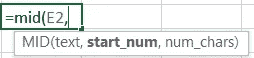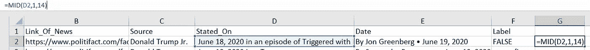

按回车键时:

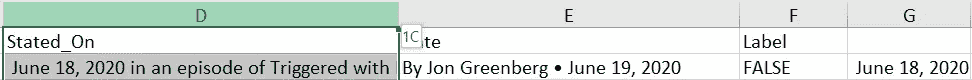

看看属性上新的**说明:**

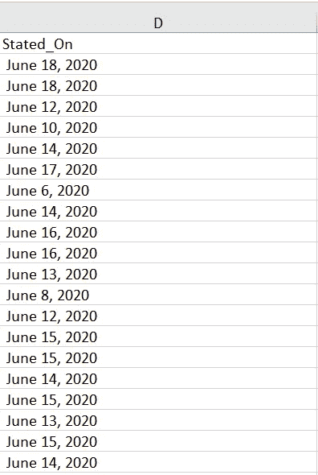

**三。**在“ **Date** ”属性中，我们不需要日期以外的文本，我们也不能在这里使用“ **mid** ”公式，因为日期是在字符串&的后缀中指定的，没有明确的起点，因为它对于所有的比较单元格都是变化的。

因此，我们将通过使用“ **RIGHT** ”来实现此任务:

转到 new empty cell > type command "**RIGHT(E2，LEN(E20-FIND("，E2))** " >按 enter >键，执行与上述相同的步骤，用旧值替换新列插入的值。

1.  编写公式:

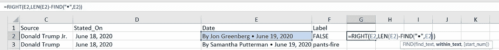

2.按回车键:

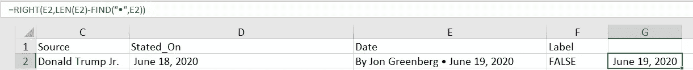

3.新列将如下所示:

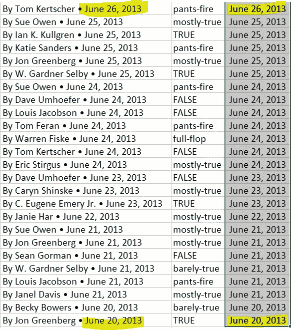

所有格式化后的最终数据集:

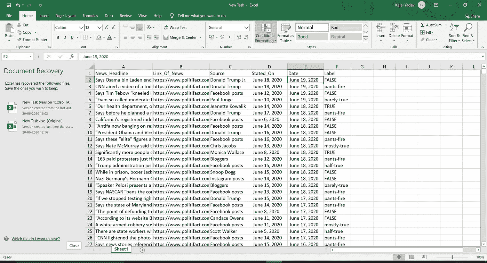

所以，这些数据现在都已经整理好了，可以使用了，我希望你们会发现这篇文章对你们有用。请在评论框中分享你的想法&如果你有任何疑问，请告诉我。✌️

所以，如果我的博客帖子对你有所帮助，而你此刻觉得很慷慨，请不要犹豫，请给我买杯咖啡。☕😍

[](https://www.buymeacoffee.com/techykajal)

是的，点击我。

```
And yes, buying me a coffee **(and lots of it if you are feeling extra generous)** goes a long way in ensuring that I keep producing content every day in the years to come.
```

您可以通过以下方式联系我:

1.  订阅我的 [**YouTube 频道**](https://www.youtube.com/channel/UCdwAaZMWiRmvIBIT96ApVjw) 视频内容即将上线 [**这里**](https://www.youtube.com/channel/UCdwAaZMWiRmvIBIT96ApVjw)
2.  跟我上 [**中**](https://medium.com/@TechyKajal)
3.  通过 [**LinkedIn**](http://www.linkedin.com/in/techykajal) 联系我
4.  跟随我的博客之旅:-[**https://kajalyadav.com/**](https://kajalyadav.com/)
5.  成为会员:[https://techykajal.medium.com/membershipT21](https://techykajal.medium.com/membership)

也可以看看我的其他博客:

[](/8-ml-ai-projects-to-make-your-portfolio-stand-out-bfc5be94e063) [## 8 ML/AI 项目，让您的投资组合脱颖而出

### 有趣的项目想法与源代码和参考文章，也附上一些研究论文。

towardsdatascience.com](/8-ml-ai-projects-to-make-your-portfolio-stand-out-bfc5be94e063) [](https://medium.com/datadriveninvestor/predicting-us-presidential-election-using-twitter-sentiment-analysis-with-python-8affe9e9b8f) [## 基于 Python 的推特情感分析预测美国总统大选

### 修订数据科学基础的有趣项目，从数据集创建到数据分析再到数据可视化

medium.com](https://medium.com/datadriveninvestor/predicting-us-presidential-election-using-twitter-sentiment-analysis-with-python-8affe9e9b8f)