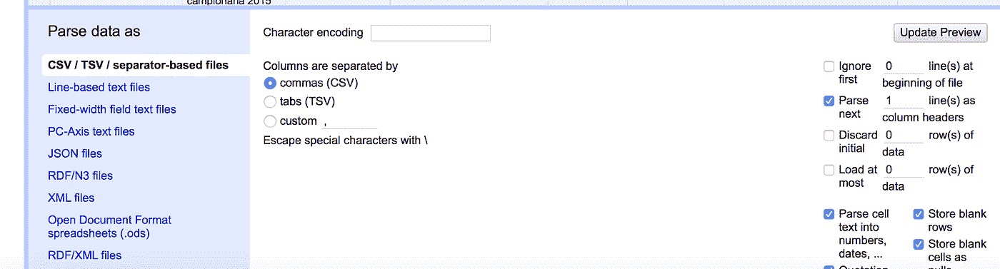
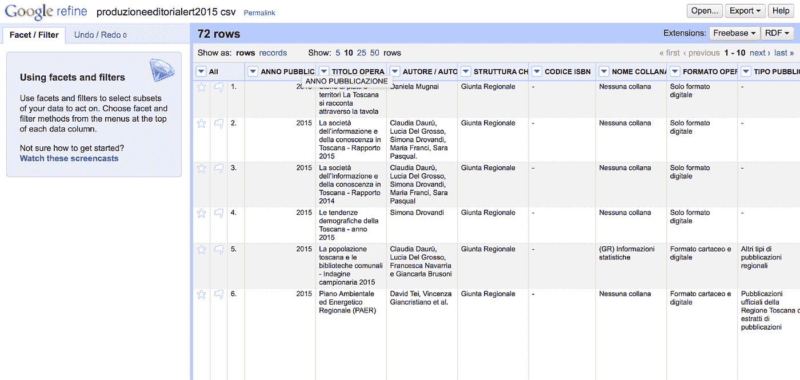
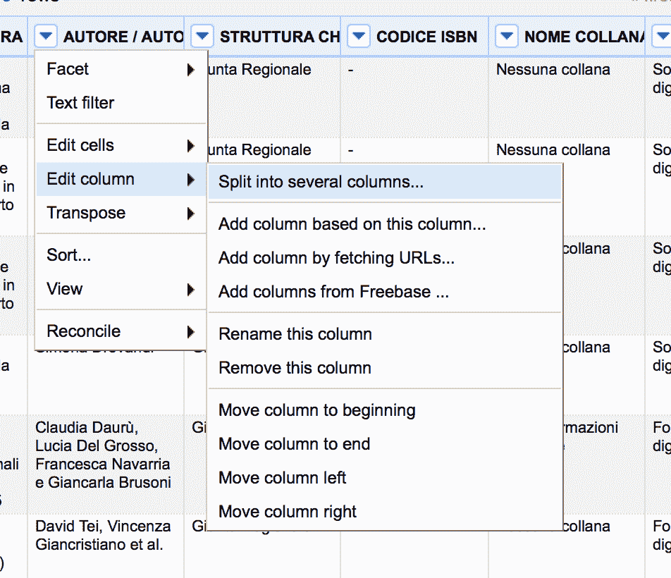
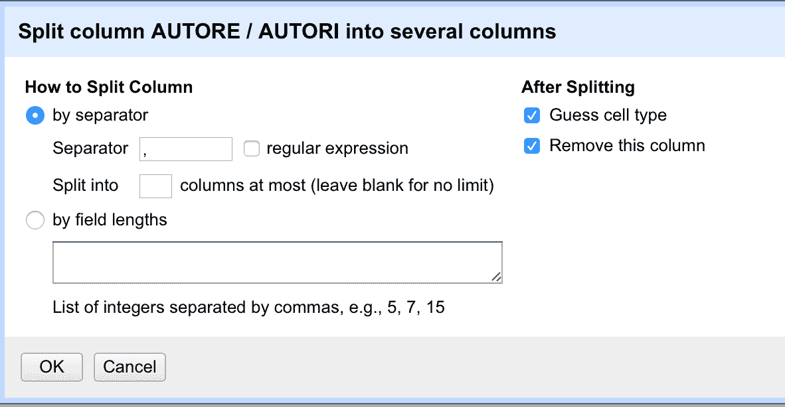
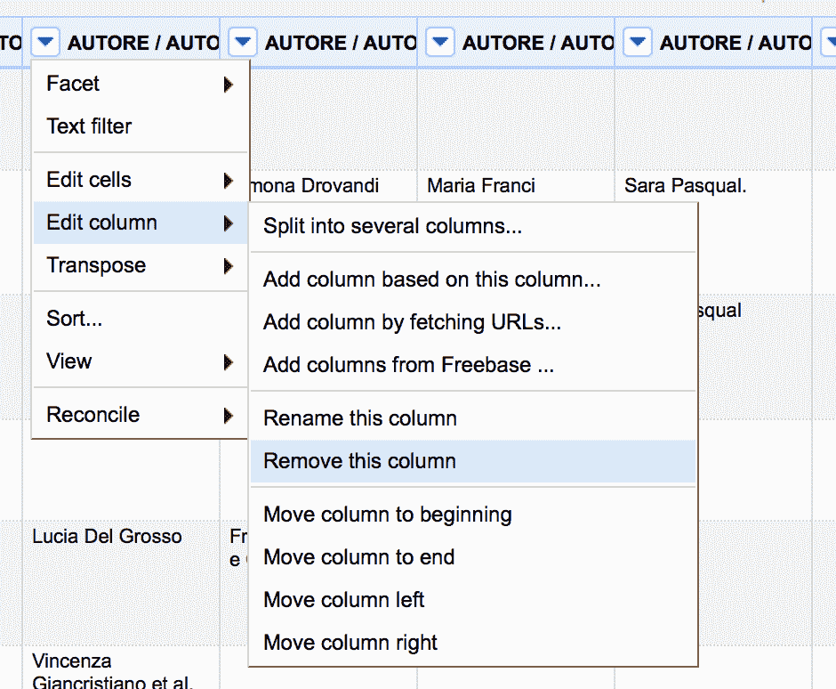
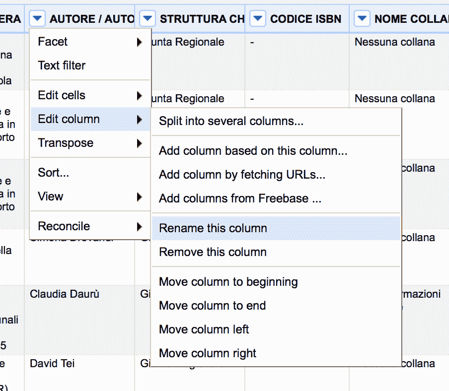
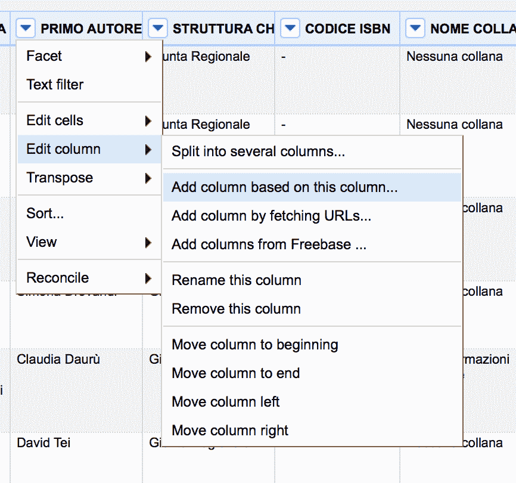
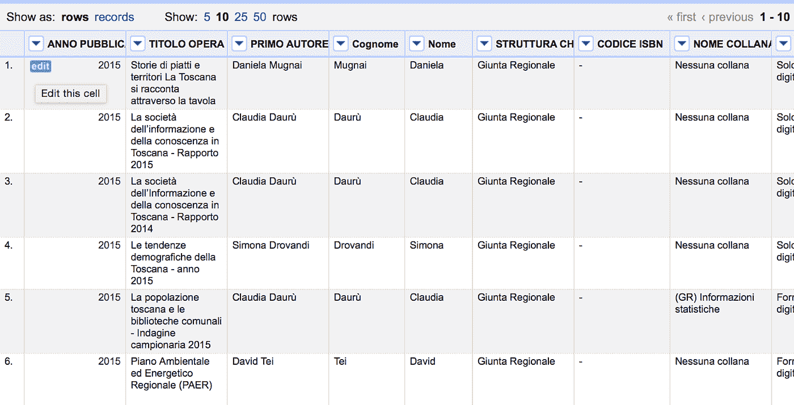
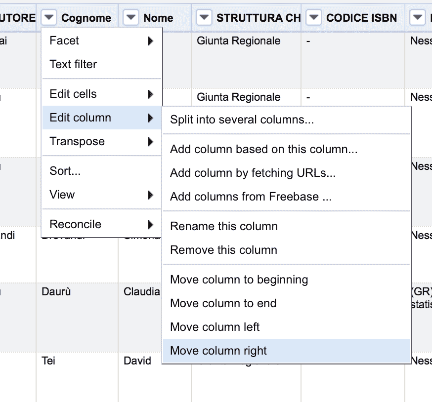
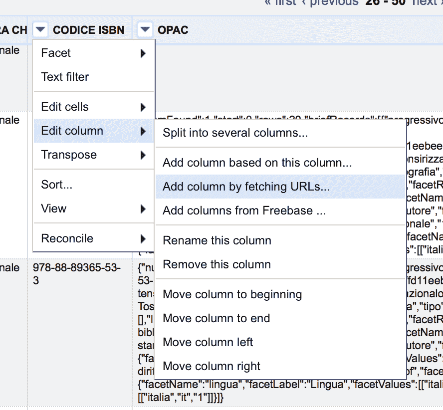

# 使用 Open Refine 操作数据集

> 原文：<https://towardsdatascience.com/dataset-manipulation-with-open-refine-a5043b7294a7?source=collection_archive---------29----------------------->


图片由[皮克斯拜](https://pixabay.com/?utm_source=link-attribution&utm_medium=referral&utm_campaign=image&utm_content=5744621)的 Gerd Altmann 提供

Open Refine 是一个用于清理、转换和丰富数据集的 web 应用程序。可以在以下地址下载:【http://openrefine.org。在下载部分，您可以下载适用于 Windows、Linux 和 Mac OS 的最新稳定版本。下载安装程序后，就可以运行了。一旦执行，该应用程序就可以在以下地址由浏览器使用: [http://127.0.0.1:3333](http://127.0.0.1:3333) 。

Open Refine 允许您执行各种操作。在本教程中，我们将只看到以下内容:

1.  上传 CSV 格式的数据集(也支持其他格式)
2.  对列的操作
3.  在现有列的基础上添加新列
4.  从柱中提取元素
5.  用外部数据丰富数据集

对于数据操作，Open Refine 使用 GREL(通用精炼表达式语言)。

# 数据集的上传

例如，我们采用包含 2015 年托斯卡纳地区[编辑作品的数据集](http://dati.toscana.it/dataset/rt-proded-2015)。在数据集下载之后，运行 Open Refine 并从左侧的菜单中选择 Create Project 项。然后选择我们要从计算机导入的文件，并按下一步按钮。此时，会出现项目的预览。在下半部分，出现另一个菜单(见下图)，从中可以选择一些选项，如 CSV 字段的分隔字符(由标题*指示，列由*分隔)和右侧的其他选项(ad 示例*将下一行解析为 setnames 的下一列标题列*)。位于左上角的另一个选项提供了设置编码的可能性。在我们的例子中，预览中的数据集存在一些编码问题，因此我们可以从选项*字符编码*中选择 utf8 编码。至此，我们的数据集的编码问题应该解决了。



作者图片

此时，在页面的右上部分，我们可以更改项目的名称(在*项目名称*下)，然后按下按钮*创建项目*。应用程序屏幕应该如下图所示:



作者图片

# 列操作

首先，我们希望在 Author 列中分离作者，并为每个作者创建一个列。为此，根据作者列的标题，单击箭头，从打开的下拉菜单中(见下图)，选择编辑列，然后拆分为几列。



作者图片

在打开的窗口中(见下图)，您可以选择各种选项，包括如何划分列。在我们的例子中，默认选项就可以了，即使用逗号作为字段分隔符。我们按下 ok 按钮，我们看到我们的表已经改变。原来的列已经被删除，并且创建了许多列，每一列都以该列的旧名称作为名称，后跟一个渐进的数字。



作者图片

现在让我们删除所有添加的列，除了第一列。这样我们就只有每篇编辑作品的第一作者了。为此，对于要删除的每一列，始终从列名旁边的箭头中选择“编辑列”选项，然后删除该列(见下图)。



作者图片

此时，我们只有一个列有第一作者的名字。我们把专栏改名为“第一作者”吧。为此，我们从列名旁边的箭头选择编辑列，然后重命名该列:



作者图片

现在，假设我们想要创建两个新列，一个包含第一作者的姓名，另一个包含第一作者的姓氏。为此，从箭头中选择编辑列，然后基于此列添加列:



作者图片

在打开的窗口中，您必须指明要创建的列的名称，然后用 GREL 语言指定表达式来操作该列。让我们来插一句 GREL 语。在 GREL，你可以使用变量、控件和函数。变量代表表中的行。有不同类型的变量:

*   值—表示对应于选定列的单元格值
*   单元格—表示对应于选定列的单元格。可以对该变量执行两个操作:执行 cell.value(对应于 value)和 cell.recon(允许获得与外部数据的协调过程的结果)
*   单元格—表示整行。若要访问列的值，必须使用以下语法:cells ["column name"]。价值。

至于控件，有不同的类型，包括 if 和 foreach。有关更多详细信息，请参见文档。最后是函数，可以是不同的类型。其中最重要的是字符串操作。有关更多详细信息，请参见文档。

让我们回到我们的数据集。我们说过要创建两个新列，一个包含作者的名字，另一个包含作者的名字。为此，我们可以使用之前使用的拆分列，但是我们会丢失原始列。要保留起始列，我们可以使用添加列。在为 GREL 表达式保留的字段中，我们可以使用 substring 函数创建包含姓名的第一列，该函数从传递的字符串中提取一个子字符串。我们将 substring 函数应用于当前单元格的值(由 value 变量表示)，它接收子字符串的极值(起始索引，到达索引)。起始索引为 0，而到达索引由空格字符的位置给出，可通过`indexOf function`识别，始终应用于变量值:

```
value.substring (0, value.indexOf (“”))
```

这样我们就知道了作者的名字。要获得姓氏，您需要创建一个新列，然后再次选择 add column based on this column，然后通过 GREL 以如下方式操作字符串:您必须从字符空格+ 1 的位置开始从 value 变量中提取一个子字符串:

```
value .substring (value.indexOf (““))
```

此时，结果应该如下图所示:



作者图片

要向左或向右移动列，您可以从箭头中选择“编辑列”菜单，然后向左或向右移动列(见下图)。



作者图片

# 丰富数据集

现在假设我们要为带有 ISBN 码的图书添加标识码。为此，我们可以查询 opac.sbn.it 网站，该网站提供了一个 API，用于接收输入的 ISBN 代码并返回一系列信息。API 可以按如下方式调用:

[http://opac.sbn.it/opacmobilegw/search.json?isbn=numeroisbn](http://opac.sbn.it/opacmobilegw/search.json?isbn=numeroisbn)

结果是一个 json，其中还包含图书的识别码。在我们的例子中，我们选择对应于 ISBN 的列，然后编辑列，然后通过获取 URL 添加列:



作者图片

在与 GREL 语言相对应的方框中，我们必须区分包含 ISBN 的行和不包含 ISBN 的行。我们可以将不包含 ISBN 的行识别为长度为 1 的行。因此，我们可以使用 IF 类型控件来检查该行是否包含 ISBN。if 检查的工作方式如下:

```
if (condition, true expression, false expression)
```

如果条件出现，则执行真表达式，否则执行假表达式。在我们的案例中:

```
if (value.length () == 1, null, *load_identification_code*)
```

要加载标识码，您需要调用 API。为此，只需输入带引号的 API URL，并使用+运算符添加任何变量。在我们的例子中，有必要指定 ISBN，它有时会等于当前行的值(value):

```
“http://opac.sbn.it/opacmobilegw/search.json?isbn=" + value
```

那么要插入 GREL 盒的完整代码是这样的:

```
if (value.length () == 1, null, “http://opac.sbn.it/opacmobilegw/search.json?isbn=" + value)
```

让我们为新列命名(例如 JSON ),然后点击 ok。我们等待结果。当系统完成这个过程时，会出现一个名为 JSON 的新列，其中包含一个 JSON，包含从 API 中提取的所有信息。现在要提取标识码字段，我们需要解析 JSON。我们选择 JSON 列，并从菜单“编辑列”中选择“基于此列添加列”。我们插入新列的名称(标识代码)，并在与 GREL 语言相关的空间中插入代码来操作 JSON。首先，我们需要检查:如果字段为 null，我们不需要做任何事情，否则我们必须解析 JSON。我们使用 isNull 函数来检查变量是否为空:

```
if (isNull (value), null, *parsing_del_json*)
```

现在让我们来处理 JSON 的解析。我们将 parseJson()函数应用于 value 变量，该变量将 Json 转换为一个数组，因此我们可以直接访问数组的字段。识别码位于简要记录阵列的第一个位置。因此，我们可以按如下方式访问它:

```
value.parseJson () [“briefRecords”] [0] [“Identification”]
```

代码将插入为 GREL 语言保留的空间中的完整代码如下:

```
if (isNull (value), null, value.parseJson () [“briefRecords”] [0] [“Identification code”])
```

现在按 ok 按钮，我们将看到一个新的列出现，它带有与 ISBN 代码行相对应的识别码。

# 摘要

在本教程中，我演示了如何使用 Open Refine 提供的基本功能，这是一个非常强大的数据集操作工具。Open Refine 结合了图形操作和用 GREL 语言执行的高级操作。

如果你想了解我的研究和其他活动的最新情况，你可以在 [Twitter](https://twitter.com/alod83) 、 [Youtube](https://www.youtube.com/channel/UC4O8-FtQqGIsgDW_ytXIWOg?view_as=subscriber) 和 [Github](https://github.com/alod83) 上关注我。