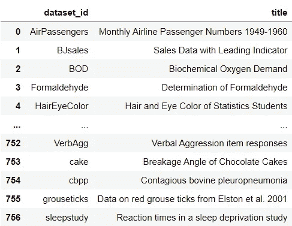
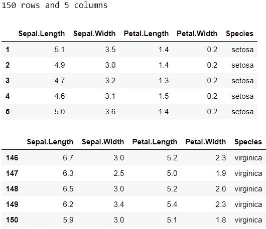
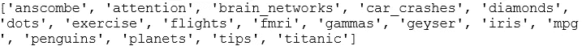
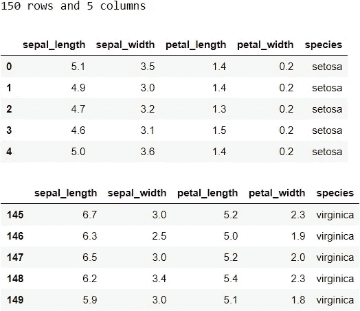
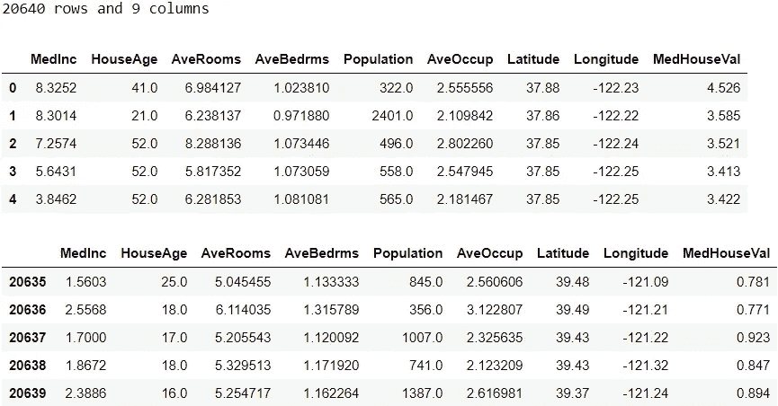
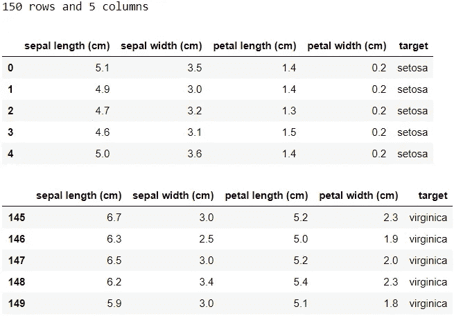
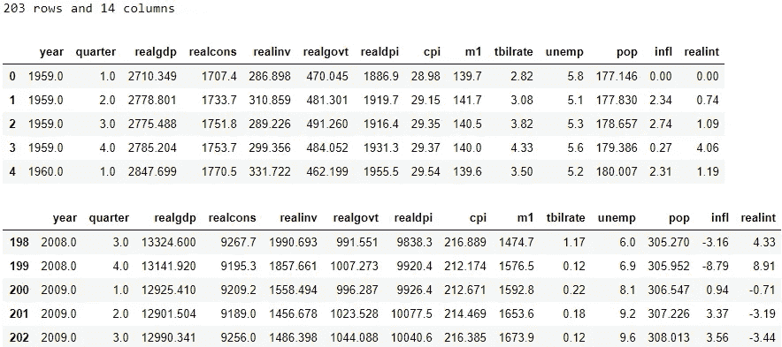
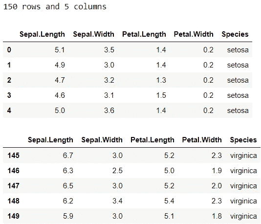
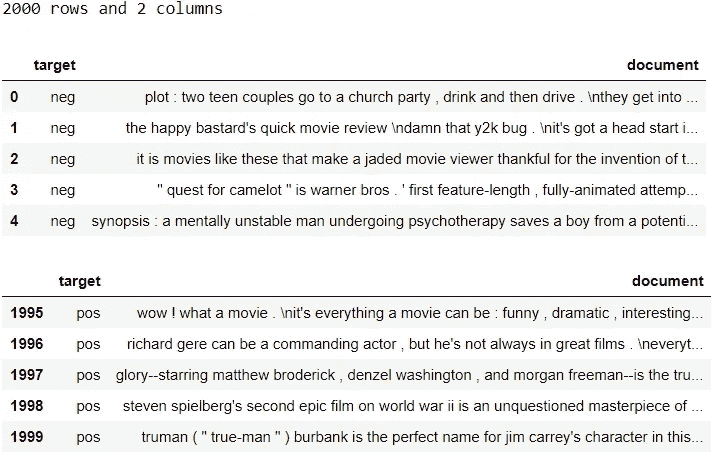

# Python 中的数据集

> 原文：<https://towardsdatascience.com/datasets-in-python-425475a20eb1?source=collection_archive---------3----------------------->

## *5 个软件包，可轻松访问各种数据集*

有一些有用的 Python 包，只需要几行代码就可以加载公开可用的数据集。在本帖中，我们将看看 5 个包，它们提供了对一系列数据集的即时访问。对于每个包，我们将了解*如何检查其可用数据集列表*以及*如何将示例数据集加载到熊猫数据框架*。


照片由[王思然·哈德森](https://unsplash.com/@hudsoncrafted?utm_source=medium&utm_medium=referral)在 [Unsplash](https://unsplash.com?utm_source=medium&utm_medium=referral) 上拍摄

# 0.Python 设置🔧

我假设读者(👀是的，你！)可以访问并熟悉 Python，包括安装包、定义函数和其他基本任务。如果你是 Python 的新手，[这个](https://www.python.org/about/gettingstarted/)是一个很好的入门地方。

我已经在 Jupyter Notebook 中使用并测试了 Python 3.7.1 中的脚本。在我们开始之前，让我们确保您已经安装了相关的软件包:

◼️ ️ *pydataset* :数据集包，
◼️ ️ *seaborn* :数据可视化包，
◼️ ️ *sklearn:* 机器学习包，
◼️ ️ *statsmodel* :统计模型包，
◼️ ️ *nltk:* 自然语言工具包包

对于每个包，我们将检查示例数据集的*形状*、*头部*和*尾部*。为了避免重复我们自己，让我们快速制作一个函数:

```
# Create a function to glimpse the data
def glimpse(df):
    print(f"{df.shape[0]} rows and {df.shape[1]} columns")
    display(df.head())
    display(df.tail())
```

好了，我们准备好潜水了！🐳

# 1.PyDataset📚

我们要看的第一个包是 *PyDataset* 。它易于使用，可以访问 700 多个数据集。这个包的灵感来自于在 R 中访问数据集的便利性，并致力于在 Python 中实现这种便利性。让我们来看看数据集列表:

```
# Import package
from pydataset import data# Check out datasets
data()
```



这将返回一个数据帧，其中包含您可以浏览的所有数据集的 *dataset_id* 和 *title* 。目前，有 757 个数据集。现在，让我们加载著名的 *iris* 数据集作为示例:

```
# Load as a dataframe
df = data('iris')
glimpse(df)
```



导入包后，将数据集加载到 dataframe 只需要一行代码。就这么简单，对吧？需要注意的是，在这个数据集中，行索引从 1 开始，而不是从 0 开始。

🔗要了解更多信息，请查看 PyDataset 的 [GitHub 库](https://github.com/iamaziz/PyDataset)。

# 2.海生的🌊

Seaborn 是另一个软件包，它提供了对示例数据集的简单访问。要找到数据集的完整列表，你可以浏览 [GitHub 库](https://github.com/mwaskom/seaborn-data)，或者你可以像这样用 Python 查看:

```
# Import seaborn
import seaborn as sns# Check out available datasets
print(sns.get_dataset_names())
```



目前，有 17 个数据集可用。让我们以加载*虹膜*数据集为例:

```
# Load as a dataframe
df = sns.load_dataset('iris')
glimpse(df)
```



导入包后，只需一行代码就可以将数据集作为 dataframe 加载。

🔗要了解更多信息，请查看 *load_dataset* 的[文档页面。](https://seaborn.pydata.org/generated/seaborn.load_dataset.html)

# 3.sci kit-学习📓

s *cikit-learn* 不仅在功能工程和构建模型方面表现出色，它还附带玩具数据集，并提供下载和加载真实世界数据集的便捷途径。玩具和真实数据集的列表以及其他细节可在[这里](https://scikit-learn.org/stable/datasets.html)获得。您可以通过滚动链接或参考各个函数的文档来了解有关数据集的更多详细信息。值得一提的是，在这些数据集中，有一些玩具和真实的*图像数据集* ，如[数字数据集](https://scikit-learn.org/stable/modules/generated/sklearn.datasets.load_digits.html?highlight=load_digit#sklearn.datasets.load_digits)和[奥利维蒂人脸数据集](https://scikit-learn.org/stable/modules/generated/sklearn.datasets.fetch_olivetti_faces.html#sklearn.datasets.fetch_olivetti_faces)。

现在，让我们通过一个示例来看看如何加载真实数据集:

```
# Import package
from sklearn.datasets import fetch_california_housing# Load data (will download the data if it's the first time loading)
housing = fetch_california_housing(as_frame=True)# Create a dataframe
df = housing['data'].join(housing['target'])
glimpse(df)
```



下面是如何加载一个示例玩具数据集， *iris* :

```
# Import package
from sklearn.datasets import load_iris# Load data
iris = load_iris(as_frame=True)# Create a dataframe
df = iris['data'].join(iris['target'])# Map target names (only for categorical target)
df['target'].replace(dict(enumerate(iris['target_names'])), 
                     inplace=True)
glimpse(df)
```



💡如果您得到一个关于 *as_frame* 参数的错误，请将您的 *sklearn* 版本更新到 0.23 或更高版本，或者使用下面的脚本:

```
# Import packages
import pandas as pd
from sklearn.datasets import load_iris# Load data
iris = load_iris()# Create a dataframe
X = pd.DataFrame(iris['data'], columns=iris['feature_names'])
y = pd.DataFrame(iris['target'], columns=['target'])
df = X.join(y)# Map target names (only for categorical target)
df['target'].replace(dict(enumerate(iris['target_names'])), 
                     inplace=True)
glimpse(df)
```

🔗欲了解更多信息，请查看 scikit-learn 的[文档页面](https://scikit-learn.org/stable/datasets/index.html)。

# 4.统计模型📔

另一个我们可以用来访问数据的包是 s *tatsmodels* 。可用的内置数据集列在他们网站上的[这里](https://www.statsmodels.org/devel/datasets/index.html)。让我们选择[‘美国宏观经济数据](https://www.statsmodels.org/stable/datasets/generated/macrodata.html)’作为例子并加载它:

```
# Import package
import statsmodels.api as sm# Load data as a dataframe
df = sm.datasets.macrodata.load_pandas()['data']
glimpse(df)
```



你可能已经注意到，我们用来访问[‘美国宏观经济数据](https://www.statsmodels.org/stable/datasets/generated/macrodata.html)’的名字是*宏观数据*。要找到其他数据集的等效名称，请查看该数据集文档的 URL 末尾。例如，如果您点击[可用数据集](https://www.statsmodels.org/devel/datasets/index.html)部分中的“美国宏观经济数据”并查看浏览器中的地址栏，您会在 URL 的末尾看到*“macro data . html”*。

*Statsmodels* 还允许使用 *get_rdataset* 函数从 R 加载数据集。此处的可用数据集列表为[和](https://vincentarelbundock.github.io/Rdatasets/articles/data.html)。以 *iris* 数据集为例，我们可以这样加载数据:

```
# Load data as a dataframe
df = sm.datasets.get_rdataset(dataname='iris', package='datasets')['data']
glimpse(df)
```



🔗欲了解更多信息，请查看数据集的[文档页面](https://www.statsmodels.org/stable/datasets/index.html)。

# 5.自然语言工具包| NLTK📜

这个包与其他包略有不同，因为它只提供对文本数据集的访问。这里是可用的文本数据集列表(Psst，请注意列表中的一些项目是模型)。使用 *id* ，我们可以从 NLTK 访问相关的文本数据集。我们以*情感极性数据集*为例。它的 *id* 是*电影 _ 评论*。让我们先用下面的脚本下载它:

```
# Import package
import nltk# Download the corpus (only need to do once)
nltk.download('movie_reviews')
```

如果已经下载了，运行它会通知您已经下载了。下载后，我们可以将数据加载到数据帧中，如下所示:

```
# Import packages
import pandas as pd
from nltk.corpus import movie_reviews# Convert to dataframe
documents = []
for fileid in movie_reviews.fileids():
    tag, filename = fileid.split('/')
    documents.append((tag, movie_reviews.raw(fileid)))
df = pd.DataFrame(documents, columns=['target', 'document'])
glimpse(df)
```



在将文本数据从 NLTK 转换为 dataframe 时，没有一种适合所有情况的方法。这意味着您需要根据具体情况寻找转换为数据帧的适当方法。

🔗欲了解更多信息，请查看关于访问文本语料库和词汇资源的资源。

这就是你要的，5 个允许轻松访问数据集的包。现在您知道如何从这些包中加载数据集了。这些包中可用的数据集将来可能会改变，但是你知道如何找到所有可用的数据集！🙆


克里斯汀娜·戈塔迪在 [Unsplash](https://unsplash.com?utm_source=medium&utm_medium=referral) 上的照片

*您想访问更多这样的内容吗？媒体会员可以无限制地访问媒体上的任何文章。如果你使用* [*我的推荐链接*](https://zluvsand.medium.com/membership)*成为会员，你的一部分会费会直接去支持我。*

谢谢你看我的帖子。希望你找到了有用的东西，✂️.如果你感兴趣，这里有我的一些其他帖子的链接:
◼️️ [给熊猫用户的 5 个提示](/5-tips-for-pandas-users-e73681d16d17)
◼️️️️ [如何在熊猫数据框架中转换变量](/transforming-variables-in-a-pandas-dataframe-bce2c6ef91a1)
◼️ [TF-IDF 解释](https://medium.com/@zluvsand/introduction-to-nlp-part-3-tf-idf-explained-cedb1fc1f7dc)
◼️[python 中的监督文本分类模型](https://medium.com/@zluvsand/introduction-to-nlp-part-4-supervised-text-classification-model-in-python-96e9709b4267)

再见🏃💨