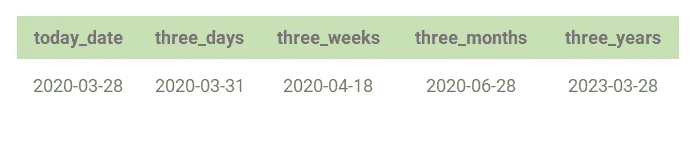
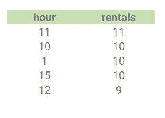
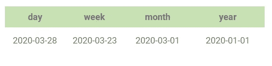
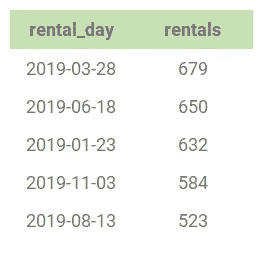
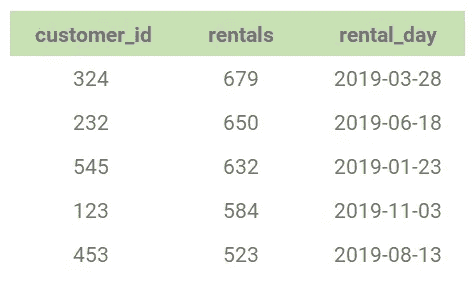

# SQL 中的日期/时间函数

> 原文：<https://towardsdatascience.com/date-time-functions-in-sql-1885e2cbdc1a?source=collection_archive---------3----------------------->

## 如何使用 CAST、EXTRACT 和 DATE_TRUNC 的教程


照片由[卢卡斯·布拉塞克](https://unsplash.com/@goumbik?utm_source=medium&utm_medium=referral)在 [Unsplash](https://unsplash.com?utm_source=medium&utm_medium=referral) 上拍摄

# 什么是时序数据？

在使用 SQL 时，处理日期和时间是一种常见的做法。使用日期，我们可以计算随时间的变化，数据的趋势，执行区间运算。更好地理解潜在业务问题的影响。

> [时序数据](https://blog.timescale.com/blog/what-the-heck-is-time-series-data-and-why-do-i-need-a-time-series-database-dcf3b1b18563/)作为一系列数据点，随着时间的推移测量同一事物，按时间顺序存储。

时序数据的一些常见用途

*   股票价格变动
*   传感器跟踪(例如，天气跟踪)
*   租赁服务(如自行车或踏板车租赁)

# 我们开始吧

对于本教程，我将假设您具有中级 SQL 技能。我们将讨论三个函数并使用 PostgreSQL 语法。

1.  投
2.  提取
3.  日期 _TRUNC

当分解包含大量数据的数据集时，这些函数都很有用。当我们通过一些例子浏览代码时，我们将会看到每种方法的优点。

# 铸造功能

一个`CAST`函数将选择的数据类型转换成另一种类型。相当直接。它把一种类型变成你喜欢的类型。语法如下。

```
CAST(expression AS **datatype**)
```

下面是一个如何应用于日期和时间的例子。

```
SELECT
    NOW(),
    CAST(NOW() AS TIMESTAMP),
    CAST(NOW() AS DATE),
    CAST(NOW() AS TIME),
    CURRENT_DATE,
    CURRENT_TIME
```

在这个查询中，我们期望有 6 个输出。如果您不熟悉`NOW()`、`CURRENT_DATE`、`CURRENT_TIME`，它们是检索当前时间或日期的 SQL 函数。以下是按顺序排列的查询的所有输出。(注意—由于这些函数调用的是确切的时间或日期，因此您将获得不同的数字)

*   2020–03–28 23:18:20.261879+00:00
*   2020–03–28 23:18:20.261879
*   2020–03–28
*   23:18:20.261879
*   2020–03–28
*   23:18:20.261879+00:00

查看来自单独使用的`NOW()`的第一个结果，我们得到一个完整的时间戳值，包括时区。现在我们来看第二个输出，我们使用`CAST`只检索时间戳，不包括来自`NOW()`的时区。现在我们可以看到 cast 是如何工作的了。我们传入一个我们想要转换的值，然后声明我们想要的类型。

接下来，我们在`NOW()`上使用`CAST()`，但是传入`DATE`作为我们想要的类型。我们现在得到了一个时间戳，只保留了年/月/日格式。类似地，看看只有`TIME`和`NOW()`的`CAST()`函数，我们得到的只是没有日期的时间值。

我们可以看到`CAST`函数如何与时间一起工作，使用`CURRENT_DATE`和`CURRENT_TIME`的最后两个输出只是为了让您看到结果的比较。

## 更多示例—不带时间戳

SQL 还允许`CAST()`函数用于没有时间戳的类型。

```
SELECT 
    CAST(1.34 AS INT),
    CAST(1 AS BOOLEAN),
    CAST(2.65 AS DEC(3,0))
```

该查询的结果是，

*   1 →因为整数不能有小数，所以会四舍五入到最接近的整数值
*   true → 1 作为布尔值为真，0 为假
*   3 →使用`DEC()`我们也可以做第一次整数转换的反向操作。

## 间隔

在 SQL 中，您还可以使用`INTERVAL`为您拥有的任何时间戳添加更多时间。对于下面的例子，您不需要使用`CAST()`函数，但是我选择这样做只是为了得到日期。

```
SELECT
    CAST(NOW() AS DATE) AS TODAY_DATE,
    CAST((**INTERVAL** '3 DAYS' + NOW()) AS DATE) AS three_days,
    CAST((**INTERVAL** '3 WEEKS' + NOW()) AS DATE) AS three_weeks,
    CAST((**INTERVAL** '3 MONTHS' + NOW()) AS DATE) AS three_months,
    CAST((**INTERVAL** '3 YEARS' + NOW()) AS DATE) AS three_years
```



**输出**

我们可以看到，除了以天、周、月或年为单位的时间间隔长度之外，使用`INTERVAL`会为您拥有的任何日期增加更多时间——在本例中，当前日期是从`NOW()`获得的。

# 提取()

接下来，我们可以看看从时间戳中提取特定的格式。目标是从时间戳中提取一部分。例如，如果我们只需要 2018 年 12 月 10 日的月份，我们将得到 12 月(12)。

让我们来看看`EXTRACT`的语法

```
EXTRACT(part FROM date)
```

我们声明我们想要的提取类型为*部分*，然后是要提取的源*日期*。`EXTRACT`是时间序列数据分析的重要工具。它可以帮助您隔离时间戳中的组，以便基于精确的计时来聚合数据。例如，如果一家汽车租赁店想在每个`MAY`找到`MONDAYS`最繁忙的租赁`HOUR`，您可以使用`EXTRACT`来完成。你可以深入细节，看到更多有价值的见解。

假设我们运行`NOW()`，我们的时间戳是**2020–03–29 00:27:51.677318+00:00**，我们可以使用`EXTRACT`得到以下内容。

```
SELECT
    EXTRACT(MINUTE      FROM NOW()) AS MINUTE,
    EXTRACT(HOUR        FROM NOW()) AS HOUR,
    EXTRACT(DAY         FROM NOW()) AS DAY,
    EXTRACT(WEEK        FROM NOW()) AS WEEK,
    EXTRACT(MONTH       FROM NOW()) AS MONTH,
    EXTRACT(YEAR        FROM NOW()) AS YEAR,
    EXTRACT(DOW         FROM NOW()) AS DAY_OF_WEEK,
    EXTRACT(DOY         FROM NOW()) AS DAY_OF_YEAR,
    EXTRACT(QUARTER     FROM NOW()) AS QUARTER,
    EXTRACT(TIMEZONE    FROM NOW()) AS TIMEZONE
```


**输出**

我们看到，我们可以深入了解如何从时间戳中提取信息。注意— DOW —一周中的某一天是星期日(0)到星期六(6)。

我们可以在前面的租车例子的基础上，看看它是如何工作的。

```
SELECT 
  EXTRACT(HOUR FROM RENTAL_DATE) AS HOUR, 
  COUNT(*) as RENTALS 
FROM RENTAL 
WHERE
    EXTRACT(DOW   FROM RENTAL_DATE) = 1 AND
    EXTRACT(MONTH FROM RENTAL_DATE) = 5
GROUP BY 1
ORDER BY RENTALS DESC
```

请记住，我们希望每个`MAY`的`MONDAYS`有最繁忙的出租`HOUR`。首先，我们在`SELECT`中使用`EXTRCT`来声明，我们只需要`HOUR`和总计`COUNT`。然后我们在`WHERE`子句中为传递两个`EXTRACT`函数，以便只过滤`MONDAYS`和`MAY`。看下面的表格，上午 11 点是 5 月份每周一最受欢迎的出租时间，共有 11 次出租。



**输出**

# 日期 _TRUNC

> 截断——通过或仿佛通过切断来缩短

在 SQL 中截断日期的目的是以绝对精度返回一个间隔。精度值是可用于`EXTRACT`的字段标识符的子集。`DATE_TRUNC`将返回一个时间间隔或时间戳而不是一个数字。

`DATE_TRUNC`、`time_column`的[语法](https://mode.com/blog/date-trunc-sql-timestamp-function-count-on)是包含您想要舍入的时间戳的数据库列，而`‘[interval]’`表示您想要的精度级别。

```
DATE_TRUNC(‘[interval]’, time_column)
```

让我们假设我们的`NOW()`返回相同的**2020–03–29 00:27:51.677318+00:00**，我们可以使用`date_part`得到如下。

```
SELECT
    CAST(DATE_TRUNC('DAY', NOW()) AS DATE) AS DAY,
    CAST(DATE_TRUNC('WEEK', NOW()) AS DATE) AS WEEK,
    CAST(DATE_TRUNC('MONTH', NOW()) AS DATE) AS MONTH,
    CAST(DATE_TRUNC('YEAR', NOW()) AS DATE) AS YEAR
```



**输出**

可以把使用`DATE_TRUNC`看作是获取当前位置的间隔，间隔的每一层都是日期被修整的方式。注意——在这个例子中，我们不需要使用`CAST`。我用它来确保格式干净，便于分析。

我们可以在前面的租车场景中使用`DATE_TRUNC`,并尝试找出一年中的哪一天(不考虑时间)更受欢迎。

```
SELECT
    CAST(DATE_TRUNC('DAY', RENTAL_DATE) AS DATE) AS RENTAL_DAY,
    COUNT(*) AS RENTALS
FROM RENTAL
GROUP BY
    RENTAL_DAY
ORDER BY RENTALS DESC
```



**输出**

# 把所有的放在一起

既然我们已经看到了如何使用`CAST`、`EXTRACT`和`DATE_TRUNC`，我们可以将我们学到的一些技术整合到一个实际的例子中。

对于本例，我们将添加一个名为`AGE`的新时间函数，它接受 2 个日期作为参数，并输出“[年龄](https://w3resource.com/PostgreSQL/age-function.php)”或日期之间的年和月时间。

让我们通过从`2019–05–01` + `30 days`中提取租赁持续时间最长(`AGE`)的客户列表来结束本教程。

```
SELECT
    CUSTOMER_ID,
    **EXTRACT**(DOW FROM RENTAL_DATE) AS DAY_OF_WEEK,
    **AGE**(RETURN_DATE, RENTAL_DATE) AS RENTAL_DAYS
FROM
    RENTAL
WHERE 
    RENTAL_DATE 
        BETWEEN **CAST**('2019-05-01' AS TIMESTAMP) AND
                **CAST**('2019-05-01' AS TIMESTAMP) + **INTERVAL** '30 DAY'
ORDER BY 3 DESC
```



**输出**

# 最终结果

我希望您对在 SQL 中使用时间戳感到舒适。你已经学会使用`CAST`、`EXTRACT`、`INTERVAL`、`DATE_TRUNC`、`AGE`。您应该做好充分准备来处理与趋势相关的分析，并更深入地挖掘数据，以找到您以前可能无法找到的见解！

如果你对更多的 SQL 教程感兴趣，可以看看我的其他帖子。

*   [如何在 SQL 中使用 cte](/using-ctes-to-improve-sql-queries-dfcb04b7edf0)
*   [窗口功能介绍](/intro-to-window-functions-in-sql-23ecdc7c1ceb)
*   [在 SQL 中创建表格](/creating-tables-in-sql-96cfb8223827)

在 [**Linkedin**](https://www.linkedin.com/in/jasonmchlee/) 或 [**Github**](https://github.com/jasonmchlee) 上与我联系