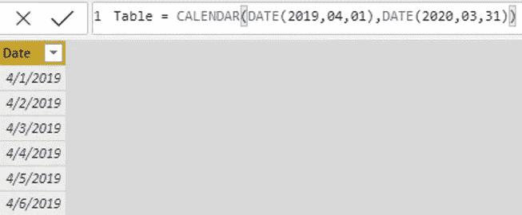

# 幂 BI 中的日期

> 原文：<https://towardsdatascience.com/dates-in-power-bi-ada30f85e4b3?source=collection_archive---------8----------------------->

## 与日期打交道——可能有些有趣。


柯蒂斯·麦克牛顿在 [Unsplash](https://unsplash.com?utm_source=medium&utm_medium=referral) 上的照片

在 Power BI 中，许多专家强烈推荐的方法是在处理日期时创建一个日期表格。我在没有它的情况下工作过，这绝对不是一个好主意。这让我头疼，也给了我不必要的痛苦。


作者图片

日期表很重要！这里有三个原因。

**日期计算** — DAX 需要一个日期表来进行日期计算！没有它，那些 SAMEPERIODLASTYEAR、LASTQUARTER 或 DATESBETWEEN 类型的计算就无法工作。也许会，但会非常复杂。为什么伤你的头？

**周末/节假日** —如果您需要在计算中排除节假日，并且您没有日期表？这将非常困难。

**不同的粒度** —有时，您需要在基于月的表和基于日的表之间进行比较。你需要一些东西来加入他们，这样你才能充分地报道。

在本文中，我将向您展示如何在 M (Power Query)和 DAX 中创建日历表。

我们开始吧！

# 创建日期表

我们打开幂查询吧(如果不知道从哪里打开，看看[这篇文章](/joins-with-power-bi-bde7de3e2181?source=friends_link&sk=91ebb5c4e4dca48f4e1d216fe86ffdc4)里的基础知识。)

我想要的表是一个财政年度所有日期的列表，包括星期几、月份和周数…如果可能的话，还包括节假日。我们只想标记这些。

像下面这样的会很好。


作者图片

为了在 Power Query 中做到这一点，我们需要创建一个新的查询。

创建一个新的查询—右键点击查询窗格>**选择新的空白查询>选择高级编辑器(顶部的按钮)**

完成后，将此功能插入高级编辑器。

```
Source = List.Dates(#date(2019,04,01),365,#duration(1,0,0,0))
```

好吧，那到底是什么意思？


这意味着我正在使用一个列表。Dates 函数，创建一个日期表，从 2019 年 4 月 1 日开始，持续时间为 365 天。

一旦你输入这个，Power Query 会给我们一个从 2020 年 4 月 1 日到 365 天之后的所有日期的列表。


作者图片

现在它以列表格式出现，所以我们必须将它转换成表格，以便使用我们的其他函数。您可以选择列>右键>到表格。它会帮你把它变成一张桌子。

现在让我们添加一些其他功能。


在这里您可以[浏览许多其他功能。您可以使用这些函数，方法是获取所列函数的名称，并将其引用到您的日期列。](https://docs.microsoft.com/en-us/powerquery-m/date-functions)

例如，如果我对添加星期几感兴趣，我可以输入*日期。DayOfWeekName([日期])* 。此外，如果我只对数字感兴趣，即一周中的实际日期，我可以使用*日期。day ofweek([日期])* 。

链接中列出了许多功能，需要做很多实验，所以我只使用了我最常用的功能。我并不都记得。

最后，你会得到一个如下图所示的表格。


作者图片

现在为你的 PBI 报告输入所有这些内容是相当乏味的，所以我为你创建了一个简单的脚本。将数据加载到 PBI 时，您可能需要调整数据类型。

下面是一个基本数据表的脚本—复制下面的**右键单击>选择新的空白查询>选择高级编辑器>粘贴下面的**

根据您的需要添加 4 个参数，您就可以开始了。

```
(Year as number, Month as number, Days as number, Duration as number) =>let
    Source = List.Dates(#date(Year,Month,Days),Duration,#duration(1,0,0,0)),
    #"Converted to Table" = Table.FromList(Source, Splitter.SplitByNothing(), null, null, ExtraValues.Error),
    #"Added Custom" = Table.AddColumn(#"Converted to Table", "Custom", each Date.DayOfWeek([Column1])),
    #"Renamed Columns5" = Table.RenameColumns(#"Added Custom",{{"Column1", "Date"}}),
    #"Added Custom1" = Table.AddColumn(#"Renamed Columns5", "Custom.1", each Date.DayOfWeekName([Date])),
    #"Renamed Columns" = Table.RenameColumns(#"Added Custom1",{{"Custom", "Day of Week"}, {"Custom.1", "Day of Week Name"}}),
    #"Added Custom2" = Table.AddColumn(#"Renamed Columns", "Custom", each Date.DayOfYear([Date])),
    #"Renamed Columns1" = Table.RenameColumns(#"Added Custom2",{{"Custom", "Day of Year"}}),
    #"Added Custom3" = Table.AddColumn(#"Renamed Columns1", "Custom", each Date.Month([Date])),
    #"Renamed Columns2" = Table.RenameColumns(#"Added Custom3",{{"Custom", "Month"}}),
    #"Added Custom4" = Table.AddColumn(#"Renamed Columns2", "Custom", each Date.MonthName([Date])),
    #"Renamed Columns3" = Table.RenameColumns(#"Added Custom4",{{"Custom", "Month Name"}})
in
    #"Renamed Columns3"
```

一旦输入，电源查询将为您带来一个日期表。现在，您可以根据需要输入周长。


作者图片

当加载到报表中时，您只需将您的表标记为日期表。将表标记为日期表的说明如下。

然后，您将有一个日期表。

# DAX 中的日期表

在 DAX 中创建日期表的过程非常相似。

您必须在 Power BI 报告视图中选择**表格工具>新表格**，完成后，您可以通过此功能填充您的表格。

```
Table = CALENDAR(DATE(2019,04,01),DATE(2020,03,31))
```


作者图片

一旦您使用这个函数创建了一个新表，您将得到如下结果。



作者图片

现在，转到**表格工具>标记为日期表格**将其标记为日期表格

Power BI 将要求您选择日期列。一旦选中，它将验证该表是一个日期表。


作者图片

完成后，您可以使用 FORMAT 函数添加其他列。在这里，我添加了格式(表格[日期]，" DD ")和其他格式，我选择了一些我常用的格式，但是你也可以添加你自己的格式样式，看看下面的最后一个专栏。


作者图片

当然也有其他格式。你可以在这里获得更多信息

# 接下来呢？

您现在知道了如何使用 DAX 和 m 创建一个简单的日期表，那么这一切有什么意义呢？这是为了将您的表(可能是事实表)与您的日期表连接起来。

类似这样的东西可能会帮助你。


作者图片

现在，您可以在事实表和日期表之间创建多对一联接。

由于您的日期现在反映在日期表中，您现在可以进行如下计算。


作者图片

我个人的最爱。

获取两个日期之间的总销售额。


作者图片

现在，这些 DAX 日期计算只有在你有一个日期表，并且以这种方式连接的情况下才有效。也许您的事实表很小，您可以在事实表中包含一个日期列，但它不会很漂亮。

还有很多很多很酷的 DAX 日期时间智能函数都是[这里](https://docs.microsoft.com/en-us/dax/time-intelligence-functions-dax)。

# 日期栏一开始就搞砸了——所以我不能加入。

我也明白了。“您向我展示了如何在 DAX 和 M 中构建一个日期表，以及一些使用时间智能的方法，这很好，但是我甚至无法开始，因为事实表中的日期列一开始就被搞砸了！”


作者图片

以下是你可以做的——而且对我来说几乎一直都有效。希望你的表没有被弄得一排排颠倒月份和日期..那可能本身就是另一篇文章了。

我建议在幂查询中使用“列按例”。这里的“人工智能”在查询。我不能在这里使用日期列，因为它是文本格式的，即使转换成日期，它也会抛出错误。


作者图片

开始自己填充日期列，AI 将会选择你正在做的事情并为你创建新的日期列。


注意当你添加斜线的时候，它是如何选择你正在做的事情的？


它得到了你想要做的事情！


作者图片


现在，您可以对日期表进行连接了。

希望你喜欢这篇文章！

保持鼓励，保持安全，祝您的数据之旅好运！