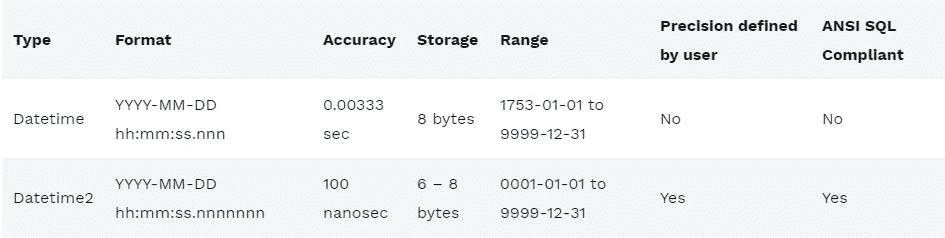
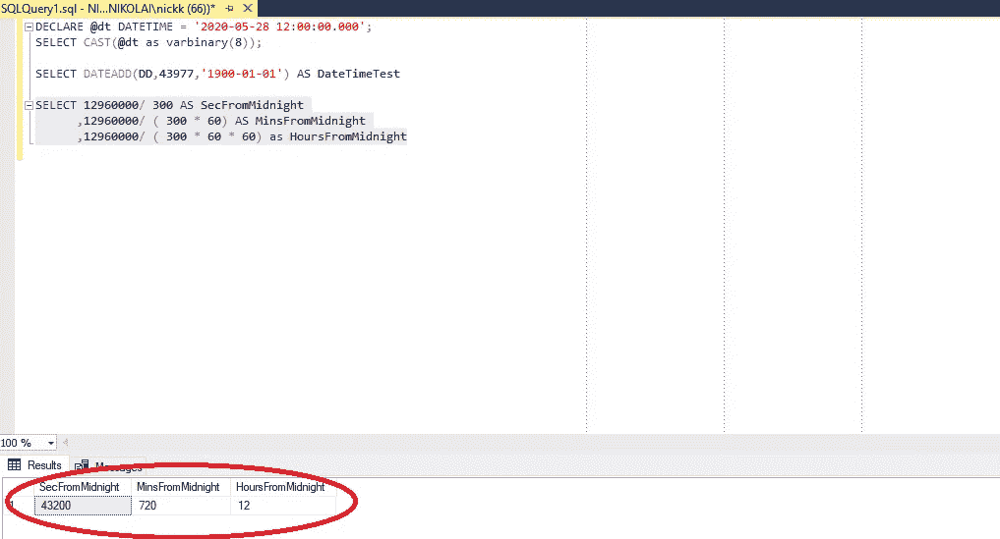
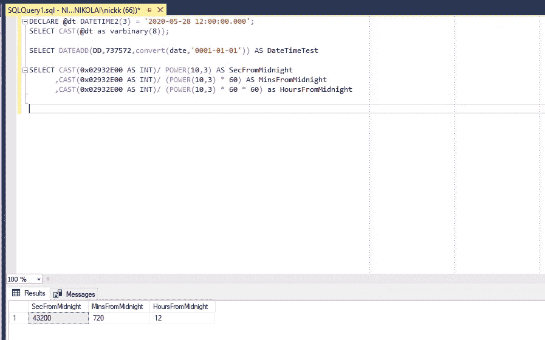
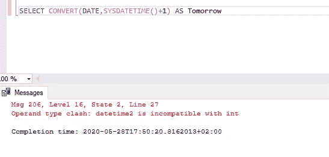
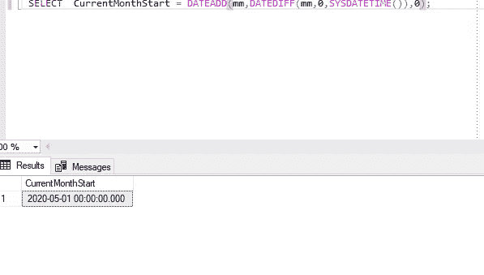
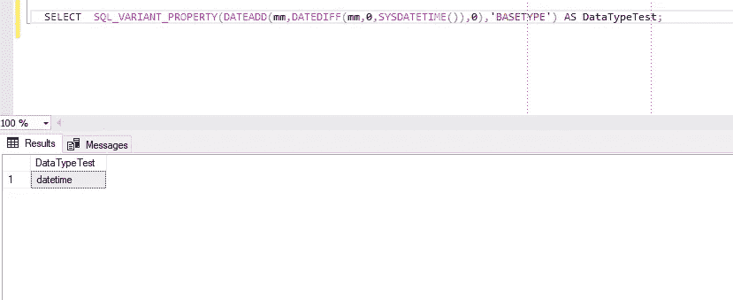

# Datetime2 —为什么应该(不应该)使用它？

> 原文：<https://towardsdatascience.com/datetime2-why-you-should-not-use-it-70e50ae2bab9?source=collection_archive---------3----------------------->

## 选择正确的数据类型并不像您第一眼看到的那样简单


乔恩·泰森在 [Unsplash](https://unsplash.com/s/photos/time?utm_source=unsplash&utm_medium=referral&utm_content=creditCopyText) 上的照片

几周前，我正在处理一个业务请求，为客户调查准备一个数据集成场景。在最初的概念阶段和逻辑数据建模之后，在物理数据建模阶段，我在考虑既能满足业务需求又能确保 SQL Server 资源得到最佳利用的某些数据类型。

我的建议是对所有 Datetime 列使用 *Datetime2* 数据类型，而我的老板坚持使用老式的 *Datetime* 。我想，他是一个老派的家伙，习惯于使用传统的数据类型，所以我将证明他是错的，并说服他改用更新的(顺便说一下，也是微软推荐的)数据类型。

## 介绍

在继续之前，我需要简要强调一下 *Datetime* 和 *Datetime2* 数据类型之间的主要特征和差异。

下表给出了这两者的简要概述:



## 日期时间

*Datetime* 是一种“传统”数据类型，用于存储关于日期和时间的数据。它占用 8 个字节的内存，4 个字节用于日期部分，4 个字节用于时间部分。

所以，让我们来看看幕后发生了什么:

```
DECLARE @dt DATETIME = '2020-05-28 12:00:00.000';
SELECT CAST(@dt as varbinary(8));
```

我们得到了以下十六进制值:0x0000ABC900C5C100

因此，如果我们取前 8 个字符(0000ABC9)并将其转换为十进制，我们将得到 43977 个整数值。该值显示自 1900–01–01 以来的天数，可以按如下方式进行测试:

```
SELECT DATEADD(DD, 43977, '1900-01-01') AS DateTimeTest
```

我们看到我们之前“定义”的日期(2020 年 5 月 28 日)就在那里。

让我们检查时间部分，去掉最后 8 个字符(00C5C100)。把它转换成十进制，得到 12960000。这个数字表示从午夜开始的时钟滴答数。而且，由于精度为 1/300 秒，我们可以进行以下计算，以获得更多人类可读的结果:

```
SELECT 12960000/ 300 AS SecFromMidnight
      ,12960000/ ( 300 * 60) AS MinsFromMidnight
      ,12960000/ ( 300 * 60 * 60) as HoursFromMidnight
```



一旦我们将这个时间部分“添加”到前一个日期部分，我们将得到 2020–05–28 12:00:00.000，就像第一个声明中一样。

## 日期时间 2

*Datetime2* 是在 SQL Server 2008 中引入的，所以它在这里足够长，可以与它的“哥哥”进行一些比较。主要区别在于数据存储的方式:在 *Datetime* 类型中，先日期后时间，在 *Datetime2* 中，3 个字节，最后表示日期部分！

让我们用与前面相同的数据进行检查:

```
DECLARE @dt DATETIME2(3) = '2020-05-28 12:00:00.000';
SELECT CAST(@dt as varbinary(8));
```

现在，十六进制值是:0x03002E930224410B

所以，我们取日期的最后 6 个字符(3 个字节)，但是最右边的字节在*数据时间 2* 中是最重要的，所以它先取:0B4124。把它转换成十进制，我们得到 737572。当我们将其添加到*日期时间 2* 数据类型的“0001–01–01”起点时，我们将日期(2020–05–28)恢复为:

```
SELECT DATEADD(DD,737572,convert(date,'0001-01-01')) AS DateTimeTest
```

对于时间部分，事情变得更加复杂，因为它依赖于定义的精度。在我们的例子中，它是 3 位精度，但它可以达到 7 位(这是默认的，以防我们没有定义任何特定的值)。根据精度不同， *Datetime2* 占用 6 到 8 个字节的存储空间。

回到我们的例子:

```
SELECT CAST(0x02932E00 AS INT)/ POWER(10,3) AS SecFromMidnight
      ,CAST(0x02932E00 AS INT)/ (POWER(10,3) * 60) AS MinsFromMidnight
      ,CAST(0x02932E00 AS INT)/ (POWER(10,3) * 60 * 60) as HoursFromMidnight
```



同样，我们得到了预期的结果。

## 回到我们最初的场景…

好了，这是两种数据类型的简要概述。创建表时，在许多情况下，人们无法预见特定表中将存储多少数据。有时，你创建了一个表，认为它不会超过某个阈值，但过了一会儿，你意识到你的假设是不正确的。

然而，我们确信这张桌子会很大！我说的大，是指一两年后可能接近 1 亿行。回到我们最初创建最优表的请求，我认为将数据存储为 2 位数精度的 *Datetime2* (需要 6 个字节)，乘以至少 5 个 Datetime 列，可以为我们节省大量空间。

需要更少的存储，更高的精度，更大的日期范围，符合 SQL 标准…

# 为什么还有人使用日期时间呢？

但是，我开始深入挖掘。并尝试在网上搜索寻找专家对这个话题的看法。我想，Datetime2 一定有什么(我的意思是，我的老板通常知道他在说什么，呵呵)。所以，我发现[这个讨论](https://www.sqlservercentral.com/forums/topic/why-do-some-dbas-avoid-datetime2)有着 *Datetime2* 的被充分证明的缺点。

主要问题是缺乏对日期进行基本数学运算的(简单)可能性，例如计算两个日期之间的天数、小时数、分钟数等。

下面是一个关于*日期时间*类型的基本示例:

```
SELECT CONVERT(DATE, GETDATE()+1) AS Tomorrow;
```

如果您试图对 *Datetime2* 做同样的事情，您将得到一个错误:

```
SELECT CONVERT(DATE,SYSDATETIME()+1) AS Tomorrow;
```



另一个非常明显的缺点是，如果您试图计算当月的第一天，这是一种非常常见的情况:

```
SELECT  CurrentMonthStart = DATEADD(mm,DATEDIFF(mm,0,SYSDATETIME()),0);
```

结果是意料之中的:



但是，你不会想到它的数据类型是:*日期时间*，而不是*日期时间 2* ！

```
SELECT  SQL_VARIANT_PROPERTY(DATEADD(mm,DATEDIFF(mm,0,SYSDATETIME()),0),'BASETYPE') AS DataTypeTest
```



这意味着每次使用这些计算进行比较时，您都将完成隐式数据转换！

另一个真正重要的考虑来自于这样一个事实，即由于数据存储的方式(还记得前面解释过的字节逆序)，SQL Server 不能正确地对 *Datetime2* 列使用统计信息。关于这些问题的更多信息，请参见亚伦·贝特朗的文章[。](https://sqlperformance.com/2016/04/sql-performance/surprises-dateadd)

错误的估计会导致非最优的查询计划，从而降低性能，这是一个更大的缺点。

因此，结果是错误的估计和糟糕的查询计划，常见场景中的隐式数据转换，无法使用基本的数学运算进行日期计算…

# 究竟为什么有人想使用 Datetime2？