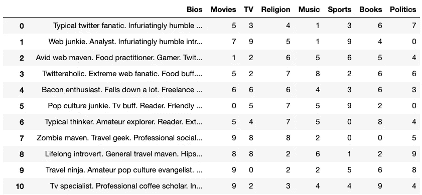
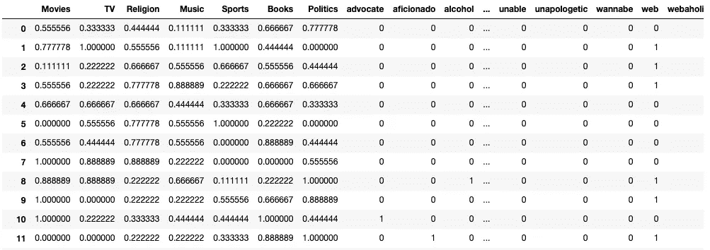
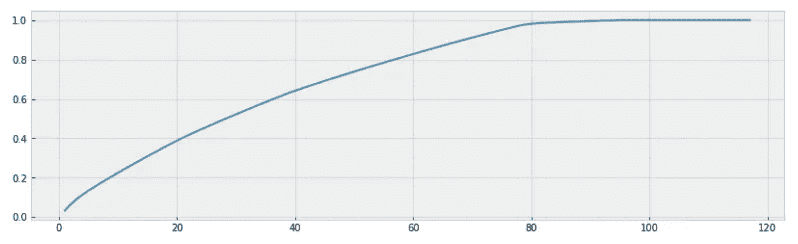
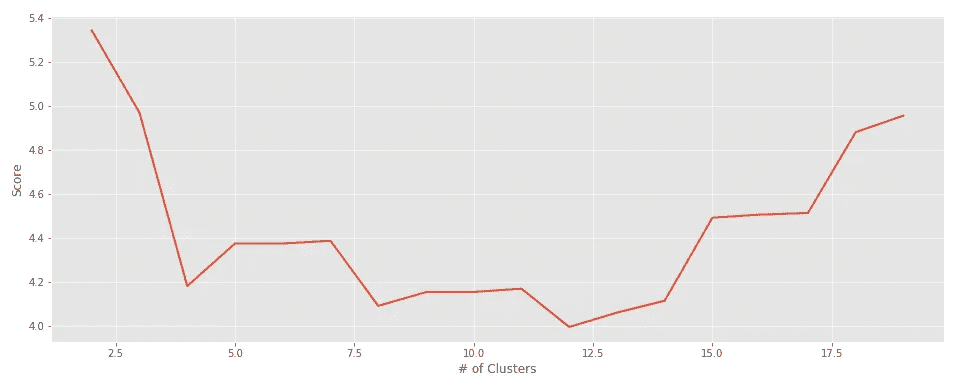
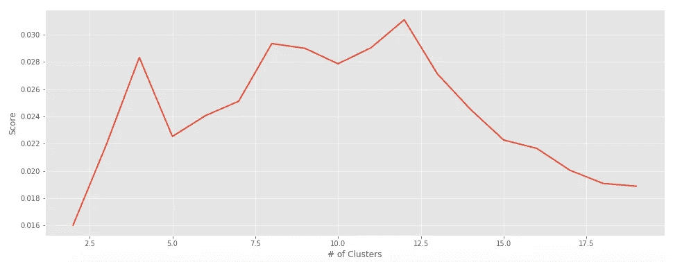
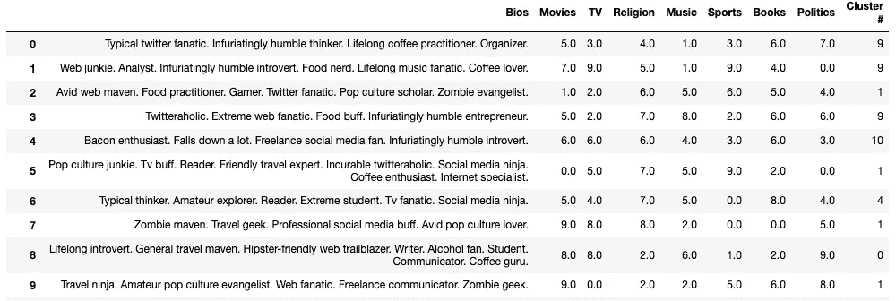

# 我用机器学习和人工智能做了一个约会算法

> 原文：<https://towardsdatascience.com/dating-algorithms-using-machine-learning-and-ai-814b68ecd75e?source=collection_archive---------9----------------------->

## 为约会应用程序利用无监督机器学习


亚历山大·辛恩在 [Unsplash](https://unsplash.com?utm_source=medium&utm_medium=referral) 上的照片

对单身的人来说，约会是艰难的。约会应用程序可能更难。约会应用程序使用的算法在很大程度上被使用它们的不同公司保密。今天，我们将尝试通过使用人工智能和机器学习构建一个约会算法来揭示这些算法。更具体地说，我们将以聚类的形式利用无监督的机器学习。

希望我们可以通过使用机器学习将用户配对来改善约会简档匹配的过程。如果像 Tinder 或 Hinge 这样的约会公司已经利用了这些技术，那么我们至少会多了解一点他们的档案匹配过程和一些无监督的机器学习概念。然而，如果他们不使用机器学习，那么也许我们肯定可以自己改进配对过程。

将机器学习用于约会应用和算法背后的想法已经在下面的前一篇文章中进行了探索和详细描述:

[](https://medium.com/datadriveninvestor/applying-machine-learning-to-find-love-3558dafcc4a1) [## 可以用机器学习来寻找爱情吗？

medium.com](https://medium.com/datadriveninvestor/applying-machine-learning-to-find-love-3558dafcc4a1) 

这篇文章讨论了人工智能和约会应用的应用。它列出了项目的大纲，我们将在本文中完成。总体概念和应用很简单。我们将使用 [**K-Means 聚类**](https://www.geeksforgeeks.org/k-means-clustering-introduction/) 或 [**分层凝聚聚类**](https://www.datanovia.com/en/lessons/agglomerative-hierarchical-clustering/) 来对约会简档进行聚类。通过这样做，我们希望为这些假设的用户提供更多与他们相似的匹配，而不是与他们不同的个人资料。

现在我们已经有了开始创建这个机器学习约会算法的大纲，我们可以开始用 Python 来编码了！

> [在这里注册一个中级会员，可以无限制地访问和支持像我这样的内容！在你的支持下，我赚了一小部分会费。谢谢！](https://marco-santos.medium.com/membership)

# 获取约会档案数据

由于公开的约会档案很少或不可能得到，这是可以理解的，因为安全和隐私风险，我们将不得不求助于假的约会档案来测试我们的机器学习算法。下面的文章概述了收集这些虚假约会资料的过程:

[](/generating-fake-dating-profiles-for-data-science-cd3b929972bc) [## 我为数据科学制作了 1000 份假的约会资料

towardsdatascience.com](/generating-fake-dating-profiles-for-data-science-cd3b929972bc) 

一旦我们有了伪造的约会档案，我们就可以开始使用 [**【自然语言处理(NLP)**](https://www.analyticsvidhya.com/blog/2017/01/ultimate-guide-to-understand-implement-natural-language-processing-codes-in-python/) 来探索和分析我们的数据，特别是用户的 bios。我们有另一篇文章详细介绍了整个过程:

[](https://medium.com/swlh/using-nlp-machine-learning-on-dating-profiles-1d9328484e85) [## 我在约会档案上使用了机器学习 NLP

medium.com](https://medium.com/swlh/using-nlp-machine-learning-on-dating-profiles-1d9328484e85) 

有了收集和分析的数据，我们将能够继续进行项目的下一个激动人心的部分— **集群**！

# 准备配置文件数据

首先，我们必须首先导入我们需要的所有必要的库，以便这个聚类算法能够正确运行。我们还将加载熊猫数据框架，这是我们在伪造假约会资料时创建的。



数据框包含我们所有的数据为每个假的约会配置文件

数据集准备就绪后，我们可以开始聚类算法的下一步。

## 缩放数据

下一步，将有助于我们的聚类算法的性能，是扩大约会类别(*电影，电视，宗教等*)。这将潜在地减少将我们的聚类算法适应和转换到数据集所花费的时间。

```
# Instantiating the Scaler
scaler = MinMaxScaler()# Scaling the categories then replacing the old values
df = df[['Bios']].join(
              pd.DataFrame(
          scaler.fit_transform(
                               df.drop('Bios',axis=1)), 
                               columns=df.columns[1:], 
                               index=df.index))
```

## 向量化 Bios

接下来，我们将不得不矢量化我们从假的个人资料。我们将创建一个包含矢量化 bios 的新数据框架，并删除原来的“ *Bio* ”列。对于矢量化，我们将实施两种不同的方法，看看它们是否对聚类算法有显著影响。这两种矢量化方法是: [**计数矢量化**](https://kavita-ganesan.com/how-to-use-countvectorizer/) 和 [**TFIDF 矢量化**](https://www.kdnuggets.com/2018/08/wtf-tf-idf.html) 。我们将尝试这两种方法，以找到最佳的矢量化方法。

这里，我们可以选择使用`CountVectorizer()`或`TfidfVectorizer()`来矢量化约会简介 bios。当 *Bios* 被矢量化并放置到它们自己的数据框架中时，我们将把它们与缩放的日期类别连接起来，以创建一个具有我们需要的所有功能的新数据框架。



我们的 DF 包括矢量化的 bios 和定年类别

基于这个最终的 DF，我们有 100 多个特性。因此，我们必须使用主成分分析(PCA)来降低数据集的维数。

## 数据帧上的 PCA

为了缩减这个庞大的特征集，我们必须实现[**【PCA】**](http://setosa.io/ev/principal-component-analysis/)。这项技术将减少我们的数据集的维度，但仍然保留了许多可变性或有价值的统计信息。

我们在这里做的是拟合和转换我们最后的 DF，然后绘制方差和特征数。该图将直观地告诉我们有多少特征导致了差异。



占差异百分比的特征数

运行我们的代码后，占方差 ***95%*** 的特征数为 ***74*** 。记住这个数字，我们可以将它应用到我们的 PCA 函数中，以从 **117** 减少最后一个 DF 中的*主成分*或*特征*到 **74** 的数量。这些特征现在将被用来代替原来的 DF 来适应我们的聚类算法。

# 聚类约会简档

随着我们的数据缩放，矢量化，主成分分析，我们可以开始聚类的日期配置文件。为了将我们的配置文件聚集在一起，我们必须首先找到要创建的最佳集群数量。

## 聚类的评估指标

聚类的最佳数量将基于特定的评估度量来确定，这些评估度量将量化聚类算法的性能。由于没有确定的集群创建数量，我们将使用几个不同的评估指标来确定集群的最佳数量。这些指标是 [***轮廓系数***](https://scikit-learn.org/stable/modules/generated/sklearn.metrics.silhouette_score.html) 和 [***戴维斯-波尔丁评分***](https://scikit-learn.org/stable/modules/generated/sklearn.metrics.davies_bouldin_score.html#:~:text=Computes%20the%20Davies%2DBouldin%20score,result%20in%20a%20better%20score.) 。

这些指标各有优缺点。选择使用哪一个纯粹是主观的，如果你愿意，你可以自由地使用另一个指标。

## 找到正确的集群数量

下面，我们将运行一些代码，这些代码将使用不同数量的聚类来运行我们的聚类算法。

通过运行这段代码，我们将经历几个步骤:

1.  为我们的聚类算法遍历不同数量的聚类。
2.  使算法适合我们的 PCA 数据框架。
3.  将配置文件分配给它们的集群。
4.  将各自的评估分数附加到列表中。稍后将使用该列表来确定最佳聚类数。

此外，还可以选择在循环中运行两种类型的聚类算法:*分层凝聚聚类*和*k 均值聚类*。有一个取消注释所需聚类算法的选项。

## 评估集群

为了评估聚类算法，我们将创建一个评估函数来运行我们的分数列表。

使用该函数，我们可以评估所获得的分数列表，并绘制出这些值，以确定最佳聚类数。



戴维斯-波尔丁评分



轮廓系数得分

基于这两个图表和评估指标，集群的最佳数量似乎是 **12** 。对于算法的最后一次运行，我们将使用:

*   **CountVectorizer** 代替 TfidfVectorizer 对 bios 进行矢量化。
*   **分层凝聚聚类**代替 KMeans 聚类。
*   **12 个**集群

有了这些参数或函数，我们将对我们的约会档案进行聚类，并为每个档案分配一个编号，以确定它们属于哪个聚类。

# 运行最终的聚类算法

万事俱备，我们终于可以发现每个约会档案的聚类分配了。

我们最终聚类算法的代码

一旦我们运行了代码，我们就可以创建一个包含集群分配的新列。这个新的数据框架现在显示了每个约会概况的分配。



我们已经成功地将我们的约会档案分组！现在，我们可以通过仅选择特定的集群编号来过滤数据帧中的选择。也许可以做得更多，但为了简单起见，这种聚类算法运行良好。

# 结束语

通过利用无监督的机器学习技术，如*分层凝聚聚类*，我们成功地将超过 5000 个不同的约会概况聚类在一起。请随意更改和试验代码，看看是否有可能改善整体结果。希望在本文结束时，您能够了解更多关于 NLP 和无监督机器学习的知识。

该项目还有其他潜在的改进，例如实现一种方法来包含新的用户输入数据，以查看他们可能与谁匹配或聚集在一起。也许创建一个仪表板来完全实现这个聚类算法，作为一个原型约会应用程序。总是有新的令人兴奋的方法来继续这个项目，也许最终，我们可以通过这个项目帮助解决人们的约会困境。

## **看看下面这篇文章，看看我们是如何为这个约会应用程序创建 web 应用程序的:**

[](/how-to-use-streamlit-to-create-web-applications-218af44064f5) [## 我如何使用 Streamlit 构建 Web 应用程序

towardsdatascience.com](/how-to-use-streamlit-to-create-web-applications-218af44064f5) 

# 资源

[](https://github.com/marcosan93/AI-Matchmaker) [## Marcos an 93/人工智能媒婆

github.com](https://github.com/marcosan93/AI-Matchmaker) [](https://medium.com/swlh/using-nlp-machine-learning-on-dating-profiles-1d9328484e85) [## 我在约会档案上使用了机器学习 NLP

medium.com](https://medium.com/swlh/using-nlp-machine-learning-on-dating-profiles-1d9328484e85) [](/generating-fake-dating-profiles-for-data-science-cd3b929972bc) [## 我为数据科学制作了 1000 份假的约会资料

towardsdatascience.com](/generating-fake-dating-profiles-for-data-science-cd3b929972bc) [](https://medium.com/datadriveninvestor/applying-machine-learning-to-find-love-3558dafcc4a1) [## 可以用机器学习来寻找爱情吗？

medium.com](https://medium.com/datadriveninvestor/applying-machine-learning-to-find-love-3558dafcc4a1)