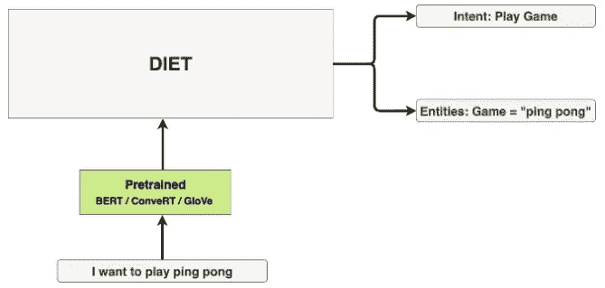
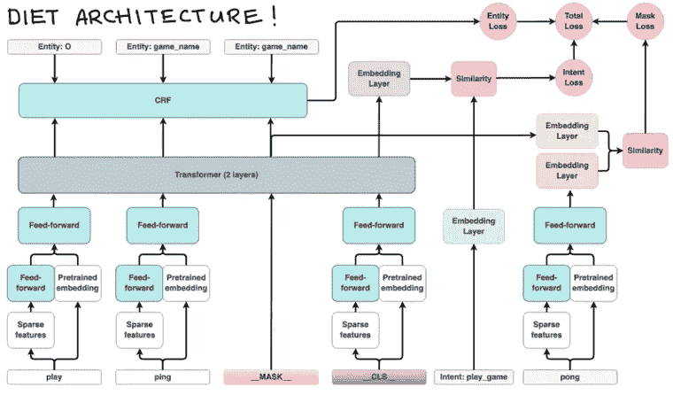
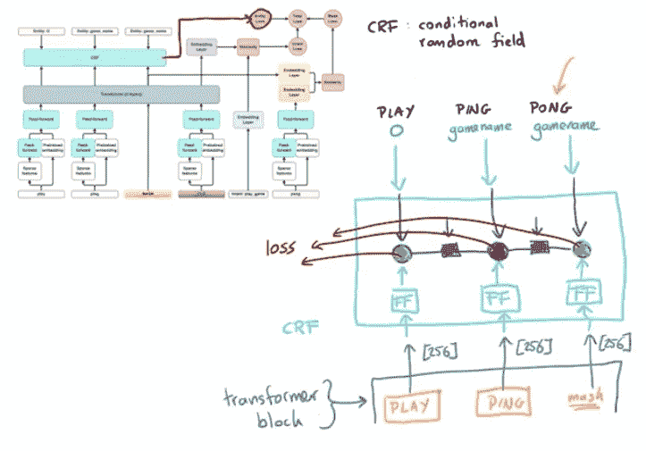
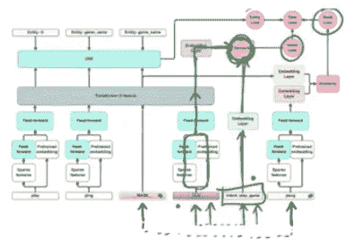
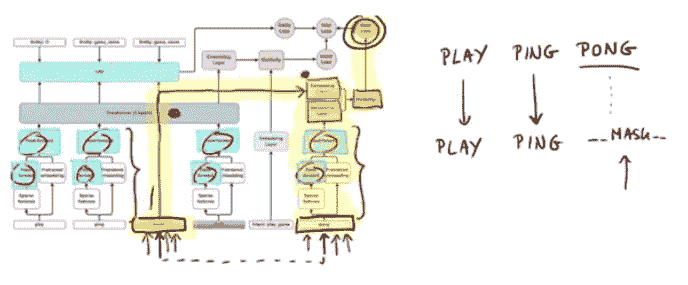

# #NLP365 的第 101 天:深入研究 RASA 的饮食结构

> 原文：<https://towardsdatascience.com/day-101-of-nlp365-in-depth-study-of-rasas-diet-architecture-3cdc10601599?source=collection_archive---------16----------------------->

## [内线艾](https://medium.com/towards-data-science/inside-ai/home) [NLP365](https://towardsdatascience.com/tagged/nlp365)

## 用于意图和实体分类的最新架构

大家好，我的名字是瑞安。我在伦敦做数据科学家。我对自然语言处理(NLP)非常有热情，我目前正在从事项目#NLP365 (+1)，在那里我记录了我在 2020 年的每一天的 NLP 学习旅程。请随意查看我在过去 100 天里学到的东西[这里](https://ryanong.co.uk/natural-language-processing-365/)。

今天的帖子是关于 RASA 的饮食结构。我真的很喜欢 RASA 的饮食结构，虽然我发现 RASA 的解释视频非常有用，但我不想在将来再次访问饮食结构时重新观看整个视频，所以下面是我对 RASA 饮食的所有笔记:)

# 饮食有什么特别的？

DIET 代表双重意图和实体转换器。DIET 是一个多任务转换器架构，可以同时执行意图分类和实体识别。它由多个组件组成，允许我们灵活地更换不同的组件。例如，我们可以尝试使用不同的单词嵌入，比如 BERT 和 GloVe。

许多预先训练的语言模型非常沉重，因为它需要很大的计算能力，推理时间很长，所以尽管它们的性能很强，但它们不是为对话式人工智能应用程序设计的。饮食不同，因为它:

*   是一种模块化体系结构，允许软件开发人员在实验中有更大的灵活性
*   在准确性方面与预先训练的语言模型相匹配
*   优于当前的 SOTA，训练速度快 6 倍

饮食模型的高级概述[1]

# 饮食建筑是什么？

饮食结构的深入概述[2]

首先，我们需要哪些训练数据来训练饮食模型？该架构要求数据集具有输入文本、意图标签和实体标签。

该架构有许多组件，需要优化(最小化)的总损耗由三个损耗组成:

1.  实体损失
2.  意向损失
3.  掩模损失

# 实体损失

训练时输入的句子如何与实体损失联系起来？以下是将输入句子与实体损失联系起来的层次:

1.  个体令牌路径
2.  变压器层
3.  条件随机场

## 个体令牌路径被分成两个子路径

1.  *预埋预埋*。这可以是伯特或手套。在这里，您可以尝试不同的嵌入。输出是令牌的数字表示
2.  *稀疏特征+前馈神经网络*。由作为特征的字符级 N-grams 的单热编码器组成，并被传递到前馈层

两个子路径的输出合并在一起，并馈入另一个 FFNN。FFNN 的输出是一个 256 维向量。

单个令牌路径的输出被馈入 2 层变压器层。点击[这里](http://jalammar.github.io/illustrated-transformer/)看一篇关于变形金刚的好文章。随后，变换器层的输出被馈入条件随机场(CRF)层。在 CRF 中，我们有一个 FFNN，它获取 transformer 层的输出，并对输出的实体进行分类。例如，单词“ping”具有 game_name 的实体。在这些 FFNN 之间，我们有一个转移矩阵。转移矩阵背后的思想是捕捉这样一种情况，即如果有一个令牌是一个实体，那么它的相邻令牌也很有可能是一个实体。对于每个令牌，我们都有地面真实实体的标签，这可以在训练期间用来训练我们的 FFNN 和转移矩阵(它们的权重)。

实体损失和输入令牌之间的联系[2]

# 意向损失

上图饮食建筑图中有一个特殊的类令牌(__CLS__)。这个特殊的类标记背后的思想是，它将总结整个输入句子，并导出代表整个输入句子的数字表示。这个特殊的类标记遵循与个体标记相同的路径，然而，预训练的嵌入和稀疏特征的输出略有不同:

1.  预训练嵌入的输出现在是句子嵌入。根据所使用的预训练嵌入，计算方式会有所不同。
2.  特殊类标记的稀疏特征是各个标记的所有单独稀疏特征的总和。

因为类标记是整个输入句子的总结，所以类标记应该能够预测意图。特殊的类令牌将通过单独的令牌路径、转换器层，然后到达嵌入层。同时，输入句子的真实意图通过嵌入层。正在计算两个嵌入层的输出之间的相似性(以及意图损失)。

意图丧失与特殊阶级令牌 __CLS__(绿线)之间的联系[2]

# 掩模损失

在体系结构中添加这个掩码标记是为了使模型也可以作为语言模型来训练。语言模型是在给定一组输入标记的情况下，模型预测最合适的下一个标记。在训练期间，模型会随机屏蔽一些单词，算法的目标是预测被屏蔽的原始单词是什么。下图显示了这是如何工作的。掩码令牌将通过转换器传递到嵌入层。同时，被屏蔽的令牌(图中的单词 pong)通过单独的令牌路径，并且也进入嵌入层。计算这两个嵌入之间的相似性函数。该模型的目标之一是最小化掩模损失。屏蔽损失越低，模型预测屏蔽令牌就越好。

掩码丢失和掩码令牌之间的联系[2]

# FFNN 特性

关于结构中所有 FFNN 的两个特别注意事项。首先，它们没有完全连接。FFNN 从一开始就有 80%左右的辍学率。这使得 FFNN 更加轻便。第二，所有的 FFNN 共享相同的权重。所有 FFNN 后稀疏特征共享权重(W1)，并且所有 FFNN 后合并两条路径的输出共享另一组权重(W2)。

# 结束的

当他们已经在使用预训练的模型时，为什么他们使用掩码令牌并再次训练语言模型？以允许模型适应数据集的域。特别是在聊天机器人或社交媒体上下文中，有更多拼写错误的单词或俚语或命令文本，因此再次训练语言模型将允许模型捕捉这些领域特定的语言。

该架构旨在允许模型学习我们输入句子的更一般的表示。在训练过程中，所有的权重都必须基于三种不同的损失进行优化:实体、意图和屏蔽损失，因此，模型不能只学习一种使其中一种损失最小化的表示。此外，该架构的设计方式使您可以打开或关闭多个组件。该架构旨在处理意图和实体分类，但如果我们只想让模型进行意图分类，我们可以“关闭”实体和屏蔽损失，只专注于优化训练期间的意图损失。我非常喜欢学习 RASA 的饮食模式，下一步是尝试 RASA 图书馆。

来源:

1.  [https://blog . rasa . com/introducing-dual-intent-and-entity-transformer-diet-state-of-art-performance-on-a-lightweight-architecture/](https://blog.rasa.com/introducing-dual-intent-and-entity-transformer-diet-state-of-the-art-performance-on-a-lightweight-architecture/)
2.  [https://www.youtube.com/watch?v=vWStcJDuOUk&list = pl 75 E0 QA 87 DLG-za 8 Eli 6t 0 _ PBX afk-cxb](https://www.youtube.com/watch?v=vWStcJDuOUk&list=PL75e0qA87dlG-za8eLI6t0_Pbxafk-cxb)
3.  【https://www.youtube.com/watch?v=KUGGuJ0aTL8】&list = pl 75 E0 QA 87 DLG-za 8 Eli 6t 0 _ PBX afk-cxb&index = 3