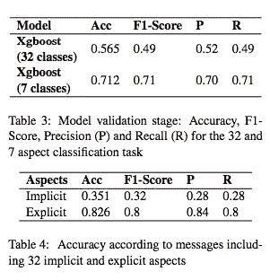

# #NLP365 第 102 天:NLP 论文摘要——财经微博中的隐式和显式方面提取

> 原文：<https://towardsdatascience.com/day-102-of-nlp365-nlp-papers-summary-implicit-and-explicit-aspect-extraction-in-financial-bdf00a66db41?source=collection_archive---------51----------------------->

阅读和理解研究论文就像拼凑一个未解之谜。汉斯-彼得·高斯特在 [Unsplash](https://unsplash.com/s/photos/research-papers?utm_source=unsplash&utm_medium=referral&utm_content=creditCopyText) 上拍摄的照片。

## [内线艾](https://medium.com/towards-data-science/inside-ai/home) [NLP365](http://towardsdatascience.com/tagged/nlp365)

## NLP 论文摘要是我总结 NLP 研究论文要点的系列文章

项目#NLP365 (+1)是我在 2020 年每天记录我的 NLP 学习旅程的地方。在这里，你可以随意查看我在过去的 100 天里学到了什么。

今天的 NLP 论文是财经微博中的隐式和显式方面提取。以下是研究论文的要点。

# 目标和贡献

使用无监督和有监督技术从金融微博中进行方面提取。贡献在于它提取了特定领域(金融)的方面，并处理了隐式和显式方面的提取。

# 注记和数据集

1.  预定义了一个股票投资分类法，以提取隐含和明确的方面
2.  创建了一个包含 7 个方面类和 32 个方面子类的语料库。语料库有 368 条信息，其中 218 条是隐含方面，150 条是明确方面

# 模型

1.  分布式语义模型
2.  监督 ML 模型 XGBoost、随机森林、SVM 和条件随机场

## 分布式语义模型

本质上，它使用单词嵌入来计算语义相关度。有两个步骤:

1.  提取候选人。使用形态句法模式选择相关的名词和动词短语，包括副词、形容词等修饰语。例如，“收入下降”。
2.  计算与类别的相关度。一旦提取了候选项，计算语义相关度包括将候选项向量与方面子类向量进行比较。多个候选单词被组合成一个向量。为每个消息中所有可能的成对记号组合计算余弦相似度，并保留最高得分对。

## 监督 ML 模型

这是一个多类监督分类问题。它涉及特征工程、机器学习算法优化以及模型选择和评估:

1.  特征工程。这包括 BoW(二进制计数、频率计数和 TFIDF)、词性标注、数字和预测的实体情感
2.  ML 算法优化。选择了 4 ML 算法:XGBoost、随机森林、SVM 和条件随机场。超参数调整使用粒子群优化(PSO)方法
3.  模型选择和评估。选择 DSM 和 ML 模型中的最佳模型(使用 CV ),并使用留一法选项验证所选模型

# 结果

XGBoost 得分最高，被选中。下图显示了 XGBoost 在方面类和方面子类分类以及隐式和显式方面分类上的结果。XGBoost 在 7 个方面的分类上取得了 71%的准确率，在显式方面分类上取得了 82%的准确率，在隐式方面分类上取得了 35%的准确率。

模型验证和隐式与显式方面的结果分解[1]

# 结论

显式方面分类表现良好，但是隐式方面分类仍然需要更多工作，且可以用更大的数据集和更好的特征工程来处理。

## 来源:

[1]盖拉特，托马斯等，“财经微博中的隐性和显性体抽取。”*计算语言学协会年会)*。计算语言学协会，2018。网址:【https://www.aclweb.org/anthology/W18-3108.pdf 

【https://ryanong.co.uk】原载于 2020 年 4 月 11 日**。**