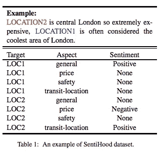
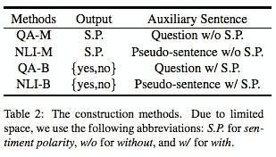
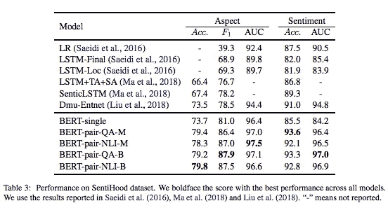
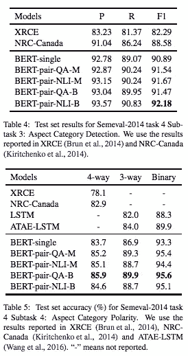

# #NLP365 的第 103 天:NLP 论文摘要——通过构造辅助句利用 BERT 进行基于方面的情感分析

> 原文：<https://towardsdatascience.com/day-103-nlp-research-papers-utilizing-bert-for-aspect-based-sentiment-analysis-via-constructing-38ab3e1630a3?source=collection_archive---------22----------------------->

阅读和理解研究论文就像拼凑一个未解之谜。汉斯-彼得·高斯特在 [Unsplash](https://unsplash.com/s/photos/research-papers?utm_source=unsplash&utm_medium=referral&utm_content=creditCopyText) 上拍摄的照片。

## [内线艾](https://medium.com/towards-data-science/inside-ai/home) [NLP365](http://towardsdatascience.com/tagged/nlp365)

## NLP 论文摘要是我总结 NLP 研究论文要点的系列文章

项目#NLP365 (+1)是我在 2020 年每天记录我的 NLP 学习旅程的地方。在这里，你可以随意查看我在过去的 100 天里学到了什么。

今天的 NLP 论文是 ***通过构造辅助句*** 利用 BERT 进行基于方面的情感分析。以下是研究论文的要点。

# 目标和贡献

针对基于方面的目标情感分析(TABSA)，微调预训练的 BERT。TABSA 是一项任务，通过这项任务，您可以针对与给定目标相关的特定方面识别出细粒度的意见极性。在基于方面的情感分析(ABSA)中，你没有目标-方面对，只有方面。本文的贡献在于:

1.  一种新的处理 TABSA 的方法，通过创建辅助句把它当作一个句子对分类任务
2.  通过使用微调的 BERT 在 SentiHood 和 SemEval-2014 任务 4 数据集上实现 SOTA 结果

# 数据集

## 感知

*   5215 个句子，其中 3862 个包含单个目标，其余包含多个目标
*   每个句子包含一个带有情感极性的目标体对列表
*   给定一个句子和目标，我们需要 a)检测对目标体的提及，b)确定检测到的目标体对的极性

感知标签示例[1]

## 塞姆瓦尔-2014 年任务 4

这是 ABSA 而不是塔布萨，所以他们没有目标-方面对，只有方面。允许模型同时处理子任务 3(方面检测)和子任务 4(方面极性)。

# 方法学

所有助句方法概述

本文采用四种方法构造辅助句，将 TABSA 转换为句子对分类任务。使用(位置 1，安全)作为目标-特征对示例:

## 问答的句子

*   使用目标-体对生成一个问题。格式必须保持不变
*   例如，“你认为 location-1 的安全性如何？”

## 对 NLI 的判决

*   这里创造的句子不是一个标准句子，而是一个含有目标体对的假句子
*   例如，“位置-1-安全”

## 问答部分的句子

*   为句子添加情感标签，并将其视为二元分类问题，将每个句子分类为是或否
*   每个目标-特征对将有三个新的序列。下面是一个例子:

> 位置-1 的安全方面的极性为正
> 
> 位置-1 的安全方面的极性为负
> 
> 位置-1 的特征安全性的极性为“无”

*   我们将具有最高匹配分数概率的类别作为预测类别

## 对 NLI 的判决-B

*   同样，对于 NLI-B，助动词句从真题变成伪句如下:

> 位置— 1 —安全—积极
> 
> 位置-1-安全-负
> 
> 位置-1-安全-无

# 实验和结果

这里有两个实验设置，因为我们有两个不同的数据集。

## 感知实验设置

感知度的评估只考虑数据集中最常见的 4 个方面(一般、价格、交通位置、安全)。以下是选择用于比较的模型:

*   *。具有 n 元语法和位置标签功能的 LR*
*   ****LSTM——决赛*** 。以最终状态表示的 biLSTM*
*   ****LSTM-洛克*** 。以与目标位置相关联的状态作为表示*
*   ****LSTM+TA+SA*** 。具有复杂目标级和句子级注意机制的 biLSTM*
*   ****SenticLSTM*** 。LSTM+TA+SA 升级版，引入 Sentic Net 外部信息*
*   ****Dmu-Entnet*** 。具有跟踪实体的延迟存储器更新机制的外部存储器链的双向 EntNet*

## *感知结果*

**

*感知结果——所选模型、BERT-single 和 BERT-pair 之间的比较[1]*

*   *BERT-single 在特征检测方面优于 Dmu-Entnet，但在情感分类准确性方面得分较低*
*   *BERT-pair 在特征检测和情感分类方面远远超过其他模型。伯特对问答模型往往在情感分析上表现更好，而伯特对 NLI 模型往往在方面检测上表现更好*

## *SemEval-2014 任务 4 实验设置*

*BERT-pair 模型与性能最好的系统进行了比较，即 XRCE、NRC-Canada 和 ATAE-LSTM。*

## *SemEval-2014 年任务 4 成果*

**

*SemEval-2014 任务 4 子任务 3(表 4)和子任务 4(表 5)之间的结果细分。子任务 3 是方面检测，子任务 4 是方面极性[1]*

*   *BERT-single 模型足以在两个子任务上取得更好的结果*
*   *伯特对模型实现了对伯特单模型的进一步改进*

# *结论和未来工作*

*为什么 BERT-pair 的实验结果好那么多？*

*   *把目标体对转换成辅助句相当于扩大了语料库，因此，我们的模型有了更多的数据*
*   *伯特似乎在问答和 NLI 任务中表现良好，表明在处理句子对分类方面的优势。这可能归因于无监督的掩蔽语言模型和下一句预测任务*
*   *在 TABSA 上直接微调预训练的 BERT 不会产生好的结果。通过将 TABSA 转换为句子对分类任务，上下文现在类似于问答和 NLI，因此可以利用预训练 BERT 的优势*

*从单句分类到句子对分类任务的转换已经产生了强有力的结果。未来的工作可以将这种转换方法应用于其他类似的任务。*

## *来源:*

*[1]孙，迟，，黄，邱希鹏."通过构造辅助句，利用 bert 进行基于方面的情感分析." *arXiv 预印本 arXiv:1903.09588* (2019)。网址:【https://arxiv.org/pdf/1903.09588.pdf *

*【https://ryanong.co.uk】原载于 2020 年 4 月 12 日**。***